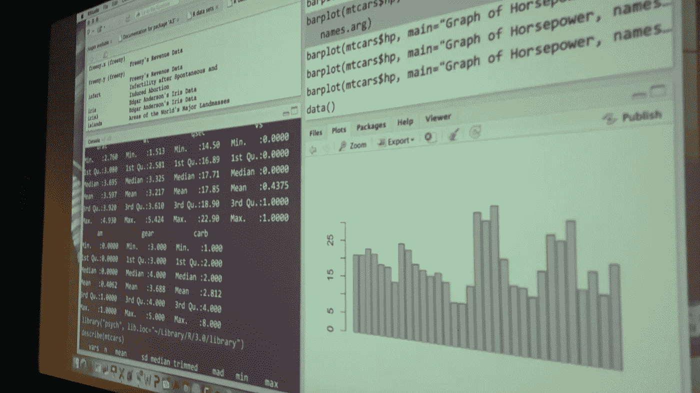

# 如何规划一个好的工作流程来避免不良数据

> 原文：<https://medium.com/analytics-vidhya/how-to-plan-a-good-workflow-to-avoid-bad-data-2fb87bb4dba4?source=collection_archive---------29----------------------->

如果您在决定采取什么步骤来创建数据模型和有效地使用资源时感到不确定，您并不孤单。数据本身是非常深奥的，以至于有时分析师会因为一开始就有数据而觉得是一种个人胜利。

但是胜利转瞬即逝。数据必须与模型的假设相联系，但是如何最好地…