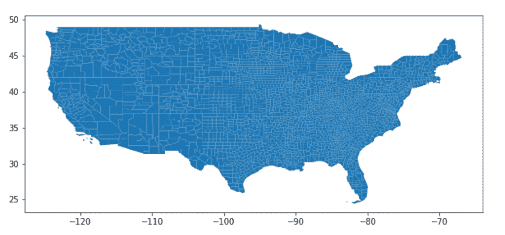
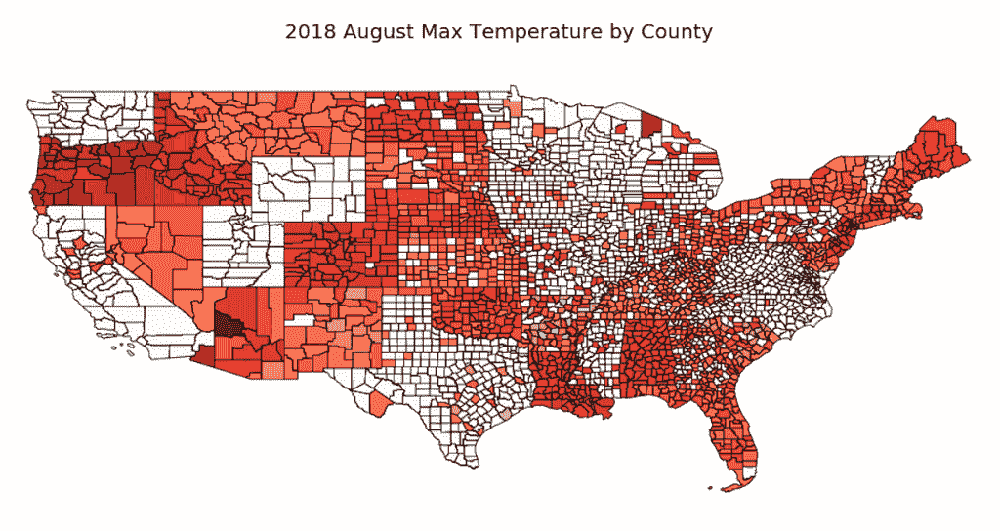

# 如何用 Python 绘制地图

> 原文：<https://medium.com/analytics-vidhya/how-to-plot-a-map-in-python-d78f17c0b4a4?source=collection_archive---------4----------------------->

# 使用 Geopandas 和 Geoplot

在我以前的工作中，我必须经常制作地图。从来没有一种特别简单的方法可以做到这一点，所以我决定测试一下我的 Python 技能来创建一个地图。一路上我遇到了不少的减速带，但最终还是制作出了我想要的地图。我相信随着更多的练习，用 Python 绘图会变得非常容易。我最初偶然发现 Geopandas 和 Geoplot 用于制图，我在这里使用它们，但是还有其他 Python 库可以生成更好的地图，比如 follow。

# **决定映射什么**

首先，你必须决定你想要绘制什么样的地图，以及这些信息在哪个地理层次上。我对将数据科学应用于环境问题和可持续发展很感兴趣，所以我决定看看美国国家海洋和大气管理局(NOAA)的一些县级数据。我特意选择查看每个县每月的最高温度。

其次，你需要收集你的数据。从 [NOAA 气候部门数据网站](https://www.ncdc.noaa.gov/monitoring-references/maps/us-climate-divisions.php#grdd)，我可以通过点击“nClimDiv”数据集链接来获取我需要的数据。将这些数据解压到一个本地文件夹后，我就可以继续了。

第三，您需要收集适当的 Shapefile 来绘制数据。如果你不知道什么是 Shapefile，[这个链接](http://desktop.arcgis.com/en/arcmap/10.3/manage-data/shapefiles/what-is-a-shapefile.htm)将有助于解释他们的目的。我能够从[美国人口普查老虎/线形状文件数据库](https://catalog.data.gov/dataset/tiger-line-shapefile-2017-nation-u-s-current-county-and-equivalent-national-shapefile)中检索出美国县级形状文件。下载适当的数据集，并将其存储在与要绘制的数据相同的本地文件夹中。

# **地图准备工作**

**形状文件**

如上所述，我使用了 python 库 Geopandas 和 Geoplot。此外，我发现我还需要安装笛卡尔库。为了安装这些库，我必须从我的终端运行以下 bash 命令:

现在，您将能够像导入任何其他 python 库一样导入这些库(例如，“import pandas as pd”)。要加载 Shapefile，您可以使用以下 Geopandas (gpd)方法:

数据文件

为了加载县一级的数据，我还有几个问题要解决。该文件来自 NOAA 的固定宽度文件格式。有关固定宽度文件格式的更多信息，请查看以下[网站](http://www.softinterface.com/Convert-XLS/Features/Fixed-Width-Text-File-Definition.htm)。我按照以下步骤将数据转换成可行的格式:

此外，还涉及到相当多的数据清理，但我将给您一个简短的概述。我想过滤 Shapefile，使其仅包含美国本土，因此我需要过滤出以下州代码:

*   02:阿拉斯加
*   15:夏威夷
*   60:美属萨摩亚
*   66:关岛
*   69:马里亚纳群岛
*   72:波多黎各
*   78:维尔京群岛

让我们先来看看 Shapefile:

你可以看到美国所有相邻的县。

合并 Shapefile 和数据集

Shapefile 和数据集需要有一个共同的列，以便匹配要映射的数据。我决定用 [FIPS 代码](https://www.nrcs.usda.gov/wps/portal/nrcs/detail/national/home/?cid=nrcs143_013697)来匹配。要在 Shapefile 中创建 FIPS 代码:

在县数据中创建 FIPS 代码(注意:为了简单起见，我只过滤了 2018 年的数据):

最后，要合并 Shapefile 和 Dataset:

最后，我们将数据映射到 Shapefile。我使用 geoplot.choropleth 方法来绘制最高温度数据。红色越深，某个县的最高温度就越高。该地图是为 2018 年 8 月创建的。

你可以看到我们能够在美国的县地图上绘制数据！希望这个演示有帮助！

不幸的是，你可以看到有丢失的数据。此外，我可以生成一个图例，但它会显示为地图本身大小的两倍，所以我决定删除它。

【http://github.com】最初发表于**。**