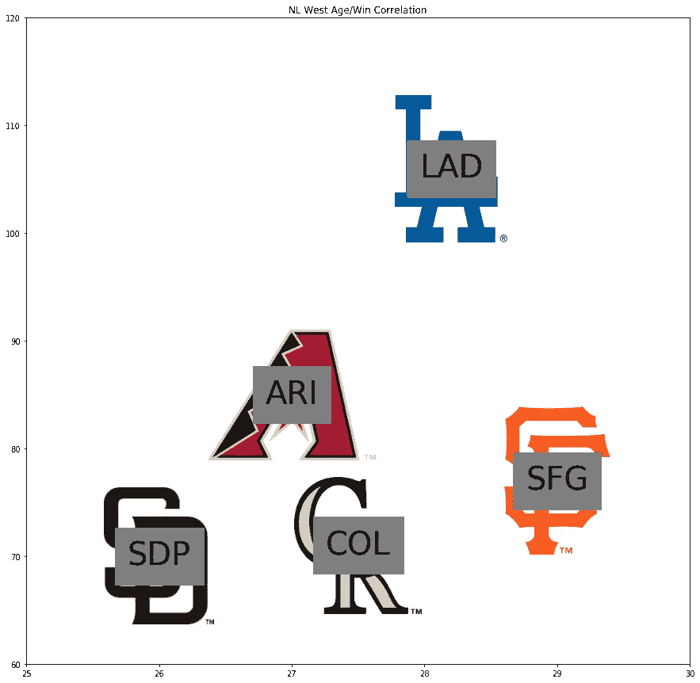
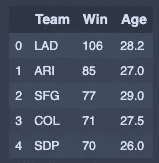
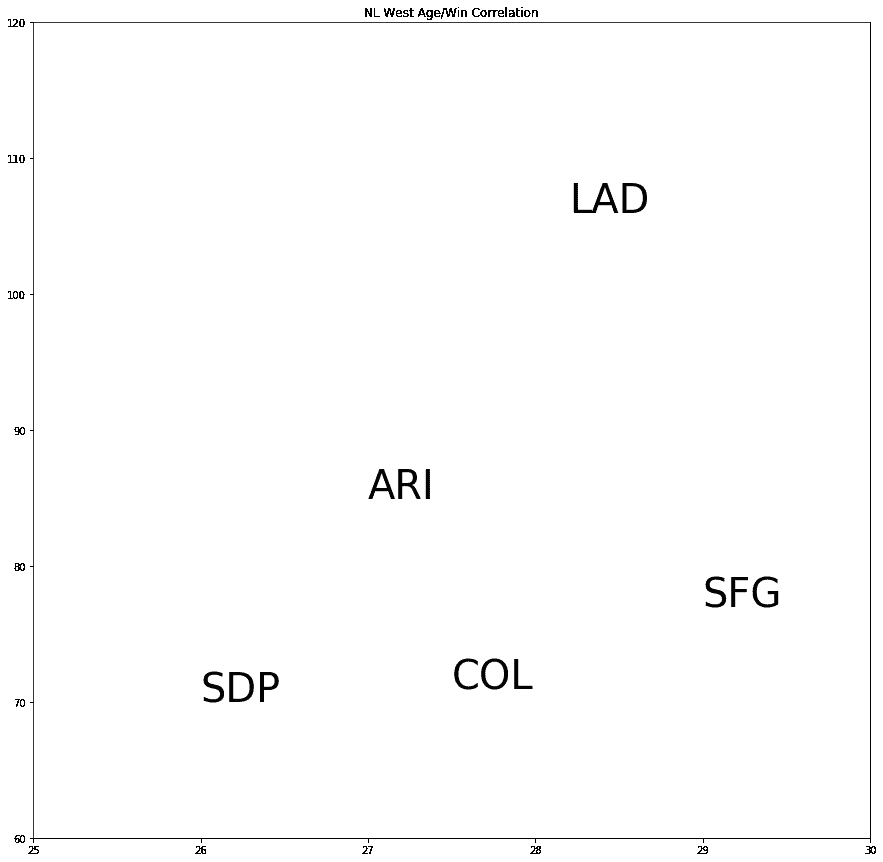
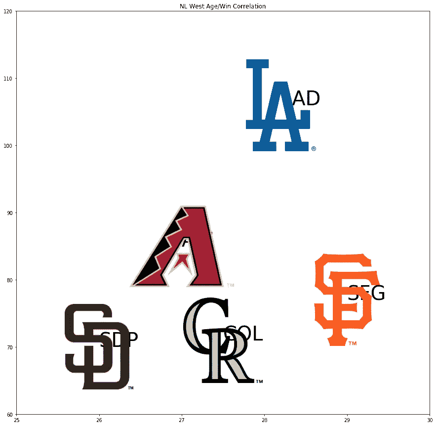

# 如何使用 Python matplotlib 绘制图像和文本

> 原文：<https://medium.com/analytics-vidhya/how-to-plot-image-and-text-on-matplotlib-91d7f23a3043?source=collection_archive---------1----------------------->

你知道如何在 matplotlib 上绘制图像和文本吗？这使得图形看起来更好。让我们试试。



设计不好？没关系；)

今天，我将使用以下这些数据:

```
import pandas as pd
records = pd.read_csv('data.csv')
records
```



这是美国职业棒球大联盟西部赛区的胜场和年龄。

如果你想绘制文本，这很容易。

```
import matplotlib.pyplot as pltfig = plt.figure(figsize=(15,15))
ax=fig.add_subplot(1,1,1)
ax.set_xlim(25, 30)
ax.set_ylim(60, 120)for i, record in records.iterrows():
    ax.text(record.Age, record.Win, record.Team, fontsize=40)plt.title('NL West Age/Win Correlation')
plt.show()
```



如果你想绘制球队标志的图片而不是文字，我们该怎么做？用“add_artist”，就这样。

```
from matplotlib.offsetbox import OffsetImage, AnnotationBboxfor i, record in records.iterrows():
    image = plt.imread('image/' + record.Team + '.png') 
    ax.add_artist( #ax can be added image as artist.
        AnnotationBbox(
            OffsetImage(image)
            , (record.Age, record.Win)
            , frameon=False
        ) 
    )
```



都搞定了…等等，文字都在图像后面！也许，如果你在添加图像之后再添加文本，那么文本就被放在了图像的前面。

```
fig = plt.figure(figsize=(15,15))
ax=fig.add_subplot(1,1,1)
ax.set_xlim(20, 35)
ax.set_ylim(60, 120)
for i, record in records.iterrows():
    image = plt.imread('image/' + record.Team + '.png') 
    ax.add_artist( #ax can be added image as artist.
        AnnotationBbox(
            OffsetImage(image)
            , (record.Age, record.Win)
            , frameon=False
        ) 
    )
    ax.text(record.Age, record.Win, record.Team, fontsize=40)plt.title('NL West Age/Win Correlation')
plt.show()
```


肯定是一样的结果。我们如何做到这一点？答案也是用“add_artist”。

```
import matplotlib.text as mpl_textfig = plt.figure(figsize=(15,15))
ax=fig.add_subplot(1,1,1)
ax.set_xlim(20, 35)
ax.set_ylim(60, 120)
for i, record in records.iterrows():
    image = plt.imread('image/' + record.Team + '.png') 
    ax.add_artist( #ax can be added image as artist.
        AnnotationBbox(
            OffsetImage(image)
            , (record.Age, record.Win)
            , frameon=False
        ) 
    )
    ax.add_artist(
        mpl_text.Text(
            x=record.Age
            ,y=record.Win
            ,text=record.Team
            ,color='black'
            ,backgroundcolor='grey'
            ,verticalalignment='center'
            ,horizontalalignment='center'
            ,multialignment=None
            ,fontsize=40
            ,linespacing=None
            ,rotation_mode=None
        )
    )plt.title('NL West Age/Win Correlation')
plt.show()
```


一切都结束了，最终！！就像这些，你可以使用“add_artist”在 matplotlib 的图形上添加图片和文本。

我想让你尝尝这个！！感谢阅读。