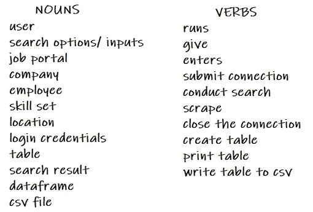
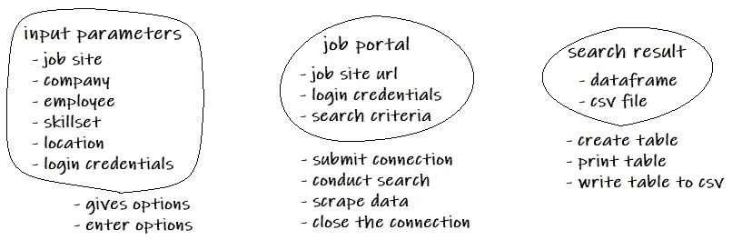

# 如何练习面向对象编程

> 原文：<https://medium.com/analytics-vidhya/how-to-practice-object-oriented-programming-32dab8169a3?source=collection_archive---------10----------------------->

老实说，对于像我这样在职业生涯中习惯于用过程结构编码的人来说，跳到“面向对象”的方式让我很困惑。

(事实:我正在使用大型机遗留系统，COBOL 非常程序化…使冗余代码可重用的最有效的方法是创建子例程，就是这样。)

当我开始学习 Python 的时候，我甚至不关心结构。我一边编码一边‘编码’和‘解释’(多亏了 Jupyter 笔记本)，看起来*非常* *程序化*。这看起来“没问题”,因为许多 Kaggle 项目都是以类似的方式编码的，而且大多数在线教程都使用 notebook 来获得适当的讲课流程。但你瞧，当我公开发布我的项目时，我感到“尴尬”——感觉就像是某个新手吹嘘她新发现的 Python 和数据科学技能，却不知道如何以面向对象、可重用、可扩展的方式设计她的程序。

所以我试着寻找关于面向对象设计的教程，找到了一个非常简单但内容丰富的入门指南。因此，我在这里分享我学到的东西给其他学习者，当然也给我自己参考。

(感谢 Barron 和 Olivia Stone 的教程视频[编程基础:面向对象设计](https://www.linkedin.com/learning-login/share?forceAccount=false&redirect=https%3A%2F%2Fwww.linkedin.com%2Flearning%2Fprogramming-foundations-object-oriented-design-3%3Ftrk%3Dshare_ent_url)。查看他们的视频，因为他们的视频更全面！)

我们可以从澄清基础开始。

首先，让我们讨论一下**类**的概念——它是“蓝图”，用于生成**对象**的模板(这是 OOP 范例的主要焦点)。该类将包含对象的**属性**(字段属性)和它可以使用的**方法**(过程)。它在某种程度上创建了一种新的用户定义的数据类型(除了像 int、char 或 float 这样的内置数据类型之外)

```
class Pet(object): 
      def __init__(self, type):  # constructor method
          print('Automatically called when Pet class is created.')
          self.type = type             # this is an attribute
          self.name = 'new kid'        # this is an attribute def speak(self):                 # class method
          print('Hi hooman, my name is ',self.name,', and I am a ',self.type,'!') def setName(self, name):         # class method
          self.name = name
          return self.name
```

对于每一个定义的类，你都需要一个构造函数方法——当然，这是放置和初始化所有类属性的地方，因为这总是在创建时被调用。如果我创建了一个新的宠物对象，它将自动拥有一个用户输入的“类型”属性和一个最初被定义为“新孩子”的“名字”。请参见下面的样本。

```
catto = Pet('cat')>> Automatically called when Pet class is created.
```

创建的对象“catto”是类“Pet”的实例。

```
type(catto)
>> __main__.Petcatto.type
>> 'cat'catto.name
>> 'new kid'
```

这个 catto 对象也将自动拥有“speak”和“setName”方法。

```
catto.setName('Malfoy')
>> 'Malfoy'catto.speak()
>> 'Hi hooman, my name is Malfoy, and I am a cat!'
```

注意:“方法”和“函数”都是一组操作。然而，方法的使用仅限于它自己的对象&类，而函数可以应用于任何适用的对象。

我还在下面定义了一个名为‘Wild’的新类，它展示了继承属性是如何工作的。

```
class Wild(Pet):
      def __init__(self,type,size):
          super().__init__(type,name)
          self.size = size

      def speak(self):
          print('Hi hooman, I am a wild animal named ',self.name,'!')
```

从父类(超类)“Pet”开始，子类(派生类)“Wild”将继承所有“Pet”属性，并有自己的附加属性“size”。

它还将继承 speak()和 setName()方法。但是，由于我们也定义了自己的 speak()，这将覆盖原来的“Pet”方法。

```
doggo = Wild('dog',10)>> Automatically called when Pet class is created.type(doggo)
>> __main__.Wilddoggo.type
>> 'dog'doggo.name
>> 'new kid'doggo.size
>> 10doggo.setName('Hagrid')
>> 'Hagrid'doggo.speak()
>> 'Hi hooman, I am a wild animal named Hagrid!'
```

我就不赘述封装和多态等其他细节了。这里的目标是对类、属性和方法有一个简单的定义。

(参见[编程基础:面向对象设计](https://www.linkedin.com/learning-login/share?forceAccount=false&redirect=https%3A%2F%2Fwww.linkedin.com%2Flearning%2Fprogramming-foundations-object-oriented-design-3%3Ftrk%3Dshare_ent_url)了解更多详情)

所以现在，我将分享一个关于我如何提出面向对象设计的草稿。

## 首先，定义功能需求。

让我们做一个名为技能集映射的示例项目。这是它的作用:

该系统必须能够搜索:
1。特定技能组合+地点+人员；和
2。具体技能+地点+公司
和回报:
1。姓名、职位、公司、学院、课程、地点、URL(如果我们搜索具有特定技能的人)
2。公司名称、职位、资历级别、行业、位置、URL(如果我们搜索雇用特定技能的公司)

## 其次，我们现在可以转移到需求的用例。

根据我在这里的理解，我们应该能够定义系统的一步一步的成功处理(被称为“成功场景”)，以及当事情出错时它的动作(他们称之为“扩展”)。

标题:LinkedIn 技能集映射
主要参与者:用户

成功场景:
1。用户运行主模块。
2。系统提供搜索选项的工作门户网站考虑，我们正在搜索一个公司发布或员工所需的技能和地理位置。
3。用户输入登录凭据。
4。向职务门户提交连接请求的系统。
5。系统自动执行标准搜索。
6。系统抓取所有搜索相关的结果。
7。系统关闭连接。
8。系统为搜索结果创建表格。
9。打印出创建的数据帧。
10。将数据帧写入 csv 文件。

扩展:
2a。输入的选项无效怎么办？
3a。登录凭证无效怎么办？
4a。如果网站无法访问怎么办？
6a。如果没有搜索结果呢？

## 接下来，有了所有这些定义，我们现在可以确定对象、类关系和类责任。

为了识别对象，我们需要记下用例中的所有名词和动词。



我们现在可以把它们联系在一起，把名词看作一个类，把动词看作它的方法。这实际上有点棘手，因为我写的大多数名词实际上都可以被简化，例如。技能集、位置、登录详细信息等输入选项—它们可以归类为“输入参数”，因为它们都是用户输入。和动词一样，它可以被简化为基本的方法。

总之，我们还是需要想清楚，某个名词是否应该是一个类，它需要执行的具体动作是什么。所以我在下面创建了一个更精确的名词-动词关系。



在画得很糟糕的圆圈内，我们可以看到类名，它是位于最顶端的文本，后面是一个称为类属性的列表。圆圈外面是这个类的方法。如您所见，我将一些名词作为一个类的属性，而不是将它们都定义为单独的类。我把他们和他们的行动语言配对，并把它们定义为他们的方法。

因此，如果我试图将“输入参数”类翻译成代码，它是这样的:(为了便于阅读，我将登录细节和搜索标准分成两个独立的类)

```
# inputparms.pyclass LoginDetails(object):
    def __init__(self):
        self.user_id = '[sample@gmail.com](mailto:sample@gmail.com)'
        self.user_pass = 'samplepassword'
    def setId(self):
        self.user_id = input('\nEmail ID : ')
    def setPass(self):
        self.user_pass = input('Passcode : ')
    def getId(self):
        return self.user_id
    def getPass(self):
        return self.user_pass

class SearchCriteria(object):
    def __init__(self):
        self.site_platform = ''
        self.cap_skill = ''
        self.curr_loc = ''
        self.org_cat = ''
        self.ctry_iso_list = {
            'Philippines':'ph',
            'Singapore':'sg',
            'Malaysia':'my',
        }
    def setSite(self):
        self.site_platform = input('Enter platform website to be searched ("ie. LinkedIn") : ')
    def setSkill(self):
        self.cap_skill = input('Enter capability / skillset to be searched ("ie. data analyst"): ')
    def setLocation(self):
        print('\nCountry Options:')
        print([i for i in self.ctry_iso_list.keys()])
        self.curr_loc = input('Enter country to be searched : ')
    def setCategory(self):
        while True: 
            temp_var = input('Enter category type ("Company" / "Employee") : ')
            if temp_var == 'Company' or temp_var == 'Employee':
                self.org_cat = temp_var
                break
            else:
                print('Invalid option. Please try again.')
    def getSite(self):
        return self.site_platform 
    def getSkill(self):
        return self.cap_skill
    def getLocation(self):
        return self.curr_loc
    def getCategory(self):
        return self.org_cat
    def getCountryList(self):
        return self.ctry_iso_list
```

顺便说一下，我使用 python 编程语言，因为它非常灵活，因此类属性没有定义为 public 或 private。对于其他编程语言，我认为必须这样定义它们。同样，你可以查看编程基础教程以获得更多细节。

主要目标是使一个类尽可能的独立，实例化的对象应该能够独立地站立和做自己的动作。

我想我会在这里结束我的博客。这是我能想到的最简单的例子，我希望我能够清楚地表达我的想法。非常欢迎任何反馈、纠正或建议。谢谢你花时间在这个博客上。:)