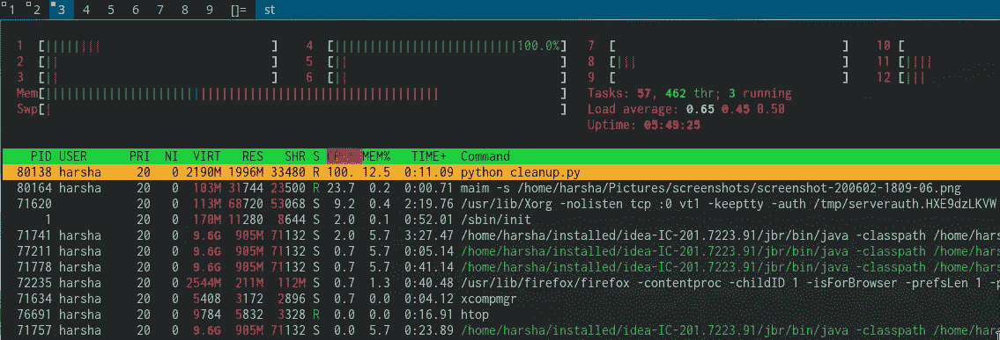
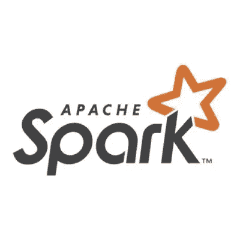
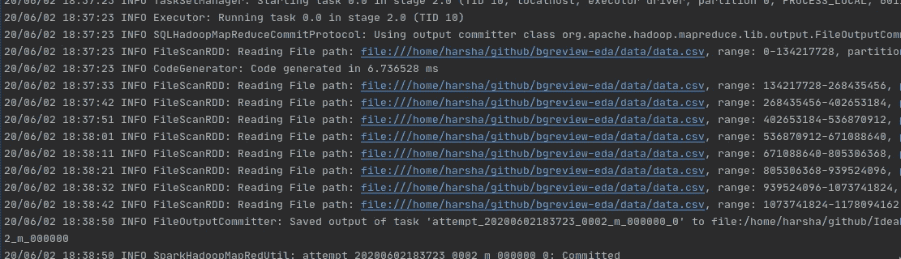

# 如何使用 Spark 为机器学习预处理大数据集

> 原文：<https://medium.com/analytics-vidhya/how-to-pre-process-large-datasets-for-machine-learning-using-spark-19500155b521?source=collection_archive---------18----------------------->

图片鸣谢:[https://unsplash.com/@sortino](https://unsplash.com/@sortino)

## 介绍

在本文中，我将展示如何克服纯 python 解决方案的一个限制，对大型数据集进行预处理，以训练机器学习模型

## 动机

我正在处理一个棋盘游戏评论数据集，我必须建立一个模型来预测关于游戏的给定评论的评分。当我使用 *scikit-learn* 来训练模型并预测给定评论的评分时，我注意到我机器上的所有资源并没有被利用。

## 资料组

[数据集](https://www.kaggle.com/jvanelteren/boardgamegeek-reviews)是 2019 年 5 月 2 日使用 [BGG XML API2](https://boardgamegeek.com/wiki/page/BGG_XML_API2) 查询的棋盘游戏评论和评级的集合。该数据集的总容量约为 1GB，包含约 1300 万条记录，其中约 260 万条记录有注释。

## 问题是

我的目的是评估一些线性模型，如 Linear、Lasso、Ridge Regression 和一些分类模型，如 Naive Bayes 和 Logistic Regression，以了解什么模型最适合这些数据。

因为我在这里处理的是文本特征，所以需要将它转换成数字向量来训练上面提到的一些模型。最流行的技术之一是 [TF-IDF 矢量化](https://machinelearningmastery.com/prepare-text-data-machine-learning-scikit-learn/)

无论采用何种技术，净化数据都很重要，这样我们可以消除任何无用的信息，减少训练时间，并最终提高训练模型的质量。

根据数据集的复杂程度，需要执行几个操作来清理数据。对于此数据集，以下是步骤

1.  转换为小写
2.  删除 HTML 标签、标点符号、链接、带数字的单词、特殊字符
3.  排除长度小于 3 的单词
4.  删除停用词(这些是经常出现的词，不会提供有用的信息，如 a、an、the 等)

所有上述操作都是非常基本的，它们的实现在 python 中非常简单

整体剧本用了 ***~3m22s*** 完成。那么问题出在哪里？性能瓶颈在哪里？到底有没有？

下面是我对数据集运行 cleanup 方法时发生的情况。

资源利用:Python 实现

它只使用了我笔记本电脑上 12 个可用内核中的一个(6 个物理内核+ 6 个虚拟内核)。这促使我思考是否可以利用机器上的其他内核？我可以并行化部分逻辑吗？我的解决方案是否能像我的数据一样扩展？

最后，为什么这些问题听起来很熟悉？这就是 Spark 等大数据工具的用途——大容量数据的分布式处理。

## 火花溶液

Apache spark 可能是最流行的大数据处理工具，它允许您表达处理逻辑，而不必担心并行化。并行化在其编程模型中进行了优雅的抽象，使用它构建的解决方案可以在各种环境中工作，包括但不限于本地、独立集群、YARN 和 Mesos

总之，如果您必须在并行的大规模数据集上执行操作，spark 允许您构建一个不仅是分布式的，而且是可横向扩展并在各种部署环境中工作的解决方案。

那么 spark 是如何帮助我优化解决方案的呢？

还记得 python 的实现只利用了一个内核吗？有了 spark，我能够实现并行化，而无需实现并行化逻辑。

以下是步骤，

1.  初始化 spark 会话并指定并行度

即使用多少个内核。我选择使用 8 核。

2.从文件加载数据并执行清理

Spark 代码片段加载 csv 文件到 RDD 和清理

可以注意到，清理逻辑和 python 中的一样简单。

只是这一次，文件中的数据被读取为 8 个块(下面是可用的屏幕截图)，清理操作是在我的笔记本电脑上使用 8 个内核并行执行的。

Spark 作业日志

总而言之，这个火花工作用了 ***~2m8s*** 完成。

但是等等！！这并不是很大的性能提升。快不了一分钟。spark 真的值得这么麻烦吗？这篇文章到底有什么意义？

让我后退一步，像这样修改 spark 实现的一行代码

我删除了最后一行的合并(1)

这次有什么改进？这个作业的实现用了 ***~50.6 秒*** 才完成。哇哦。！这几乎是 python 实现时间的三分之一。

这到底是怎么回事？

如果到目前为止您已经仔细阅读了本文，那么您可能已经明白了`coalesce(1)`是用来通过混洗将数据合并到一个分区中的。本质上，这意味着如果没有`coalesce(1)`，作业的结果将被保存到 8 个不同的文件中。这是 spark 的一个默认行为，我不会在这篇文章中解释原因，因为这已经超出了范围。

虽然这项工作的结果不能被像`scikit-learn`这样的库直接使用，但很明显，预处理可以得到优化，基于 spark 的架构可以更好地利用硬件/环境。

## 结论

这绝不是一个完美的解决方案。相反，这是一个更好地利用数据工程环境并促进高效下游消费(如训练机器学习模型)的工作流。

这种解决方案对于概念验证可能没有意义。但是，如果您正在构建一个最终必须扩展的企业项目，那么明智的做法是构建一个数据管道，它可以在对源代码进行最小更改的情况下进行水平扩展。Spark 也是为了同样的用途而构建的。

那么，仅仅为了准备数据而学习另一种语言和一套工具值得吗？可能是。可能不是。要看项目整体。

## 参考/链接

我用这种数据工程的方法构建了一个评估预测应用程序。我最终继续使用这个 spark 作业，通过 TF-IDF 矢量化来矢量化注释字段。该应用程序现已上线，应可通过此[链接](https://bgreview.netlify.app/)访问

这个 app 的演示:【https://www.youtube.com/watch?v=L5gGwx_F_H4】T2&feature = youtu . be

星火工作—【https://github.com/harsha993/bgreview-etl 

车型评测笔记本:[https://github.com/harsha993/bgreview-notebook](https://github.com/harsha993/bgreview-notebook)

整个项目的博文—[https://harshavardhan . netlify . app/blog/2020-05-11-bggratings](https://harshavardhan.netlify.app/blog/2020-05-11-bggratings)

如果这篇文章对你有帮助，请不要犹豫，分享它。最后，这是我的第一篇媒体文章。所以如果有什么建议，欢迎评论。