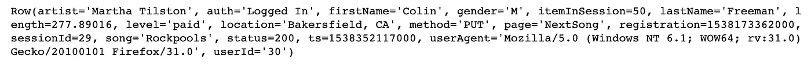
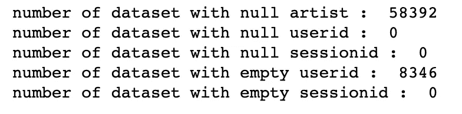
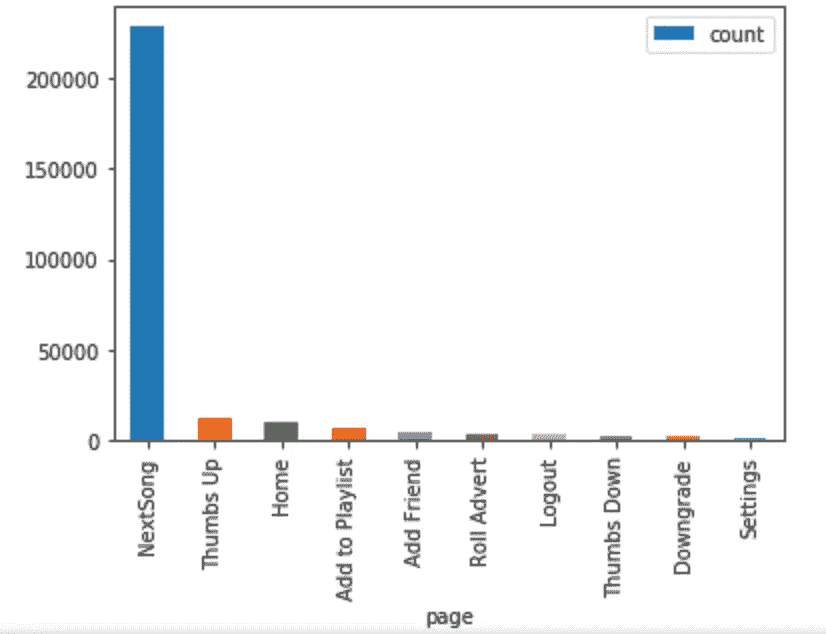
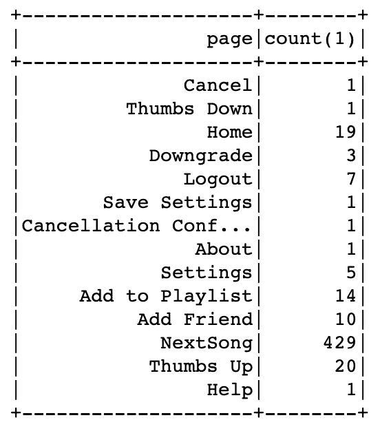
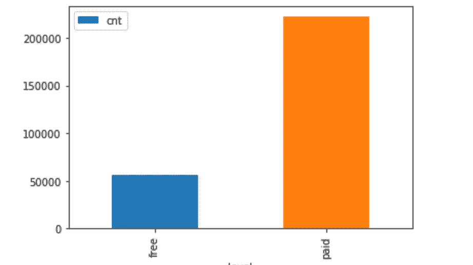
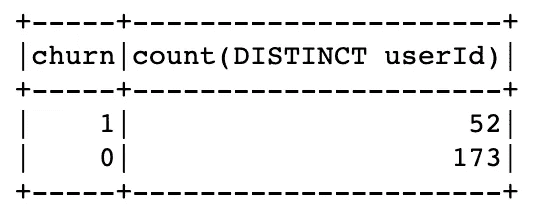
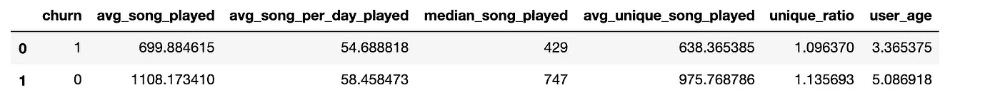
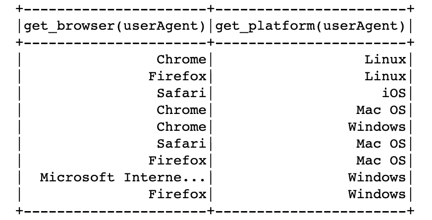
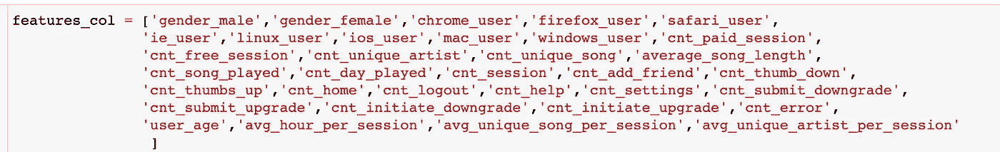
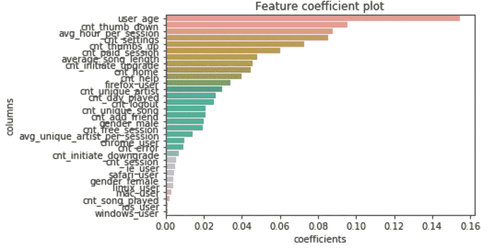

# 如何使用机器学习预测流失客户:Sparkify 项目。

> 原文：<https://medium.com/analytics-vidhya/how-to-predict-churn-customers-using-machine-learning-sparkify-project-7b8a688b4455?source=collection_archive---------27----------------------->

基于 pyspark 的流媒体服务客户流失预测。


图一。Sparkify 流媒体服务

对于 Sparkify 这样的流媒体服务公司来说，有很多方法可以创收。商业模式之一是付费订阅。这在很大程度上取决于用户对服务的满意度。为了将用户留在平台上，流媒体服务可以使用一些方法，如免费试用或免费延长订阅期。他们可以通过瞄准将在不久的将来离开的用户群来使这种方法更加有效。现在的问题是，哪个用户在取消订阅之前需要额外的关注？

这就是**流失预测**发挥作用的地方。在这个项目中，我使用机器学习模型来预测哪个用户将在不久的将来离开。

# **数据集**

在这个项目中，我使用由 Udacity 提供的 Sparkify 的基于事件的数据集。该数据集记录特定用户点击或访问事件。因此，例如当用户访问主页时，该事件将被记录在该数据集中。在图 2 中，我们可以看到播放下一首歌曲的用户记录的事件。



图二。数据集的样本。

以下是完整列的列表和说明:

*   艺人:歌曲中的艺人名称
*   auth:身份验证方法，登录或注销。
*   名字:用户的名字
*   性别:用户性别，' M '或' F '。
*   itemInSession:会话序列的编号。如果我们在图 2 中看到，这意味着用户播放 nextsong 是用户在这个会话中做的第 50 个事件。
*   姓氏:用户的姓氏
*   长度:歌曲长度
*   级别:订阅状态，是“付费”还是“免费”
*   位置:用户位置
*   方法:这个特定事件的 API 方法，在图 2 中是“PUT”。
*   宋:歌名
*   状态:来自服务器的 HTTP 响应，无论是成功(例如:200)还是失败(例如:500、404)
*   ts:事件发生时的 Unix 时间戳
*   userAgent:记录在用户代理的单个字符串中的浏览器、平台、操作系统和其他信息
*   userId:平台中的用户 Id

在这个数据集上，我发现了一些缺少 userid 的记录，如图 3 所示。由于我们只想预测登录用户(注销用户不能被给予防止流失的动作)，所以具有丢失的用户 id 的行被清除。如果用户注销，会话仍然相同，但缺少 userId，这可能是错误的。然而，为了简化项目，我们简单地排除这些用户。



图 3。不完整的行。

# **数据探索**

在本节中，我在小型数据集(128 MB)中执行数据探索，因此我们可以预期非常低的 userId。

在第一部分，我想探索页面分布。从图 4 来看， **NextSong** event 是数据集上访问量最大的页面，大拇指排名第二。有趣的是**添加好友**页面显示频率很高。



图 4。总页面频率

特定用户经常访问几个页面，例如主页和添加到播放列表，如图 4 所示。当我们看到流失用户的样本时，这也反映在图 5 的样本上。该用户在访问“**取消会议”时取消订阅**页面。如果用户正在搅动，此页面用作标志。



图 5。流失用户访问的页面列表。

查看图 6 中的订阅状态分布，我们可以看到大多数事件都是由付费用户完成的，这将有利于我们的预测，因为我们希望预测付费用户的流失。



图 6。订阅状态分布

在这个迷你数据集中，我们有 225 个用户，其中 52 个用户流失，173 个用户仍然活跃。



图 7。流失用户与活跃用户

我创建了一些指标来比较客户流失和活跃用户:

*   avg_song_played:每个用户所有时间平均播放的歌曲
*   avg_song_per_day_played:每个用户每天平均播放的歌曲
*   avg_unique_song_played:每个用户所有时间平均播放的唯一歌曲
*   median_song_played:每个用户所有时间播放的歌曲的中位数
*   unique _ ratio:avg _ unique _ song _ played/avg _ song _ played，这可以告诉我们用户通常播放的是不同的歌曲还是同一种歌曲。
*   user_age:平台平均用户年龄。



图 8。流失用户和活跃用户之间的比较指标。

根据这一指标，我们可以看到流失用户的平均用户年龄低于活跃用户。

# 特征工程

我将这些特性分为三类:

*   会话级行为:例如每次会话歌曲数量、每次会话的平均持续时间。
*   用户属性:性别、用户设备、浏览器
*   一般行为:访问的特定页面的数量，付费或免费会话的数量，播放歌曲的数量。

对于会话级特性，因为一个用户有多个会话，所以我们需要首先基于会话聚合指标，然后归纳为 userId。SQL 将如下所示:

```
SELECT userId, 
       AVG(hour_per_session)             AS avg_hour_per_session,
       AVG(unique_song_per_session)      AS avg_unique_song_per_session,
       AVG(unique_artist_per_session)    AS avg_unique_artist_per_session,
       AVG(cnt_song_played_persession)   AS avg_song_played_persession
FROM (       
SELECT userId,
       sessionId,
       (MAX(ts) -MIN(ts))/(1000*3600) AS hour_per_session,
       COUNT(DISTINCT song) unique_song_per_session,
       COUNT(DISTINCT artist) unique_artist_per_session,
       SUM(CASE WHEN page = 'NextSong' THEN 1 ELSE 0 END) AS cnt_song_played_persession
FROM event_with_churn 
GROUP BY 1,2)
GROUP BY 1
```

对于像性别这样的用户属性，我们直接在数据集中有。然而，在平台和浏览器上，我们需要从用户代理中提取信息。如果我们在图 9 中看到，我们有 9 个平台和浏览器的组合。



图 9。浏览器和平台

总之，我在这个迷你数据集上使用了 34 个特征，其中 10 个特征来自用户属性，3 个特征来自会话属性，21 个特征来自一般行为。您可以在图 10 中看到完整的特性列表。



图 10。功能列表

这些特征可能会给我们带来信息上的好处，但这会减慢我们建模的速度。如果你在 [github](https://github.com/okids/sparkify) 上看到我的 jupyter 笔记本，我会在应用完整数据集中的代码时减少特性的数量。

# 建模

我将 4 个模型应用于数据集:

1.  逻辑回归
2.  朴素贝叶斯
3.  随机森林
4.  梯度推进

在我们转向随机森林或梯度推进等更复杂模型之前，可以使用逻辑回归作为基准。我以 80:20 的比例将数据集分为训练和测试。我使用 **F1-score** 作为衡量标准和交叉验证方法来创建模型。这是因为数据集的数量非常少。迷你数据集的建模结果如图 11 所示。

图 11。微型数据集中的预测结果

令人惊讶的是，与其他模型相比，逻辑回归的 F1 值最高，而朴素贝叶斯的表现最差。这可能是由我们拥有的的[多重分类特征(0/1)造成的。与逻辑回归相比，复杂模型的表现也不太好。这可能是由于模型在小数据集中不能更好地推广。](https://stats.stackexchange.com/questions/298147/how-to-explain-low-performance-of-naive-bayes-on-a-dataset)

然而，当我在完整的数据集中应用该模型时，上述结果是不同的。我还将特征的数量减少到 17 个，以克服对完整数据集运行时的缓慢。如图 12 所示，梯度增强和随机福里斯特具有最高的准确性和 F1 值。这意味着这些模型在更大的数据集中概括得更好。由于 Pyspark 中的一些错误，我未能获得朴素贝叶斯结果。

图 12。完整数据集中的预测结果

从图 13 中的特征重要性系数中，我们可以看到 **user_age** 和 **cnt_thumb_down** 处于第一和第二高的系数等级。这非常有趣，因为从逻辑上讲 **cnt_thumb_down** 意味着用户讨厌这首歌。值得检查的是 **cnt_thumb_down** 是发生在建议事件中还是正常事件中。如果来自推荐引擎，Sparkify 需要改进他们的引擎。



图 13。特征重要性系数

# 结论

小数据集和大数据集之间的建模结果差异很大，但最终我们将使用在大数据集上具有良好通用性的模型。**梯度增强**在全数据集中具有最高的 F1 值和精确度。在应用于整个数据集之前，可以通过在小数据集中过滤最重要的基于特征的建模结果来进行改进。在现实世界中，这可以节省时间和成本，节省时间意味着降低 CPU 机器的成本。

在 [my github](https://github.com/okids/sparkify) 中关于代码的更多细节。