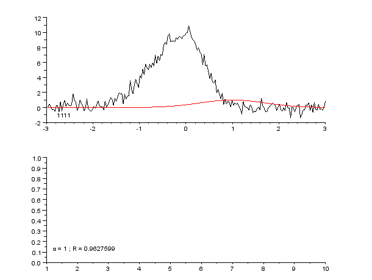

# 基于参数曲线拟合的时间序列预测

> 原文：<https://medium.com/analytics-vidhya/how-to-predict-when-the-covid-19-pandemic-will-stop-in-your-country-with-python-d6fbb2425a9f?source=collection_archive---------0----------------------->

## 预测新冠肺炎疫情什么时候会停在你的国家

## 摘要

[在数学中，**参数曲线拟合**是构建一条曲线或数学函数的过程，该曲线或数学函数对一系列数据点具有最佳拟合，可能受到约束。](https://en.wikipedia.org/wiki/Curve_fitting)

[来源](https://en.wikipedia.org/wiki/Curve_fitting#/media/File:Regression_pic_assymetrique.gif)