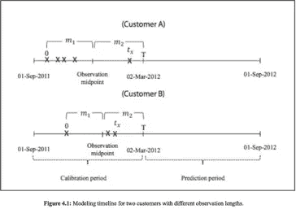

# 如何根据交易数据预测哪些客户会流失？

> 原文：<https://medium.com/analytics-vidhya/how-to-predict-which-customers-would-churn-based-on-transactional-data-da1c48836e3d?source=collection_archive---------2----------------------->

客户流失是指客户不再利用服务或购买平台上的产品，他们可以进一步分为:新客户、活跃客户、不活跃客户和可能流失的客户。

客户流失很难定义，因为客户可能是一个活跃的客户，但不购买产品，可能只是在网站上查看产品；不在平台上购买产品的原因可能有很多:产品不可用、产品被取消、产品交付延迟、没有折扣、可能交付的产品不对。此外，为了识别这些类型的客户，需要设计一个客户流失模型来发现客户流失，并需要研究用于创建客户流失模型的工程特性。

流失模型有助于识别最有可能转向不同平台的客户。

考虑到客户交易的持续时间，客户流失可以分为两种类型:

**·间歇性丢失:**

在特定时间阈值内没有购买产品的顾客，主要特征是购买频率的降低。客户可能不会在时间阈值内购买产品，并且可能会在时间阈值之后继续购买。

**永久丢失:**

客户不会在近期购买产品，因为客户由于多种原因而筋疲力尽；如顾客消费习惯的改变、成长阶段的变化，可能不再要求产品。

**问题定义**

这个预测性问题的目标是确定哪些客户会流失。

**数据描述**

考虑客户交易信息。
已经利用了一定天数的客户交易记录。这个时间窗口可以被分成两个长度相等时间段:

*   校准期和预测期。

**预测变量**:

客户特征:

*   客户创建日期和首次购买日期之间的天数。
*   购物车金额—购买时的平均花费金额。
*   总订单状态—退货和退款计数(RR)、已交付(D)、已取消(C)。
*   已应用优惠券—客户是否应用了优惠券。
*   订单总数—客户下的订单总数。
*   总折扣——向客户提供的总折扣。

为了最大限度地提高预测能力，RFM 变量已被证明在预测客户流失方面发挥着不可否认的作用，注意，客户购买的时间越近，客户越有可能活跃。
此外，客户的购买频率可以作为未来背叛可能性的衡量标准。

**RFM 型号**

**RFM** (最近、频率、货币)分析是一种营销技术，通过检查客户购买的时间(最近)、购买频率(频率)和消费金额(货币)来定量确定哪些客户是最佳客户。
购买的新近性和频率，以及在校准期间顾客总支出的变化幅度，已被选为构建流失模型的预测变量。

**RFM 变量:**

*   x:校准期间观察到的交易数量。
*   t_x:观察期内最后一笔交易的时间(0≤T _ x≤T)；它是校准周期中第一次购买和最近一次购买之间的时间。
*   t:被称为观察期，因客户而异；这是第一次购买和校准期结束之间的时间。
*   δm:客户在观察期后半段(m2)的总消费相对于观察期前半段(m1)的相对变化，即**δm =(m2 m1)/m1。**
*   RFM 分数:使用 K 均值聚类计算*最近度、频率和货币分数*。为了找出 K-means 算法需要多少个聚类，应用肘方法。肘方法简单地告诉最优惯性的最优簇数。**总得分:新近聚类+频率聚类+货币聚类。**利用这些分数，我们可以对客户进行细分 **0 到 2:低值，3 到 4:中值，5+:高值。**

通过创建时间线，从用户的第一笔交易时间线开始，直到校准期结束，为具有不同观察长度的两个客户的时间线建模。

**目标变量:**

当前研究中的目标变量是“客户流失”,它是根据客户在校准和预测期间的交易历史定义的。

因此，当客户在校准期内活跃(即在校准期内至少有一笔交易)但在预测期内没有活动(即购买)时，该客户被定义为“交易者”(编码为 1)。

另一方面，非交易者(编码为 0)被定义为在校准期间活跃并且在预测期间至少购买过一次的客户。

**参考文献:**

[http://dx.doi.org/10.1016/j.indmarman.2014.06.016](http://dx.doi.org/10.1016/j.indmarman.2014.06.016)