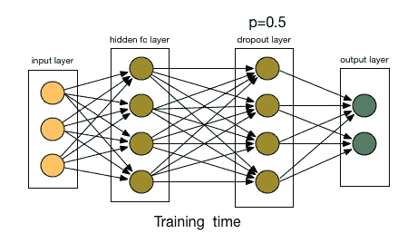

# 如何防止机器学习模型中的过度拟合

> 原文：<https://medium.com/analytics-vidhya/how-to-prevent-overfitting-in-machine-learning-models-803f23bd9b8?source=collection_archive---------8----------------------->

图片来源: [primo.ai](http://primo.ai/index.php?title=Dropout)

具有大量参数的非常深度的神经网络是非常健壮的机器学习系统。但是，在这种类型的大规模网络中，过拟合是一个常见的严重问题。学习如何处理过度拟合对于掌握机器学习至关重要。机器学习中的基本问题是优化和泛化之间的紧张关系。优化指的是…