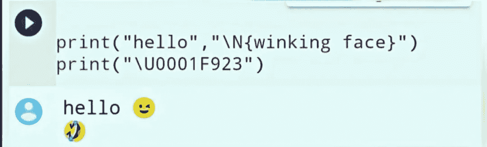
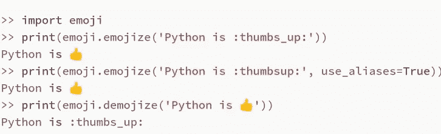

# 如何打印😁😛😋🤣使用 python 的表情符号🐍

> 原文：<https://medium.com/analytics-vidhya/how-to-print-emojis-using-python-2e4f93443f7e?source=collection_archive---------0----------------------->

如今，每个人都在社交媒体上以这样或那样的方式使用表情符号。

作为一名程序员，你有没有想过编写代码，在输出中给出表情符号？

那会很有趣的，对吧！！！

你可能认为会有大算法来打印表情符号😰🙄。但让我告诉你，这不是真的，事实上，如果你很好地理解表情符号，编写代码是非常容易的。

我说的很好地理解表情符号，是指理解表情符号是如何表示或储存在记忆中的？

内存中的一切都以二进制格式存储，表情符号也是如此。我们很难识别二进制格式的表情符号。对于这个问题，我们有各种编码方法。用于编码表情符号的方法是 Unicode。每个表情符号都有预定义的编码 Unicode 字符。

所以，我们只需要使用表情符号的 Unicode 字符。

但是可能很难使用表情符号的 Unicode 字符。

幸运是，python 有多种方法可以用来打印表情符号:

1.  统一码
2.  CLDR 人名
3.  表情模块

## Unicodes:

要使用 unicode，我们需要将 unicode 列表中的“+”替换为“000”。

例如:

“U+1F600”将变成“U0001F600”，并在 unicode 前面加上前缀“\”，然后打印出来。

## CLDR 名称:

表情符号有 CLDR 短名称，也可以使用。

## 示例:

在上面的代码中，第一行使用 CLDR 名字，第二行使用 Unicode。

## 表情模块:

表情符号也可以通过使用 Python 中提供的表情符号模块来实现。要安装它，请在终端中运行以下命令。

> pip 安装表情符号

emojize()函数要求将 CLDR 的短名称作为参数传递给它。然后它会返回相应的表情符号。用下划线替换 CLDR 简称中的空格。

## 示例:

使用以下链接获取所有表情符号的 CLDR Unicode 名称:

[https://unicode.org/emoji/charts/emoji-list.html](https://unicode.org/emoji/charts/emoji-list.html)

🐍🐍😊😊🐍🐍😊😊🐍🐍