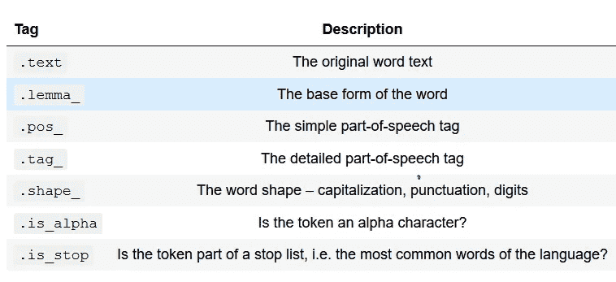
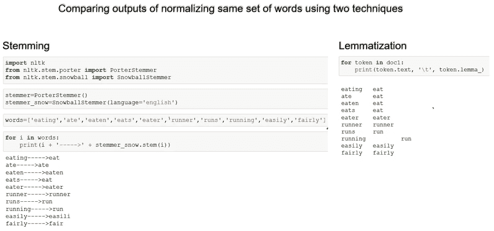

# 用于建模的文本数据处理的基本要素—自然语言处理

> 原文：<https://medium.com/analytics-vidhya/how-to-process-text-data-for-modeling-natural-language-processing-4ac063020629?source=collection_archive---------20----------------------->

“数据”一词意味着以表格格式表示的数字、类别、名称等一组结构化信息以及垄断关系数据库管理系统(RDBMS)的时代已经一去不复返了。技术的发展带来了大量的非结构化数据，如音频文件/信号、视频、文本、图像等等，这导致了新时代数据处理技术和算法的发现。

过多的数据来源提供了前所未有的机会，可以更深入、全面地理解各种概念，并做出明智的决策。

我们的世界现在是“数字化”和“数据化”的。不管你喜不喜欢，互联网可能比你爱的人更了解你。

下面提到的统计数据应该能够让您感受到我们正在生成的数据量及其带来的巨大机遇和挑战。

分析文本数据现在是所有工业领域分析的基石。例如，分析脸书、twitter、博客、网站等平台上的客户评论/反馈，可以提供关于客户情绪的重要信息，甚至可能激发启动新的服务或产品。

通过这篇文章，我的目标是激起你对自然语言处理的兴趣，并启发你探索诸如向量化、主题建模和特征工程等概念的深度

使用非结构化数据进行预测的过程非常复杂，很难在一篇文章中涵盖所有主题，因此我现在将重点放在预处理阶段。矢量化、主题建模等主题。将在我接下来的文章中讨论。

在本文结束时，您应该-

> a)理解自然语言处理的概念。
> 
> b)学习 python 中的 Spacy 和 NLTK 库的基础知识。
> 
> c)学习文本清理和文本数据探索性数据分析(EDA)的技术。

本文中讨论的概念主要基于以下主题-

# 什么是自然语言处理(NLP)？

# **简单来说——**

根据 [IDC](https://www.idc.com/) 的预测，到 2025 年，80 %生成的数据将是非结构化格式，这意味着它将是大量文本，并且没有任何预定义的数据模型。这就是 NLP 发挥作用的地方，它为大规模非结构化数据提供上下文，这有助于在信息的大海中找到洞察力的针。

***“自然语言处理(Natural Language Processing)是指将文本数据摄取并转换为计算机可以处理的形状和形式的一系列技术。”***

# 让我们熟悉一下我们将要使用的库

## **NLTK vs Spacy —**

对于许多常见的 NLP 任务，spaCy 更快更有效，代价是用户不能选择算法实现。

然而，spaCy 并不包括为某些应用程序预先创建的模型，比如情感分析，它相对来说更容易用 NLTK 来执行

在本文中，由于 Spacy 最先进的方法和效率，我们将重点关注 spaCy，但在 NLTK 更容易使用时使用它。到本文结束时，当这两个库最适合某项任务时，您应该可以轻松地使用它们了。

## **NLTK vs 空间事实-**

好了，理论到此为止！让我们开始编码。

*按照下面提到的步骤安装必要的软件包。*

*注意:Anaconda 软件的可用性是先决条件。*

我们将在本节中介绍使用空间的几个关键步骤

我们开始吧

我只提到了最常用的属性。令牌还有其他属性，如“前缀”、“is_title”等。也是。这些属性在特征工程过程中起着至关重要的作用。

*注意:可以使用各种选项使视觉效果更吸引人，并满足您的需求。更多详情请参考*[*https://spacy.io/usage/visualizers*](https://spacy.io/usage/visualizers)*。*

令牌的基本结构包括 3 部分( **<前缀> <语素> <后缀>** )。规范化是去掉前缀/后缀，只保留单词的基本形式(“语素”)的过程。

*如:Anti nationalist =****Anti****【前缀】+****national****【语素】+****ist****【后缀】*

当一个单词(在一个句子中以各种形式存在)被规范化为它的基本形式时，它有助于减少冗余(维度减少)，我们需要处理的单词更少。

我们有两种技术来规范化文本数据。然而，在本文中，我选择了使用词汇化，因为它比词干化更好。

词干实际上是砍掉单词的末尾，直到到达词干。它可能适用于大多数情况，但并非 100%有效。不幸的是，英语有许多例外，词干分析不能产生准确的结果。

大多数关于 NLP 特征词干的讨论，因此我觉得必须包括一个关于它的简介。术语化总是首选，你可以参考 https://github.com/explosion/spaCy/issues/327 的文章来获得这个主题的背景知识。

词汇化有一种形态学的规范化方法，它考虑句子的上下文，而不仅仅是排除结尾字母。例如， ***的引理【was】***是***【be】******【小鼠】*** 是 ***【小鼠】*** 。此外，*的引理可能是 ***【吃】*** 或 ***【吃】*** 视其在句子中的上下文而定。*

**

*观察突出显示的单词的规范化。所有动词都被规范化为“eat ”,名词形式保留其原来的单词以适应句子的上下文。*

**注意:spaCy 不支持词干**

**

*诸如“the”、“a”、“here”、“and”之类的词在句子中频繁出现，但是它们在 NLP 的上下文中几乎没有添加任何值。spaCy 现有一套 350 个停用词，可以根据用户的需要进行定制。停用词的去除有助于减少冗余，提高模型的效率。*

*停用词的例子-*

**

*下面列出了一些定制和学习停用词的技巧。*

****

*可能存在用户想要定义特定模式来查找或移除文本中的特定单词的情况。例如，假设用户希望统计单词“自然语言处理”在句子或语料库(一组文档)中的频率。*

*这个词可以以多种形式存在，比如“自然语言处理”、“自然语言处理”、“自然语言处理”。*

*spaCy 提供了**【Matcher】**和**【phrase Matcher】**，使用户能够构建一个令牌模式库，然后将这些模式与 Doc 对象进行匹配，以返回找到的匹配项列表。*

*您可以在令牌的任何部分进行匹配，包括文本和注释，并且您可以将多个模式添加到同一个**【Matcher】**。*

****

*尝试其他令牌属性，以充分理解“Matcher”所提供的灵活性。*

**

*到目前为止，我们一直孤立地看待概念，现在是时候将它们结合起来，并学习它们在现实世界问题中的实现。*

*我会用亚马逊产品评论的数据集来解释。*

*请参考[https://www . ka ggle . com/data initi/consumer-reviews-of-Amazon-products](https://www.kaggle.com/datafiniti/consumer-reviews-of-amazon-products)了解问题及其属性的完整详细信息。*

**********

*在我们移除停用词并对文档进行词汇化之前，重要的是扩展术语，如**“are ' nt”、“ain't”、“is not”**。*

*以下是我正在使用的一套收缩映射。*

**

*原始文本数据只是自由文本，这意味着输入没有预定义的格式。例如，当用户在网站上评论产品或服务时，他可能希望使用正确的英语单词或使用简短的形式，如 **"coz"** 来代替**"因为"**，等等。或者这可能是一个真正的拼写错误。*

*清理这样的数据是一场噩梦，因为它没有特定的模式，并且复杂性可能因每个用户或输入而异。此外，拼写错误的单词会严重损害模型的准确性。*

*谢天谢地，我们有**文本 Blob** 来拯救我们。它通常用于情感分析，然而，它在纠正拼写错误的单词时也非常方便。下面是一个例子，说明它对文本清理有很大的帮助。像**【expectationsz】****【browsng】**这样的词被转换成**【expectations】****【浏览】。***

****

*代码的结果:*

**

**注意:正则表达式在文本清理过程中非常方便。我已经详细介绍了这个主题，因为它是一个庞大的主题，需要单独的。请务必参考*[*https://regex101.com/*](https://regex101.com/)*来试验正则表达式模式并学习它的实际实现。**

*我们现在已经完成了文本清理阶段。*

*在本文中，您已经了解了 NLP 的概念及其重要性。*

*更具体地说，*

*a)熟悉 spaCy 和 NLTK 库，并了解为什么前者是首选。*

*b)了解使用原始文本数据构建模型时文本清理的重要性和技巧。*

*b)熟悉基本概念，如标记化、文本规范化和停用词。*

*我将在接下来的文章中讨论以下概念*

**