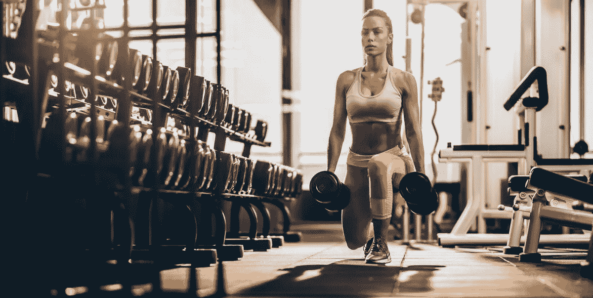
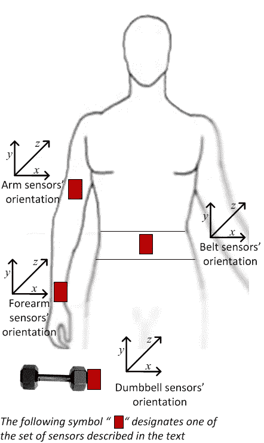
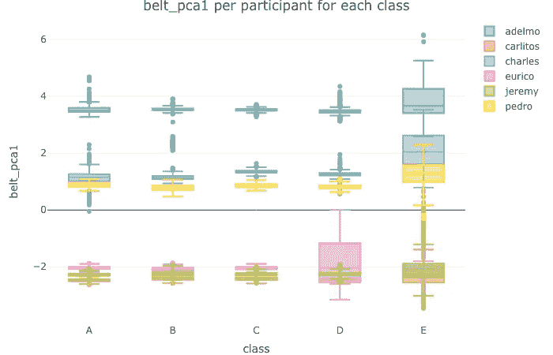
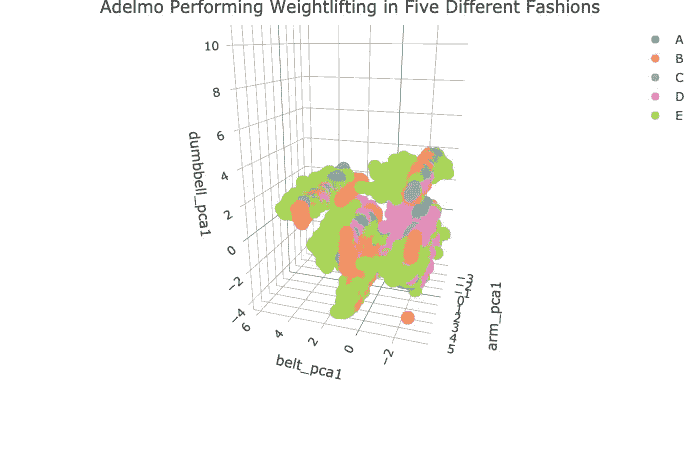

# 如何使用健身追踪器数据鉴定举重练习

> 原文：<https://medium.com/analytics-vidhya/how-to-qualify-weightlifting-exercise-using-fitness-tracker-data-8f5c591072ec?source=collection_archive---------34----------------------->

主成分分析、随机森林和 K 近邻



健身房里的人非常关注的一件事是他们做了多少次，但他们很少关注他们做得有多好。使用 Jawbone Up、Nike FuelBand 和 Fitbit 等设备，现在可以相对便宜地收集大量个人活动数据。有没有可能使用健身追踪器数据来判断人们是做得很好还是犯了一些常见的错误？

在这个项目中，我的目标是使用在 Groupware @ LES([http://web . archive . org/web/20161224072740/http:/Groupware . LES . INF . puc-Rio . br/har](http://web.archive.org/web/20161224072740/http:/groupware.les.inf.puc-rio.br/har))进行的实验中收集的健身追踪器数据来预测某人进行简单举重练习的方式。

# 实验概述

这是研究人员进行的实验的概述。六名年轻健康的参与者，年龄都在 20-28 岁，几乎没有举重经验，被要求以五种不同的方式进行一组 10 次重复的单侧哑铃二头肌弯曲:

*   A 类:完全按照规范(正确的方式)
*   B 类:将手肘向前倾(常见错误之一)
*   C 类:只举一半哑铃(常见错误之一)
*   D 类:只将哑铃放下一半(常见错误之一)
*   E 类:将臀部甩向前方(常见错误之一)



参与者由一名经验丰富的举重运动员监督，以确保执行符合他们应该模拟的方式。实验中放置了 4 个不同的加速度计，如左图所示。其中三个放在腰带、前臂和手臂上，一个放在哑铃上。在没有太多细节的情况下，研究人员能够在非常短的时间间隔内跟踪每个代表中发生的 150 多个变量，原始的和衍生的。

# 降维

150 个变量对于建模来说太多了。这不仅需要我的 MacBook Pro 可能无法处理的大量计算能力，还可能引入夸大的方差，因为这些变量中有许多是从原始数据中得出的，可能高度相关。我的首要任务是降低数据维度。我将使用 caret 包来预处理数据。由于可以通过传感器对特征进行分组，我们先来看看皮带传感器的特征，并验证我们使用主成分分析来降低维数的做法是否正确。

```
library(caret)
training_belt_pcamodel <- preProcess(training_belt, method = c("center", "scale", "pca"), thresh = 0.90)
training_belt_pcamodel## Created from 19622 samples and 13 variables
## 
## Pre-processing:
##   - centered (13)
##   - ignored (0)
##   - principal component signal extraction (13)
##   - scaled (13)
## 
## PCA needed 4 components to capture 90 percent of the variance
```

正如我们所看到的，即使这组有 13 个变量，我们也可以用简单的 4 个成分获得 90%的方差。还不错。我将继续将这种方法应用于所有的特征组，最终得到大约 25 个变量。

# 探索性数据分析

逻辑上。很明显，来自传感器数据的特征将与锻炼的质量直接相关。参与者本身呢？即使他们都以相同的方式举起哑铃，传感器的跟踪也会不同吗？从下面的图表中我们可以看到答案是肯定的。查看皮带传感器数据的第一个主成分分析，每个类别中不同参与者之间的值范围存在差异。Adelmo(绿色)在 belt_pca1 中似乎总是有较高的数值。



从上面的图表看不出每个参与者的五种不同方式的运动数据有什么不同。让我们仔细看看。以我们最喜欢的参与者 Adelmo 为例。下面是一个互动的三维情节，检查他的动作。x、y、z 轴分别为 belt_pca1、dumbbel _ pca1 和 arm_pca1。不同的等级用不同的颜色表示。我们可以看到有些类在这三个特征上似乎有非常鲜明的价值，比如 E 类(浅绿色)；而其他一些类别就不那么容易区分了，比如 A 类(青绿色)和 C 类(蓝色)。



***你可以在这里玩转这个互动 3D 图表* **[*https://raaandu . github . io/coursera _ practical _ machine _ learning/index . html*](https://raaandu.github.io/coursera_practical_machine_learning/index.html)

探索性数据分析的结论是，参与者本身和他们的运动对他们进行锻炼的方式有影响。

# 模型拟合

因为这是一个多分类问题，所以不能像 Logistic 模型一样使用二元分类模型。这里我将拟合两个模型——随机森林和 K-最近邻。

1.  随机森林

随机森林是一个强大的工具。预测性能可以与最好的监督学习算法竞争。它提供了测试误差的有效估计，而不会产生与交叉验证相关的重复模型训练的成本。我们下面的随机森林模型达到了 97%的准确率，非常好。

```
*# Fit random forest model*model1 <- train(classe ~., data= pca_tra, method="rf")
pca_val$pred_rf <- predict(model1, newdata = pca_val, type = "raw")# Check confusion matrix
confusionMatrix(pca_val$classe, pca_val$pred_rf)## Confusion Matrix and Statistics
## 
##           Reference
## Prediction    A    B    C    D    E
##          A 2216    8    3    2    3
##          B   56 1449   12    1    0
##          C    3   32 1322   11    0
##          D    6    0   62 1210    8
##          E    0    0   11    7 1424
## 
## Overall Statistics
##                                           
##                Accuracy : 0.9713          
##                  95% CI : (0.9674, 0.9749)
##     No Information Rate : 0.2907          
##     P-Value [Acc > NIR] : < 2.2e-16       
##                                           
##                   Kappa : 0.9637 
```

2.k-最近邻

与随机森林一样，KNN 也是一个非参数模型，这意味着它不会对基础数据分布做出任何假设，例如结果变量和预测值之间是否存在线性关系。理解起来非常简单，实现起来也同样容易。通过交叉验证，我们的 KNN 模型达到了 98%的准确率。

```
*# Fit KNN model
# We will create a 3-fold cross validation
# We will tune k between 1 and 10*ctrl <- trainControl(method="repeatedcv",repeats = 3)
model2 <- train(classe ~., data= pca_tra, method="knn", trControl = ctrl, tuneGrid = expand.grid(k = 1:10))
pca_val$pred_knn <- predict(model2, newdata = pca_val, type = "raw")# Check confusion matrix
confusionMatrix(pca_val$classe, pca_val$pred_knn)## Confusion Matrix and Statistics
## 
##           Reference
## Prediction    A    B    C    D    E
##          A 2210   16    5    0    1
##          B   20 1480   17    1    0
##          C    6   10 1337   12    3
##          D    1    0   22 1261    2
##          E    0    3    6    3 1430
## 
## Overall Statistics
##                                           
##                Accuracy : 0.9837          
##                  95% CI : (0.9806, 0.9864)
##     No Information Rate : 0.2851          
##     P-Value [Acc > NIR] : <2e-16          
##                                           
##                   Kappa : 0.9794
```

# 做出预测

对于项目的最后一步，我继续在研究人员提供的单独测试数据集上测试随机森林模型。它有 20 个举重动作的传感器数据。我的模型正确地预测了他们所有人的类别。答对了。

# 结论

如果你以前有过任何类型的健身追踪器，你可能会记得第一次穿上它们时，其中一些会要求你走几步，跳几次，或者做一些运动。这个过程通常被称为校准。校准后，您的追踪器软件将能够比较您与其他用户进行这些锻炼动作的情况，就像我们在模型中比较 Adelmo 与其他五名参与者的情况一样(箱线图)。从这种比较中得出的关系将被纳入到你的追踪器软件的预测模型中，允许它预测你的活动类型。我们的模型和这个模型的不同之处在于，我们的模型实际上试图预测你进行特定锻炼的效果，而不是你进行什么类型的锻炼，但原理是相同的。从我们的模型中我们知道，这种预测需要多个传感器。接下来的问题是，这对于日常锻炼是否可行？合理预测所需的最少传感器数量是多少？我们应该把这些传感器放在哪里以获得最大的预测能力？

*   *本文中的数据处理和可视化是用 r 编写的，在我的* [*Github*](https://github.com/raaandu/blog_posts/tree/master/How_to_Qualify_Weightlifting_Exercise) *上可以找到更多信息。*