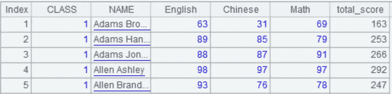
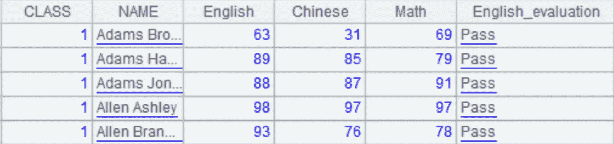
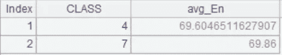
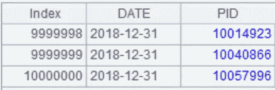
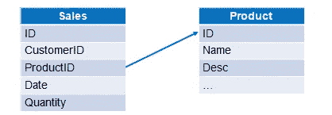
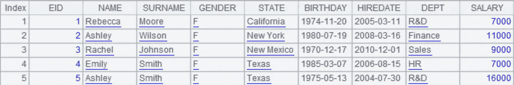
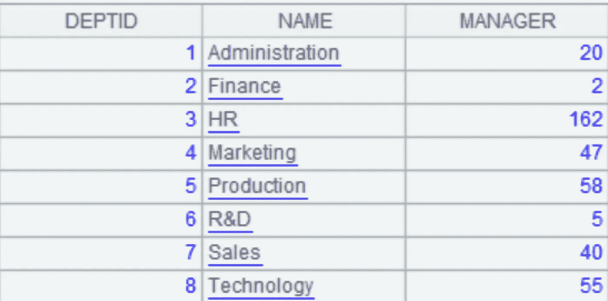

# 如何在数据文件上查询 SQL

> 原文：<https://medium.com/analytics-vidhya/how-to-query-sql-on-data-file-eaadbeff2abe?source=collection_archive---------7----------------------->


在 SQL 中操作数据库数据既方便又高效。当我们试图计算文件时，将数据加载到数据库并在 SQL 中处理它是很自然的。问题是数据加载本身并不简单。如果有一种方法可以直接在文件上执行 SQL 查询，那将会非常方便。这里我将引入这样一个工具，esProc SPL，列出各种 SQL 文件查询场景并提供 esProc 示例程序。esProc 是一个专门的数据计算引擎，SPL(esProc 使用的结构化过程语言的缩写)拥有一套完整的 SQL 文件查询方法。

本文在所有例子中都使用了文本文件。事实上，这些方法也适用于 Excel 文件。

# 1.过滤

根据 SQL 中的指定条件从文本文件中选择记录。

示例:从学生成绩表 *Students_scores.txt* 中选择 1 班学生的成绩。在该文件中，第一行包含列名，详细数据从第二行开始:


```
$select * from E:/txt/Students_scores.txt where CLASS = 1
```

# 2.聚合

在 SQL 文本文件中汇总数据。

示例:根据学生成绩表计算语文平均分、数学最高分、英语总分。

```
$select avg(Chinese),max(Math),sum(English) from E:/txt/Students_scores.txt
```

# 3.列间计算

在 SQL 的文本文件中执行列间计算。

例:计算学生成绩表中每个学生的总分。

```
$select *,English+Chinese+Math as total_score from E:/txt/students_scores.txt
```

下面是结果，其中添加了计算列 total_score。



# 4.选择语句

我们可以使用 CASE 语句在 SQL 中执行复杂的条件查询。

示例:确定学生成绩表中每个学生的英语成绩是否合格。

```
$select *, case when English>=60 then ‘Pass’ else ‘Fail’ end as English_evaluation from E:/txt/students_scores.txt
```

下面是 A1 的结果，其中添加了一个计算列 English_evaluation。



# 5.整理

在 SQL 中将文本文件中的数据按升序(或降序)排序。

示例:按班级升序和总分降序对学生成绩表进行排序。

```
$select * from E:/txt/students_scores.txt order by CLASS,English+Chinese+Math desc
```

# 6.顶级的

在 SQL 中获取文本文件的 Top-N。

例如:获取英语成绩最高的三名学生的记录。

```
$select top 3 * from E:/txt/students_scores.txt order by English desc
```

# 7.分组和聚合

在 SQL 中对文本文件中的数据执行分组和聚合。

例:求各班英语最低分，语文最高分，数学总分。

```
$select CLASS,min(English),max(Chinese),sum(Math) from E:/txt/students_scores.txt group by CLASS
```

# 8.分组后过滤

对文本文件中的数据进行分组和汇总，然后在 SQL 中执行过滤。

例子:找出英语平均成绩在 70 分以下的班级。

```
$select CLASS,avg(English) as avg_En from E:/txt/students_scores.txt group by CLASS having avg(English)<70
```

这是结果。



# 9.明显的

在 SQL 中对文本文件中的数据执行不同的操作。

示例:获取所有类的 id。

```
$select distinct CLASS from E:/txt/students_scores.txt
```

# 10.独特计数

在 SQL 中对文本文件中的数据执行 distinct 操作后计数。

示例:根据产品信息文件，统计不同种类产品的数量。以下是文件的一部分:



```
$select count(distinct PID) from E:/txt/PRODUCT_SALE.txt
```

# 11.不同分组和计数

对文本文件中的数据进行分组，并在 SQL 中对文本文件中的数据进行非重复计数。

示例:根据销售表，计算每种产品有销售记录的天数。

```
$select PID,count(distinct DATE) as no_sdate from E:/txt/PRODUCT_SALE.txt group by PID
```

# 12.两表连接查询

在 SQL 中对两个文本文件执行连接查询。

示例:产品信息和销售信息分别存储在两个文本文件中。我们想计算每份订单数量小于 10 的产品的总销售额。以下是文件的数据结构及其关系:



```
$select sum(S.quantity*P.Price) as total 
from E:/txt/Sales.txt as S join E:/txt/Products.txt as P on S.productid=P.ID 
where S.quantity<=10
```

# 13.多表连接查询

在 SQL 中对两个以上的文本文件执行连接查询。

示例:州信息、部门信息和员工信息存储在三个不同的文本文件中。我们想在人力资源部找到加州雇员的信息。

```
$select e.NAME as NAME
from E:/txt/EMPLOYEE_J.txt as e 
 join E:/txt/DEPARTMENT.txt as d on e.DEPTID=d.DEPTID 
 join E:/txt/STATE.txt as s on e.STATEID=s.STATEID 
where 
 d.NAME=’HR’ and s.NAME=’California’
```

# 14.多表、多级连接查询

在 SQL 中对两个以上的文本文件执行多级连接查询。

示例:州信息、部门信息和员工信息存储在三个不同的文本文件中。我们想找到经理来自加利福尼亚的纽约州雇员的信息。

```
$select e.NAME as ENAME
from E:/txt/EMPLOYEE.txt as e 
 join E:/txt/DEPARTMENT.txt as d on e.DEPT=d.NAME
 join E:/txt/EMPLOYEE.txt as emp on d.MANAGER=emp.EID 
where e.STATE=’New York’ and emp.STATE=’California’
```

# 15.嵌套子查询

在嵌套子查询中使用非常复杂的 SQL。

示例:员工信息和部门信息存储在两个文本文件中。我们想找到拥有最年轻经理的部门。以下是这两个文件的部分内容:



```
$select emp.BIRTHDAY as BIRTHDAY,emp.DEPT as DEPT
from E:/txt/DEPARTMENT.txt as dept 
 join E:/txt/EMPLOYEE.txt emp 
 on dept.MANAGER=emp.EID 
where 
 emp.BIRTHDAY=(select max(BIRTHDAY) 
 from ( select emp1.BIRTHDAY as BIRTHDAY 
 from E:/txt/DEPARTMENT.txt as dept1 
 join E:/txt/EMPLOYEE.txt as emp1 
 on dept1.MANAGER=emp1.EID
  )
 )
```

# 16.公共表表达式

使用 SQL WITH 子句计算文本文件中的数据。

示例:基于上一示例中的相同文本文件，从部门表中找到指定的部门(人力资源、R&D、销售),并对这些部门中的女性员工进行计数并计算平均工资。

```
$with A as 
(select NAME as DEPT from E:/txt/DEPARTMENT.txt
where NAME=’HR’ or NAME=’R&D’ or NAME=’Sales’) select A.DEPT DEPT,count(*) NUM,avg(B.SALARY) AVG_SALARY from 
A left join E:/txt/EMPLOYEE.txt B
on A.DEPT=B.DEPT 
where B.GENDER=’F’ group by A.DEPT
```