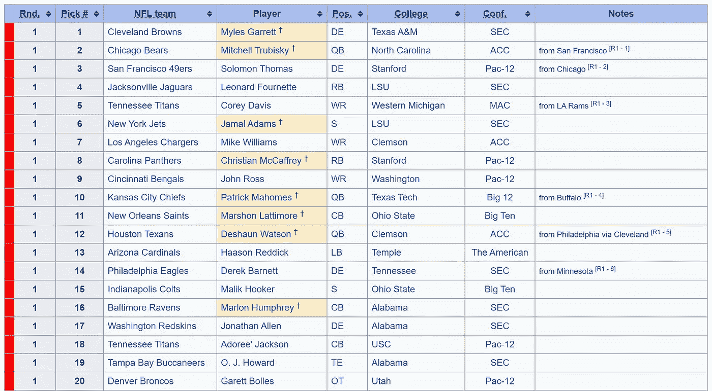

# 如何:使用 Python 在互联网上搜索数据

> 原文：<https://medium.com/analytics-vidhya/how-to-querying-the-internet-for-data-part-1-5385f3961b52?source=collection_archive---------15----------------------->

*这是 2017 年跑卫系列的第 1 部分，共 3 部分。*

当一个问题出现时，你知道你是一个极客，你立即想到编码解决方案。

我是一个超级体育迷，go #WhoDatNation，体育最棒的部分之一就是随之而来的无穷无尽的数据。每项运动的每场比赛都会产生更多的数据，这意味着有更多的数据可供分析。

总有相关的 XKCD。

就在昨天，在维京人和包装工队的比赛中，评论员提到了 2017 年 NFL 选秀，以及它如何产生了我们见过的最好的选秀课程之一。所以我花了一些时间在网上寻找球员的完整名单，看看他们从那以后的表现。事实证明，并没有一个简化的列表——所以让我们做一个吧！

> 在 How To 中，我们将学习如何使用 Python 和请求库来查询互联网。然后，我们将数据转换成 DataFrame，这样我们就可以使用 Pandas 和 Python 中的其他库来进一步操作和分析数据。

什么是网页抓取？听起来，它是在网上搜寻信息。现在，这并不意味着我们自己去尝试获取信息；这意味着我们正在利用某种技术使检索过程更容易。

我们将从挑选我们想要查看的信息开始，在我们的情况下，这是 2017 年的某种选秀名单。快速搜索显示，维基百科关于 2017 年 NFL 选秀[的页面有一个漂亮且易于阅读的表格，所以我们将使用它。](https://en.wikipedia.org/wiki/2017_NFL_Draft)

2017 年 NFL 选秀前 20 名。

接下来，让我们导入所有必需的库。

Python 中的[请求](https://2.python-requests.org/en/master/)库允许您向 URI\URL 发送请求。这些请求通常是 POST(添加)、PUT(更新)、GET(检索)和 DELETE(删除)。这些是您在与典型的 API 交互时可以采取的操作，而请求库使您可以轻松地与所述 API 进行交互。出于我们的目的，我们只需要向维基百科的网页发送一个 GET 请求。

这一行使用请求库的`get`方法并返回一个响应对象，在我们的例子中是`<Response [200]>`。`200`是我们得到的一个 HTTP 状态代码。200 OK 是表示请求成功的响应！

实际 GET 请求的内容存储在`r.content`中，是我们查询的 Wikipedia 页面的原始 html。我们将使用带有 [BeautifulSoup](https://pypi.org/project/beautifulsoup4/) 的内容。BeautifulSoup 允许我们使 HTML 可读，并在 HTML 中搜索元素(例如我们正在寻找的表格)。

这里，`root`保存了格式化的 HTML，是一个我们可以使用 BeautifulSoup 的`.find`方法进行搜索的对象。让我们首先在 HTML 中找到确切的表格

这是保存拔模数据的表格。注意，这个类是“维基可排序的”。

我们已经找到了桌子，但是我们怎样才能进一步使用它呢？这就是熊猫的用武之地。Pandas 是一个库，为数据操作和分析提供了不同类型的数据结构。在用 Python 处理数据时，由于它的灵活性和特性，它是一个很好的资源。Pandas 中的数据帧是一个 2D 数组，表示为一个表。我们使用这些表来轻松地访问数据。

回到手头的问题。现在我们已经找到了表，我们可以使用 BeautifulSoup 的`find`方法在 HTML 中查找正确的表(通过指定我们要查找的类)。然后，我们可以用这个表格 HTML 创建一个熊猫数据框架，以便进一步操作。

看看 df.head()返回什么。我们有数据了！

恭喜你。您能够从 web 中抓取数据，并将其存储在一个易于使用的数据结构中，我们可以用它来执行数据分析。然而，我们还没有完全完成。下一步是预处理数据。我们将通过删除`Unnamed: 0`列并重命名剩余的列来清理我们的数据帧。

df.head()现在返回修改后的 DataFrame。干净利落，蓄势待发！

> 预处理数据是数据分析的必要步骤，因为它允许我们处理只包含我们关心的值的[【整齐的数据】](http://vita.had.co.nz/papers/tidy-data.pdf)。数据还应该易于使用，以便未来的应用更容易(如果我们进入数据可视化或机器学习)。

现在我们已经清理了数据，我们可以开始查看我们感兴趣的内容:班级中的跑卫(由“RB”位置指示)。对我们来说幸运的是，Pandas 使得过滤我们的数据变得很容易(而且有很多方法可以做到这一点)。我们将创建一个新的数据帧来存储所有的运行备份。

跑锋最终名单！

至此，我们完成了本教程！我们能够使用 requests 和 BeautifulSoup 库来查询 Wikipedia 网页并获得我们的表的 HTML。然后我们使用 Pandas，将 HTML 转换成数据帧，我们可以清理和过滤它，得到我们的跑锋列表！

在系列的下一部分[中，我们将使用我们所学的关于请求的知识来获取更多的数据，并学习如何处理数据帧。然后我们将学习可视化我们的数据，看看 2017 年的跑卫现在在 NFL 的表现如何，与其他人相比。](/@amanjaiman/how-to-manipulate-dataframes-in-pandas-31375623d859)

*本教程的完整代码如下:*

*一如既往，我很想听听你对这篇文章的看法！将任何问题或意见发送至***。**