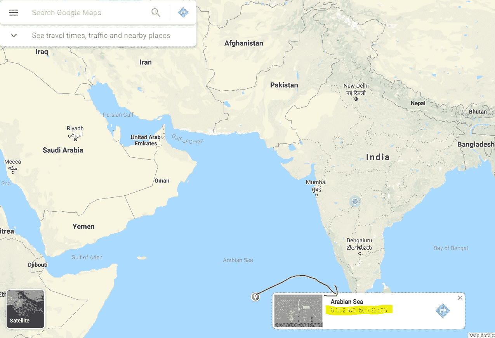
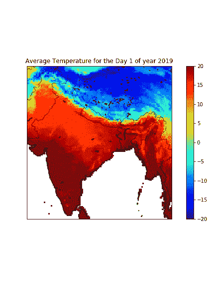

# 如何阅读和可视化 netCDF(。nc)地理空间文件使用 python？

> 原文：<https://medium.com/analytics-vidhya/how-to-read-and-visualize-netcdf-nc-geospatial-files-using-python-6c2ac8907c7c?source=collection_archive---------3----------------------->

> 如果你能把数据可视化，你就能分析数据。

**什么是 netCDF 文件？**
netCDF(网络通用数据格式)是一种用于存储温度、湿度、气压、风速、风向等多维科学数据(以变量的形式)的文件格式。这些变量中的每一个都可以通过一个维度(比如时间)来显示。它通常用于气候学、气象学、海洋学，其中数据与天气预报、气候变化有关，甚至用于一些 GIS 应用程序。

**访问和可视化 netCDF 文件需要哪些库？**

要安装“底图”，请遵循以下具体步骤:

1.  首先，你的电脑上必须有 **anaconda** 安装。
2.  现在进入这个伟大的链接:[**http://www.lfd.uci.edu/~gohlke/pythonlibs/**](http://www.lfd.uci.edu/~gohlke/pythonlibs/) **搜索“底图”并下载名为“**底图-1 . 2 . 1-cp37-cp37m-win _ amd64 . whl**”的文件。
    我下载了这个文件，因为我的 python 版本是 **3.7.4** ，我的操作系统是 **64** 位。请根据您的系统配置选择文件。**
3.  **移动下载的'**。“文件到目录”C:\Python27** 。(同样，这是我下载 python 的路径，请选择 python 安装所在的路径。)**
4.  **在“以管理员身份运行”模式下打开 anaconda 提示符，并转到。文件被移动了。**
5.  **使用此命令:**

```
pip install basemap‑1.2.1‑cp37‑cp37m‑win_amd64.whl
```

**之后，您就可以导入所有需要的库了。**

****如何用 python 读取 netCDF 文件？****

**请点击[此处](https://psl.noaa.gov/cgi-bin/db_search/DBListFiles.pl?did=195&tid=86447&vid=668)下载本文数据。一旦数据下载完毕，我们就开始吧。**

**输出:**

```
<class 'netCDF4._netCDF4.Dataset'>
dict_keys(['lon', 'lat', 'time', 'tave', 'rstn'])
```

**我们可以看到数据集的类型是 netCDF，数据中总共有 5 个变量(' lat '，' lon '，' time '，' air '，' time_bnds ')。**

**现在，我们已经从“数据”中包含的任何变量中读取了数据，对于本文，我们将读取坐标变量和“空气”变量。下面的代码将变量放入 NumPy 数组。**

****如何使用底图绘制数据？****

**“底图”允许您使用较低和较高级别的经度和纬度位置创建参考地图。在下面的代码中，纬度和经度点取自谷歌地图，引用了印度的边界。您也可以查看下图，了解如何从谷歌地图中获取点，突出显示的值的格式为(lat，long)。这里，基本上将生成一个底图实例，它指定了我们所需的地图和投影设置。**

**您也可以查看下图，了解如何从谷歌地图中获取点，突出显示的值的格式为(lat，long)。**

****

**显示坐标的谷歌地图快照**

**生成底图实例后，我们将继续下一步，使用 matplotlib 绘制数据。**

**数据包含全年每天的点，我们现在只能看到一天的可视化，让我们尝试模拟该过程，以便全年的数据都能够可视化。在运行下面的代码之前，一定要提到应该创建的图像的数量(天数),我已经提到了整整一年(365)**

**一旦创建了图像，循环这些图像以创建一个。gif '以便更好地可视化。在这里，利用“PIL”图书馆读取图像，并使用它们制作一个 gif。**

**如果所有步骤都以正确的方式执行，生成的“tave_timelapse.gif”将类似于下面这样。看一看。由于在介质上共享超过 25MB 图像大小的内存限制，我只做了前 50 天的模拟。**

****

****观测:** 我们可以在地图上看到上半球的温度是如何变化的。这种类型的可视化有助于发现特定因素的变化，例如一段时间内的风、雨。**

```
**References:** [https://www.youtube.com/watch?v=r5m_aU5V6oY](https://www.youtube.com/watch?v=r5m_aU5V6oY) [http://schubert.atmos.colostate.edu/~cslocum/netcdf_example.html](http://schubert.atmos.colostate.edu/~cslocum/netcdf_example.html)
```