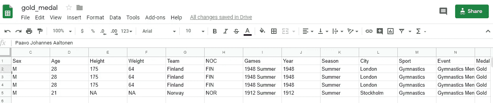

# 如何使用 Python 读写 google sheet

> 原文：<https://medium.com/analytics-vidhya/how-to-read-and-write-data-to-google-spreadsheet-using-python-ebf54d51a72c?source=collection_archive---------0----------------------->


米卡·鲍梅斯特在 [Unsplash](https://unsplash.com?utm_source=medium&utm_medium=referral) 上的照片

**小提示:**如果你正在寻找使用 python 读写 gsheet，那么这个博客将会解决你的问题。这是我的 **100%保证**，但就这一点，你必须慢慢来，仔细阅读。

**H** ello 学者，

今天，我们将了解如何从一个 google 电子表格中读取数据，对数据进行一些操作，然后再将数据写入另一个 google 电子表格。

听起来很酷？我们开始吧

首先，您必须使用 Pip 导入以下包。

```
pip install google_spreadsheet
pip install google-auth-oauthlib
pip install pandas
```

然后获取想要从中读取数据的 google sheet 的 ID。

*   **获取工作表 ID。**

1.  转到电子表格(在我的例子中，我想从运动员事件表中读取数据),然后单击共享。


2.一旦你点击一个共享，你会得到这样的页面，所以点击复制链接。


3.你会得到这种格式的链接。

[https://docs.google.com/spreadsheets/d/**1 cvzswlido 3 lfh na 7 RCS 8 vfqacx 73 rgor-OZ _ ftvyle 8**/edit？usp =共享](https://docs.google.com/spreadsheets/d/1cvZswLiDo3LfhnA7RcS8vFqacx73RGor-OZ_FtvyLE8/edit?usp=sharing)

粗体文本是您的 google 工作表 ID。(如果您正在从其他人的工作表中读取数据，那么该工作表应该与您的 google id 共享)

*   **启用 Google sheet API。**

前往[https://developers.google.com/sheets/api/quickstart/python](https://developers.google.com/sheets/api/quickstart/python)。


点击“启用 Google sheet”API 按钮，下载 JSON 文件，并存储在保存代码的同一个文件夹中。

(如果您是第一次使用谷歌云，请激活 GCP 并创建一个新项目)

*   在您的 python 环境中运行以下代码。

在这段代码中，您必须进行以下更改。

1.  更改 google 工作表 ID。
2.  更改 JSON 文件。
3.  根据您的数据更改工作表的范围。(如果需要)

一旦你做了这些改变，认证链接将在你运行代码时出现，所以通过登录你的谷歌账户进行认证。

这段代码将从您的 google 工作表中读取数据，并将其存储在 pandas dataframe 中。

让我们快速理解代码。

1.  导入了必要的库。
2.  定义了工作表的范围。可以根据需要改变范围。


因为我们在阅读材料，所以我们可以选择前两个范围中的任何一个。

3.输入工作表的 ID 和范围。从提到的 ID 和选定范围的数据将通过代码读取。

4.通过下载的 JSON 文件验证 Google API。通过使用该文件，我们创建了“token.pickle”文件，该文件将存储在我们的 pc 中以备将来使用，每当该 pickle 文件过期时，我们的代码将刷新该文件。

5.构建了调用工作表 API 并获取数据的服务。然后最终将数据存储在 pandas dataframe 中。

6.在这里，我们将我们的凭证存储在 pickle 文件中，这样我们就不必每次都进行身份验证，并将 pickle 文件发送到服务器，这样我们就可以轻松地将其投入生产。


现在你可以在你的数据帧上做任何你想做的操作。(通常，我将它用于多个用户输入，所以当一些变量值改变时，我不需要在我的代码中做改变)

# 将 dataframe 写入 google sheet。

我已经阅读了“运动员 _ 事件”表的数据，并将其存储在数据帧中。现在我只想要在‘金牌榜’上获得体操金牌的运动员的数据。

酷…我们开始吧。

1.  获取要存储输出的工作表的 ID。
2.  确定我的输出范围。

这段代码将从 JSON 文件创建一个 pickle 文件，构建服务，最后将记录更新到 gold_medal 表中。

执行上述代码后，将会打开一个身份验证窗口，询问是否可以访问。在允许对纸张进行写入访问后，将会出现认证成功消息。



呜呜呜…..现在我们的数据帧在我们的输出表中。

谢谢你，❤️

[**点击这里保持联系**](https://forms.gle/BPDm3oyx6vwAwD619)

如果对这个博客有任何疑问，请随时联系我

参考资料:

[https://developers.google.com/sheets/api/quickstart/python](https://developers.google.com/sheets/api/quickstart/python)。

[https://learn data analysis . org/create-a-function-to-construct-service-instance-for-Google-API/](https://learndataanalysis.org/create-a-function-to-construct-service-instance-for-google-api/)