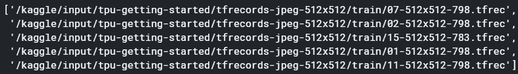
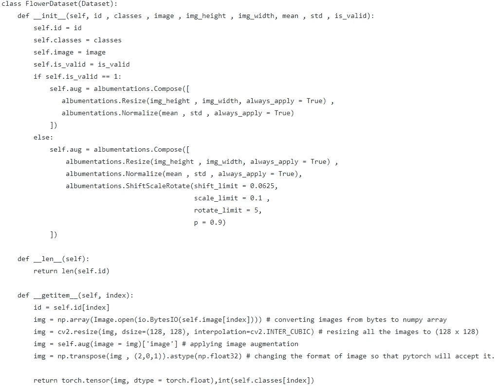
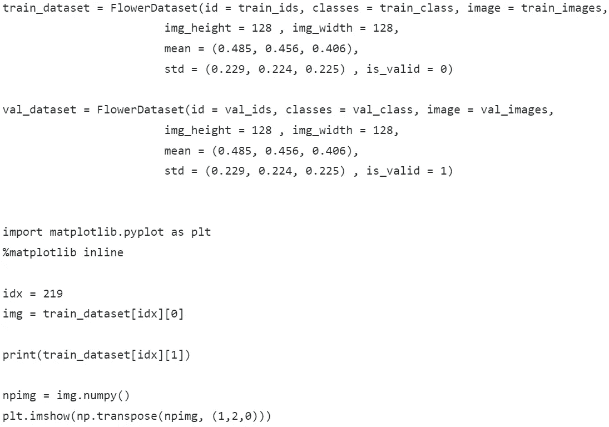
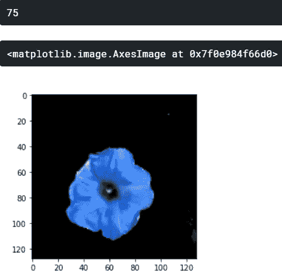

# 如何在 PyTorch 中读取 tfrecords 文件！

> 原文：<https://medium.com/analytics-vidhya/how-to-read-tfrecords-files-in-pytorch-72763786743f?source=collection_archive---------3----------------------->

**第一步** →首先你需要知道你的数据内容是什么。为了便于理解，我将使用 kaggle 数据对 104 种花类 进行 [**分类。因此，有 4 个文件夹，每个文件夹有 3 个子文件夹，分别用于训练、验证和测试图像。因此，我将只使用培训和验证子文件夹。tfrec 文件用于我们的演示。**注**:已给出每个。子文件夹中的 tfrec fie 包含`id`、`label`(样本的类别，用于训练&验证数据)和`img`(字节串格式的实际像素)。**](https://www.kaggle.com/c/tpu-getting-started)


我们数据集的样本图片

**第 2 步** →我们将使用 **glob** 库来获取文件，并在训练和验证子文件夹中使用它们的路径名

```
import globtrain_files = glob.glob(‘/kaggle/input/tpu-getting-started/*/train/*.tfrec’)val_files = glob.glob(‘/kaggle/input/tpu-getting-started/*/val/*.tfrec’)
```

让我们看看在 train_files 变量中加载了什么

```
print(train_files[:5])
```



**步骤 3** →现在，我们将在三个不同的列表变量中收集 id、文件名和图像字节，用于训练&验证文件。

```
# importing tensorfow to read .tfrec files
import tensorflow as tf
```

首先导入 tensorflow

```
# Create a dictionary describing the features.
train_feature_description = {
    'class': tf.io.FixedLenFeature([], tf.int64),
    'id': tf.io.FixedLenFeature([], tf.string),
    'image': tf.io.FixedLenFeature([], tf.string),
}
```

我们正在创建一个字典，描述字节字符串中的类、id 和图像的特征。

```
def _parse_image_function(example_proto):
 return tf.io.parse_single_example(example_proto, train_feature_description)
```

然后创建一个函数来解析输入 tf。使用字典的示例原型(**train _ feature _ description**)

```
train_ids = []
train_class = []
train_images = []for i in train_files:
  train_image_dataset = tf.data.TFRecordDataset(i)train_image_dataset = train_image_dataset.map(_parse_image_function)ids = [str(id_features['id'].numpy())[2:-1] for id_features in train_image_dataset] # [2:-1] is done to remove b' from 1st and 'from last in train id names
  train_ids = train_ids + idsclasses = [int(class_features['class'].numpy()) for class_features in train_image_dataset]
  train_class = train_class + classesimages = [image_features['image'].numpy() for image_features in train_image_dataset]
  train_images = train_images + images
```

最后，将特征存储在 3 个不同的列表中。为了方便起见，您也可以使用这些列表创建一个数据框架。**注** : [2:-1]用于删除列车 id 名称中第一个 **b'** 和最后一个【T23 '。我们也可以为我们的验证做同样的事情。tfrec 文件

为了测试，我们可以这样做。

```
import IPython.display as displaydisplay.display(display.Image(data=train_images[211]))
```


上述代码的输出

**步骤 4** →最后，我们将使用提取的特征创建 pytorch 数据集类，即 train _ ids、train_class、train_images。

先做一些进口

```
from PIL import Image
import cv2
import albumentations
import torch
import numpy as np
import io
from torch.utils.data import Dataset
```

这里我们使用 albumentations 库进行转换，然后定义我们的数据集类



对于空转测试，

为我们的 FlowerDataset 类创建对象→



以上代码的输出

现在，我们可以将 FlowerDataset 的 train_dataset & val_dataset 对象直接加载到 pytorch 数据加载器中。

这是我们阅读的方式。pytorch 中的 tfrec 文件。让我知道你是否有任何问题，评论或意见。感谢阅读，并在此之前享受学习。