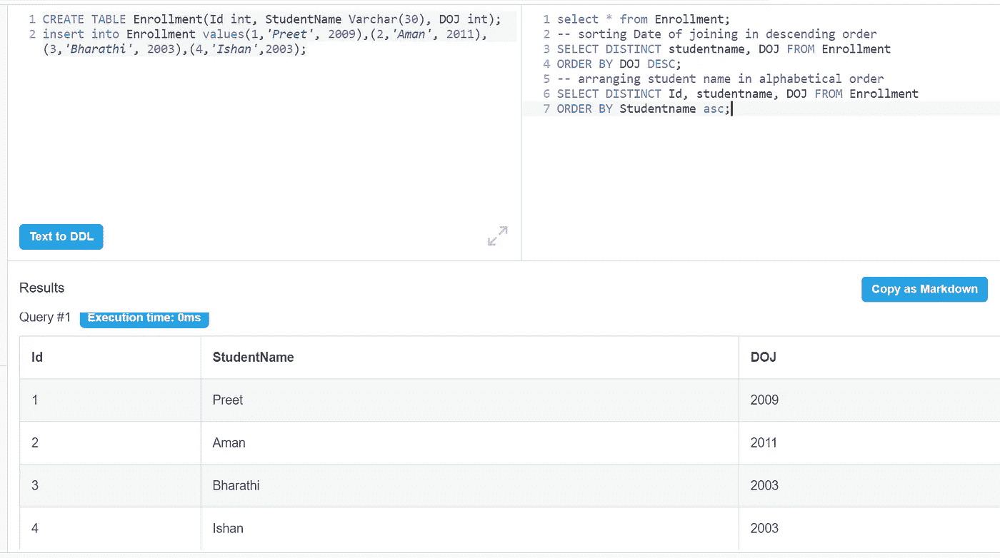
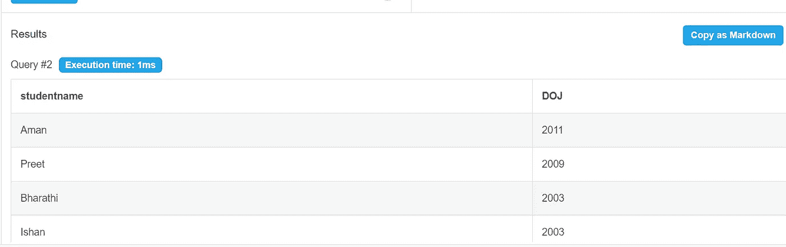
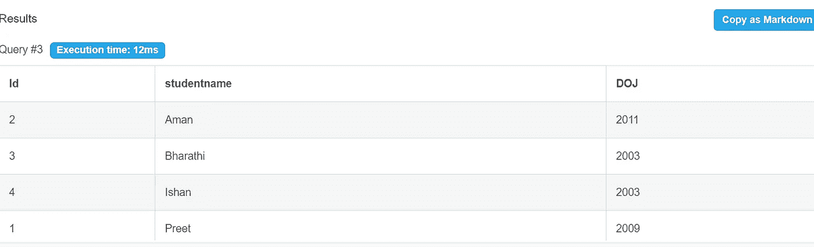
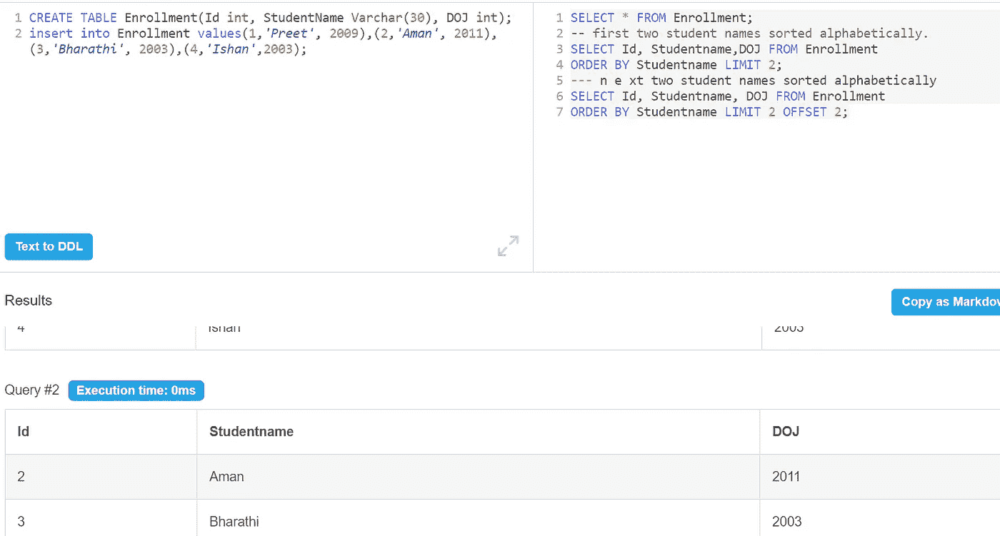
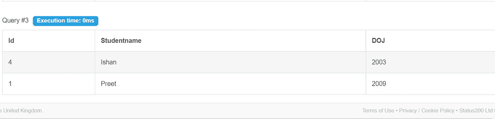

# 如何在 SQL 中按升序或降序重新排列列？

> 原文：<https://medium.com/analytics-vidhya/how-to-rearrange-columns-in-ascending-or-descending-order-in-sql-ebb2907393fb?source=collection_archive---------18----------------------->

## 给定的数据按升序或降序排序，便于理解。

## 通过使用 ORDER BY 子句，SQL 提供了一个按给定列以升序(ASC)或降序(DESC)对结果进行排序的选项。

## **限制**和**偏移**条款有助于进一步优化。

**限制**将减少返回的行数，可选的**偏移量**将指定从哪里开始计算行数。

**让我们创建一个表格。**

创建表注册(Id int，StudentName Varchar(30)，DOJ int)；
插入注册值(1，' Preet '，2009 年)，(2，' Aman '，2011 年)，(3，' Bharathi '，2003 年)，(4，' Ishan '，2003 年)；

从注册中选择*；
—排序加入 DOJ 的日期)按降序排列
从 DOJ·desc 的报名顺序
中选择不同的学生姓名，DOJ；

—按字母顺序排列学生姓名
按学生姓名 asc 从注册中选择不同的 Id、学生姓名、DOJ
；

**极限值**

前两个学生名字按字母顺序排列。
从登记中选择 Id，学生名，DOJ
按学生名限制 2 排序；

**偏移**

接下来的两个学生姓名按字母顺序排序
从注册中选择 Id、学生姓名、DOJ
按学生姓名限制 2 偏移量 2 排序；

借助这些基本的排序和筛选子句，简化数据库变得更快。