# 机器学习如何剔除离群值？

> 原文：<https://medium.com/analytics-vidhya/how-to-remove-outliers-for-machine-learning-24620c4657e8?source=collection_archive---------1----------------------->

> 什么是离群值，如何处理？

在这篇文章中，我们将通过回答以下问题来理解所有关于离群值的问题，在文章的最后，我们将使用 Python 来创建一些例子。

1.  什么是离群值？
2.  异常值是如何引入数据集中的？
3.  如何检测异常值？
4.  为什么识别异常值很重要？
5.  离群值有哪些类型？
6.  防止离群值的方法有哪些？

> **1。什么是离群值？**

异常值是指那些与给定数据集中的其他观察值显著不同的数据点。这可能是由于测量中的可变性和填充数据点时的错误解释造成的。

> **2。异常值是如何引入数据集中的？**

**数据集上异常值的最常见原因:**

*   ***数据录入错误:*** 人为错误如数据采集、记录或录入过程中产生的错误会导致数据出现离群值。
*   ***测量误差*(仪器误差)**:这是异常值最常见的来源。这是由于使用的测量仪器出现故障造成的。
*   ***实验错误*** (数据提取或实验计划/执行错误)
*   *(为测试检测方法而制造的伪异常值)*
*   ****数据处理错误*** (数据操纵或数据集意外突变)*
*   ****采样错误*** (从错误的或各种来源提取或混合数据)*
*   ****自然离群值*** (不是错误，数据中的新奇):当一个离群值不是人为的(由于错误)，它就是自然离群值。大多数真实世界的数据都属于这一类。*

> ***3。如何检测异常值？***

***不同的离群点检测技术***

*异常值有两种类型:单变量和多变量。上面，我们已经讨论了单变量异常值的例子。当我们观察单个变量的分布时，可以发现这些异常值。多变量异常值是 n 维空间中的异常值。*

*a)假设检验*

*b) Z 分数法*

*c)稳健的 Z 得分*

*d)智商权数法*

*e) Winsorization 法(百分位数上限)*

*f) DBSCAN 聚类*

*g)隔离林*

*h)线性回归模型(PCA，LMS)*

*I)标准偏差*

*j)百分点*

*k)可视化数据*

# ****b) z 得分****

*这种方法假设变量具有高斯分布。它代表观察值偏离平均值的标准偏差数:*

*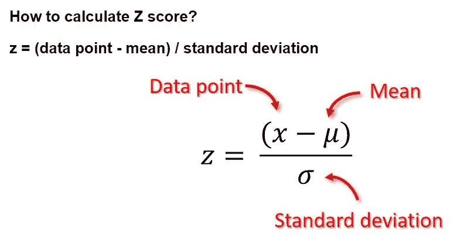*

*在这里，我们通常将异常值定义为 z 得分的模数大于阈值的点。这个阈值通常大于 2 (3 是一个常见值)。*

*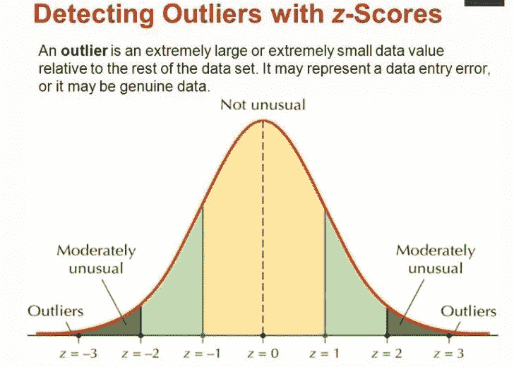*

***d) IQR 法***

*在这种方法中，通过使用四分位数间距(IQR)，我们检测异常值。IQR 告诉我们数据集的变化。超出-1.5 倍 IQR 到 1.5 倍 IQR 范围的任何值都被视为异常值。*

*   *Q1 代表数据的第一个四分位数/第 25 个百分位数。*
*   *Q2 代表数据的第二个四分位数/中位数/第 50 个百分位数。*
*   *Q3 代表数据的第 3 个四分位数/第 75 个百分位数。*
*   *(Q1–1.5*IQR)代表数据集中的最小值，而(Q3+1.5* IQR)代表数据集中的最大值*

***k)可视化数据***

*数据可视化对于数据清理、探索数据、检测异常值和异常组、识别趋势和聚类等非常有用。这里是数据可视化图表列表，用于识别异常值。*

*a)盒须图(盒图)*

*b)散点图*

*c)直方图*

*d)分布图*

*e) QQ 情节*

## *I)单变量方法*

*这种方法在一个变量上寻找具有极值的数据点。*

*检测异常值的最简单方法之一是使用 ***箱线图*** 。箱线图是描述数据分布的图形显示。箱线图使用中间值和上下四分位数。*

*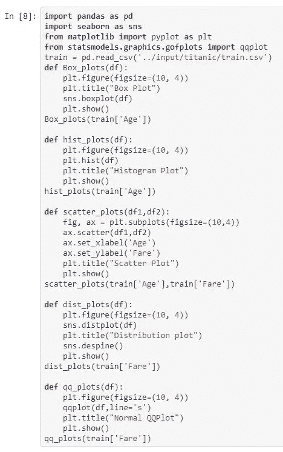**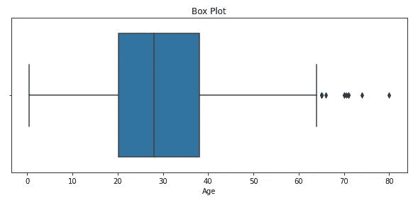**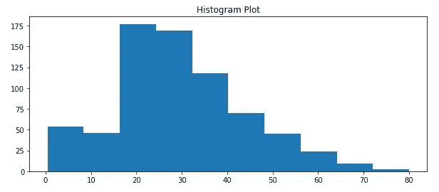**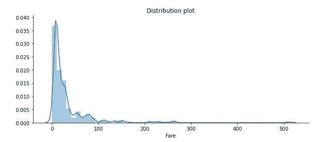*

## *ii)多元方法*

*在这里，我们寻找所有变量的不寻常组合。*

*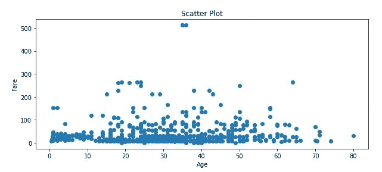**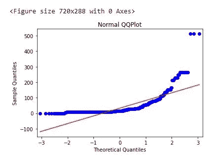*

> ***4。为什么识别异常值很重要？***

*通常离群值会被丢弃，因为它们会影响数据集的总体分布和统计分析。如果异常值是由于某种错误(测量错误、数据损坏等)造成的，这无疑是一个好方法。)，然而异常值的来源通常并不清楚。在许多情况下，偶然的“极端”事件会导致异常值超出数据集的正常分布，但这是一个有效的测量值，而不是由于错误。在这些情况下，如何处理异常值的选择不一定很清楚，并且该选择对数据集上进行的任何统计分析的结果都有重大影响。关于如何处理异常值的决定取决于研究的目标和背景，并且应该在关于方法的任何解释中详细说明。*

> ***5。离群值有哪些类型？***

*主要有 3 种异常值。*

1.  ***点或全局异常值:**相对于特征中的大多数观察值异常的观察值。简而言之，如果一个数据点的值远远超出其所在的整个数据集，则该数据点被视为全局异常值。*

*例如:在一个班级里，所有学生的年龄都大约是。类似，但是如果看到一个年龄为 500 的学生的记录。这是一个异常值。它可能由于各种原因而产生。*

***2。上下文(条件)异常值:**在给定的特定上下文中被认为异常的观察值。如果一个数据点的值明显偏离相同上下文中的其余数据点，则该数据点被视为上下文异常值。请注意，这意味着如果相同的值出现在不同的上下文中，它可能不会被视为异常值。如果我们将讨论局限于时间序列数据，那么“上下文”几乎总是时间性的，因为时间序列数据是一段时间内特定数量的记录。因此，在时间序列数据中，背景异常值很常见也就不足为奇了。在背景异常值中，数值没有超出正常的全球范围，但是与季节模式相比是异常的。*

*例证:世界经济因新冠肺炎而大幅下滑。1992 年的骗局导致股市崩盘；2020 年由于新冠肺炎。通常的数据点会彼此靠近，而特定时间段内的数据点会向上或向下非常远。这不是由于错误，但它是一个实际的观察数据点。*

***3。集体异常值:**一组异常但看起来彼此接近的观察值，因为它们都有相似的异常值。*

*如果作为集合的那些值明显偏离整个数据集，则数据集内的数据点子集被认为是异常的，但是单个数据点的值本身在上下文或全局意义上不是异常的。在时间序列数据中，这种情况的一种表现方式是，当季节性序列正常时，在某个时间范围之外出现正常的波峰和波谷，或者作为一组处于异常状态的时间序列的组合。*

> ***6。防止离群值的方法有哪些？***

*检测到异常值后，我们应该移除\处理异常值，因为**它是一个无声的杀手！！**。是..*

*   *异常值会严重影响数据集的均值和标准差。这些可能在统计上给出错误的结果。*
*   *它增加了误差方差，降低了统计检验的能力。*
*   *如果异常值是非随机分布的，它们会降低正态性。*
*   *大多数机器学习算法在存在离群值的情况下效果不佳。因此需要检测并去除异常值。*
*   *它们还会影响回归的基本假设、方差分析和其他统计模型假设。*

*由于所有这些原因，我们必须小心异常值，并在建立统计/机器学习模型之前处理它们。有一些用于处理异常值的技术。*

1.  ***删除观察值***
2.  ***转换数值***
3.  ***插补***
4.  ***分别处理***
5.  *删除观察值
    有时最好从数据集中完全删除这些记录，以免影响你的分析。如果异常值是由于*数据输入错误、数据处理错误或异常值观察数量非常少*，我们会删除异常值。我们也可以在两端使用修剪来移除异常值。但是**删除**观察不是一个好主意，当我们有**小数据集**时。*

*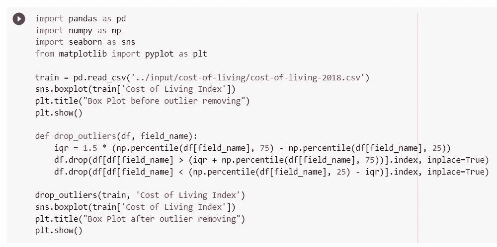**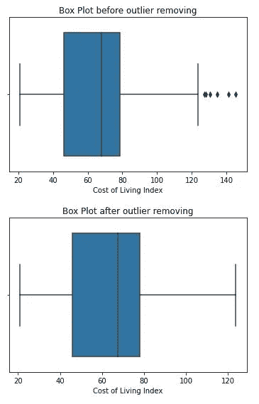*

***2。转换值:***

*变换变量也可以消除异常值。这些转换值减少了由极值引起的变化。*

1.  *缩放比例*
2.  *对数变换*
3.  *立方根归一化*
4.  *盒子变换*

*   *这些技术将数据集中的值转换为较小的值。*
*   *如果数据有许多极值或偏斜，这种方法有助于使您的数据正常。*
*   *但是这些技术并不总是给你最好的结果。*
*   *这些方法不会丢失数据*
*   *在所有这些方法中，box cox 变换给出了最好的结果。*

*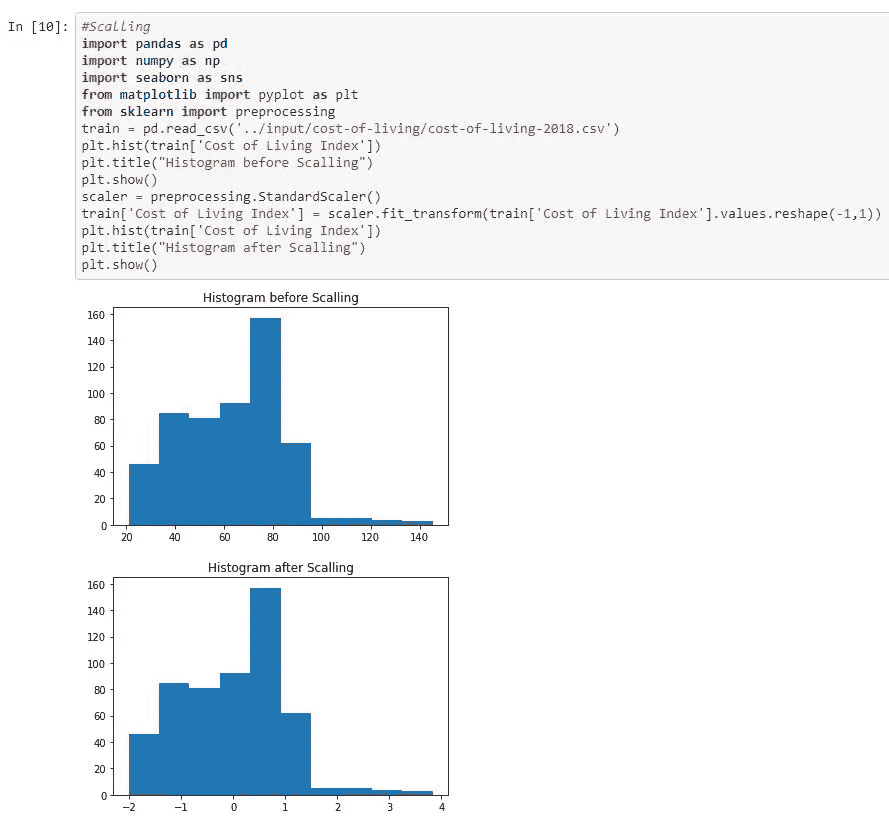*

*图:缩放*

*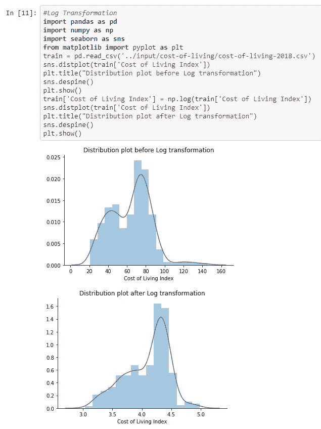*

*对数变换*

*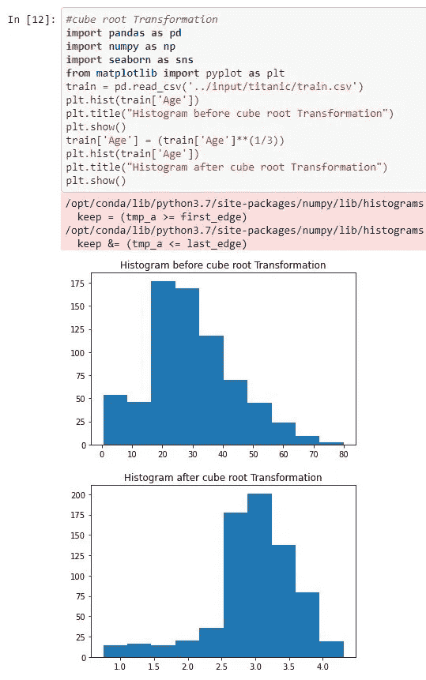*

*立方根变换*

*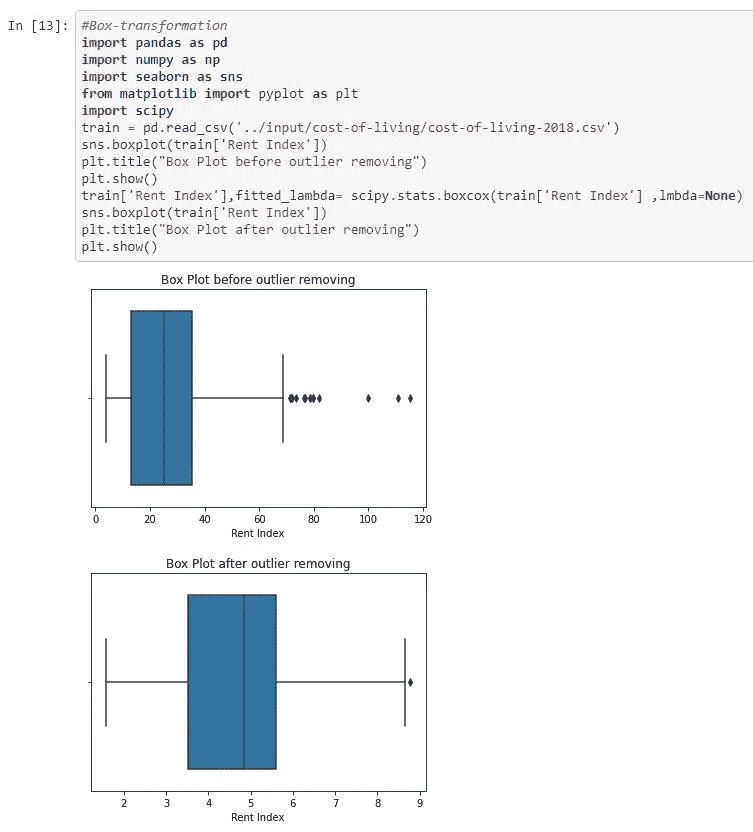*

*盒子变换*

***3。插补***

*   *像缺失值的插补一样，我们也可以插补异常值。在这种方法中，我们可以使用平均值、中间值、零值。因为我们输入没有数据丢失。这里中值是合适的，因为它不受离群值的影响。*

*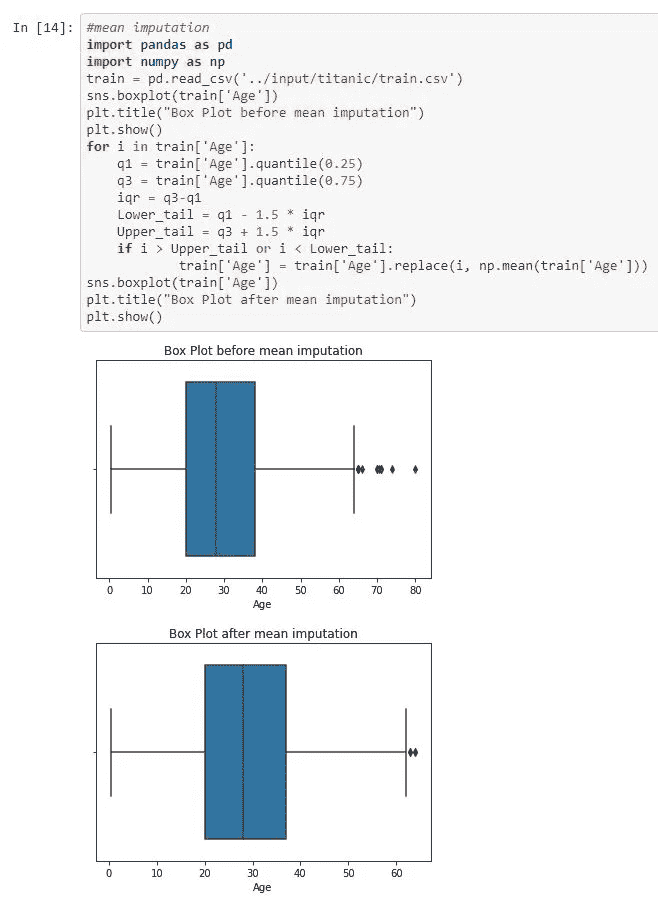*

**均值插补**

*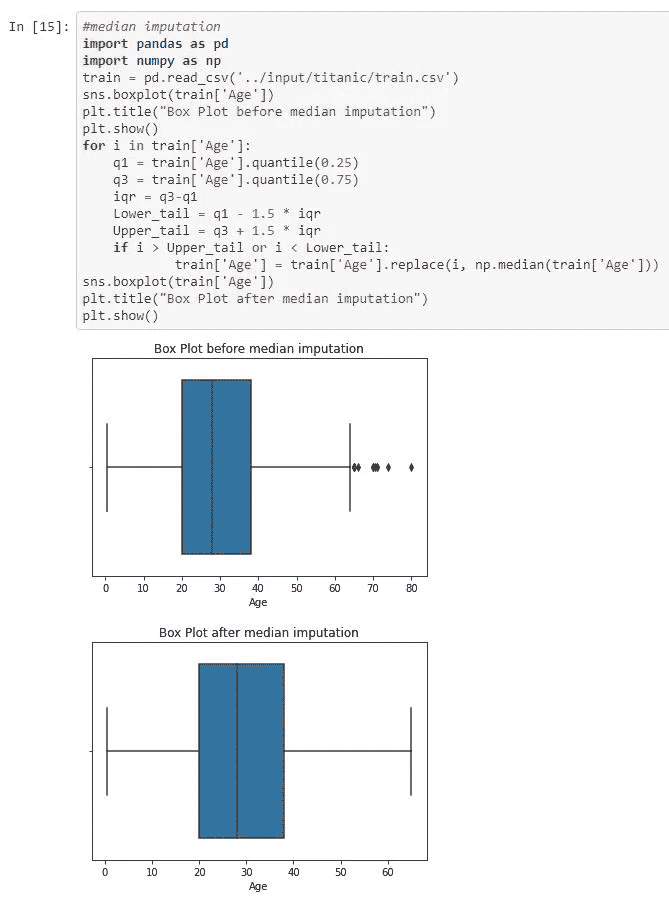*

**中位数插补**

*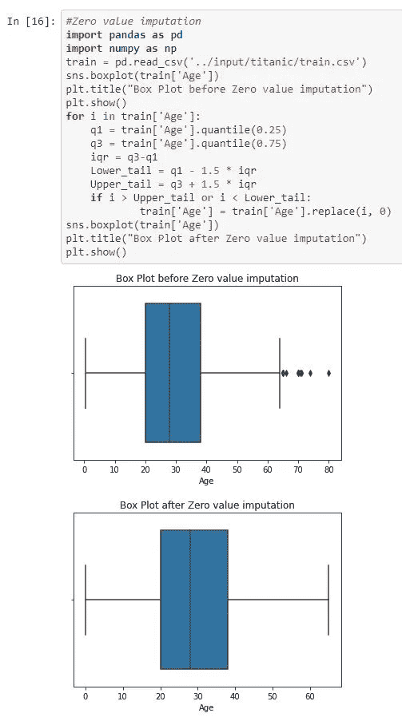*

**零值插补**

*4.**分别处理***

*如果有大量的异常值并且数据集很小，我们应该在统计模型中分别对待它们。一种方法是将两个组视为两个不同的组，为两个组建立单独的模型，然后合并输出。但是，当数据集很大时，这种技术很繁琐。*

# *就是这样！*

*感谢阅读！*

*谢谢你的阅读。以后我会写更多初学者友好的帖子。请在[媒体](https://anugantisuresh.medium.com/)上关注我，以便了解他们。我欢迎反馈，可以通过 LinkedIn[anuganti-Suresh](https://www.linkedin.com/in/anuganti-suresh-9aa17822/)联系我。快乐学习！*

# *有用的链接*

*   *[http://www . kdnugges . com/2017/01/3-methods-deal-outliers . html](http://www.kdnuggets.com/2017/01/3-methods-deal-outliers.html)*
*   *[https://www . analyticsvidhya . com/blog/2016/01/guide-data-exploration/](https://www.analyticsvidhya.com/blog/2016/01/guide-data-exploration/)*
*   *[http://machine learning mastery . com/how-to-identify-outliers-in-your-data/](http://machinelearningmastery.com/how-to-identify-outliers-in-your-data/)*

# *如果你喜欢这篇文章，请鼓掌！*