# 如何用新的 Windows 终端替换 Visual Studio 代码中的外部终端？(和其他提示)

> 原文：<https://medium.com/analytics-vidhya/how-to-replace-external-terminal-in-visual-studio-code-with-the-new-windows-terminal-66e8460f2d31?source=collection_archive---------0----------------------->

你的工作空间需要和你一样酷:)

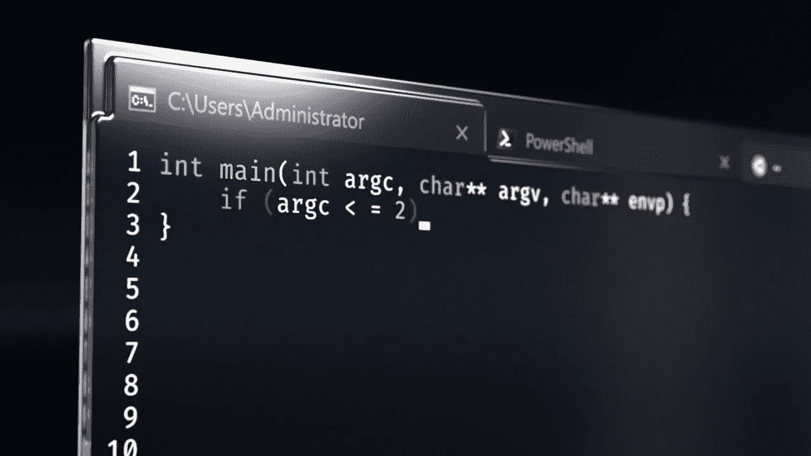

图:新的视窗终端

个性化的工作空间总是有利于提高工作效率，至少对我来说是这样。我听到很多人在谈论如何更好地“工作”,而不是美化事物，但是，我不能那样工作，我知道在座的大多数人也不能。在本文中，我将指导您如何在 visual studio 代码中轻松地将新的、很酷的 windows 终端用作外部终端。不仅如此，我们还会讨论很酷的主题、透明的终端、很酷的字体等等。

这是最终的结果。(附:不要恨我，但实际上我更喜欢亮模式终端，而不是暗模式终端😜)

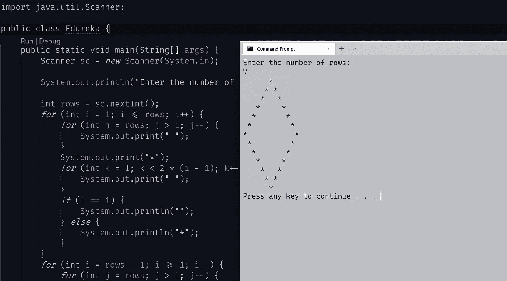

图:Java 程序在新终端上的执行

“哇，太酷了，你太酷了，你是怎么做到的？”，你可能会想。我想了很久，最后 u/GoodClover 帮我想通了。

让我们开门见山吧。请遵循以下步骤。

1.  在命令框中按 F1，搜索“打开设置”并点击选项:“首选项:打开设置(JSON)”。在下图中，该选项位于顶部，但在您的编辑器中可能不是这样。

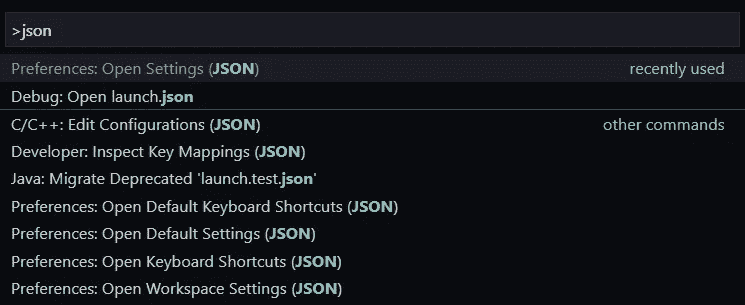

2.在打开的 settings.json 文件上，向下滚动直到看到(或搜索)

> " terminal . external . WINDOWS exec ":" C:\ \ WINDOWS \ \ SYSTEM32 \ \ cmd . exe "，

在您的系统中，该值可能不同，但密钥必须相同。

3.将该值更改为“wt -p cmd cmd ”,现在总命令将如下所示

> " terminal . external . windows exec ":" wt-p cmd cmd "，

4.耶，你可以走了。你已经得到了你想要的。

**常见问题:**

如果您将密钥设置为:

```
C:\\Users\\<username>\\AppData\\Local\\Microsoft\\WindowsApps\\wt.exe
```

您可能会遇到这样的错误:

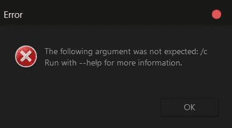

那么，它是如何工作的呢？

根据 u/GoodClover 的说法，

这是因为 VScode 假设您正在运行`cmd`，并且(afaik)没有命令行参数的配置，当它们被传递给`wt`时，它不知道它们是什么意思，添加`cmd`(最后一个)然后使`wt`运行`cmd`，参数被正确传递给它。

如果您想将您的配置文件用于 cmd，您必须添加`-p cmd`，因此完整的命令变为`wt -p cmd cmd`

# **但是**

终端仍然不如传统的命令提示符有用。例如:

如果您想在 VSCode 中打开一个项目文件夹，使用命令提示符很容易。就像这样简单:

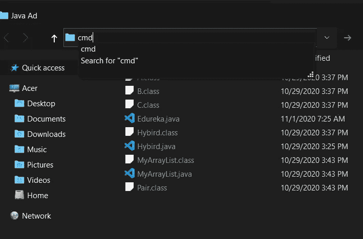

你在被调用的*工具条*上输入 cmd，一个终端窗口会在同一个目录弹出！

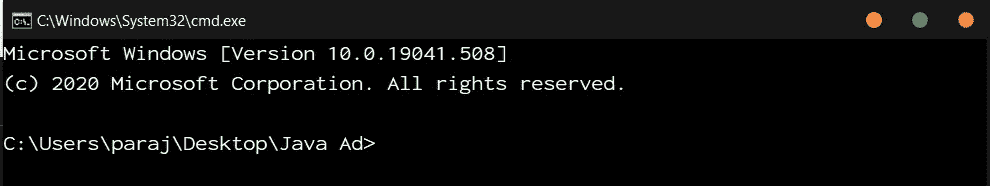

这是我想要的。

但是，如果在*无论什么栏上的“cmd”上键入“wt”，那么* Windows 终端将弹出，但是查看目录。

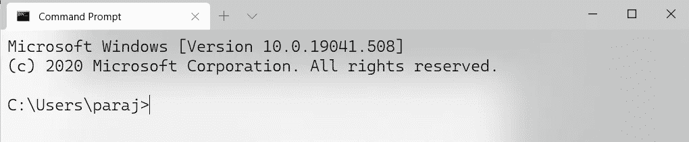

这是我的主目录！我不想那样！

那么，我们能做什么呢？解决方法其实很简单！

这些是步骤:

1.  单击向下箭头并转到设置，这将打开一个 settings.json 文件，但这是我们终端的 json 设置。

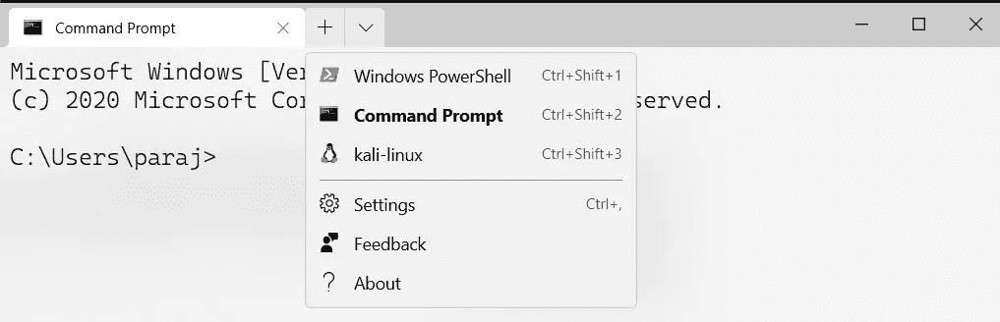

我们只需要添加一行代码就可以了。

2.在 defaults 对象(在 profiles 对象中)中，只需添加这一行:

> "正在启动目录":" %__CD__% "，

p.s .不要介意 fontFace，fontSize 等键。

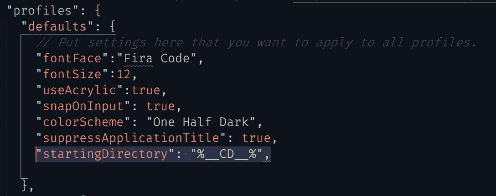

3.你做到了！！！就是这样！

# 另一个但是

您希望在上下文菜单上也有 windows 终端吗？(p.s Yayyyy 我居然还记得这个菜单叫什么。)

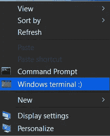

看起来很傻，不是吗？

我不想让这篇文章太长，所以看看 Vlad412 的回答[这里](https://github.com/microsoft/terminal/issues/1060#issuecomment-640060704)。很简单，下载一个图像，把它放在需要的目录下，然后运行一个注册表命令。耶，完成了。但是，如果你对此理解有问题，请留下评论，这样我可以编辑这篇文章(如果让我来说，这实际上是我的第一篇文章:)，或者回复你的评论。

# 最后一件事，

对于那些想让自己的终端看起来和我的终端一模一样的人来说，这里有一些方法:

1.在 windows 终端的 settings.json 文件中，搜索 schemes array 并将该对象粘贴到里面。

```
{“name” : “Frost”,“background” : “#FFFFFF”,“black” : “#3C5712”,“blue” : “#17b2ff”,“brightBlack” : “#749B36”,“brightBlue” : “#27B2F6”,“brightCyan” : “#13A8C0”,“brightGreen” : “#89AF50”,“brightPurple” : “#F2A20A”,“brightRed” : “#F49B36”,“brightWhite” : “#741274”,“brightYellow” : “#991070”,“cyan” : “#3C96A6”,“foreground” : “#000000”,“green” : “#6AAE08”,“purple” : “#991070”,“red” : “#8D0C0C”,“white” : “#6E386E”,“yellow” : “#991070”}
```

现在看起来是这样的:

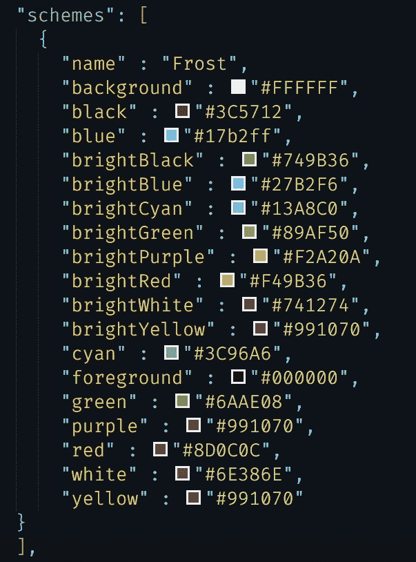

2.向上滚动到列表数组，在 cmd 对象中，删除除 guid 之外的所有内容，并粘贴以下内容:

```
"name": "Command Prompt","commandline": "cmd.exe","hidden": false,"colorScheme": "Frost","acrylicOpacity": 0.7,"cursorColor" : "#000000","fontSize": 14,"fontFace":"Cascadia Code","fontWeight": "light"
```

现在看起来是这样的:

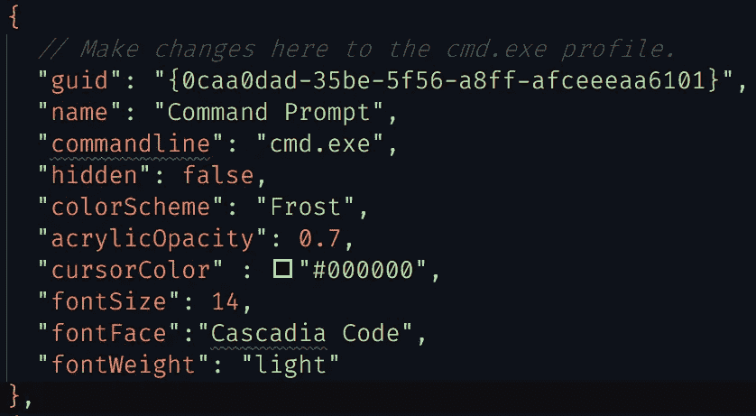

搞定了。但是，这只会影响 cmd，如果您希望 powershell 和 ubuntu 终端看起来一样，请不要将上面的代码粘贴到 cmd 数组中，而是粘贴到我们刚刚设置了起始目录的 defaults 对象中。

还有，我的 VSCode 主题是“社区素材主题海洋”。

如果你想看看我开发的主题，看起来是这样的:

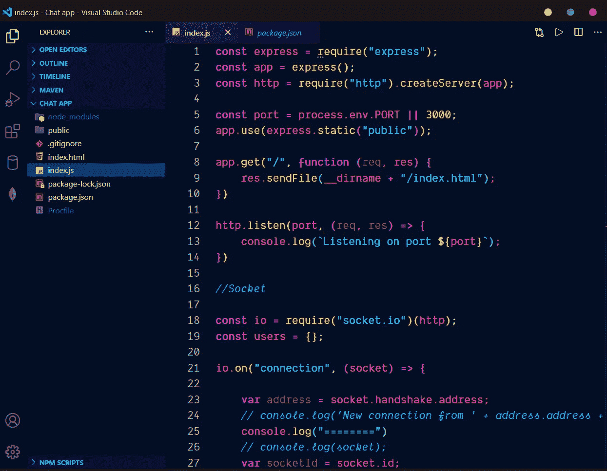

这里是[链接](https://marketplace.visualstudio.com/items?itemName=rsnpj.cool-ass-theme)。

看看我的 [GitHub](https://github.com/rsnpj/) 和[作品集](https://www.roshanparajuli.com.np/)！:)

想定制更多？看看这个。

[](https://www.sitepoint.com/windows-terminal/) [## Windows 终端:完整指南-站点点

### 在本文中，我们将探索 Windows 终端，它是 WSL2 的理想补充。它速度快，可配置，看起来很棒…

www.sitepoint.com](https://www.sitepoint.com/windows-terminal/) 

感谢您的阅读。祝你度过愉快的一天，或者一个晚上，我怎么知道你什么时候读到这封信？😜