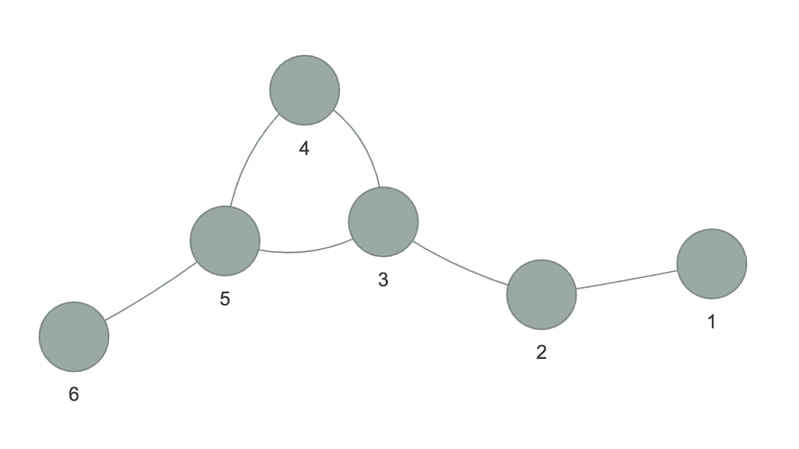
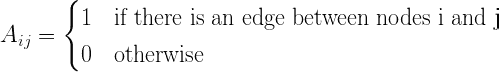
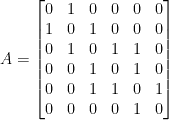
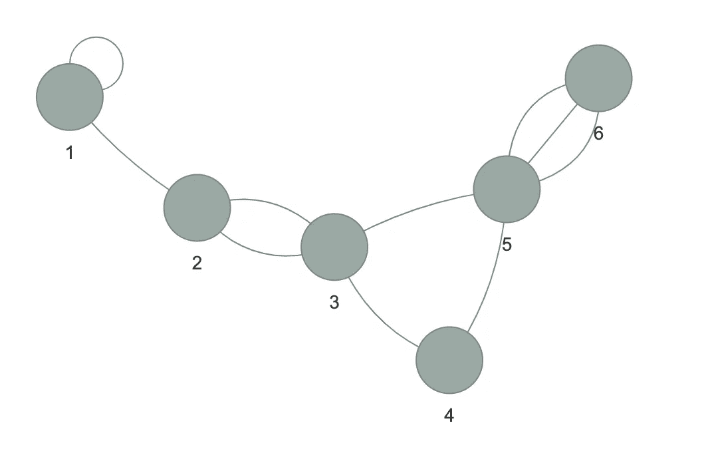
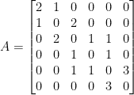

# 如何将无向图表示为邻接矩阵

> 原文：<https://medium.com/analytics-vidhya/how-to-represent-an-undirected-graph-as-an-adjacency-matrix-e9d49fee863b?source=collection_archive---------0----------------------->

## 用 R 中的“visNetwork”创建的图形

图表是深入理解大型信息系统的一种极好的方式，因为它们为我们提供了一种灵活而直观的方式，通过可视化数据中的关系来产生洞察力。在本教程中，我们将特别关注无向图。脸书和 LinkedIn 的联系都可以用无向图来表示，因为两个人之间的联系总是双向的。这些网站的互惠性质就是如此(友谊必须是相互的，邀请必须被接受，等等。)，而且不像 Twitter 这样的平台，你可以关注某人，但他们不一定要回复你的关注——例如，Béyonce 仍然没有回复我。

但是你可能会问，图和矩阵有什么关系呢？好吧，在数据科学的世界里，你不能逃避矩阵——尽管试试吧！这是因为矩阵是一种以紧凑的方式表示数据的极好方式，你的计算机和内部统计学家会*喜欢*(你好，图表分析！)那么，让我们来学习如何获得一个直观的可解释的图，并给它一个紧凑的表示，您可以使用它来生成图度量！


由[克里斯汀·休姆](https://unsplash.com/@christinhumephoto?utm_source=unsplash&utm_medium=referral&utm_content=creditCopyText)在 [Unsplash](https://unsplash.com/s/photos/computer?utm_source=unsplash&utm_medium=referral&utm_content=creditCopyText) 上拍摄的照片。

# 示例 1:

我们将从使用' *visNetwork* '包创建下图开始。该图的交互式版本可以在您自己的计算机上创建，也可以在以下网址找到:[https://thatdarndata . com/how-to-represent-a-un directed-graph-as-an-adjacency-matrix/](https://thatdarndata.com/how-to-represent-an-undirected-graph-as-an-adjacency-matrix/)。要隔离图形中的节点及其关系，只需单击一个节点或从左上角的下拉菜单中选择它。您还可以移动图表并放大和缩小。

```
*library(visNetwork)****# Create nodes dataframe for visNetwork.*** *nodes <- data.frame (id = 1:6, label = 1:6, 
                     color = rep(‘#7D9CB8’, 6))****# Create edges dataframe for visNetwork.*** *edges <- data.frame(from = c(1, 2, 3, 3, 4, 5), 
                    to = c(2, 3, 4, 5, 5, 6))****# Plot network using visNetwork.*** *visNetwork(nodes, edges) %>% 
       visOptions(highlightNearest = TRUE, nodesIdSelection = TRUE)*
```



没有回路和多边的无向图。

为了将该图表示为邻接矩阵 A，我们将让行和列的索引表示节点或顶点。对于当前示例，我们将有 6 行(代表节点 1–6)和 6 列(再次代表节点 1–6)。我们应该总是有一个方阵！每个条目表示两个节点之间是否存在边或关系。1 表示有边，0 表示没有边。



对于上图，邻接矩阵如下所示:



由于从节点 1 到节点 2 有一条边，我们在 A12(第 1 行第 2 列)和 A21(第 2 行第 1 列)中都看到了 1。图中缺乏方向性导致了对称矩阵。

另外，请注意对角线完全由零组成。那是因为从任何节点到它自己都没有边。这是检查循环的简单方法！然而，现实生活中经常会出现循环，节点之间甚至可以有多条边。现在，让我们来看一个带有循环和多边的例子。

# 示例 2:

```
***# Create new edges dataframe for visNetwork.*** *edgesMessy <- data.frame(from = c(1, 2, 3, 3, 4, 5, 1, 2, 5, 5),
                         to = c(2, 3, 4, 5, 5, 6, 1, 3, 6, 6))****# Plot network using visNetwork.*** *visNetwork(nodes, edgesMessy) %>%
        visOptions(highlightNearest = TRUE, nodesIdSelection = TRUE)*
```



有回路和多边的图。

邻接矩阵如下所示:



请注意，循环表示为 2。对于无向图，每个循环加 2，因为它在每次边遇到节点时计数。(如果节点 1 有两个环路，条目将是 4。)我们还可以看到，节点 2 和 3 之间有两条边。因此，A23 和 A32 现在用 A2 表示。节点 5 和 6 之间的边数也相应地改变了。

## 概括一下:

*   邻接矩阵总是正方形的
*   无向图的邻接矩阵是对称的
*   没有回路的无向图在对角线上会有零点
*   无向图中的每个循环都由一个 2 表示
*   邻接矩阵可以解释多条边

要下载包含本次讲座和所有代码的 R 笔记本，请点击[这里。](https://github.com/thatdarndata/BlogPosts/blob/master/how%20to%20represent%20an%20undirected%20graph%20as%20an%20adjacency%20matrix/adjacencyMatrix.Rmd)

*原载于 2019 年 3 月 25 日*[*https://thatdarndata.com*](https://thatdarndata.com/how-to-represent-an-undirected-graph-as-an-adjacency-matrix/)*。*