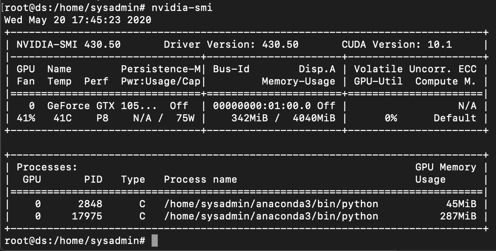

# 如何在旧电脑上用 GPU 运行数据科学项目

> 原文：<https://medium.com/analytics-vidhya/how-to-run-a-data-science-project-with-gpu-on-an-old-computer-330805898d08?source=collection_archive---------13----------------------->

## 能用就用，不要浪费！


沙哈达特·拉赫曼在 [Unsplash](https://unsplash.com?utm_source=medium&utm_medium=referral) 上拍摄的照片

## 介绍

我在 2014 年购买了这台电脑，但通常情况下，我只在我的 MacBook 上工作，这台电脑只用于简单的网络浏览和备份照片。自从 2018 年我报读了 MSc 数据科学课程，没有 GPU 处理器的 Macbooks 处理图像数据太慢了，所以我购买了一个 NVIDIA GeForce GTX 1050 Ti 显卡(它只有 HKD 550，很便宜)安装在我的 PC 上。

OS:Ubuntu 18.04 LTS
CPU:英特尔酷睿 I5–4570 @ 3.2 GHz x4
RAM:16GB
HDD:500 GB SSD
显卡:英伟达 GeForce GTX 1050 Ti

## 程序:

1.安装 Ubuntu 18.04 LTS 服务器
2。安装 CUDA 工具包 10 & CuDNN 7 & NCCL 2
3。安装 Anaconda &配置以便远程使用

## **#安装 Ubuntu 18.04 LTS 服务器**

由于我只能通过 SSH 和 Juypter 笔记本远程使用这台电脑，所以我将安装 Ubuntu 18.04 LTS 服务器。Ubuntu Desktop 和 Ubuntu Server 的区别在于安装和使用的 GUI 界面。基本上，安装 Ubuntu Desktop 和安装其他任何软件是一样的。但是 Ubuntu Server 使用的是进程驱动菜单。

Ubuntu 18.04 LTS 桌面或服务器 ISO 可在此下载:

桌面:[http://FTP . cuhk . edu . hk/pub/Linux/Ubuntu-releases/18.04/Ubuntu-18 . 04 . 4-desktop-amd64 . iso](http://ftp.cuhk.edu.hk/pub/Linux/ubuntu-releases/18.04/ubuntu-18.04.4-desktop-amd64.iso)

服务器:[http://FTP . cuhk . edu . hk/pub/Linux/Ubuntu-releases/18.04/Ubuntu-18 . 04 . 4-live-server-amd64 . iso](http://ftp.cuhk.edu.hk/pub/Linux/ubuntu-releases/18.04/ubuntu-18.04.4-live-server-amd64.iso)

安装方法可以参考下面杰克·沃伦关于 techrepublic.com 的文章

[](https://www.techrepublic.com/article/how-to-install-ubuntu-server-18-04/) [## 如何安装 Ubuntu Server 18.04

### 非常云友好的 Ubuntu Server 18.04 的安装与其前辈略有不同。这里是…

www.techrepublic.com](https://www.techrepublic.com/article/how-to-install-ubuntu-server-18-04/) 

记住，无论安装桌面版还是服务器版，重启后都需要运行更新。

```
# System update & upgrade**users@ds**:**~/**$*sudo apt-get update***users@ds**:**~/**$*sudo apt-get upgrade*
```

**#安装 CUDA 工具包 10**

因为需要使用 Tensorflow 配合 GPU 进行计算，所以我们需要安装 CUDA、CuDNN7、NCCL 2 等软件包。

```
# Install other importance packages
**sysadmin@ds**:**~/**$sudo apt-get install build-essential dkms freeglut3 freeglut3-dev libxi-dev libxmu-dev**sysadmin@ds**:**~/**$*wget* [*https://developer.download.nvidia.com/compute/cuda/repos/ubuntu1804/x86_64/cuda-repo-ubuntu1804_10.0.130-1_amd64.deb*](https://developer.download.nvidia.com/compute/cuda/repos/ubuntu1804/x86_64/cuda-repo-ubuntu1804_10.0.130-1_amd64.deb)**sysadmin@ds**:**~/**$sudo apt-key adv — fetch-keys [https://developer.download.nvidia.com/compute/cuda/repos/ubuntu1804/x86_64/7fa2af80.pub](https://developer.download.nvidia.com/compute/cuda/repos/ubuntu1804/x86_64/7fa2af80.pub)**sysadmin@ds**:**~/**$sudo apt-get update**sysadmin@ds**:**~/**$sudo dpkg -i cuda-repo-ubuntu1804_10.0.130–1_amd64.deb
```

##安装 CuDNN 7 和 NCCL 2

```
**sysadmin@ds**:**~/**$wget [http://developer.download.nvidia.com/compute/machine-learning/repos/ubuntu1804/x86_64/nvidia-machine-learning-repo-ubuntu1804_1.0.0-1_amd64.deb](http://developer.download.nvidia.com/compute/machine-learning/repos/ubuntu1804/x86_64/nvidia-machine-learning-repo-ubuntu1804_1.0.0-1_amd64.deb)**sysadmin@ds**:**~/**$sudo apt install ./nvidia-machine-learning-repo-ubuntu1804_1.0.0–1_amd64.deb**sysadmin@ds**:**~/**$sudo apt-get update**sysadmin@ds**:**~/**$apt-get install — no-install-recommends nvidia-driver-418**sysadmin@ds**:**~/**$reboot
```

##重新启动计算机

重启后，键入:nvidia-smi，安装正常，似乎没有问题。



**#安装 Anaconda &配置以远程使用**

Anaconda 是专门为数据科学和机器学习工作流设计的，它是一个开源的包管理器、环境管理器以及 Python 和 R 编程语言的发行版。

```
# Download Anaconda Python 3.7:
**sysadmin@ds**:**~/**$wget [https://repo.anaconda.com/archive/Anaconda3-2020.02-Linux-x86_64.sh](https://repo.anaconda.com/archive/Anaconda3-2020.02-Linux-x86_64.sh)
```

安装方法可以参考下面 Lisa Tagliaferri 关于 digitalocean.com 的文章

[](https://www.digitalocean.com/community/tutorials/how-to-install-anaconda-on-ubuntu-18-04-quickstart) [## 如何在 Ubuntu 18.04 上安装 Anaconda【快速入门】| DigitalOcean

### Anaconda 是一个为数据科学和机器学习工作流而设计的开源包管理器，环境…

www.digitalocean.com](https://www.digitalocean.com/community/tutorials/how-to-install-anaconda-on-ubuntu-18-04-quickstart) 

要创建一个 jupyter_notebook_config.py 文件，并注释掉所有默认值，可以使用以下命令行:

```
**sysadmin@ds**:**~/**$jupyter notebook --generate-config
```

对于远程访问，我们需要设置 Jupyter 笔记本的密码，可以使用下面的命令行::

```
**sysadmin@ds**:**~/**$jupyter notebook password
```

设置密码后，我们需要修改 Jupyter 笔记本的配置文件，你可以在$home/中找到该文件。jupyter/jupyter _ notebook _ config . py:

```
**sysadmin@ds**:**~/**$cd .jupyter
**sysadmin@ds**:**~/.jupyter**$nano jupyter_notebook_config.pychange the following item:c.NotebookApp.ip = **'0.0.0.0'** c.NotebookApp.open_browser = **False**
```

创建 jupyter.services

```
**sysadmin@ds**:**~/**$nano /etc/systemd/system/jupyter.services[Unit]
Description=Jupyter Notebook[Service]
Type=simple
PIDFile=/run/jupyter.pid
ExecStart=/bin/bash -c ". /home/sysadmin/anaconda3/bin/activate;jupyter-notebook"
User=sysadmin
Group=sysadmin
WorkingDirectory=/home/sysadmin/data
Restart=always
RestartSec=10[Install]
WantedBy=multi-user.target
```

现已启用如下服务:

```
**sysadmin@ds**:**~/**$sudo systemctl enable jupyter.services**sysadmin@ds**:**~/**$sudo systemctl daemon-reload**sysadmin@ds**:**~/**$sudo systemctl restart jupyter.services
```

该服务现已启动。您可以按如下方式进行测试:

```
**sysadmin@ds**:**~/**$systemctl -a | grep jupyter
 jupyter.services      loaded active running Jupyter Notebook
```

现在，Jupyter 笔记本可以通过互联网访问！！！

感谢阅读！如果你喜欢这篇文章，请通过鼓掌来感谢你的支持(👏🏼)按钮，或者通过共享这篇文章让其他人可以找到它。

参考:

 [## 在 Ubuntu 16.04 中将 jupyter 笔记本服务器设置为服务

### 步骤 1:验证 jupyter 笔记本电脑的位置:

medium.com](/@joelzhang/setting-up-jupyter-notebook-server-as-service-in-ubuntu-16-04-116cf8e84781)  [## Ubuntu 18.04 安裝 NVIDIA Driver 418 & CUDA 10 & TensorFlow 1.13

### 作業系統：Kubuntu 18.04 (Ubuntu 的 KDE 版本) 顯示卡：NVIDIA GeForce GTX 1080 Ti 預計目標是可以成功執行 TensorFlow 1.13 的 GPU 版本。

medium.com](/@maniac.tw/ubuntu-18-04-安裝-nvidia-driver-418-cuda-10-tensorflow-1-13-a4f1c71dd8e5) [](https://www.tensorflow.org/install/gpu#software_requirements) [## GPU 支持| TensorFlow

### 注意:GPU 支持适用于带有 CUDA 卡的 Ubuntu 和 Windows。TensorFlow GPU 支持需要…

www.tensorflow.org](https://www.tensorflow.org/install/gpu#software_requirements)