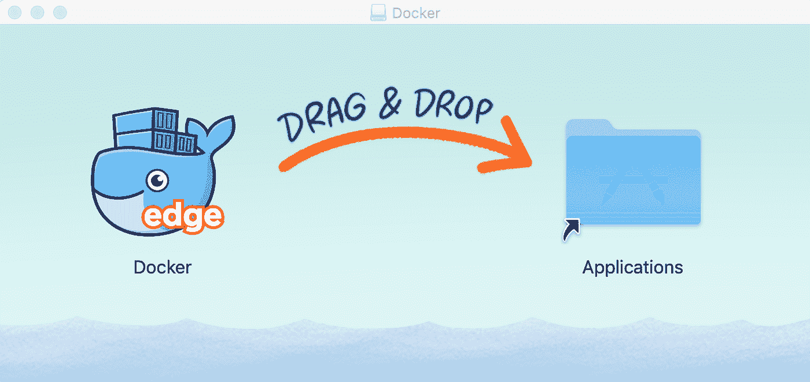
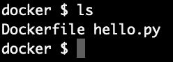
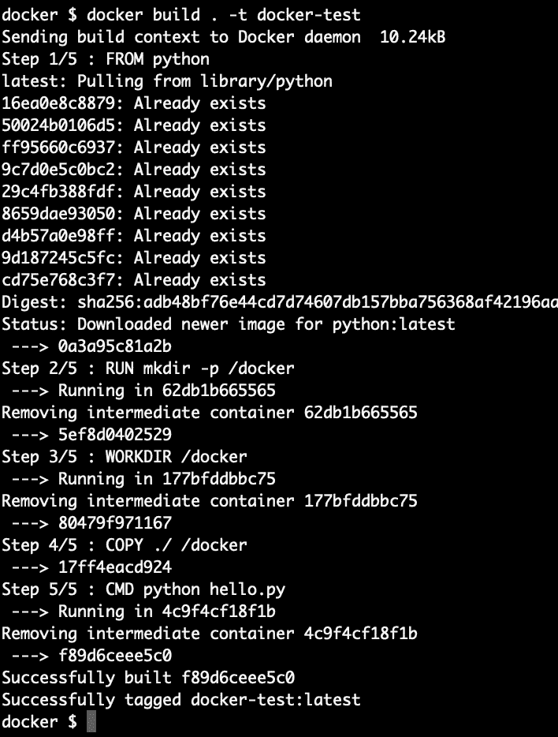
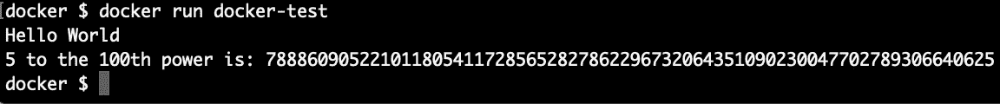
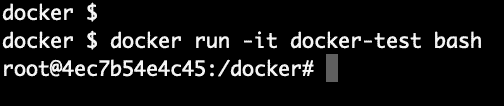
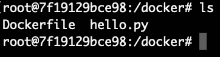

# 如何运行 Docker 图像并制作自己的图像！数据科学/Python 的 Docker

> 原文：<https://medium.com/analytics-vidhya/how-to-run-docker-images-and-make-your-own-docker-for-data-science-python-cba7311fdc92?source=collection_archive---------11----------------------->


这是我上一篇文章的后续，[*Docker 是什么，为什么它对数据科学有用？*](/analytics-vidhya/what-is-docker-and-why-is-it-useful-for-data-science-683294a57b81) 在这篇文章中，我将向你展示如何在你的机器上设置 Docker，并从 Docker 文件创建一个 Docker 映像，然后如何获得一个运行 PostgreSQL 的 Docker 容器。

## 安装 Docker



这里有一个下载 Docker 桌面的链接。您需要注册才能免费下载该文件。下载完成后，双击下载文件夹中的 Docker.dmg 文件，将可爱的鲸鱼图标拖到应用程序文件夹中。

当你看到鲸鱼图标出现在你的菜单栏上时，你就知道 Docker 正在运行(为了便于查看，我在图标周围加了一个红框)


现在是时候看看一切是否正常工作了。打开您的终端，输入以下命令:

```
docker run hello-world        # The syntax for running images is 
                              # docker run <image-name>
```

您应该会看到一条弹出消息——恭喜，您刚刚运行了您的第一个 Docker 图像！要总结您看到显示的文本:

*   Docker 试图寻找该图像的本地副本(但失败了)
*   它从 [Docker Hub](https://hub.docker.com/) (各种 Docker 图片的存储库)中提取了“hello-world”的图片
*   它从该映像创建了一个容器，其中包含一个可执行的命令，该命令产生出现在终端上的文本

请记住映像和容器之间的区别:映像是从 Docker 文件创建的，并从 Docker Hub 下载，但它们并不在您的机器上“运行”。Docker 容器是正在运行(或短暂运行以运行可执行文件)的映像的实例。以下是一些其他有用的命令:

```
docker help             #brings up the full help menu. There's A LOT
docker <command> --help #this displays help for a certain command
docker images           #shows all images stored on your machine
docker rmi <image name> #removes an image (add -f to force it)
docker ps               #shows all running containers
docker run <image name> #create a container based upon an image
```

## 创建自己的 docker 文件

将您的工作/代码封装到 Docker 映像中进行共享的方法是使用 Docker 文件。Docker 文件是一个包含命令的文本文档，Docker 将读取这些命令来组合图像。我将向你展示如何制作一个非常基本的图像，然后探索更复杂的功能。但是如果你想继续阅读: [Docker 有大量关于 Dockerfile 命令的文档](https://docs.docker.com/engine/reference/builder/)。以下是步骤:

1.  制作一个目录来存放你的作品。我在我的主目录中制作了一个名为 **docker** 的文件
2.  使用您最喜欢的 IDE 编写一个简短的 Python 脚本。并保存在您的 Docker 目录中。我做了这样的事情:

```
print(f'5 to the 100th power is {5**100}')
```

3.打开另一个文本文档，保存为‘Dockerfile’(就 docker file)。我使用 VSCode，它有一个漂亮的 Docker 插件。输入以下命令:

```
FROM python            # Use the latest image of PythonRUN mkdir -p /docker   # Make a directory in the imageWORKDIR /docker        # Makes that directory the working directoryCOPY ./ /docker        # Copy local files to that directoryCMD python hello.py    # When the image is ran, run this command
```

*   **FROM** :通过设置一个“基础图像”来初始化构建图像在这里，您可以使用任何有效的图像，但是让我们对这个图像使用最新的 Python。您必须提供此命令来创建新的映像。您可以通过在末尾添加一个位来指定版本。来自 python:3.7 将使用 Python 3.7 映像。
*   **运行**:这发出一个命令，在映像/容器中创建一个目录，我们将从这个目录开始工作。
*   **WORKDIR** :设置后续运行/CMD/ENTRYPOINT/COPY/ADD 命令的工作目录。我们将工作目录设置为我们刚刚在 RUN 命令中创建的目录
*   **复制**:这里有两个论点。第一个，。/表示它正在复制 Dockerfile 所在目录中的所有文件。这些文件将被复制到我们创建的/docker 目录中。因为我只复制了一个文件，所以我可以列出它而不是。/ command。
*   **CMD** :运行镜像时发出一个命令。为此，我们告诉它运行 Python 脚本“hello.py”，因为它在我们当前的工作目录中，我们可以只列出文件名。

## 从您的 Docker 文件构建 Docker 映像



使用 docker 文件和 Python 脚本导航到该目录

现在来建立一个码头工人的形象！简单回顾一下，您应该在同一个目录中有一个 Python 脚本和一个 docker 文件，在您的终端中，您应该在那个目录中。现在是好东西！在您的终端中键入以下内容，将这一切转换成一个图像(称为构建 Docker 图像)。

```
docker build . -t docker-test   # This is saying to build all (.),
                                # as well as to tag it (-t) with the
                                # string proceeding, using the 
                                # Dockerfile in my directory
```

按回车键。它应该会向你反馈一些信息。如果您查看每一步，就会发现它正在运行我们放在 docker 文件中的所有命令。首先，它从 Docker Hub 中提取 Python，在映像中创建一个目录，将该目录指定为工作目录，将当前目录(在本地机器上)中的所有文件复制到映像中的目录。它存储 CMD 行，该行仅在容器启动时运行。



构建 Docker 映像的输出

恭喜——你刚刚制作了你的第一个码头工人形象！你可以键入 **docker images** 来查看它的列表。

现在，通过在下面的命令行中键入以下命令来运行它:

```
docker run <image-name>  # This is how you run any image in Docker
docker run docker-test   # I named my image docker-test earlier
```

它现在将运行我们放在 docker file:**python hello . py**中的 **CMD** ，并运行我们的脚本:



哇，这是一个很大的数字！

## 一点关于 CMD 指令

还有一个说明是，如果你用 CMD 替换，你不会看出和我们目前所做的有什么不同。是入口点。CMD 是一个在容器启动时运行的命令，但是如果您在命令行参数中同时发出其他命令(稍后将详细介绍)，它将不会运行。ENTRYPOINT 使容器像可执行文件一样被对待，它不会监听相同的添加命令，而是只执行提供给它的命令。尝试下面的代码，确保在容器名之前/之后添加 **-it** 和 **bash** 。这意味着我们将直接访问集装箱的码头。您将看到它忽略了 CMD 指令，并且不运行 hello.py。



CMD 函数被忽略，我们直接进入容器的终端



我们复制到 Docker 映像中的文件


试着输入 **ls** 看看容器里面是什么。您将看到我们位于 Dockerfile 中指定的 **/docker** 目录中，其中包含我们复制到其中的文件。

整洁，对不对？

## 一种数据库系统

这将是一个让 PostgreSQL 容器运行以及如何访问它的快速速成课程(注意:我自己还在学习过程中)。在以后的文章中，我将更彻底地探索这个方面。

[这里是官方 PostgreSQL Docker Hub 页面](https://hub.docker.com/_/postgres)的链接。

启动实例非常简单，只需在命令行中尝试以下命令:

```
docker run --name posg -e POSTGRES_PASSWORD=bestpw -d postgres
```

您现在应该有一个运行着 PostgreSQL 的**Docker 容器(在我们之前的例子中，它运行了一次，然后关闭了)!尝试在命令行中使用 **docker ps** 来查看正在运行的容器，您的容器现在应该在那里了。**

要访问容器本身的命令行，请键入以下内容:

```
docker exec -it posg bash # 'posg' is what we named the container in
                          # the above command. We are using
                          # 'exec' specifically to access a running
                          # container's terminal
```

现在你在这个容器里了！要打开 PostgreSQL，请键入以下内容:

```
psql -U postgres          # access psql as the user postgres
```

你被录取了。这里没有数据，但我会继续讨论。我的目标是描述如何设置 PostgreSQL 数据库来托管您的数据，以及如何为一个给定的项目设置并运行一个 Jupyter 笔记本。

## **接下来的步骤**

*   尝试编辑您的原始 docker 文件，用 ENTRYPOINT 替换 CMD 指令，并遵循上面的步骤。您将看到它不允许您访问容器的 bash 终端，而是执行您列出的命令。
*   尝试在容器的 PostgreSQL 实例中创建一个表。然后—退出 PostgreSQL 容器，停止容器(docker stop **container** )，重新启动它(docker start container)，并查找您的表。它还在那里！
*   抱歉，这个帖子太单调了！

以下是我写这篇文章时使用的资源:

*   [https://docs.docker.com/engine/reference/builder/](https://docs.docker.com/engine/reference/builder/)
*   https://goinbigdata.com/docker-run-vs-cmd-vs-entrypoint/
*   [https://several nines . com/database-blog/how-deploy-PostgreSQL-docker-container-using-cluster control](https://severalnines.com/database-blog/how-deploy-postgresql-docker-container-using-clustercontrol)