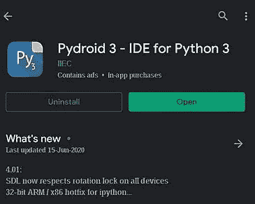
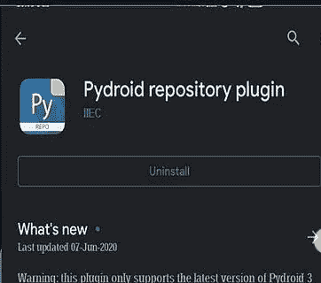
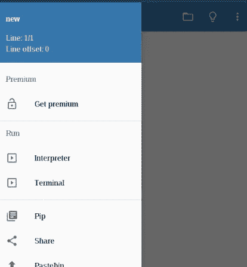
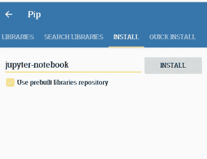
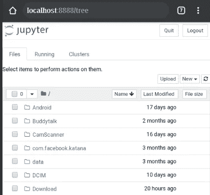
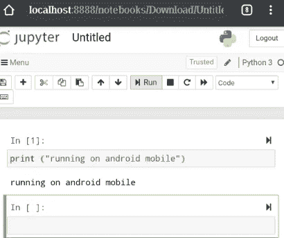

# 如何在 Android 上运行 Jupyter 笔记本？

> 原文：<https://medium.com/analytics-vidhya/how-to-run-jupyter-notebook-on-andriod-dfc5bccca7ca?source=collection_archive---------2----------------------->

最近，我在搜索 Jupyter 笔记本电脑来运行我的 Android 手机。但是没有直接的方法安装它。所以我想我们写下来。

我们将它分为两部分，第一部分是应用程序安装，第二部分是 Android 设置。

# 1.装置

你需要从 google play 商店安装两件东西来开始。

1 .从 google play 商店安装[***Pydroid 3—Python 3 的 IDE***](https://play.google.com/store/apps/details?id=ru.iiec.pydroid3&hl=en_IN&gl=US)

2.从 google play 商店安装 [***Pydroid 储存库插件***](http://Pydroid repository plugin)

**

*安装以上 2 个应用程序后，我们就可以安装 jupyter 笔记本了。*

# *2.Android 设置*

*打开[***Pydroid 3—Python 3 的 IDE***](https://play.google.com/store/apps/details?id=ru.iiec.pydroid3&hl=en_IN&gl=US)*

*   *点击 **pip** 图标*

**

*   *搜索 **jupyter -notebook** 并安装。*

**

*   *点击**终端的**图标*

**

*   *jupyter 标牌-终端笔记本*

**

*   *新页面将作为本地主机启动*

**

*   *创建一个新的 python 文件，你的 jupyter 笔记本就准备好了。*

**

*感谢阅读。*