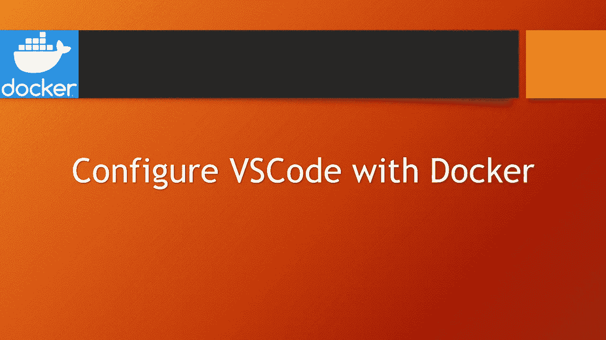
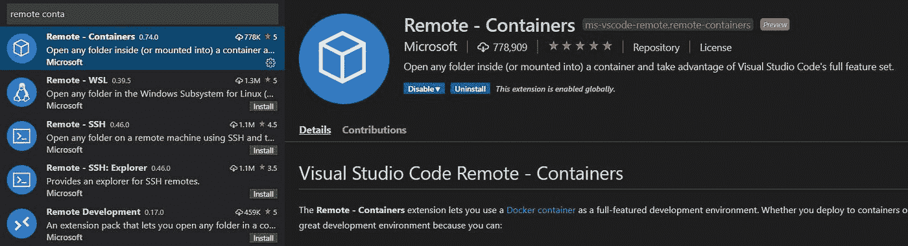
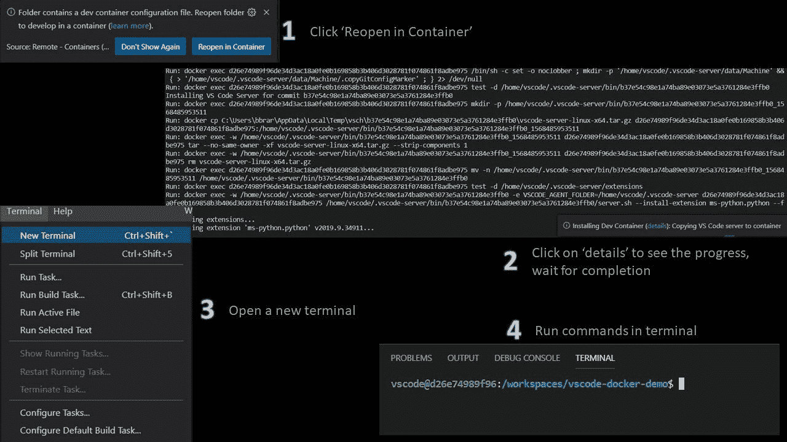
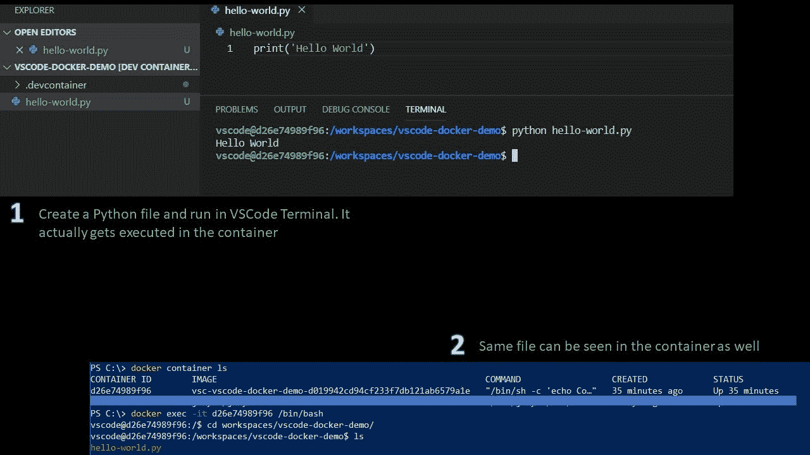

# 不安装 Python 如何运行 Python 程序

> 原文：<https://medium.com/analytics-vidhya/how-to-run-python-programs-without-installing-python-714459f5f7f0?source=collection_archive---------7----------------------->



微软 VSCode 是一个非常受开发者欢迎的 IDE。Docker 是另一个强大的工具，可以进行本地开发，然后将容器化的应用程序推向真实的环境。如果可以使用安装在本地系统上的 VSCode 进行开发，但使用 docker 来运行应用程序，这将非常有帮助。这样，我们不需要在本地系统上安装任何特定于应用程序的库。
这种方法对于 web 应用程序来说非常有效且易于配置。我们需要做的就是创建一个 docker 文件，扩展基本映像，配置所需的包，然后公开容器端口。本地存储与容器共享，因此可以直接从本地环境编辑文件，并且更改会立即反映在容器中。
请参考我的[文章](https://balkaranbrar.ca/articles/develop-laravel-apps-on-docker/)设置类似的环境。
但是，对于一些不能暴露在任何端口上，不能与主机系统映射的 python 程序，使用 docker 怎么样？假设我想运行一个简单的 Python 程序，而不在我的本地系统上安装 Python。我怎样才能做到这一点？好吧，让我们深入研究一下。

首先启动 VSCode 并搜索**远程容器**扩展并安装。



接下来，让我们创建一个需要 Python3 来运行程序的简单应用程序。我们需要按名称创建一个文件夹”。应用程序根目录下的“devcontainer”。接下来，在该文件夹中创建两个文件。

*   devcontainer —配置容器的设置，如用户 id、路径等。
*   docker file——定义运行程序的容器

**devcontainer**

```
{"name": "Demo","dockerFile": "Dockerfile","settings": {"terminal.integrated.shell.linux": "/bin/bash","python.pythonPath": "/usr/local/bin/python","python.linting.pylintEnabled": true,"python.linting.pylintPath": "/usr/local/bin/pylint","python.linting.enabled": true},"extensions": ["ms-python.python"]}
```

**Dockerfile**

```
FROM python:3**# Avoid warnings by switching to noninteractive**ENV DEBIAN_FRONTEND=noninteractiveARG USERNAME=vscodeARG USER_UID=1000ARG USER_GID=$USER_UID**# Configure apt and install packages**RUN apt-get update \&& apt-get -y install --no-install-recommends apt-utils dialog 2>&1 \&& apt-get -y install git procps lsb-release \# Install pylint&& pip --disable-pip-version-check --no-cache-dir install pylint \# Create a non-root user to use if preferred - see https://aka.ms/vscode-remote/containers/non-root-user.&& groupadd --gid $USER_GID $USERNAME \&& useradd -s /bin/bash --uid $USER_UID --gid $USER_GID -m $USERNAME \# [Optional] Add sudo support for non-root user&& apt-get install -y sudo \&& echo $USERNAME ALL=\(root\) NOPASSWD:ALL > /etc/sudoers.d/$USERNAME \&& chmod 0440 /etc/sudoers.d/$USERNAME \&& apt-get autoremove -y \&& apt-get clean -y \&& rm -rf /var/lib/apt/lists/*ENV DEBIAN_FRONTEND=
```

现在让我们打开您的应用程序文件夹，您将看到 VSCode 将检测到该项目需要在容器中运行。下面的屏幕截图解释了从 VSCode 终端运行容器中的命令可能需要经历的各个步骤。



您可以在 VSCode 中创建新的 python 文件，并在终端中运行，实际的执行发生在容器中。
您也可以查看容器本身中的文件。下面的截图演示了这个过程。



我将发表更多的文章来解释如何使用 boto3、pyspark、numpy 等等。
*希望这篇文章能对某人有所帮助。感谢阅读。*

*最初发布于*[*https://balkaranbrar . ca*](https://balkaranbrar.ca/articles/configure-vscode-with-docker/)*。*