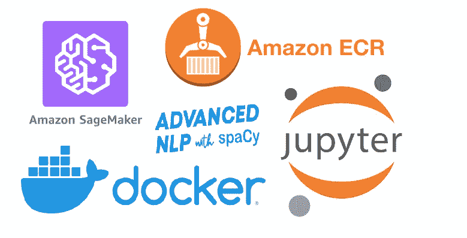

# 如何在 AWS SageMaker 定制容器上运行 Spacy:快速简单

> 原文：<https://medium.com/analytics-vidhya/how-to-run-spacy-on-aws-sagemaker-custom-containers-quick-and-easy-884a6898ed48?source=collection_archive---------2----------------------->

## 使用 Dockerized 定制容器在 AWS SageMaker 上运行和扩展 SpaCy 或任何依赖项(库)的最快方法

## 背景

对于数据科学家和机器学习工程师来说，AWS SageMaker 是一个非常棒的工具，因为它使用户能够…