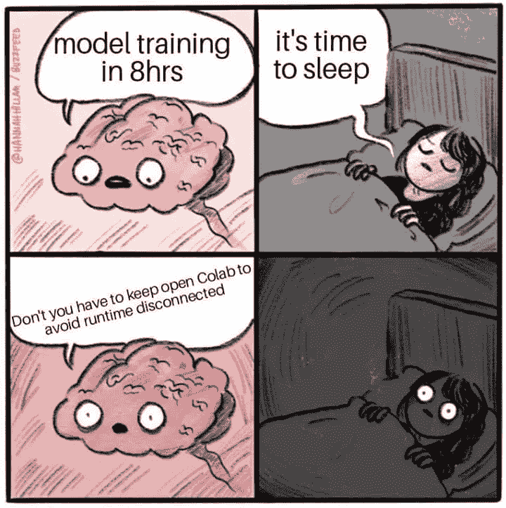
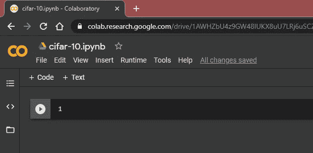
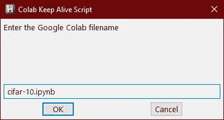
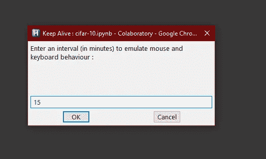

# 如何避免 Google Colab 笔记本运行时超时

> 原文：<https://medium.com/analytics-vidhya/how-to-save-google-colab-notebooks-from-runtime-timeouts-4aa133375a7e?source=collection_archive---------1----------------------->

## 避免不活动超时，停止诅咒 Colab

表情包

Google Colaboratory 强加了一个不活动超时来阻止用户使用 Colab 来执行长时间运行的任务。而超时间隔取决于活动用户数量、资源使用情况等因素。但是如果你让你的 Colab 闲置足够长的时间，你会失去你的进步。

我喜欢数据科学或深度学习的一点是，在模型训练时，我可以在南方公园休息一会儿。不是每个人都有一对 v100s 留给 Colab 下一个最好的选择。由于 Colab 的运行时空闲超时而丢失您的训练进度，只不过是在尿道上狠狠踢了一脚。

> 为了避免运行时中断，你应该定期与你的笔记本互动。如果《南方公园》一集没有在一集中结束，你就不能点击“下一集”。你天真地想知道这个“灌水器”是否会当选总统，这可能会导致 Colab 回收你的运行时，并把资源分配给另一个有更高优先级的用户。

但是，如果你喜欢过边缘生活，这里有一个简单的自动热键脚本，模拟你恐慌的训练-生命体征检查行为，这样你就可以尽情享受你的表演(除了脚本偶尔切换窗口)，而你的模型在后台快乐地训练。现在，你可以睡 12 个小时，醒来时是一个训练有素的模特。生活是美好的。

AutoHotKey 是一个不错的开源脚本工具，允许您快速编写自动化脚本，并将其编译成一个可在任何地方使用的可移植可执行文件。您可以根据存储库中的代码自行编译脚本，或者在 repo 的 releases 部分运行编译后的可执行文件。

这个脚本非常简单易读。让我们看看是怎么回事。

keepAlive 函数接受窗口的标题和间隔整数，并只发送一串滚动和点击来模拟您的常规和完全正常的恐慌窗口切换行为，以检查模型的进度，如果它在您的疏忽中幸存下来。

这是 keepAlive 函数的驱动程序代码。当您运行脚本时，它会询问您非常关心的 Colab 笔记本的文件名。

这里的文件名是`cifar-10.ipynb`，我们将把它输入到输入对话框，要求输入文件名。

现在，只要我们点击“确定”，它就会切换到 Colab 窗口并将其最大化。你会被要求有一段时间来模拟与笔记本的互动。

我个人觉得 15 分钟是个不错的选择。

现在你可以放松一下，去南方公园享受一下。

 [## sour 4bh/停止诅咒-colab

### 一个简单的 AHK 脚本来保持 Google Colab 运行时的活力。

github.com](https://github.com/sour4bh/stop-cursing-colab)