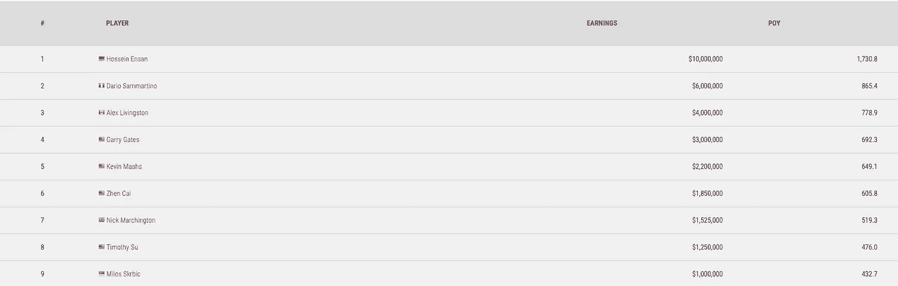
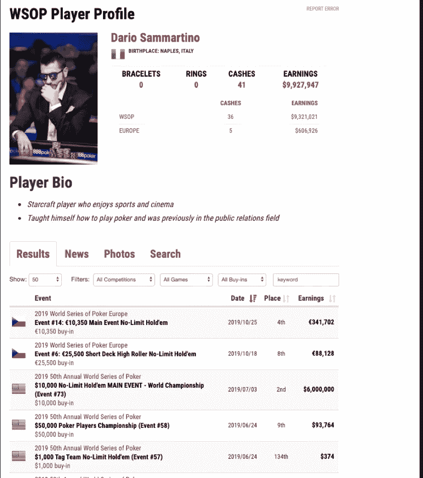
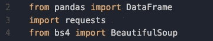
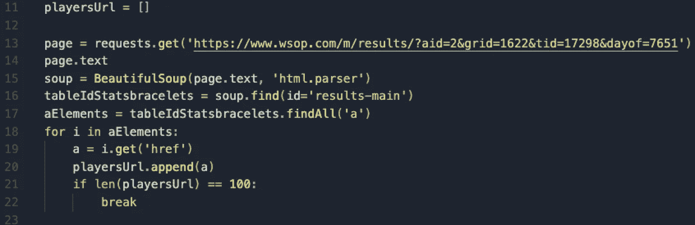
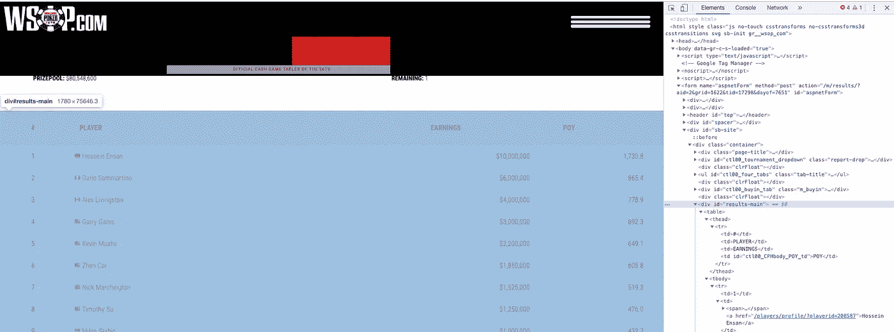
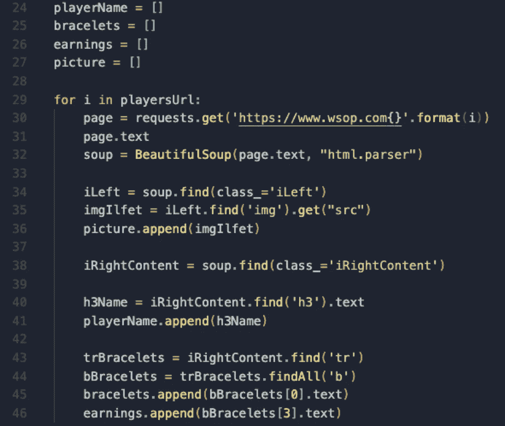
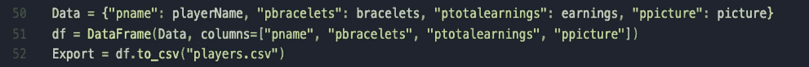

# 如何使用 Python 和 BeautifulSoup 抓取静态内容？

> 原文：<https://medium.com/analytics-vidhya/how-to-scrap-static-content-using-python-and-beautifulsoup-a4c30a79c5db?source=collection_archive---------16----------------------->

**静态内容和动态内容的区别**

静态内容是跨页面保持不变的内容。

动态内容是基于用户与页面的交互而变化的内容，例如点击元素、在表单上键入、向下滚动页面、甚至加载 HTML 等。

**动态内容和静态内容一样报废吗？**

不，通常废弃动态内容的最大挑战是，要加载它，我们需要从浏览器访问它。如果您尝试使用 Python 库请求向动态网站发送 get 请求，很可能无法获得您正在寻找的数据，因为 JavaScript 脚本不会被执行。

**如何一步一步地处理废弃的静态内容。** [**为动态点击此处。**](http://www.google.com)

对于这个循序渐进的过程，我们将使用 [WSOP](https://www.wsop.com/) 网站。为什么？因为我喜欢扑克。

我假设你已经设置了你的 Python 环境，如果你还没有这样做，请跟随[这篇教程](https://www.youtube.com/watch?v=06I63_p-2A4&t=2640s)学习如何设置你的 visual studio 代码环境。如果您愿意，也可以使用流行的 Anaconda 环境。但是对于本教程，我将使用 Visual Studio 代码。

好了，对于这个教程，我想得到(静态数据):

玩家的名字，

玩家的手镯数量，

球员职业生涯的总收入，

球员的照片。

还有一件事，我只想要 2019 年 WSOP 的前 100 名选手，所以我们需要去这个地址找他们:[https://www.wsop.com/m/results/?aid=2&grid = 1622&tid = 17298&dayof = 7651](https://www.wsop.com/m/results/?aid=2&grid=1622&tid=17298&dayof=7651)



这是所有玩家的名单。如果我们点击他们的名字，我们将被带到他们的个人资料页面:



好了，现在我们知道要获得我们想要的数据，我们需要进入 100 个个人资料页面，以某种方式获得所有的数据。

**步骤 1:** 打开您的终端并运行以下命令:

```
$ cd desktop && mkdir scrapping && cd scrapping && touch scrapper.py
```

基本上，这个命令会在桌面上创建一个新文件夹和一个扩展名为的文件。巴拉圭

**步骤 2:** 通过在终端上运行以下命令来启动 visual studio 代码

```
$ code .
```

第三步:打开文件夹里唯一一个名为“scrapper.py”的文件，里面会是空的。

步骤 4: 导入这个项目需要的所有库。



第 2 行:我们导入熊猫库。该库将帮助我们将数据转换为数据框，以便以后将其导出为 CSV 文件。

**第 3 行:**这将允许我们发送一个 HTTP 请求并获取网站代码。

**第 4 行:**这个库将接受 HTTP 请求，并将其转换成一个文本文件，我们可以浏览并找到我们需要的数据。

**第五步:**获取前 100 名玩家的网址



**第 11 行:**我们在变量 playersUrl 下创建一个空数组。

**第 13 行:**我们向 WSOP 站点发出一个 GET 请求，并将该请求保存在变量页面上。

**第 14 行:**我们使用。方法将请求转换成文本。

**第 15 行:**我们使用 BeautifulSoup 方法解析数据并保存在变量 Soup 下。

**第 16 行:**我们使用 find 方法查找 id 为“results-main”的元素，并将其保存在变量 tableIdStatsbracelets 下。

(如果我们转到扑克网站，我们可以打开检查器，通过选择信息所在的桌子，我们可以看到 id 在那里)。

**第 17 行:**基本上，我们正在将整个 HTML 中的数据缩小到表中。在这一行，我们将寻找所有标记为< a >的元素，因为我们知道玩家的 URL 在那里，然后将它保存到变量 aElements 中。

**第 18 到 22 行:**在这些行中，我们将执行一个 for 循环来遍历< a >标签的数组，并使用。get 方法，稍后将它推送到我们的数组的第 14 行。我们还添加了一个 if stamen 来限制玩家数量，使之只有 100 人。

参考线:16



**步骤 6:** 遍历每一个 URL，并从每个配置文件中提取数据。



**第 24 行到第 27 行:**我们创建空数组来保存最终数据。

第 29 行:这里是我们的循环开始遍历玩家的 URL 数组的地方。

**第 30 行:**我们将再次对 URL 进行 GET 请求，但这次会有一点不同，因为这些 URL 会在每次迭代中发生变化，这样我们每次都会打开不同的配置文件。

第 31 行:我们将把我们的请求转换成一个文本文件。

第 32 行:我们将使用 BeautifulSoup 方法来解析我们的文本文件。

**第 34 行:**我们将寻找容易定位的 HTML 来保存我们的个人资料图片。在这种情况下，它是带有类“iLeft”的元素，我们将把它保存在变量 iLeft 中。

**第 35 行:**我们将选择第一个也是唯一一个< img >标签并使用该方法。获取图像 URL 所在的标签的 src 属性。

**第 36 行:**在这一行，我们将把刚刚从< img >标签中获取的 URL 推送到我们的数组 picture 中(第 27 行)。

**第 38 行:**我们将重复我们对图片所做的，但是这次是玩家的名字。我们将寻找容易定位的 HTML 来保存我们的玩家名字。在这种情况下，它是具有“iRightContent”类的元素，我们将把它保存在变量 iRightContent 中。

**第 40 行:**现在我们知道我们的扑克玩家名字在< h3 >标签之间，并且我们知道它们是唯一的< h3 >标签，所以我们可以调用方法 find，该方法将查找第一个 h3 元素并将其保存在变量 h3Name 上。

**第 41 行:**我们将名字推送到数组 call playerName。

**第 43 行到第 46 行:**我们基本上执行了与第 40 行和第 41 行相同的步骤，但是使用了不同的类。

**第七步:**将我们收集的数据转化为数据帧(CSV 文件)



**第 50 行:**我们创建一个带有键和值对的对象。密钥将是我们的数据帧的报头。如果您想将这个 CSV 文件导入到一个 Rails 数据库中，我建议您使用与 SQL 列相同的键名。这些值将是我们保存在数组中的数据(第 24 到 27 行)。

**第 51 行:**我们使用 DataFrame 方法将数据转换成数据帧。我们可以通过调用 Python 上的 print 方法在终端上看到这一点。

**第 52 行:**我们使用方法将数据帧导出为 CSV 文件。to_csv("name.csv ")

现在已经完成了。我们将数据保存在 CSV 文件中，可以用来分析信息或构建数据库。