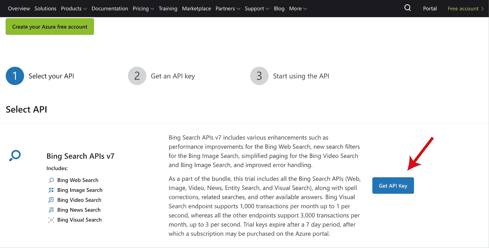

# 如何抓取 google 图片，用 12 行代码构建深度学习图片数据集？

> 原文：<https://medium.com/analytics-vidhya/how-to-scrape-google-images-and-build-a-deep-learning-image-dataset-in-12-lines-of-code-b5472f5b5c6?source=collection_archive---------7----------------------->

## 使用 Bing 图像搜索 API 快速创建您自己的数据集！

照片由[丹金](https://unsplash.com/@danielcgold?utm_source=medium&utm_medium=referral)在 [Unsplash](https://unsplash.com?utm_source=medium&utm_medium=referral) 拍摄

深度学习和计算机视觉最具挑战性的部分可能是找到合适的数据集来处理。当我在读**杰瑞米·霍华德的 Fastai 的书【1】**时，他描述了一种用 Bing 图像搜索 API 和 Fastai 收集图像数据集的简单方法。在这篇简短的文章中，我将向您展示如何毫不费力地构建自己的数据集。然后，我将继续描述如何使用 Fastai 库轻松地从数据集中删除损坏的文件。

> **建立数据集比建立复杂的深度学习算法更重要。**

# 1)使用 Bing 图像搜索 API 构建您自己的数据集:

微软的 Bing 图片搜索 API 让你可以使用 Bing 的认知图片搜索，从网上收集高质量的图片。在本例中，我将使用以下步骤构建一个包含四种不同植物类型的 600 幅图像的数据集:

**A)** 在[微软页面](https://docs.microsoft.com/en-us/azure/cognitive-services/)创建账户。

**B)** 从此[页面获取 Bing 搜索 API 的免费访问密钥。](https://azure.microsoft.com/en-us/try/cognitive-services/?api=bing-image-search-api)

图 1:显示如何获取 Bing 搜索 API 密钥的屏幕截图

这将带你到一个有几个网址和 2 个 API 键的页面。复制其中一个密钥，以便在下一步中使用。

与任何软件包一样，您需要安装`azure-cognitiveservices-search-imagesearch`并导入这些软件包，如下所示。然后，创建一个简单的函数`seach_images_bing`,它接受您的键和您想要搜索的词(针对图片)。

现在，你可以简单地创建一个包含所有你想要搜索的术语的列表。在我的例子中，我使用了 4 种不同的植物类型。然后，使用函数`search_images_bing`，我遍历列表中的术语来创建一个新的 4 个文件夹，每个文件夹包含每种植物类型的 150 张图片。

## **使用** Bing 图像搜索 API **收集你自己的数据集是多么容易，但是如何移除损坏的图像呢？**

照片由 [Soragrit Wongsa](https://unsplash.com/@invictar1997?utm_source=medium&utm_medium=referral) 在 [Unsplash](https://unsplash.com?utm_source=medium&utm_medium=referral) 拍摄

# 2)使用 Fastai 魔法:

可以使用 fastai 库中的`get_image_files()`从路径中提取图像，然后使用`verify_images()`收集损坏的文件。最后，你可以通过在每张图片上使用`unlink`来删除所有失败的图片。

## 现在，你可以开始毫不费力地为计算机视觉创建你自己的数据集。

## 参考资料:

[1]霍华德，j .，&古格，S. (2020)。*Fastai 和 PyTorch 的程序员深度学习:没有博士学位的 ai 应用*(第 1 版。)

注意:所有的代码都在杰瑞米·霍华德的 Fastai 书中有描述。