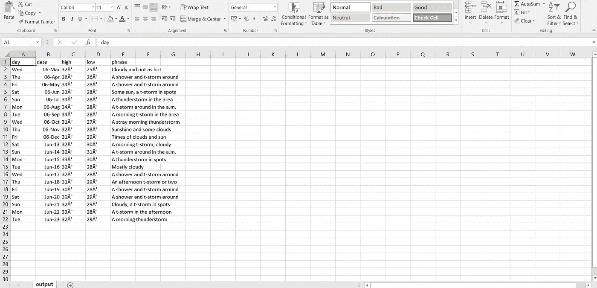
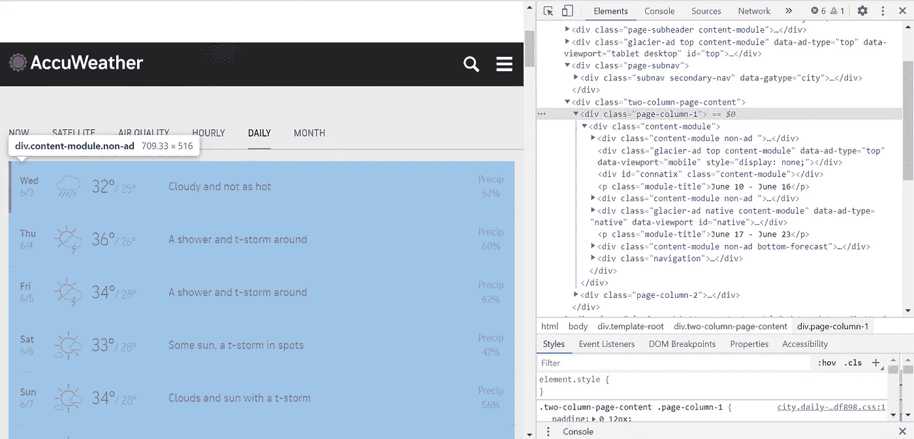
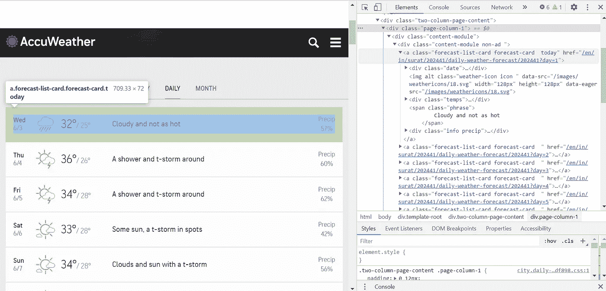

# 如何用 python (BeautifulSoup)抓取 HTTPS 网站？

> 原文：<https://medium.com/analytics-vidhya/how-to-scrape-https-sites-in-python-beautifulsoup-a08374af960d?source=collection_archive---------3----------------------->

你可能听说过网络抓取及其各种应用，但以防万一，你想在这里介绍一下。**在本文中，我们还将关注如何抓取 https 站点，并以 https://www.accuweather.com**[](https://www.accuweather.com/)****的 web 抓取为例。****

# **什么是网络抓取？**

**抓取只是一个提取数据的过程。当我们从网上(如网页或网站)抓取或提取数据或信息时，我们称之为网络抓取。**

**因此，web 抓取也称为 web 数据抽取或 web 收获，是从 web 中抽取数据。简而言之，web 抓取为开发者提供了一种从互联网上收集和分析数据的方法。**

# **为什么要抓取网页？**

**网络抓取提供了一个很好的工具来自动完成人们在浏览时所做的大部分事情。网络搜集在企业中有多种用途**

*   ****金融:**从 bse 股票交易所和许多不同的站点获取股票收盘和开盘价。**
*   ****价格比较:**网络搜集用于从在线购物网站收集数据，并使用它来比较产品的价格。**
*   ****电子邮件地址收集:**许多使用电子邮件作为营销媒介的公司使用网络搜集来收集电子邮件 ID，然后发送批量电子邮件。**
*   ****社交媒体抓取:**网络抓取用于从 Twitter 等社交媒体网站收集数据，以了解流行趋势。**
*   ****研发:**网页抓取用于收集大量数据(统计、一般信息、温度等。)从网站上下载，分析后用于调查或研发。**
*   ****职位列表:**从不同的网站收集有关职位空缺、面试的详细信息，然后在一个地方列出，以便用户可以轻松访问。**

# **网络抓取合法吗？**

**谈论网页抓取是否合法，有些网站允许网页抓取，有些不允许。想知道一个网站是否允许网页抓取，可以看看网站的“robots.txt”文件。您可以通过将“/robots.txt”附加到您想要抓取的 URL 来找到该文件。**

# **为什么使用 Python 进行网络抓取？**

**Python 是最流行的网络抓取语言之一，因为它可以非常容易地处理大多数与网络抓取相关的任务。**

1.  **易于使用(没有任何花括号“{ }”或分号“；”任何地方)**
2.  **巨大的图书馆支持**
3.  **巨大的社区**
4.  **动态类型语言(分配给变量的数据表明变量的类型)**

# **网页抓取是如何工作的？**

**当您运行 web 抓取代码时，会向您提到的 URL 发送一个请求。作为对请求的响应，服务器发送数据并允许您读取 HTML 或 XML 页面。然后，代码解析 HTML 或 XML 页面，找到数据并提取出来。**

**要通过 python 使用 web 抓取来提取数据，您需要遵循以下基本步骤:**

1.  **找到您想要抓取的 URL**
2.  **检查页面**
3.  **查找要提取的数据**
4.  **写代码**
5.  **运行代码并提取数据**
6.  **以要求的格式存储数据**

**现在理论已经足够了，让我们跳到抓取 https 站点的主题[https://www.accuweather.com](https://www.accuweather.com/)。我们希望获得天气信息，accuweather 为我们提供了 [API](https://developer.accuweather.com/) ，但出于学习目的，我们将使用 BS4(美丽的汤)。**

*****最终结果*** :我们将以这种格式提取数据**

****

**输出数据格式(output.csv)**

****

**截图来自[https://www . accuweather . com/en/in/Surat/202441/daily-weather-forecast/202441](https://www.accuweather.com/en/in/surat/202441/daily-weather-forecast/202441)**

**对于网页抓取，让我们首先前往 [accuweather 网站](https://www.accuweather.com/en/in/surat/202441/daily-weather-forecast/202441)，这里我在苏拉特，所以我有苏拉特的天气信息，你也可以前往你所在的地方并获得数据。这是网站的截图，你可以看到*类* **"page-column-1"** ，我们的父类和**'内容模块非广告'，**以< a >标签的形式拥有我们的数据。我们在里面有三个类“日期”，“临时”和“信息”。**

****

**详细查看“内容模块非广告”类**

**在**【日期】**类中我们的**日**细节在于**【道氏】类中，日期**细节在于**【子】类中。****

**在**【temps】**类中，我们的**高**和**低**温度明细分别在**【高】**和**【低】**类中。我们在**“短语”**类中也有短语细节。**

# ****代码****

**你应该已经安装了 [BeautifulSoup 库](https://www.crummy.com/software/BeautifulSoup/bs4/doc/)或者你可以**

```
**pip install beautifulsoup4**
```

**在您的命令提示符下。**

```
## Importing required librariesfrom bs4 import BeautifulSoup
import requests
import pandas as pd
import csv
```

**永远记住在抓取 https 站点时要包含头文件，因为如果没有头文件，就会出现**访问被拒绝**的错误。所有的标题都是一样的，所以不用担心。大多数 https 网站不允许网络抓取，但问题是，尽管它是 https 网站，你是如何查看该网站的？这是因为我们的 Web 浏览器使用**头**让服务器知道请求是通过 Web 浏览器发出的，所以我们将头传递给服务器。**

```
url=’[https://www.accuweather.com/en/in/surat/202441/daily-weather-forecast/202441'](https://www.accuweather.com/en/in/surat/202441/daily-weather-forecast/202441')headers = {‘User-Agent’: ‘Mozilla/5.0 (Windows NT 10.0; Win64; x64) AppleWebKit/537.36 (KHTML, like Gecko) Chrome/83.0.4103.61 Safari/537.36’}
```

**这里[**‘html 5 lib’**](https://pypi.org/project/html5lib/)是一个解析 html 的纯 python 库。**

```
r=requests.get(url, headers=headers)
soup1 = BeautifulSoup(r.content, ‘html5lib’)
```

**我们就用 [**。findAll()**](https://www.crummy.com/software/BeautifulSoup/bs4/doc/#find-all) ， [**。bs4 的**](https://www.crummy.com/software/BeautifulSoup/bs4/doc/#find) 查找() [**找出数据元素的函数。**get _ text()](https://pythonprogramming.net/introduction-scraping-parsing-beautiful-soup-tutorial/)获取元素的文本。此外，如果你有多个类要提取，然后在列表中传递它们，如 **['内容模块非广告'，'内容模块非广告底部预测']。****

**这是它的全部代码。**

**以下是如何转换为。csv 文件，可以根据您的应用程序使用**

```
df.to_csv(‘./output.csv’, encoding=’utf-8', index=False)
```

# **非常感谢你的阅读，如果你喜欢这个故事，请为它鼓掌。**

**给我接通**linkedIn**:[https://www.linkedin.com/in/kalp-panwala-72284018a](https://www.linkedin.com/in/kalp-panwala-72284018a/)**

**在推特上关注我:https://twitter.com/PanwalaKalp**

**关注我的**github:**https://github.com/kpanwala**

**如果你对这个故事有任何疑问或者任何改进的空间，那么给我发邮件到**kpanwala33@gmail.com**。**