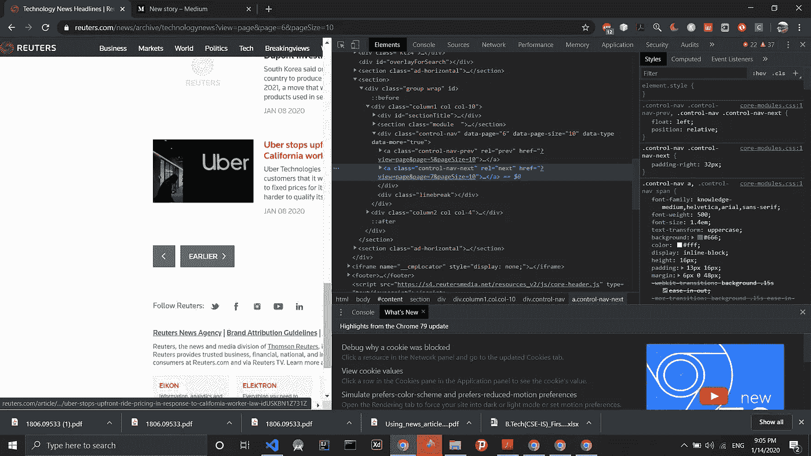

# 如何从路透社刮出新闻标题？

> 原文：<https://medium.com/analytics-vidhya/how-to-scrape-news-headlines-from-reuters-27c0274dc13c?source=collection_archive---------10----------------------->


由 [Unsplash](https://unsplash.com?utm_source=medium&utm_medium=referral) 上的[absolute vision](https://unsplash.com/@freegraphictoday?utm_source=medium&utm_medium=referral)拍摄

网络抓取可能是一项复杂的任务，因为如果你只是使用 python 中的 beautifulsoup 等库并遍历 html，一些网站会阻止你抓取。你需要任务自动化库，比如 selenium，这样你就可以在这个软件点击加载更多按钮时抓取大量的标题。看到 python 中的简单代码如何在瞬间打开浏览器、向下滚动、点击和抓取数据，真的很有趣。

所以让我们开始吧！

首先，我们得到了路透社的网址，你正计划刮例如，网址是 https://www.reuters.com/news/archive/technologynews?的[view = page&page = 6&pageSize = 10](https://www.reuters.com/news/archive/technologynews?view=page&page=6&pageSize=10)

现在你需要看看你如何加载更多的文章，每一页都有不同的方式来加载更多的项目，它们是:向下滚动，点击页码，点击下一页或点击加载更多。

我们可以看到，该网页重定向到其他网页时，你点击较早



我们可以看到，类名是 control-nav-next，每篇新闻文章的类名是 story-title。现在我们已经完成了关于页面如何工作的研究，我们可以开始用 python 编码了

在我们开始编码之前，我想告诉你我们将使用 selenium 来达到这个目的。Selenium 是一个流行的基于 web 的开源自动化工具，也用于测试，我们将使用 selenium 的力量来抓取标题。

让我们跳到代码

首先使用以下命令安装 selenium:pip install selenium

现在创建一个单独的项目，并确保你下载了 chromedriver。如果没有，在谷歌上搜索并下载最新版本。如果你下载旧版本，问题将开始出现，你将无法调试它，因为它发生在我身上。因此，请确保下载最新的 chrome 驱动程序

```
from selenium import webdriverfrom selenium.common.exceptions import NoSuchElementExceptionfrom selenium.webdriver.common.by import Byfrom selenium.webdriver.support.ui import WebDriverWaitfrom selenium.webdriver.support import expected_conditions as ECimport dateutil.parserimport timeimport csvfrom datetime import datetimeimport iodriver = webdriver.Chrome('chromedriver.exe')driver.get('https://www.reuters.com/news/archive/businessnews?view=page&page=5&pageSize=10')
```

添加导入启动并初始化 chromedriver，确保目录中有 chromedriver 文件。

```
count = 0headlines =[]dates = []for x in range(500):try:# loadMoreButton.click()# time.sleep(3)loadMoreButton = driver.find_element_by_class_name("control-nav-next")# driver.execute_script("window.scrollTo(0, document.body.scrollHeight)")time.sleep(3)loadMoreButton.click()time.sleep(2)news_headlines = driver.find_elements_by_class_name("story-title")news_dates = driver.find_elements_by_class_name("timestamp")for headline in news_headlines:headlines.append(headline.text)print(headline.text)for date in news_dates:dates.append(date.text)print(date.text)count=count+1print("CLICKED!!:")except *Exception* as e:print(e)break
```

我知道有很多代码，所以让我们一步一步来

我们设置了 500 次点击的限制，所以如果每页有 10 条新闻，我们将能够提取 5000 篇文章。如果您对数据很感兴趣，可以使用 while true，让它运行几个小时或几天，这取决于路透社在该部分的文章数量

```
loadMoreButton = driver.find_element_by_class_name("control-nav-next")
```

我们搜索按钮来加载更多的文章

```
time.sleep(3)loadMoreButton.click()time.sleep(2)
```

睡眠，因为页面需要一些时间来加载和点击它

```
news_headlines = driver.find_elements_by_class_name("story-title")news_dates = driver.find_elements_by_class_name("timestamp")
```

点击后，使用类名查找文章

```
for headline in news_headlines:headlines.append(headline.text)print(headline.text)for date in news_dates:dates.append(date.text)print(date.text)
```

现在迭代标题和日期，并将其添加到列表中

就是这样！如果你喜欢这篇文章，我会感谢一些掌声。这是我第一篇关于 medium 的编程文章，所以我希望得到一些反馈