# 文本数据怎么刮？？

> 原文：<https://medium.com/analytics-vidhya/how-to-scrape-the-text-data-9332e7ad1d71?source=collection_archive---------12----------------------->

## 从 ***亚马逊网站*** 提取评论

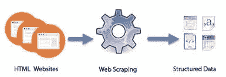

网页抓取方法

我们在日常生活中看到的所有数据都是以数字的形式存在的，这些数字是按行和列排列的。因此，数字形式的数据是现成的格式。但是，让我们假设当我们使用一个电子商务网站，任何社交媒体网站，如脸书，推特，Instagram，我们不能分析客户评论，因为所有这些评论都是文本格式的。

> **Python** 为我们从网站上抓取数据提供了一个很好的工具。Python 使用 ***请求*** 库从网页中检索内容。同样，我们使用 ***美汤*** 来提取信息。让我们看看代码。

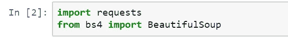

为了从网站上抓取特定的数据，我们需要提供带有基本 URL 的特定项目的搜索查询。

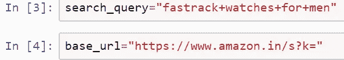

现在我们传递了 URL，但是我们需要检查我们是否可以访问这个页面。因此，我们使用*search _ response . status _ code*

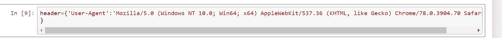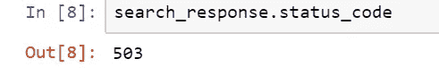

HTML 中的状态代码 503 表示*服务不可用。*所以，我们需要在 search_response 中传递头。在传递头部之后，我们得到的状态码是 200，这是可以的。

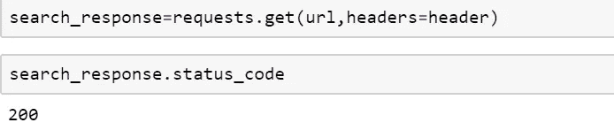

然后我们应该检查是否所有的搜索查询状态都是 200。所以，我写了一个定义状态码的函数。

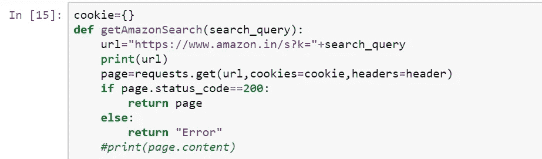

因此，如果出现任何错误，上面的代码都会返回，正如我提到的 status_code 200 提供对页面的访问。

我选择的产品是男士 Fastrack 手表。那么，我们开始吧。

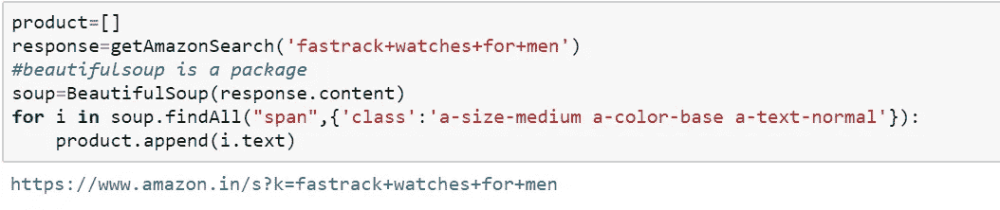

上面的代码给出了我们正在搜索的产品的 URL。在这里，soup.findALL 指的是我们访问亚马逊网页时的产品名称。要获得 span 标签，我们需要访问网站，然后单击开发人员工具(F12)。现在，我们应该单击产品名称来获取所需的 span 标签。

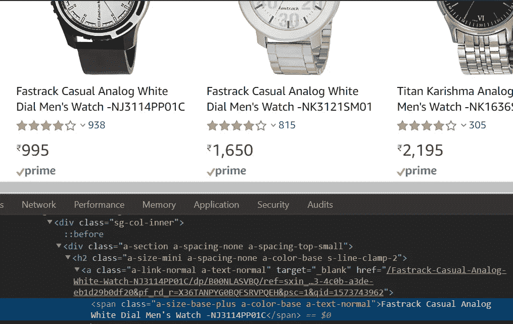

开发人员工具(F12)

从上面的步骤中，我们执行了 Fastrack 的产品。现在，让我们分析 ASIN 代码。ASIN 代表亚马逊标准识别号，是亚马逊分配的字母数字唯一标识符。

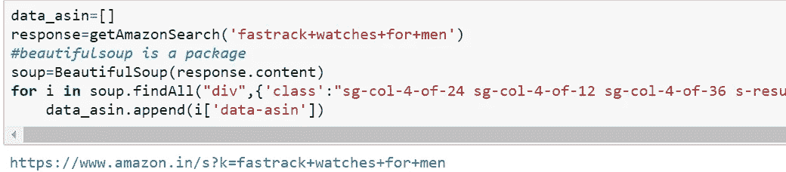

对于每一个数据，一个 asin 编号被分配给一个特定的产品，当我们打印时，分别检查 asin 代码，以验证我们是否得到了一个特定的产品。

现在我们已经得到了数据，让我们使用下面的函数来抓取评论。

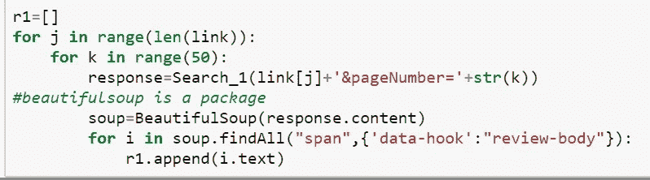

r1 表示我们已经放弃的评论，然后打印所有评论。

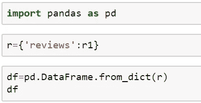

现在再次导入熊猫并将 r1 加载到 r 中。为了验证所有的评论，将所有的评论转换为 CSV 文件以便进行验证。

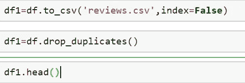

最后，我们通过搜集数据获得了对我们产品的所有评论，python 帮助我们通过几个小时的努力完成了工作。我们可以在任何网站上使用这种方法将文本数据转换成结构化格式。

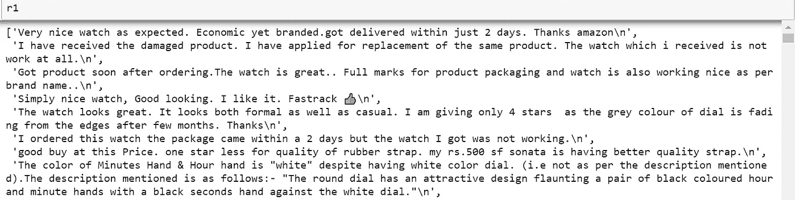

亚马逊的评论

这是结构化格式的输出，正如我前面提到的，我们可以将其转换为 CSV 文件。

## **停止复印开始刮削** …