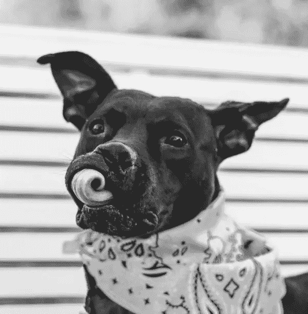
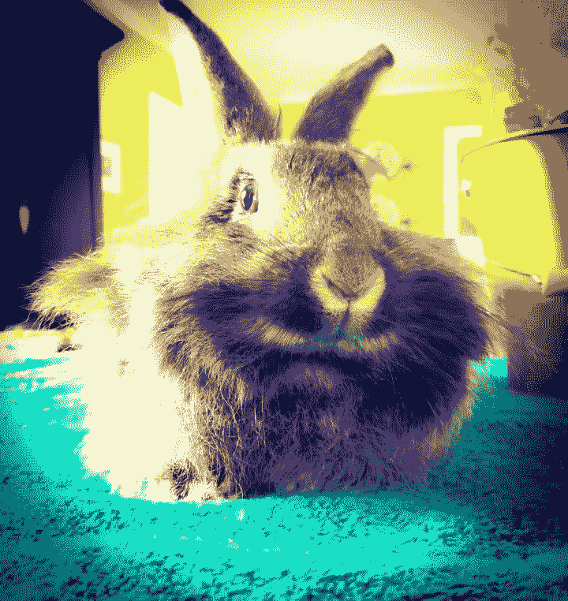
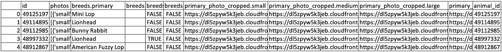

# 如何使用 Petpy API 从 Petfinder 中抓取成千上万张可收养的宠物照片:第 1 部分——收集宠物数据

> 原文：<https://medium.com/analytics-vidhya/how-to-scrape-thousands-of-adoptable-pet-photos-from-petfinder-using-petpy-api-part-1-b55e3a890845?source=collection_archive---------24----------------------->

在制作我的顶点石时，我使用了 Petpy API，并按照[亚伦·施莱格尔关于如何用 petpy](https://github.com/aschleg/petpy/tree/master/notebooks) 下载 45，000 张可收养的猫图像的说明进行操作，在尝试使用一些属性时，我遇到了一些麻烦。我意识到他们已经改变了，我发现很难找到更新的信息。我能够理解它，我甚至找到了更快、更短的做事方法，我想与你分享。

你要做的第一件事是安装 petpy。
在终端`pip install petpy`或在 Jupyter `! pip install petpy`中

接下来，你需要做的是去 [Petfinder 开发者页面](https://www.petfinder.com/developers/)获取一个 API。

现在，让我们开始吧。您将希望导入 petpy 并定义您的 API 和秘密

`import petpy
pf = petpy.Petfinder('your key', 'your secret')`

现在我们可以开始使用`pf.animals,`搜索宠物，但首先，让我们看看所有的参数:

`animal_id, animal_type, breed, size, gender, age, color, coat, status, name, organization_id, location, distance, sort, pages, good_with_cats, good_with_children, good_with_dogs, before_date, after_date, results_per_page, return_df`

在这个例子中，我们将只关注几个参数，但是完整的文档可以在[这里](https://petpy.readthedocs.io/_/downloads/en/latest/pdf/)找到:

`animal_type` -这将是一个字符串，是要搜索的动物类型。

`size` -尺寸选项有“小”、“中”、“大”和“xlarge”。

这可以有三种格式:经度、邮政编码或城市、州。

`distance` -默认为 100 英里，但您最多可以输入 500 英里。

`pages` -您想要返回的页数。

`results_per_page` -您希望每页返回的结果数量。

`return_df`您是否希望返回一个熊猫数据框。

## 让我们寻找一些兔子吧！

`rabbit = pf.animals(animal_type='rabbit', size='small', location=76825, distance=500, pages=1, results_per_page=5, return_df=True)`

我选择了德克萨斯州的中心作为地点，用最大距离寻找 5 只小兔子。结果返回了一个数据框，其中有 5 行是我的 5 只兔子，48 列是不同的属性、照片和信息。以下是完整列表:`['id', 'organization_id', 'url', 'type', 'species', 'age', 'gender', 'size', 'coat', 'tags', 'name', 'description', 'organization_animal_id', 'photos', 'videos', 'status', 'status_changed_at', 'published_at', 'distance', 'breeds.primary', 'breeds.secondary', 'breeds.mixed', 'breeds.unknown', 'colors.primary', 'colors.secondary', 'colors.tertiary', 'attributes.spayed_neutered', 'attributes.house_trained', 'attributes.declawed', 'attributes.special_needs', 'attributes.shots_current', 'environment.children', 'environment.dogs', 'environment.cats', 'primary_photo_cropped.small', 'primary_photo_cropped.medium', 'primary_photo_cropped.large', 'primary_photo_cropped.full', 'contact.email', 'contact.phone', 'contact.address.address1', 'contact.address.address2', 'contact.address.city', 'contact.address.state', 'contact.address.postcode', 'contact.address.country', 'animal_id', 'animal_type', 'organization_id']`

当抓取图像时，我们不需要这些列中的大部分，所以我将删除一些以使我们的数据帧更干净，但首先我们应该将我们的数据保存到 csv，以防我们搞砸了，需要重新开始。我们真的不想重新收集数据，尤其是如果有成千上万的结果。

`rabbit.to_csv('./rabbits.csv')`

现在，我将从兔子数据框创建一个新的数据框，该数据框只包含包含单词 id、品种或照片的列，并将其命名为 rabbitCLEANED

`rabbitCLEANED = rabbit[rabbit.columns[rabbit.columns.str.contains('id|breed|photo')]]`

还有几列我们不需要，所以我们可以删除它们。

`rabbitCLEANED.drop(columns=['organization_id', 'organization_id','organization_animal_id', 'videos'], inplace=True)`

我将把清理后的数据帧导出到 csv 文件中进行备份。

`rabbitCLEANED.to_csv('./rabbitCLEANED.csv')`

现在让我们看看我们的数据框架

我们剩下的唯一的列是包含照片、品种和动物 id 的列。这给了我们一个很好的切入点。[这是我们下载图片的第二部分！](/@shinermaz/how-to-scrape-thousands-of-adoptable-pet-photos-from-petfinder-using-petpy-api-part-2-57abb0ef7146)

来自 [Petfinder](https://www.petfinder.com) 的照片