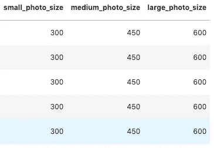

# 如何使用 Petpy API 从 Petfinder 中抓取成千上万张可收养的宠物照片:第 2 部分——下载宠物图片

> 原文：<https://medium.com/analytics-vidhya/how-to-scrape-thousands-of-adoptable-pet-photos-from-petfinder-using-petpy-api-part-2-57abb0ef7146?source=collection_archive---------18----------------------->


回想一下第 1 部分，我们留下了一个包含宠物 id、品种和照片的干净的数据帧。下一步是决定我们想要下载哪些照片。

我们首先需要进口。

```
import petpy
import os
import pandas as pd
import urllib.request
import urllib.error
from multiprocessing import Pool
from multiprocessing.dummy import Pool as ThreadPool
```

我们可以为 3 个图像列中的每一个创建 3 个大小列来显示它们的大小。

```
rabbitCLEANED['small_photo_size']= rabbitCLEANED['primary_photo_cropped.small'].str.split('width=', 1).str[1].str.split('&', 0).str[0].astype(int)rabbitCLEANED['medium_photo_size']=rabbitCLEANED['primary_photo_cropped.medium'].str.split('width=', 1).str[1].str.split('&', 0).str[0].astype(int)rabbitCLEANED['large_photo_size']=rabbitCLEANED['primary_photo_cropped.large'].str.split('width=', 1).str[1].str.split('&', 0).str[0].astype(int)
```

我们的数据框架中的结果是如下所示的 3 列:



如果我们看一下这些列，我们可以看到三种照片尺寸的像素宽度分别为 300、450 和 600。我们将在这个例子中使用中等大小，因为为什么不呢？因此，我们将过滤数据，只保留 450 的大小。

```
medphotos=rabbitCLEANED.groupby('id').apply(lambda x: x[x['medium_photo_size'] == 450])
```

为每个品种选择任意数量的照片。我会选择 5 张，因为我们的名单很小，我们不能为每个品种提供更多的照片，但这取决于你想要多少张照片。

```
medium=medphotos.groupby('breeds.primary').head(5)
```

我们将从 rabbitCLEANED 中获取我们需要的列，并将它们转换成列表。

```
urls, breed, index = rabbitCLEANED['primary_photo_cropped.medium'].tolist(), rabbitCLEANED['breeds.primary'].tolist(), rabbitCLEANED.index.tolist()
```

然后我们创建一个列表列表:`rabbitlist = [index, breed, urls]`

[‘我们必须重新排列列表的列表，使其格式允许我们在](https://github.com/aschleg/petpy/blob/master/notebooks/02-Download%2045%2C000%20Adoptable%20Cat%20Images%20with%20petpy%20and%20multiprocessing.ipynb) `[Pool](https://github.com/aschleg/petpy/blob/master/notebooks/02-Download%2045%2C000%20Adoptable%20Cat%20Images%20with%20petpy%20and%20multiprocessing.ipynb)` [流程遍历值时轻松地将值输入其中。’](https://github.com/aschleg/petpy/blob/master/notebooks/02-Download%2045%2C000%20Adoptable%20Cat%20Images%20with%20petpy%20and%20multiprocessing.ipynb)

```
new_rabbitlist = []
for i in range(0, len(rabbitlist[0])):
    new_rabbitlist.append([rabbitlist[0][i], rabbitlist[1][i],
    rabbitlist[2][i]])
```

下一步，我们需要它根据主要品种将照片分成不同的目录。我们想添加独特的，所以它不会有一个以上的同一品种的文件夹。

```
breed_dirs = new_rabbitlist(medphotos['breeds.primary'].unique())
```

现在我们可以定义一个函数，为所有名为 rabbit _ breeds 的品种目录创建一个文件夹。它还为图像指定一个名称，这个名称将是品种类型以及 id。[我们还确保用](https://github.com/aschleg/petpy/blob/master/notebooks/02-Download%2045%2C000%20Adoptable%20Cat%20Images%20with%20petpy%20and%20multiprocessing.ipynb) `[urllib](https://github.com/aschleg/petpy/blob/master/notebooks/02-Download%2045%2C000%20Adoptable%20Cat%20Images%20with%20petpy%20and%20multiprocessing.ipynb)` [和](https://github.com/aschleg/petpy/blob/master/notebooks/02-Download%2045%2C000%20Adoptable%20Cat%20Images%20with%20petpy%20and%20multiprocessing.ipynb) `[HTTPError](https://github.com/aschleg/petpy/blob/master/notebooks/02-Download%2045%2C000%20Adoptable%20Cat%20Images%20with%20petpy%20and%20multiprocessing.ipynb)` [编写一个错误异常，用于从 URL 中抓取图像。](https://github.com/aschleg/petpy/blob/master/notebooks/02-Download%2045%2C000%20Adoptable%20Cat%20Images%20with%20petpy%20and%20multiprocessing.ipynb)’

```
def download_breed_images(breed_img):
    try:
        urllib.request.urlretrieve(breed_img[2], 
                                   os.path.join('rabbit_breeds/', str(breed_img[1]),
                                                str(breed_img[1]) +
                                                str(breed_img[0]) +
                                                '.jpg'))
     except urllib.error.HTTPError as err:
         print(err.code)
```

我们使用多处理池，它根据计算机上可用的最大内核数量生成一个工作进程池，然后在内核可用时基本上输入任务。( [link](https://stackoverflow.com/questions/20886565/using-multiprocessing-process-with-a-maximum-number-of-simultaneous-processes) )
我的 mac 有 4 个内核，所以我将选择 4 个，但当我使用其他值时，它对我有效，所以这有点武断。

```
pool = ThreadPool(processes=4)
```

[这里的](https://docs.python.org/2/library/multiprocessing.html)是更多关于多处理和池的文档。

```
pool.map(download_breed_images, breed_list_new)
pool.close()
pool.join()
```

我的跑得很快，因为我们只有 5 只兔子。我现在在我的 rabbit _ breeds 目录中有目录，包含我们收集的所有兔子的品种名称。这是我从这个例子中得到的一个小可爱。


当然，这可以用任何一种宠物来做，我选择兔子是因为它们毛茸茸的，很可爱。

如果没有亚伦·施莱格尔的指导，我不可能用宠物下载 45000 张可收养的猫图片。
来自[宠物搜索者](https://www.petfinder.com/)的照片。