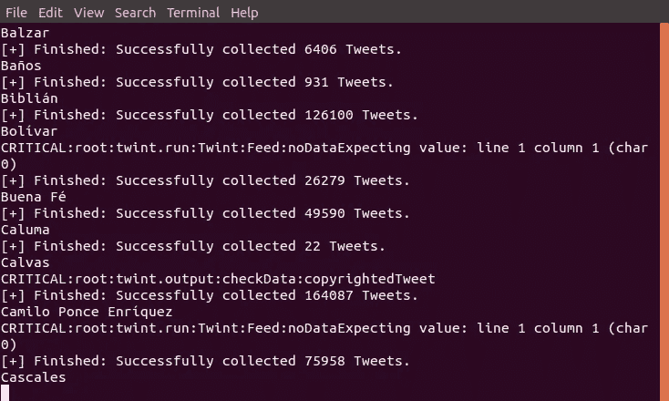
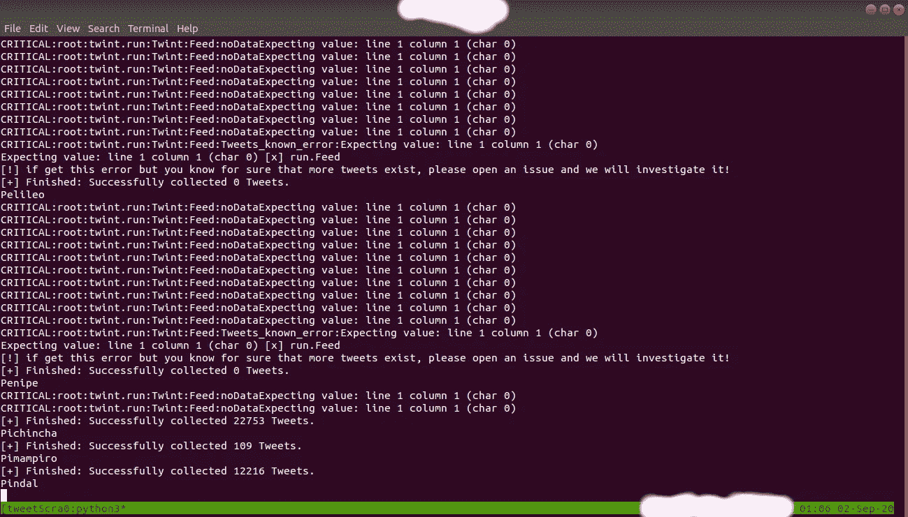

# 如何在没有 Twitter API 的情况下使用 Twint 抓取推文并创建数据集

> 原文：<https://medium.com/analytics-vidhya/how-to-scrape-tweets-and-create-dataset-using-twint-without-twitter-api-e5890c25d1c9?source=collection_archive---------1----------------------->


照片由[晨酿](https://unsplash.com/@morningbrew?utm_source=medium&utm_medium=referral)在 [Unsplash](https://unsplash.com?utm_source=medium&utm_medium=referral) 拍摄

# 大纲:

1.  介绍
2.  设置/安装
3.  预脚本
4.  脚本
5.  投入生产
6.  用例
7.  例子
8.  结论
9.  连接

Twint 是一个用 Python 编写的高级 Twitter 抓取工具，允许在不使用 Twitter API 的情况下从 Twitter 个人资料中抓取 Tweets。

在这篇文章中，我将描述我是如何创建一个从整个国家搜集的巨大的推特数据集的。

[](https://github.com/twintproject/twint/) [## twintproject/twint

### 没有认证。没有 API。没有限制。Twint 是一个用 Python 编写的高级 Twitter 抓取工具，它允许…

github.com](https://github.com/twintproject/twint/) 

**注意:**这篇文章将为你准备一个生产水平的脚本。

# 装置

Git:

```
git clone [https://github.com/twintproject/twint.git](https://github.com/twintproject/twint.git)
cd twint
pip3 install . -r requirements.txt
```

Pip:

```
pip3 install twint
```

或者

```
pip3 install --user --upgrade git+https://github.com/twintproject/twint.git@origin/master#egg=twint
```

# 预脚本:

1.  在谷歌上搜索这个国家的城市列表(这可能是一个城市或州的地名)。喜欢:巴基斯坦城市列表
2.  下载城市列表后，清理数据。而且如果没有清理，还可以从维基百科获取这些数据。
3.  清理后，在“all_cities”变量脚本中分配列表，如下所示

# 脚本:

```
import twint
import pandas#Cities list of Pakistan
all_cities = ["Bagh", "Bhimber", "khuiratta", "Kotli", "Mangla", "Mirpur", "Muzaffarabad", "Plandri", "Rawalakot", "Punch", "Amir\u00a0Chah", "Bazdar", "Bela", "Bellpat", "Bagh", "Burj", "Chagai", "Chah\u00a0Sandan", "Chakku", "Chaman", "Chhatr", "Dalbandin", "Dera Bugti", "Dhana Sar", "Diwana", "Duki", "Dushi", "Duzab", "Gajar", "Gandava", "Garhi Khairo", "Garruck", "Ghazluna", "Girdan", "Gulistan", "Gwadar", "Gwash", "Hab Chauki", "Hameedabad", "Harnai", "Hinglaj", "Hoshab", "Ispikan", "Jhal", "Jhal Jhao", "Jhatpat", "Jiwani", "Kalandi", "Kalat", "Kamararod", "Kanak", "Kandi", "Kanpur", "Kapip", "Kappar", "Karodi", "Katuri", "Kharan", "Khuzdar", "Kikki", "Kohan", "Kohlu", "Korak", "Lahri", "Lasbela", "Liari", "Loralai", "Mach", "Mand", "Manguchar", "Mashki\u00a0Chah", "Maslti", "Mastung", "Mekhtar", "Merui", "Mianez", "Murgha Kibzai", "Musa Khel Bazar", "Nagha Kalat", "Nal", "Naseerabad", "Nauroz Kalat", "Nur Gamma", "Nushki", "Nuttal", "Ormara", "Palantuk", "Panjgur", "Pasni", "Piharak", "Pishin", "Qamruddin Karez", "Qila Abdullah", "Qila Ladgasht", "Qila Safed", "Qila Saifullah", "Quetta", "Rakhni", "Robat Thana", "Rodkhan", "Saindak", "Sanjawi", "Saruna", "Shabaz Kalat", "Shahpur", "Sharam Jogizai", "Shingar", "Shorap", "Sibi", "Sonmiani", "Spezand", "Spintangi", "Sui", "Suntsar", "Surab", "Thalo", "Tump", "Turbat", "Umarao", "pirMahal", "Uthal", "Vitakri", "Wadh", "Washap", "Wasjuk", "Yakmach", "Zhob", "Astor", "Baramula", "Hunza", "Gilgit", "Nagar", "Skardu", "Shangrila", "Shandur", "Bajaur", "Hangu", "Malakand", "Miram Shah", "Mohmand", "Khyber", "Kurram", "North Waziristan", "South Waziristan", "Wana", "Abbottabad", "Ayubia", "Adezai", "Banda Daud Shah", "Bannu", "Batagram", "Birote", "Buner", "Chakdara", "Charsadda", "Chitral", "Dargai", "Darya Khan", "Dera Ismail Khan", "Drasan", "Drosh", "Hangu", "Haripur", "Kalam", "Karak", "Khanaspur", "Kohat", "Kohistan", "Lakki Marwat", "Latamber", "Lower Dir", "Madyan", "Malakand", "Mansehra", "Mardan", "Mastuj", "Mongora", "Nowshera", "Paharpur", "Peshawar", "Saidu Sharif", "Shangla", "Sakesar", "Swabi", "Swat", "Tangi", "Tank", "Thall", "Tordher", "Upper Dir", "Ahmedpur East", "Ahmed Nager Chatha", "Ali Pur", "Arifwala", "Attock", "Basti Malook", "Bhagalchur", "Bhalwal", "Bahawalnagar", "Bahawalpur", "Bhaipheru", "Bhakkar", "Burewala", "Chailianwala", "Chakwal", "Chichawatni", "Chiniot", "Chowk Azam", "Chowk Sarwar Shaheed", "Daska", "Darya Khan", "Dera Ghazi Khan", "Derawar Fort", "Dhaular", "Dina City", "Dinga", "Dipalpur", "Faisalabad", "Fateh Jang", "Gadar", "Ghakhar Mandi", "Gujranwala", "Gujrat", "Gujar Khan", "Hafizabad", "Haroonabad", "Hasilpur", "Haveli Lakha", "Jampur", "Jhang", "Jhelum", "Kalabagh", "Karor Lal Esan", "Kasur", "Kamalia", "Kamokey", "Khanewal", "Khanpur", "Kharian", "Khushab", "Kot Addu", "Jahania", "Jalla Araain", "Jauharabad", "Laar", "Lahore", "Lalamusa", "Layyah", "Lodhran", "Mamoori", "Mandi Bahauddin", "Makhdoom Aali", "Mandi Warburton", "Mailsi", "Mian Channu", "Minawala", "Mianwali", "Multan", "Murree", "Muridke", "Muzaffargarh", "Narowal", "Okara", "Renala Khurd", "Rajan Pur", "Pak Pattan", "Panjgur", "Pattoki", "Pirmahal", "Qila Didar Singh", "Rabwah", "Raiwind", "Rajan Pur", "Rahim Yar Khan", "Rawalpindi", "Rohri", "Sadiqabad", "Safdar Abad \u0096 (Dhaban Singh)", "Sahiwal", "Sangla Hill", "Samberial", "Sarai Alamgir", "Sargodha", "Shakargarh", "Shafqat Shaheed Chowk", "Sheikhupura", "Sialkot", "Sohawa", "Sooianwala", "Sundar (city)", "Talagang", "Tarbela", "Takhtbai", "Taxila", "Toba Tek Singh", "Vehari", "Wah Cantonment", "Wazirabad", "Ali Bandar", "Baden", "Chachro", "Dadu", "Digri", "Diplo", "Dokri", "Gadra", "Ghanian", "Ghauspur", "Ghotki", "Hala", "Hyderabad", "Islamkot", "Jacobabad", "Jamesabad", "Jamshoro", "Janghar", "Jati (Mughalbhin)", "Jhudo", "Jungshahi", "Kandiaro", "Karachi", "Kashmor", "Keti Bandar", "Khairpur", "Khora", "Klupro", "Khokhropur", "Korangi", "Kotri", "Kot Sarae", "Larkana", "Lund", "Mathi", "Matiari", "Mehar", "Mirpur Batoro", "Mirpur Khas", "Mirpur Sakro", "Mithi", "Mithani", "Moro", "Nagar Parkar", "Naushara", "Naudero", "Noushero Feroz", "Nawabshah", "Nazimabad", "Naokot", "Pendoo", "Pokran", "Qambar", "Qazi Ahmad", "Ranipur", "Ratodero", "Rohri", "Saidu Sharif", "Sakrand", "Sanghar", "Shadadkhot", "Shahbandar", "Shahdadpur", "Shahpur Chakar", "Shikarpur", "Sujawal", "Sukkur", "Tando Adam", "Tando Allahyar", "Tando Bago", "Tar Ahamd Rind", "Thatta", "Tujal", "Umarkot", "Veirwaro", "Warah"]def scrape_by_city(keywords, since, outfile):
    unique_cities=set(all_cities) #To get unique cities of country
    cities = sorted(unique_cities) #Sort & convert datatype to list
    for city in cities:
        print(city)
        c = twint.Config()
        c.Search = keywords #search keyword
        c.Since = since
        c.Store_csv = True
        c.Output = "./" + outfile
        c.Near = city
        c.Hide_output = True
        c.Count = True
        c.Stats = True
        c.Resume = 'resume.txt'
        twint.run.Search(c)scrape_by_city('', '2020-08-5 15:55:00', 'Pakistan_Tweets_Dataset.csv')
```

现在，我来解释一下' **scrape_by_city()** '方法。

首先我们要导入 twint 配置。

关键字:我让关键字为空，这样它会抓取所有的推文。否则，如果你是针对一个特定的关键字，你可以在那里添加它。

**因为:**在这个参数中，您添加了想要抓取 tweets 时的时间戳。

**Store_csv:** 将推文保存在 csv 文件中。

**输出:**输入您想要保存数据集的文件名。

附近:这里你要输入城市名。

**Hide_output:** 如果你不想在终端中看到输出，我更喜欢在生产中看到，因为它会降低性能。

**Count:** 检查 tweets 抓取数量的状态。

**Resume:** 要恢复抓取，我们必须传递存储在我们的 CSV 或我们存储数据的地方的最后一个 id 值。下面的脚本将帮助您获得最后一个 id。

```
#script to get last id value
import pandas as pd
import numpy as npdf = pd.reas_csv('last_hour.csv')
result = df.iloc[[-1]]
print(result)
```

获得“id”值后，该值将是一个类似于“1298337878339133447”的数字。你必须把号码存到像“resume.txt”这样的文件里。将简历文件放在原始抓取脚本的同一个目录中，并将文件名赋给参数。现在运行脚本，猜猜什么抓取已经重新开始。



脚本运行时

# 生产:

请记住，根据推文的数量和你所覆盖的地理区域，抓取可能会花费很多时间，甚至几天。所以，这里是我的一些将脚本投入生产的小技巧。

1.  因为抓取需要时间，所以只需旋转一个云实例，使用 ssh 上传脚本。

```
Syntax:
scp <local_file> <user@remote_host:remote_file> Example:
scp ./twint_scraper.py user@remote_host:.
```

2.安装 [tmux](https://linuxize.com/post/getting-started-with-tmux/)

[](https://linuxize.com/post/getting-started-with-tmux/) [## Tmux 入门

### Tmux 是一个终端多路复用器，是 GNU 屏幕的替代品。换句话说，这意味着您可以启动一个 Tmux 会话…

linuxize.com](https://linuxize.com/post/getting-started-with-tmux/) 

3.创建一个 tmux 会话，运行脚本，分离会话，并让它运行。

4.终于刮好了。现在下载数据集

```
Syntax:
scp <user@remote_host:remote_file> <local_file>Example:
scp user@remote_host:Tweets_Dataset.csv ./home/user/
```

**注意:**有时候 tweeter 会因为发送太多请求而屏蔽你的 IP。建议在生产中使用多个轮换 IP 地址，否则您可能会遇到类似的问题，如下所示。它在很大程度上不需要旋转 IP 地址。



错误屏幕

# 使用案例:

1.  情感分析
2.  用户特征分析
3.  性别预测
4.  人口预测
5.  [在社交媒体上开发年龄和性别预测词汇](http://wwbp.org/papers/emnlp2014_developingLexica.pdf)

**举例:**

微博分析的力量

# 结论:

权力越大，责任越大。现在你有了一个惊人的数据集。你会用它做什么？

你觉得这篇文章有用吗？给它鼓掌👏，分享给社区，有一些想法，还是我漏掉了什么？请在评论中与我分享📝。

# 阅读更多信息:

谷歌云平台:核心基础设施

[](/@MrAsimZahid/google-cloud-platform-fundamentals-core-infrastructure-97c4d958d8e2) [## 谷歌云平台基础:核心基础设施

### 很荣幸 DSC SEA Google 给了我一个学习 Google 云基础知识的机会。我感谢我的经理…

medium.comHire 雇用我:](/@MrAsimZahid/google-cloud-platform-fundamentals-core-infrastructure-97c4d958d8e2) 

# 雇用我:

需要爬一个网站刮数据还是需要数据科学的工作？我愿意工作。期待收到你的来信。

# 连接

作者是一名研究科学家，热衷于开发有意义的、有影响力的产品。他是双卡格勒专家。他是前谷歌开发者学生俱乐部(GDSC)负责人和 AWS 教育云大使。他喜欢与人交往。如果你喜欢他的作品，跟他打个招呼。

[](https://mrasimzahid.github.io/) [## @MrAsimZahid |研究科学家

### Kaggle 专家|前谷歌开发者 Studnet 俱乐部负责人& AWS 教育大使

mrasimzahid.github.io](https://mrasimzahid.github.io/)