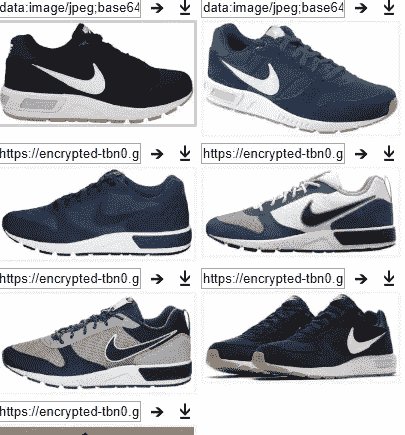
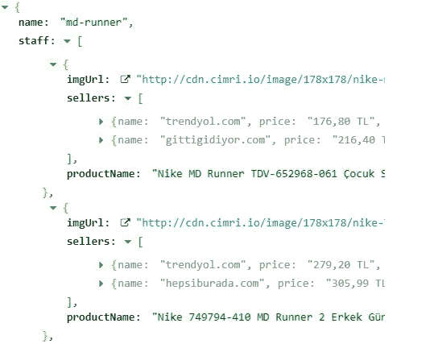
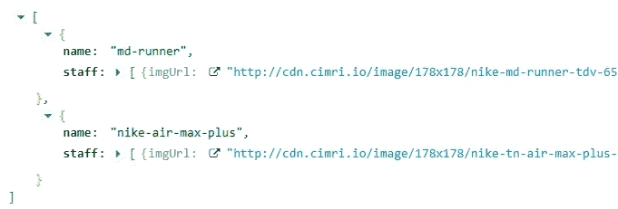
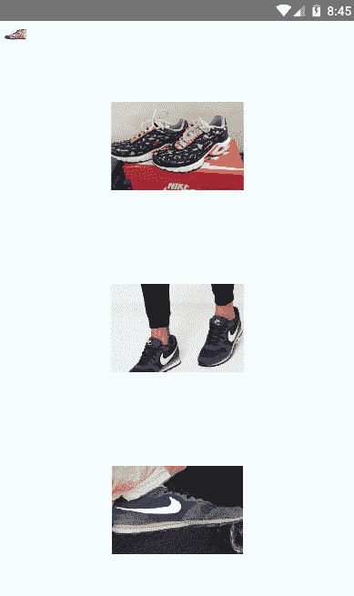

# 如何通过拍照来搜索任何产品的价格

> 原文：<https://medium.com/analytics-vidhya/how-to-search-a-product-price-by-taking-a-picture-of-it-332a7a4ea30a?source=collection_archive---------10----------------------->

*欢迎阅读通过图像分类制作产品搜索应用程序的多部分系列文章。我们想证明，如果我们有一个产品的图像，我们可以决定它是什么。我们能找到最便宜的价格。我们甚至可以在移动设备中使用这项技术。这些系列将包含为一些产品类型训练一个* [*TFLite*](https://www.tensorflow.org/lite) *模型，创建一个搜索市场上产品价格的 web 服务和一个移动客户端。每个部分都将简单地演示如何在没有任何知识的情况下完成。每个部分将包含每个状态的基本解释。任何不清楚的地方请随意评论，我很乐意编辑。*


照片由[耶鲁安穴獭](https://unsplash.com/@jeroendenotter?utm_source=unsplash&utm_medium=referral&utm_content=creditCopyText)

# 预期

学习 Tensorflow 的基础知识并使用图像训练模型。此外，我们将使用这个模型来测试预测的准确性。然后，我们将创建一个基于产品名称响应我们请求的 web 服务。如果我们发送一个产品名称，这项服务将返回互联网上最便宜的卖家。最后一步是创建我们的客户端，展示我们如何在一个用户友好的应用程序中结合这些功能。

# 第一部分

## 张量流快速介绍

它是最流行的开源深度学习工具之一。首先，你要知道什么是机器学习模型。

> 机器学习中的模型意味着具有可学习参数的函数，该函数将输入映射到期望的输出。更多信息请查看 [TensorFlow 模型页面](https://www.tensorflow.org/js/guide/train_models)。

该工具通常用于分类、感知和预测。还有，你可以在谷歌的硬件特性下，在谷歌 Colab 上训练你的模型。我们将使用这些特征来训练我们的图像分类模型。

## 样本输入的集合

在我们的例子中，我们将训练我们的模型在给定的输入图像上决定正确的鞋模型。我将使用 chrome 扩展从谷歌搜索下载样本图片。我将使用“图像下载器”扩展从 google images 下载图像。例子很多。你可以使用任何一个。下一步就是输入产品名称和下载图片。对于我们的测试，我们将为每个产品下载 150 张图片。你可以从我的[***Github***](https://github.com/rifatcakir/TensorflowLite_Image_Classification_Training/tree/master/sample_inputs)下载已经准备好的图片文件夹。



Nike Nightgazer 下载面板预览

## 培训模式

在本文中，您将为我们的项目训练图像分类模型。

[](/@rifatcakira/create-tensorflow-image-classification-model-with-your-own-dataset-in-google-colab-63e9d7853a3e) [## 使用自己的数据集进行 Tensorflow 影像分类

### 这篇文章探讨了如何用你自己的图片来训练你的图片分类模型！

medium.com](/@rifatcakira/create-tensorflow-image-classification-model-with-your-own-dataset-in-google-colab-63e9d7853a3e) 

## 这部分的结果

我们将能够根据任何鞋子的图片对其型号名称进行分类。最后，我们将使用鞋子的名称在互联网上搜索，并列出相似的价格。所以，接下来的部分继续关注吧！

# 第二部分

## 搜索市场

在这一部分中，我们将创建一个 Spring Boot web API，用产品名称在 web 上搜索产品价格。如果你对网络服务或 Spring Boot 一无所知，你可以在你的电脑上运行这项服务，只需做一些基本的修改。

> *我们将使用*[](https://www.cimri.com/)**来搜索我们的产品价格。这个网站为流行的在线卖家提供价格。在我们的服务中，我们将只获取对该网站的请求。然后，我们将解析 HTML 响应。**

## *要求*

1.  *Java — 1.8.x*
2.  *Maven — 3.x.x*
3.  *MongoDB — 4.x.x*

## *探索 Rest API*

*这个项目里有很多控制器，但是还没有全部完成。对于我们的项目，我们只需检查如何使用该服务搜索产品。*

```
*GET 
------ "/product" -> returns all products
------ "/query/{product_name}" -> Search a product and save it.*
```

## *结果示例:*

***查询一个商品的名称** *GET→*[*http://localhost:8080/product/Query/MD-runner*](http://localhost:8080/product/query/md-runner)*

**

*“MD 转轮”的市场结果*

***列出全部查询产品** *GET→*[*http://localhost:8080/product/*](http://localhost:8080/product/query/md-runner)*

**

*MongoDB 中查询的产品*

## *源代码*

*目前，我没有时间来创建一个中等的文章。你可以在这个[*Github repo*](https://github.com/rifatcakir/Search_Cheapest_Product_Price_On_Internet_Spring)*里找到源代码。此外，它还没有完全完成，但正在按预期工作，以满足该项目的基本要求。**

# *第三部分*

## *创建移动客户端*

*本系列的最后一部分是关于使用 React-Native 创建一个移动客户端来检测我们的鞋型并使用我们的 web 服务搜索价格。对于这一部分，你不需要了解任何关于 react-native 的知识来测试这个应用。从 [*我的 Github repo*](https://github.com/rifatcakir/React_Native_Image_Classification_with_Tensorflow) 下载项目文件夹即可。然后，进入项目目录并运行“npm i ”,在 windows 控制台或终端中完成安装。最后一部分是运行项目。在同一个控制台上，我们将运行“react-native run-android”来在模拟器上测试它。很快，我也计划为这部分写一篇中型文章。*

## *要求*

1.  *NodeJS*
2.  *节点程序包管理器*
3.  *`npm i react-native-tensorflow-lite --save`*

## *注意*

*在运行 react-native 客户端之前，应该修改代码中的 rest 服务地址。我们无法在 react-native 项目中使用 localhost 域名连接 web 服务。用你的本地 IP 设置它。*

****举例:****“http://XXX . XXX . XXX . XXX:8080/product/query/”**

*此外，由于 `[react-native-tensorflow-lite](https://github.com/jazzystring1/react-native-tensorflow-lite/issues/3)`中的[限制，还不能使用量化的较小模型，并且该项目目前仅适用于 Android，而](https://github.com/jazzystring1/react-native-tensorflow-lite/issues/3)[渴望 iOS 支持](https://github.com/jazzystring1/react-native-tensorflow-lite/issues/2)。*

# *最终产品视图*

*这是我们产品的最终视图。在主菜单中，有三个示例图像没有在测试预测的训练会话中使用。
*注意:主菜单上最后一张图片是我原来的鞋子照片:)**

**

*使用图像分类搜索产品*

# *有用的链接*

*在这里你会看到所有部分的源代码。*

*   *创建图像分类模型在 [*本报告*](https://github.com/rifatcakir/TensorflowLite_Image_Classification_Training) 中用 Jupyter 笔记本解释。*
*   *用 Spring Boot 在网上搜索一个产品价格就在这个 [*资源库*](https://github.com/rifatcakir/Search_Cheapest_Product_Price_On_Internet_Spring) 里。*
*   *移动项目源代码就在这个 [*Github repo*](https://github.com/rifatcakir/React_Native_Image_Classification_with_Tensorflow) 里。*