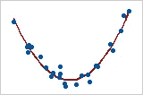
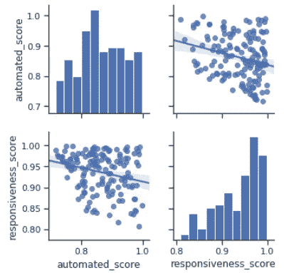
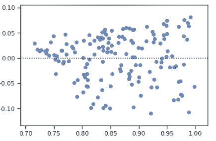

# 如何选择合适的相关方法？

> 原文：<https://medium.com/analytics-vidhya/how-to-select-the-appropriate-correlation-method-560e750dacd8?source=collection_archive---------5----------------------->

# 皮尔逊相关系数及其替代方法。

各种来源的回归笑话

当我在阅读一篇关于评估自动文本摘要模型与人工评估相比的性能的过程的科学论文时，基于相关性分析，我不断地问自己，哪种方法比其他方法更合适，例如，我应该何时使用 Pearson 而不是 Spearman，Kendall 而不是 Pearson 或 Kendall 而不是 Spearman？在对这个问题做了大量研究后，没有直接的答案，这取决于数据。

我会试着模拟他们的实验，虽然简化了还有很多东西要理解和学习。我想测试自动评估分级系统和人工评估分级系统之间的关联强度。换句话说，自动文本评估足够好，所以它接近人工评估。如何设置实验来验证两个模拟变量中的统计关联？

我有什么选择？我想到的第一个也是最熟悉的方法是使用皮尔逊积差相关系数(PPMCC)或皮尔逊相关系数，或简称为皮尔逊相关系数。它属于参数相关方法，并假设样本是从它所代表的总体中随机选取的，并且总体中数据的分布具有已知的基础分布。它是两个变量 X 和 y 之间线性相关性的度量。值介于-1 和 1 之间，而值 0 仅仅意味着两个变量之间没有任何线性关系。但是我们不能假设他们是独立的！另一方面，如果变量 X 和 Y 是独立的，那么相关系数将是 0。

我的下一个选择是尝试一些等级相关方法。当数据不满足某些假设时，通常使用它们:大样本量、正态性、线性和同方差。因此，当需要在参数和非参数相关方法之间进行选择时，尝试根据这些数据属性进行回答:正态性、线性和同方差性。

因为没有假设值的分布，所以等级相关方法被称为无分布相关或非参数相关。我首先介绍的是使用最广泛的 Spearman 秩相关系数或 Spearman 的ρ (rho ),它评估两个连续或有序变量之间单调关系的强度和方向。在单调关系中，变量往往一起变化，但不一定以恒定的速率变化。斯皮尔曼相关系数是基于每个变量的排名值，而不是原始数据。值也位于-1 和 1 之间，值 0 对应于不存在的或随机的关系。

1938 年，英国统计学家莫里斯·肯德尔通过使用等级之间的优先关系而不是等级本身，引入了一种不同的等级表示法。它通常被称为肯德尔τ(τ)系数。在等级相关法中，它与斯皮尔曼的属于同一类。肯德尔的τ通常比斯皮尔曼的ρ更可取，因为它是相应总体参数的更好估计，并且其标准误差是已知的。

用散点图检查变量之间的关系总是一个好主意。考虑下面的例子，其中 Pearson 和 Spearman 系数都为零，尽管这些变量之间存在很强的关系，但它违反了线性或单调关系的假设。

皮尔逊和斯皮尔曼系数都为零

# 我倾向于肯德尔的τ

肯德尔τ值:通常比斯皮尔曼ρ相关值小。基于和谐对和不和谐对的计算。对错误不敏感。样本量越小，p 值越准确。

Spearman 的ρ:通常比 Kendall 的τ值大。基于偏差的计算。对数据中的错误和差异更加敏感。

两者的计算复杂度都是 O(nlogn)。

# 我们如何表达这个测试的零假设？

在假设检验中，相关性分析可用于检验关联的强度。无效假设是所研究的变量之间没有关联。因此，目的是调查潜在变量的可能联系。

让我们形成零假设

H0:自动文本摘要评分和人工评估评分之间没有相关性。

另一个假设是

H1:自动文本摘要分级和人工评估分级是相关的。

# 模拟数据集

实验数据集由 8 个模拟的人类评估者组成，他们提供他们的评分，该评分被平均到 150 个摘要的*响应性得分*和自动文本评估系统(1 级)作为*自动得分*。

每个评估者的分数是从均匀分布中采样的，并且*自动得分*也是从均匀分布中以相等或更严格的间隔采样的。因此，通过添加一些额外的权重因子，automated_score 的间隔取决于评估者*responsibility _ score(*平均分数)，从而允许在距离 responsibility _ score 预定义的距离处进行采样。

反应性和自动评分分布的配对图

# 假设解析

在大多数情况下，这些相关方法的结果非常接近，并且总是会得出相同的结论，但是当出现差异时，解释较低值可能更安全。让我们来看一个快照——这很有趣，是上面例子中的相关性度量

我们能确定这两个分数之间是否存在相关性吗？嗯，也许吧，但是很难说。通过相关性本身，你可以确定两个变量一起变化的程度。现在让我们看看回归。相关性是我们回归所需要的一部分。但是我们还需要知道每个变量通过标准差分别变化了多少，以及我们应该在哪里画线，即截距。

线性回归方程

现在让我们试着拟合一条线性回归线。为了定量评估线性回归线有多好，我们可以计算 R 平方或 R 值。

线性回归的 Python 代码

R 的值是 0.0655，斜率 b 是-0.1649，截距 a 是 1.0788，所以现在我们已经完全定义了一条线。R 的值是一个好的值吗…或者仅仅比猜测好？嗯，也许吧。简单说明一下，当线性回归线中没有约束时(例如，不强制截距具有特定值)，R 是皮尔逊相关系数的平方，适用于这种情况。

下图是上一次回归的残差图。残差图通常用于发现回归问题。这个数据集适合回归吗？*记住，我们已经提到了皮尔逊相关系数(属于参数相关方法)的先决条件，即正态性、线性和同方差性。*有问题数据集的一些属性包括:

*   [异方差](https://www.statisticshowto.datasciencecentral.com/heteroscedasticity-simple-definition-examples/)数据(离线距离变化很大的点)。
*   非线性相关的数据。
*   带有[异常值](https://www.statisticshowto.datasciencecentral.com/find-outliers/)的数据集。

残差图

似乎在相应的剩余图中存在违反同方差的情况。因此，我倾向于使用肯德尔的τ作为该数据中更可靠的相关方法。

# 我能更正式地解释异方差的存在吗？

异方差性可以通过使用残差与拟合值图、查看散点图(如果存在圆锥形，则存在异方差性)或使用 Bruesch-Pagan、Cook-Weisberg 检验或 White general 检验等统计检验进行检验。

同方差假设是线性回归的一个重要假设。如果违反了这个假设，那么标准误差将会有偏差。标准误差用于进行显著性检验，并计算置信区间。

我的视觉假设是正确的吗，即存在异方差？

在这个例子中，我将使用 Bruesch-Pagan 统计测试

布鲁士-帕甘统计测试的 Python 代码

无效假设是

H0:不存在异方差

另一个假设是

H1:异方差存在

运行测试并获得测试结果，我验证了异方差存在于 99%的置信区间——测试是显著的，因此我们拒绝零假设。这个测试的 p 值是 0.0003463。

所以*肯德尔的τ*是最适合这个数据的相关方法。