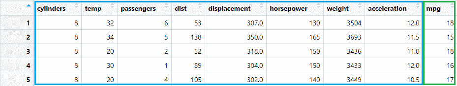
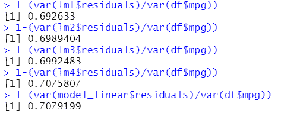
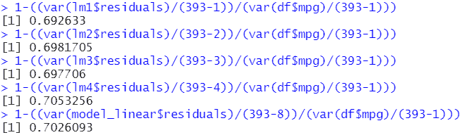
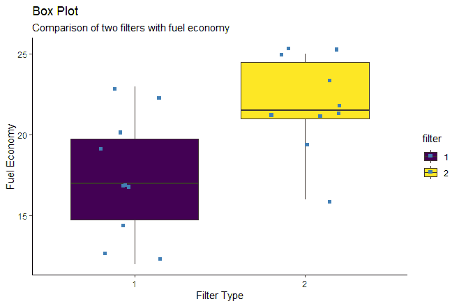
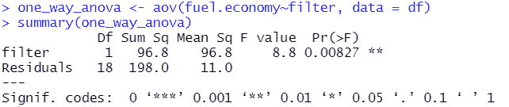
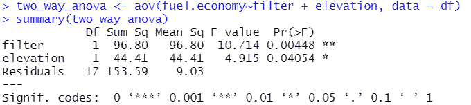
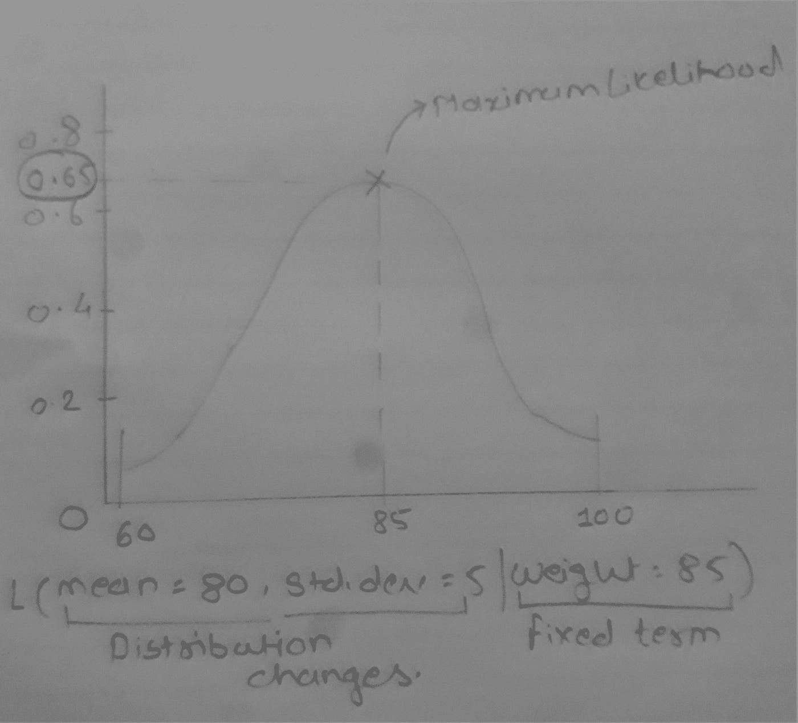

# 如何为给定的数据集选择最佳的统计模型？

> 原文：<https://medium.com/analytics-vidhya/how-to-select-the-best-possible-statistical-model-for-given-dataset-3202d3709689?source=collection_archive---------6----------------------->

这篇文章会有点长，但我会尽量让它简单有趣。所以这篇文章的主题是为数据集分析选择最佳的统计模型，但是首先什么是统计模型？

*“统计模型是体现一组关于样本数据生成的统计假设的数学模型。统计模型通常以相当理想化的形式代表数据生成过程*

这些科学定义总是如此复杂😪。简而言之，统计模型是一个显示因变量和自变量之间关系的等式。根据问题的复杂程度，这个等式有时会变得复杂。

我想当我们出去吃饭时，几乎所有人都面临这种情况，不知道从这么多美味的菜肴中选择什么😋

# 本文的主题–

*多元线性回归*

*ANOVA(单因素和双因素)*

*广义线性模型*

*型号选择参数(AIC 和 BIC)*

# 数据探索–

在探索你的数据集时，首先你必须确定因变量和自变量的数据类型。无论是连续变量还是分类变量。之后，检查他们遵循什么类型的分布，他们是否正态分布。是因为有些模型假设你的数据是正态分布的。但是如果你的数据不是正态分布，或者不符合*【高斯分布】*，那么分析的结果就会和你预期的不一样。

绘图在分析中起着超级重要的作用。散点图让我们清楚地了解变量之间的关系，以及进行线性回归还是选择适合数据的不同模型是个好主意。

# 让我们来看看线性统计模型——

# 多元线性回归–

我在上一篇文章中讨论了简单的线性回归。错过的话可以在这里[这里](https://www.linkedin.com/pulse/how-statistics-plays-important-role-machine-learning-girish-bhide/?trackingId=9phwOvj%2FKY7n6Hn97wAdfg%3D%3D)或者[这里](/@gbhide1993/how-statistics-plays-an-important-role-in-machine-learning-a10682e121fd)找到。

与简单的线性回归不同，多元回归有多个独立变量。简单线性回归中的所有假设对于多元线性回归都是一样的。当我们的数据有连续变量时，多元线性回归是首选。*(如果您有一些带因子的变量，那么使用“一键编码”来转换它们！)*

随着自变量数量的增加，方程也在增加。所以选择能更准确预测因变量的变量是很重要的。但是我们如何知道哪些变量比其他变量预测得更好呢？这就是术语*“调整后的 R 的平方”*发挥作用的时候了。在简单线性回归中，调整后的 R 平方并不发挥重要作用，因为我们在该模型中只有一个独立变量。

如上图所示，我们有 8 个标为蓝色的自变量，目标变量标为绿色。因此，多元线性回归的方程看起来像这样…

> Y = β0 + β1X1 + β2X2 + … +βnXn + ε

在简单线性回归中，R 平方值是检验我们的模型是否解释了所有方差的参数，因为我们只有一个自变量。但对于多个变量来说，情况并非如此。R 的平方值随着每个新变量的增加而增加。哇！太棒了，不是吗？不幸的是，答案是否定的。如果你看看 R 平方的等式，它是

> R = 1 — (SSreg/SStotal)

同样，复杂的符号😵….让我告诉你这个的简单含义

> *R = 1 — (Var(模型残差)/Var(目标))*

现在，随着我们不断增加变量，残差的方差下降，R 的平方值增加。上图显示了 R 的平方是如何增加的。在每个线性模型(lm)中，我都加入了新的变量。有些很重要，有些不重要。如果你看一下我们的数据集，就会发现有些变量与我们的目标变量没有任何关系，或者可以忽略不计。但是，当我们把它们加到我们的模型中，我们的 R 平方增加了。最终，这导致了模型的*【过拟合】*。

*(psst…不要忘记缩放您的数据*🤓 *)*

为了克服这个问题，我们使用*“调整的 R 平方”*。在修正的 R 平方中，考虑了总观测值的数量以及独立变量的数量。因此，使用这个指标，我们可以清楚地检查哪些参数值得保留在模型中。你可以在下面的代码中看到，调整后的 R 的平方增加到一定的数量。但是，当我们加入对预测依赖关系没有帮助的变量时，它就开始下降了。

还有一种方法叫做“*贝叶斯推理*”。但这是另一个层次的统计建模。贝叶斯方法是基于概率计算的。到目前为止，我们假设 *β* 和σ square 是未知的固定常数，但是贝叶斯方法还允许概率分布来表示假设的不确定性。因此 *β* 和σ square 可以被视为随机变量，因为我们不确定它们的值。

*这就像《复仇者联盟》和《x 战警》都属于漫威电影宇宙，但他们的道路却不同*。😛

改天我会写另一篇关于贝叶斯统计的文章…

从菜单卡移到下一个项目…

# ANOVA(方差分析)

每当我们想要比较两个或更多组的表现时，我们都要借助方差分析。但是我们到底应该使用哪种方差分析呢？单向模型，双向模型，有平衡的单向模型，有平衡的双向模型，不平衡数据的单元均值模型，有空单元的双向模型？*(这个列表就像布巴把他的虾食谱告诉阿甘一样*😁 *)*

在一篇文章中不可能涵盖方差分析中的所有方法，我将尝试给出它们的基本概念。所以，让我们从单向方差分析开始…

## ***单向方差分析—***

假设一家公司为他们的汽车发明了两种新的空气过滤器。现在，该公司有兴趣看看新安装的空气过滤器如何影响燃油经济性。首先，装有旧空气过滤器的汽车每升燃油经济性为 100 公里.然后，如果安装了空气过滤器 1，燃料经济性预计每升增加τ1 km，如果安装了空气过滤器 2，燃料经济性每升增加τ2 km。那么该模型可以表示为

> *Y1 = + τ1 + ε1，y2= + τ2 + ε2*

其中 Y1 是带空气滤清器 1 的燃油经济性， *ε1* 是随机误差项。当安装空气过滤器 2 时，同样适用于 Y2 和 *ε2* 。公司现在可以找出参数、 *τ1* 、 *τ2* ，并测试两个空气过滤器差异的假设。

在 R 中，您可以使用函数*“aov()”*执行单向 ANOVA，或者您可以参考下图中的我的代码。此外，您可以创建一个箱线图来查看观察结果的变化，如下图所示。

## *双因素方差分析—*

在研究了空气过滤器的观察结果后，该公司还想看看汽车在高海拔地区行驶时它们的表现如何。现在，我们有两个独立变量，一个是空气过滤器，另一个是海拔。因为我们有两个独立变量，我们想看到它们的组合效果，我们可以进行双向方差分析。一切都和单向一样，只是在等式中增加了几个参数。简单来说，这个等式可以写成–

> Y = + α + *β* + γ + *ε*

其中是 grand mean，α是滤波器的影响， *β* 是仰角的影响，γ是两个参数的相互作用， *ε* 是误差变量。还有索引参数，如 I、j、k，它们分别是第一因子的级别、第二因子的级别和组内复制。*(我没有把他们加到等式里。我会在一篇专门讨论 ANOVA 的文章里详细讲一下。)*

在 R 中运行模型后，我们可以看到类似这样的输出

让我们看看线性统计模型的最后一项…

# 广义线性模型–

广义线性模型包括经典的线性回归和方差分析模型以及逻辑回归和一些非参数模型。glm 的假设与我们之前看到的假设不同。其中一些假设是

病例独立分布。

因变量 Y 不需要正态分布。

它不假设因变量和自变量具有线性关系。

独立变量可以是原始独立变量的非线性变换。

不需要满足方差齐性。

并且误差需要是独立的但不是正态分布的。

这些假设在为问题生成模型时提供了更大的灵活性。

广义线性模型(GLMs)是回归模型，因此由一个*随机分量*和一个*系统分量*组成。随机和系统成分对 GLMs *采取特定的形式(是的，GLMs 是统计学的变形者*👻 *)* ，这取决于以下问题的答案——

*什么概率分布合适？*答案决定了模型的随机成分。概率分布的选择可能是由因变量决定的。

*自变量和因变量的均值有什么关系？*答案暗示了模型的系统成分。

该等式可以写成–

> η = β0 + β1X1 + β2X2 + … + βnXn

和功能是

> E(Y) = μ，g(μ) = η
> 
> Var(Y) = φ * Var(μ)

函数将分类响应变量水平的概率转换为无限的连续范围。

这些方程可能随分布类型的不同而不同。

到目前为止，您已经对主要的线性统计模型有了一个大致的了解。现在，我们将了解如何比较和选择数据集的最佳模型。有时，您会为同一个数据集构建多个模型。但是哪个型号的性能比其他型号好呢？最后讨论的话题会让你对此有一个清晰的认识。

# 型号选择参数(AIC 和 BIC)–

## *AIC(赤池的信息准则)–*

为什么称之为信息标准？答案很简单，因为它评估的是一个模型的*【信息损失】*。太好了！但是，什么是信息丢失？信息损失是对预测好坏的估计。如果一个模型预测了因变量的完美值，那么我们可以说没有信息损失。所以让我们看看它的方程式，更好地了解它…

> AIC = -2(对数似然)+ 2K

从等式开始，我们来看看*“可能性”*是什么。

例如，在上图中，我们记录了 *n* 人的体重数据。我们想知道当体重为 85 公斤时分布的可能性。简而言之，可能性是 Y 轴上固定数据点的值，其分布可以移动。为了便于计算并避免指数计算，我们取它的对数。

等式的另一部分是*“2k”，*，其中 k 是包括截距在内的模型参数的数量。(*)如果样本量小于大约。40.*)

为了在实践中应用 AIC，我们从一组候选模型开始，然后找到模型对应的 AIC 值。由于使用候选模型来表示*“真实模型”*或生成数据的过程，几乎总是会有信息丢失。

假设我们为同一个数据集拟合了 4 个模型。每个型号的 AIC 值为 AIC1、AIC2、AIC3 和 AIC4。具有最低 AIC 值的模型被认为是最佳模型，并且保持该模型作为标准，可以评估其他模型性能。

## *BIC(贝叶斯信息准则)–*

这种方法与 AIC 非常相似。该方法也考虑了与 AIC 相同的可能性。BIC 的不同之处在于，它还考虑了数据集中数据点的数量。让我们来看看这个等式

> K*log (n) — 2(对数似然)

来自 AIC 的所有术语都是相同的，添加了新的参数 *n* ，它是数据集中存在的数据点的数量。车型选择也和 AIC 一样，BIC 最低的车型被认为是最好的。以 BICmin 为基准比较两种模型的性能，我们得到δBIC。观察δBIC 的值，当值在 2 和 6 之间时，可以说反对另一个模型的证据是积极的；也就是说，我们有充分的理由支持我们的*“最佳模式”*。如果它在 6 到 10 之间，那么支持最佳模型和反对较弱模型的证据是强有力的。大于 10 的δBIC 意味着支持我们的最佳模型和备选模型的证据非常强。

所以这就是这篇文章。*(终于完成了！*🙌 *)* 希望这篇文章能让你更好的理解其中讨论的概念。

如果你坚持到了最后，那你就太棒了！🥳

干杯！！！

# 参考文献-

*Morris h . DeGroot 和 Mark J. Schervish 的概率和统计。*

*阿尔文·c·伦彻和 g·布鲁斯·沙尔吉的统计学中的线性模型。*

*Peter k . Dunn 和 Gordon K. Smyth 的广义线性模型。*