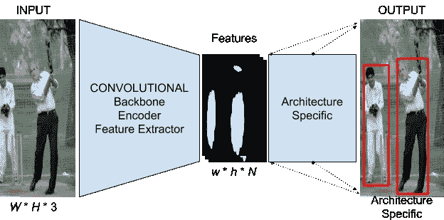
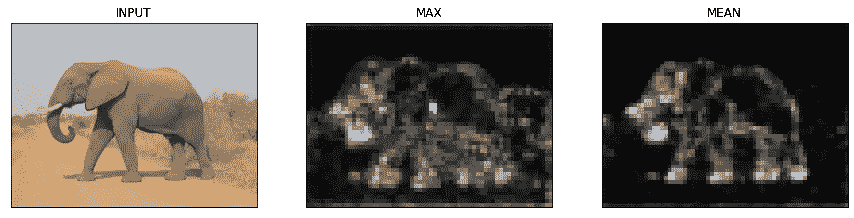
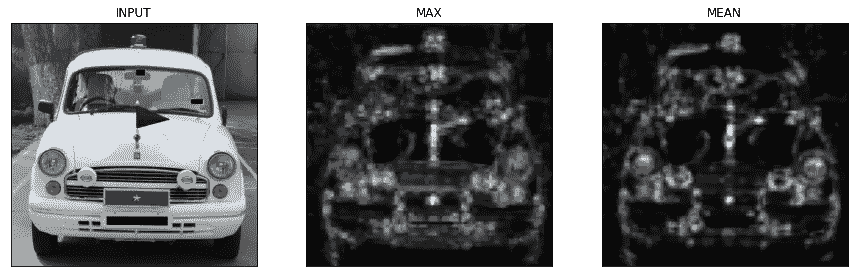
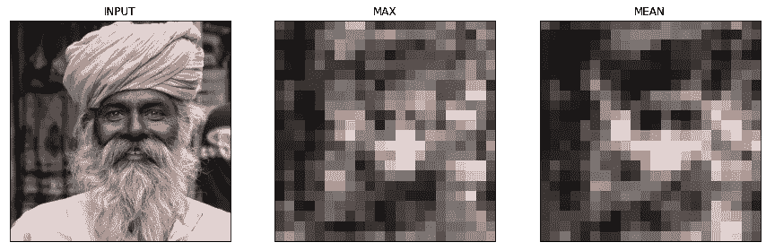
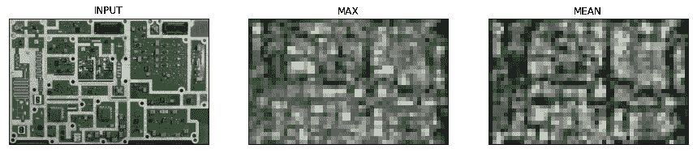

# 如何选择完美的 CNN 脊梁进行物体检测？—一个简单的测试

> 原文：<https://medium.com/analytics-vidhya/how-to-select-the-perfect-cnn-back-bone-for-object-detection-a-simple-test-b3f9e9519174?source=collection_archive---------5----------------------->

嗨！因此，您有兴趣使用卷积神经网络(CNN)来解决计算机视觉(CV)问题。如果您正在使用分类、检测或细分模型，请继续。理想情况下，我在这里描述的技巧(用代码)应该适用于任何使用卷积特征提取器(CONV-FE)的深度学习(DL)模型。(“特征提取器”有时也被称为“骨架”或“编码器”)

随着 CNN 日益深入和广泛，可视化通常是开发人员解释其模型的唯一方式。无论您是试图找出您的模型不工作的原因，还是试图验证您的模型的性能，或者试图为您的管道选择最佳的 conv-费，可视化通常是教科书解决方案的最接近的替代品。

今天，我们将看到一个巧妙的技巧来可视化任何 CV 任务的 CONV-FE。我们将使用 Keras 和 TensorFlow 后端来演示这个技巧。这个技巧可以用来“调试”没有正确训练的模型，或者“检查”/“解释”一个训练过的模型。

对于新读者来说，值得一提的是建筑和 conv-费之间的区别。SSD、YOLO 和 F-RCNN 是当今一些流行的对象检测架构。如你所知，架构是具有某种形式的*灵活性*的*模板*，用户可以选择*为他的用例调整*架构。对于新读者来说，值得一提的是架构和主干的区别。CONV-FE 是一种大多数架构都将其视为插件的东西。一些受欢迎的 conv-Fe 是 VGG-16、ResNet50 和 MobileNetV2。经常可以看到，CONV-FEs 的选择将极大地影响用特定架构构建的模型的性能(速度和准确性)。出于这个原因，从业者提到他们在模型名称中使用的 CONV-FE。F-RCNN(ResNet50)是使用 ResNet50 CONV-FE 构建的具有 F-RCNN 论文中描述的体系结构的模型。换句话说:F-RCNN(MobileNetV2)和 F-RCNN(VGG-16)遵循相同的网络架构，但是使用不同的 conv-Fe。因此，我们可以预期每个系统会有不同的性能。conv-菲斯也有他们的建筑，这就是为什么我们有 VGG-16 和 VGG-19，但这是另一天的故事！

***图 1:*** 模板为通用的物体检测算法。这适用于 YOLO、F-RCNN、SSD 等。

图 1 显示了 DL 供电对象检测系统的高级架构。众所周知的架构，如 YOLO，F-RCNN 和 SSD 可以用这个模板来概括。[ *W，H，* 3]表示图像的输入宽度和高度，也表示输入图像具有 3 个通道(*又名* RGB 输入)。【 *w，h，N* 表示 CONV 铁的输出尺寸。请注意，由于 *N* 是特征提取器的最后一个 CONV 层中的滤波器数量，因此它通常是一个很大的数字(对于 VGG-16， *N =* 512)。 *w* 和 *h* 几乎总是分别小于 *W，H* ，因为在当今的大多数架构中，CONV 块之后通常是池层。

如上所述，CONV-FE 的选择对于我们的 CV 系统实现最佳性能至关重要。然而，问题在于 *N 的高值。不可能将所有维度都任意大的三维张量可视化！这就是我们今天要解决的问题。让我们开始吧，别再废话了。为了简单起见，我们将使用 Google Colaboratoy。*

让我们选择一个 CONV 吧。VGG 16 号怎么样？让我们试着加载它。

**代码片段 1:** 加载 CONV-FE 的脚本

一旦模型被加载，我们需要做一些模板脚本来加载我们想要试验的图像。我在这里不描述这些步骤，因为它们会因您的特定用例而有很大的不同。(但是，如果您坚持的话，它们是在带有注释的代码中实现的)。现在，我们假设所有需要的图像都存储在一个名为“images”的目录中，该目录直接位于我们的工作目录中。现在让我们使用这个技巧吧！

片段 2: 加载图像、对它们进行推理并可视化 conv-费的代码

您将看到类似下面的输出(这些输出也将保存在直接在工作目录中创建的“结果”目录中)

**图 2.1:** 结果 1 _ 大象

**图 2.2:** 结果 2 _ 汽车

**图 2.3:** 结果 3_Man

**图 2.4** 结果 4_PCB

第二列显示了任何通道在由 CONV-FE 产生的输出特征图中可以达到的像素最大值。第三列显示所有频道的平均值。如果结果中的第二列和第三列显示出清晰的特征分离，我们说 CONV-FE 适合于我们的数据集。

正如我们所见，1 和 2 中的结果非常好，但 3 和 4 中的结果表明，如果您有全屏 PCB 图像或穿着传统服装的印度男子的图像，则当前模型并不真正合适。但是，如果数据集包含野生动物或汽车/车辆的图片，此模型似乎是一个不错的选择。

现在，让我们尝试为代码片段 2 中的第 25 行和第 26 行添加一个小的调整。根据图 1，输出特征图可以有任意数量(N)的输出通道。这是我们不能想象和比较 conv-菲斯的主要原因。我们使用常见的聚合技术，即。求和并平均，以获得特征图质量的总体近似值。我没有使用通道的像素中值进行聚合。你能在评论中解释为什么吗？如果我添加第四个中间列，您能告诉我输出会是什么样子吗？(**提示:**您可以使用 np.median()沿着任意 numpy 数组的任意轴查找中值)

Github 链接完整代码:[https://github . com/IshanBhattOfficial/vizulize-conv-FeatureExtractors](https://github.com/IshanBhattOfficial/Vizualize-CONV-FeatureExtractors)

希望这是有帮助的！