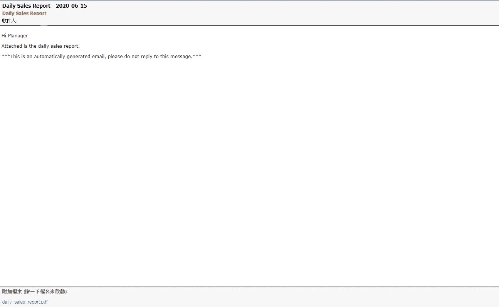

# 如何通过 python 发送电子邮件

> 原文：<https://medium.com/analytics-vidhya/how-to-send-email-via-python-95302a7f06de?source=collection_archive---------6----------------------->

## 每天自动发送销售报告


照片由 [Muukii](https://unsplash.com/@muukii?utm_source=medium&utm_medium=referral) 在 [Unsplash](https://unsplash.com?utm_source=medium&utm_medium=referral) 上拍摄

# 介绍

最近，我的公司让我为我们的销售部门研究报告解决方案。我需要每天向销售经理发送销售报告。销售报告将在一天结束后准备，报告需要在上午 08:00 发送。因此，我尝试使用用 Python 编写的自定义场景脚本来自动化流程。

# 如何通过 python 发送电子邮件

Python 在标准库中包含了几个模块，用于处理电子邮件和电子邮件服务器。基本上我们会使用内置的 **smtplib** 模块，它可以使用简单邮件传输协议(SMTP)发送电子邮件。 **smtplib** 使用 RFC 821 协议进行 SMTP。本教程中的示例将使用自己的 SMTP 服务器来发送带有附件和 HTML 内容的电子邮件，但同样的原则也适用于其他电子邮件服务。

要发送电子邮件，您需要使用 SMTP(简单邮件传输协议)。如前所述，Python 提供了处理这个任务的库，你不需要额外的安装或技巧。您可以使用以下语句导入该模块:

第 4–5 行:导入 smtplib 相关模块。默认情况下，它应该包含在 Python 中。

第 6–8 行:我们将处理 MIME 消息类型，它能够结合 HTML 和纯文本。在 Python 中，由 *email.mime* 模块处理。

第 11 行:附件仍然是 MIME 对象，但是我们需要用 base64 模块对它们进行编码。

第 13 行:导入 datetime 模块。

**让我们创建 sendemail 函数:**

第 2–6 行:创建`MIMEMultipart`消息对象，并用适当的标题为`From`、`To`和`Subject`字段加载它。

第 9 行:添加你的消息体。

第 11–24 行:添加附件。

第 29–34 行:登录邮件服务器并发送邮件。

我建议在脚本的顶部定义电子邮件地址和消息内容，这样你就可以很容易地更改它:

第 2 行:定义发送日期。

第 4–8 行:定义发件人姓名、发件人电子邮件、发件人密码、收件人和主题。

第 10 行:创建一个 HTML 消息。

第 14 行:调用 sendemail 函数。

干杯！！！我现在收到了带销售报告的电子邮件！



现在我们需要配置自动报告发送。

创建一个 run.sh

```
#!/bin/bash
source /home/user/.bashrc
python /home/user/sales_report_email.py
```

在 linux 上设置 cron 作业。

```
user@reportsrv$ crontab -e00 8 * * * /usr/bin/bash /home/user/run.sh > /home/user/logs/run_report_`date +\%Y\%m\%d`.log
```

这些只是使用 Python 发送电子邮件的基本选项。您还可以使用 for…loop 发送多个收件人。为了获得更好的结果，请查看 Python 文档！

感谢阅读！如果你喜欢这篇文章，请通过鼓掌来感谢你的支持(👏🏼)按钮，或者通过共享这篇文章让其他人可以找到它。

最后，我希望你能学会如何使用 python 来发送电子邮件。您还可以在 [GitHub](https://github.com/kindersham/100DaysDS/tree/master/SendEmail) 资源库中找到完整的项目。