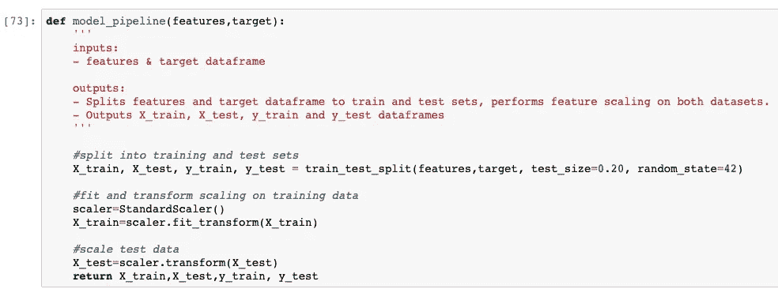

# 如何以更聪明的方式发出星巴克的提议

> 原文：<https://medium.com/analytics-vidhya/how-to-send-out-starbucks-offer-in-a-smart-way-9321cbf3ee4d?source=collection_archive---------15----------------------->

汉斯·维维克在 [Unsplash](https://unsplash.com?utm_source=medium&utm_medium=referral) 上拍摄的照片

# 介绍

每隔几天，星巴克就会向手机应用程序的用户发出一次报价。要约可以仅仅是饮料的广告或实际的要约，例如折扣或 BOGO(买一送一)，或者仅仅是包括产品信息的信息性要约。某些用户可能在特定的几周内收不到任何优惠。通过这种方式，星巴克很可能可以增加顾客在收到报价后打开报价并最终完成交易的可能性。这也有助于通过不断提醒客户最新的产品信息来提高他们的忠诚度。但这里的重点是如何以更聪明的方式发出报价，也就是说，如何最大限度地提高客户打开报价并完成交易的可能性。因此，我们将尝试分析星巴克的历史数据集，看看我们是否能从中获得一些启示。

# 商业背景

*   用于创建数据的程序模拟了人们如何做出购买决策，以及这些决策如何受到促销活动的影响。
*   模拟中的每个人都有一些影响他们购买模式的隐藏特征，并与他们的可观察特征相关联。人们产生各种事件，包括接收报价、打开报价和进行购买。
*   作为一种简化，没有明确的产品要跟踪。只记录每笔交易或报价的金额。
*   有三种类型的优惠可以发送:买一送一(BOGO)，折扣和信息。在 BOGO 优惠中，用户需要花费一定的金额来获得与该阈值金额相等的奖励。在折扣中，用户获得的奖励相当于消费金额的一小部分。在信息提供中，没有奖励，但也没有要求用户花费的金额。优惠可以通过多种渠道提供。

# 项目目标

基于以上背景，本项目将尝试提出以下问题

*   哪些因素主要影响客户对优惠的使用？公司到底该不该发出要约？
*   客户打开并使用发送给他们的产品的可能性有多大？接受报价的客户有什么共同特征吗？

# 数据字典

数据包含在三个文件中:

*   portfolio . JSON——包含要约 id 和关于每个要约的元数据(期限、类型等)。)
*   profile.json —每个客户的人口统计数据
*   transcript.json 记录交易、收到的报价、查看的报价和完成的报价

以下是文件中每个变量的模式和解释:

**portfolio.json**

*   id(字符串)—优惠 id
*   offer_type (string) —优惠的类型，如 BOGO、折扣、信息
*   难度(int) —完成报价所需的最低花费
*   奖励(int) —为完成一项提议而给予的奖励
*   duration(int)-报价开放的时间，以天为单位
*   频道(字符串列表)

**profile.json**

*   年龄(整数)—客户的年龄
*   成为会员日期(整数)—客户创建应用程序帐户的日期
*   性别(str) —客户的性别(请注意，有些条目包含“O”代表其他，而不是 M 或 F)
*   id (str) —客户 id
*   收入(浮动)—客户的收入

**抄本. json**

*   事件(str) —记录描述(即交易、收到的报价、查看的报价等。)
*   人员(字符串)—客户 id
*   时间(整数)—测试开始后的时间，以小时为单位。数据开始于时间 t=0
*   value —(字符串字典)—报价 id 或交易金额，具体取决于记录

# 数据探索

为了在接下来的部分中更好地分析这个问题，首先需要探索数据集，包括检查缺失值、可视化数据分布等。通过这种方式，我们可以更好地了解数据集的样子，以及如何选择支持模型实现的重要特征。

如上所示，投资组合数据集中没有缺失值。

通过查看数据集的前几行，可以明显看出编码为 118 的年龄列中缺少值，收入列中也缺少值。

显然，缺少年龄的行也缺少性别和收入，这意味着在接下来的步骤中删除这些行以支持模型实现可能没有问题。

快速查看数据集中的收入分布情况。

然后快速浏览抄本数据集。

由于值列包含多种信息，为了更清楚、更容易地进行分析，应该提取这些信息，所以首先对数据集进行一些基本的操作。

# 数据预处理

为了通过发送要约来找出主要影响交易完成的因素，在数据处理过程中，还需要对数据进行处理以合并发送的每个特定要约的事件，从而找出哪个要约被接收、查看并最终与交易完成。

由于 offer_id 不与任何“交易”事件相关联，为了标记要约是否已经最终完成交易，这里我们需要将要约 id 链接回所有交易事件。对于 BOGO 和折扣优惠，两者都将具有收到、查看、交易和完成优惠的结果，这将明显显示该优惠已兑现，并且肯定应该发出。对于信息要约，虽然没有奖励步骤，但仍然应该有一个与要约的使用相关联的交易。

接下来，在我们收集了数据之后，我们需要提取在报价被接收和查看之后完成的交易。由于我们已经填写了所有交易的报价 id，我们可以通过检查交易前的报价 id 是否与交易的报价 id 相同来提取从报价转换的交易。

因为不同的提议有不同的完成结果，例如，对于信息性的提议，不会有奖励。因此，为了便于分析，请按待遇类型分离成绩单数据。

在每个优惠类型中，使用在前面步骤中标记的 responded_offer，我们可以筛选出用户成功查看并完成的优惠。对于 BOGO 和折扣报价，响应报价应该是具有“报价完成”事件的报价，对于信息性报价，只有“交易”可以被视为成功的报价。

接下来，将区分只查看报价但最终没有交易和完成的客户，以及只收到报价但没有查看的客户。

然后，基于上面的合并数据集，我们可以区分出在收到报价后只查看报价的客户和在收到报价后甚至没有打开报价的客户。

对于这些步骤，将对 BOGO 和折扣报价进行相同的操作。经过上述处理后，无论是否收到或查看报价，都要过滤掉交易。

在分离出客户的不同情况后，下面的步骤将首先关注在收到报价后完成交易的客户和只查看报价而没有任何交易的客户。

至于信息要约，只有在要约的有效期限内交易完成时，该要约才能被视为回应要约。

# 特征工程

完成基本处理后，下一步将查看是否有可用于创建新要素的列。

*   为客户的会员资格期限生成一个新列

*   为每个用户生成收到的要约计数

*   减去与报价无关的交易

*   计算报价之间的时间间隔

*   将上面创建的临时数据合并在一起，然后删除性别列中缺少的值，并将频道列拆分为分类变量

# 建筑模型

在预处理数据后，下一步我们将开始实施模型，以找出哪些因素对客户是否会对报价做出反应影响最大。这个项目还试图预测顾客是否会对不同类型的优惠做出反应。

因此，我们将使用数据集中的“offer_responded”标志来构建模型，以预测客户是否会对要约做出回应。在这里，我们将选择基本树模型作为基线，这将有助于更好地解释功能的重要性，以便我们可以了解哪些因素对客户行为的影响最大。

# 模型实施准备

*   准备日期集，设置特征变量和目标列

*   将数据分成训练集和测试集

*   创建一个函数来执行不同报价类型的模型

# 在模型基线上签名

此时，我们将首先使用基线模型的默认参数，如果需要，将在后面的调整步骤中调整这些参数。

*   **BOGO 模式**

如上所示，两个模型的准确性对于初始模型实现来说都很好。但是 F1 分数略低于 80%,这可能会在后面的步骤中调整得更好。虽然决策树的 F1 表现比随机森林好一点，但给那些最终不会回应的人发出更多邀请也没什么大不了的。因此，这里现在仍然可以选择精度稍好的随机森林。

*   **折扣优惠模式**

如上所示，随机森林的性能比随机森林稍好。

*   **信息报价模型**

# 模型调整

本节将尝试调整初始模型的参数以获得更高的性能。在调优部分，我们将首先使用 GridSearch 来搜索可能获得更好模型性能的参数。

使用优化的参数在前面的步骤中重新运行模型。

将结果与之前的初始模型进行比较。

如以上比较所示，使用调整参数后，测试准确度从 0.833 略微提高到 0.838，F1 分数从 0.759 提高到 0.779。

对折扣优惠数据执行相同的步骤。

如以上比较所示，使用调整参数后，测试准确度从 0.872 略微提高到 0.873，F1 分数从 0.814 提高到 0.816。

对于信息性报价，执行相同的步骤。

如上面的比较所示，使用调整参数后，测试准确度从 0.748 略微提高到 0.753，F1 分数从 0.681 提高到 0.678。

# 查看功能重要性

接下来，我们将查看模型的结果，看看是否有任何关于决定客户是否会对我们通过调查功能重要性获得的报价做出反应的主要因素的见解。

根据我们拥有的模型显示特征的重要性。

如上所示，我们可以看到，对于所有三种类型的要约，在很大程度上影响要约最终是否会得到回应的最重要因素是会员资格的长短。也就是说，顾客成为星巴克会员的时间越长，就越有可能对他们收到的优惠做出反应。然后，影响顾客反应可能性的第二和第三个重要因素是年龄和收入，这很有意义。此外，他们收到的录用通知的数量也会对回应产生很大影响。

# 结论和后续步骤

## 结论

这个项目试图找出:

*   哪些因素主要影响客户对优惠的使用？公司到底该不该发出要约？
*   客户打开并使用发送给他们的产品的可能性有多大？接受报价的客户有什么共同特征吗？

从项目的结果来看，很可能使用机器学习模型来预测客户是否会对报价做出反应，该模型还显示了主要因素，如会员资格、年龄、收入等，这些因素高度影响客户对报价做出反应的可能性。

## 后续步骤

由于时间的原因，我没有机会在模型调整的步骤中尝试一些其他的增强。例如，我可能会对特征工程步骤进行更多的实验，以查看是否有任何其他新特征可以改进模型，我也可以尝试减少一些特征，以查看它将如何影响模型性能。

此外，到目前为止，分析更多地集中于在收到报价后成功完成交易的客户，对于客户在不考虑报价的情况下完成交易的其他情况，应该有更多的见解。如果我们能够深入了解这些情况，也许我们可以向这些客户发出更多的报价。

此外，我在想，我是否可以根据我们获得的信息对客户进行无监督学习，看看一组客户中是否有任何特定的特征，他们更有可能对报价做出反应。

要查看分析的更多细节，你可以在这里找到我的 Github 链接。