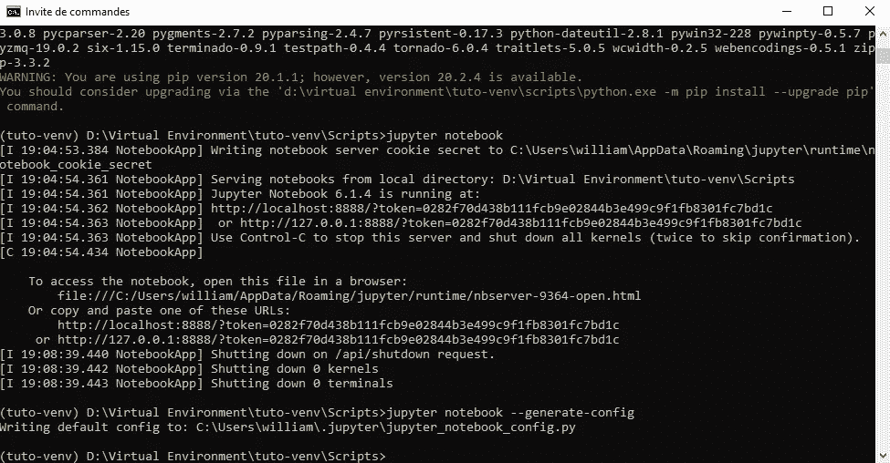
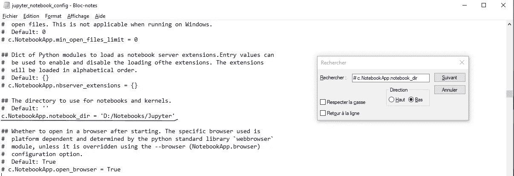
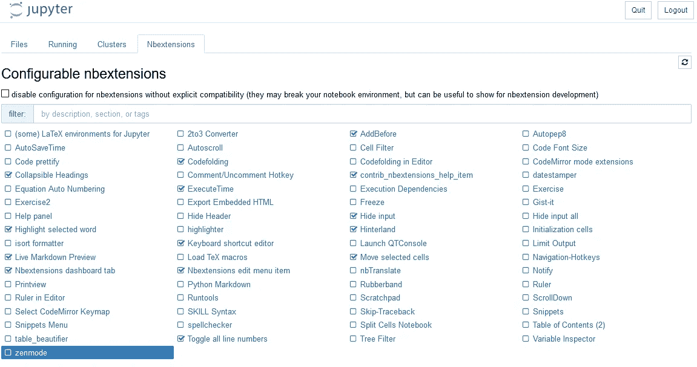

# 如何在 python 中建立虚拟环境

> 原文：<https://medium.com/analytics-vidhya/how-to-set-a-virtual-environment-in-python-c2a9995d1843?source=collection_archive---------5----------------------->

在本文中，我将解释如何用 python 建立一个虚拟环境。无论您是使用 Django 的 web 开发人员还是使用笔记本的数据科学家，它都非常有用。如果您是 python 的初学者，或者已经学完了 anaconda，那么您将会读到正确的文章！

我周围的大多数数据科学家都不重视为他们的数据科学活动建立虚拟环境。然而，知道如何正确地设置它可以将您从为您处理虚拟环境的解决方案(如 Anaconda)所强加的技术约束中解放出来。

Anaconda 可以让你马上开始:你安装它，启动它，然后点击 Jupyter 笔记本。然而，Anaconda 的默认行为是侵入性的。例如，在 Mac 上，如果您打开终端，Anaconda 的虚拟环境会被默认激活。而且，我不确定你可以根据自己的需要降级你的 python 的版本。最后，Anaconda 安装了许多应用程序，根据我作为数据科学家实践，这些应用程序甚至都没有使用过。我只要朱庇特笔记本，不要其他的。

不再进一步介绍这个话题，让我们开始设置您的第一个虚拟环境吧！

# **第一步:不要安装 python**

因为本文涉及一个全新的虚拟环境，所以我们从头开始。让我们首先确定你的设备上没有安装 python。

**在苹果电脑上:**

默认情况下，您已经安装了 Python 2，所以不用担心。然而，我们在 2020 年。所以为了你好，我们将安装 Python 3。

要检查您的设备上是否安装了 python，请进入您的终端。终端打开后，键入以下命令。

**在 Mac 上:**

```
python3 --version
```

**在 Windows 上:**

```
py --version
```


如果命令不被认可，你就可以走了！否则，您的设备上可能会残留一些 Anaconda。你应该试着清理一下再继续。

## 我仍然希望保留我的 Anaconda 环境，并拥有我自己的 python 环境

绝对有可能。让你的蟒蛇保持原样，继续下一步。

# **第二步:** **安装 python**

在这一步，在安装 python 之前，有几个信息需要记住。首先，你需要知道你需要哪个版本，对于 Windows 用户，你将安装 32 位还是 64 位 python。

## 我应该使用哪个版本的 python？

符合您需求的产品！Python 允许来自世界各地的人们开发并向每个人提供他们自己的模块。这些模块与 Python 的特定版本兼容。大多数情况下，它会显示在模块演示文稿中。


在这个例子中，我们可以看到这个模块适用于 python 3.5、3.6 和 3.7。当我试图将这个模块用于我的 Django 应用程序时，我安装了 python 3.8。你猜怎么着？它不起作用。对我来说，唯一的解决方案是倒退到 python 3.7。

大多数数据科学模块(pandas、numpy、matplotlib 等)在大多数 python 版本中都可用。但是如果你使用的是一个“罕见”的模块，并且它不工作，也许你没有使用正确的 python 版本。

## Windows : 32 位还是 64 位？

不同之处在于，32 位 python 不会为您的应用程序或笔记本使用超过 1 Gb 的 RAM。因此，假设您有一个数据帧，需要 2 Gb 的内存来打开，这对于 32 位 python 来说是行不通的。

64 位 python 没有内存限制。因此，如果您的计算机比较旧，内存只有 4 Gb 或更少，您应该选择 32 位 python。因为对你的设备要求太多可能会损坏它。

现在你已经有了安装 python 所需的所有信息，只需上 python.org 找到你要找的版本。

**在 Windows 上:**

轻松对待自己，选择可执行的安装程序版本。

安装 python 时，请遵循推荐的默认设置。如果在安装过程中提出，请禁用路径限制。

再次运行命令，检查是否安装了 python。


恭喜你，你已经成功安装了 python！现在我们可以更进一步，创建一个虚拟环境。

# **第三步:创建虚拟环境**

在运行创建虚拟环境的命令之前，我将解释为什么需要虚拟环境。

虚拟环境是一个框架，您可以在其中安全地工作，而不会影响您的计算机。我们可以现在就开始安装模块，但是模块将被安装在我们计算机中默认安装的 python 中。而且一切都很好，直到 bug 和冲突到来……你不想经历。

此外，您可以参加数据科学活动和 web 开发活动。在这种情况下，最好是一个环境用于数据科学，一个环境用于 web 开发。因为模块不一样。请自便，保持物品整洁有序。

例如，我在第二个硬盘的根目录下有两个主目录:一个用于我的虚拟环境，一个用于我的笔记本程序(Jupyter Notebook 不是唯一的一个)。


在我的笔记本目录中，我有另一个名为“Jupyter Notebook”的目录，所有与 Jupyter Notebook 相关的内容都在这里。

在我的虚拟环境目录中，我有用于数据科学活动的虚拟环境。目前，由于我从零开始，我没有。让我们创建一个。

**在 Mac 上:快速访问终端**

在 Mac 上默认使用终端可能很烦人。幸运的是，打开正确的设置，您可以在目录上“右键单击”——显示选项——并选择在该目录下打开终端。因此，你不必打开你的终端，也不必移动你的目录。要启用此选项，请进入您的 Mac 系统偏好设置，查找键盘选项，打开快捷方式轻按，然后在您的目录中找到允许您打开终端的服务。

抱歉，我不能说得更准确，我没有苹果电脑…

创建了虚拟环境的目录后，在该目录下打开一个终端。

在 Windows 上:您有两个存储磁盘吗？

如果您有两个磁盘，我建议您在存储容量最大的磁盘上创建虚拟环境。很多时候不是 C，要在 terminal 上从 C 转到 D，只需输入“D:”即可。一旦进入 D，输入以下命令:

cd 路径/到/虚拟环境

您可以进入虚拟环境目录，然后右键单击图片上突出显示的路径，而不是自己编写路径。然后，可以复制路径，在终端中用 ctrl + V 粘贴。


无论是 Mac 用户还是 Windows 用户，你来对地方了吗？很好！现在唯一要做的就是运行下面的命令:

```
py -m venv name-of-my-virtual-env
```

> Mac 用户还是先输入 python3，而不是 py


在终端允许您输入新命令之前，不要触摸任何东西。同时，您可以看到您的新虚拟环境已经在您的目录中。

## 对于不想接触蟒蛇环境的人来说

您唯一需要做的事情就是指定您将要使用的 python 版本，就像这样:

```
py -version -m venv name-of-my-virtual-env
```

假设你要安装 Python 3.7.9(在 Mac 和 Linux 上用 Python 代替 py):

```
py -3.7 venv name-of-my-virtual-env
```

现在您有了两个完全分离的虚拟环境:Anaconda 和 python。

# **第四步:激活你的虚拟环境**

从现在开始，我们所要做的就是用命令安装 Jupyter Notebook。但在此之前，我们必须激活我们的环境。

**在 Windows 上:**

要激活一个环境，我们必须在终端的脚本目录下输入命令 activate。

**在 Mac 上:**

要激活一个环境，我们必须进入终端的 bin 目录并输入命令。激活。


如果成功，您应该在终端路径前的括号中看到虚拟环境的名称，如下所示:


现在，如果你正在安装一个 python 模块，它不再安装在你的整个设备上。仅在您的虚拟环境中。要关闭虚拟环境，您必须键入命令 deactivate。


# **第五步:** **pip 安装 Jupyter 笔记本**

现在一切都设置好了，你要做的就是安装你的模块！先说 Jupyter 笔记本。

> 您应该首先确保您的虚拟环境被激活。

然后，您可以运行以下命令:

```
pip install notebook
```


## 我有个问题！pip 不是一个正确的命令

如果您曾经遇到过这种情况，有两种可能性:要么您应该使用 **pip3** 而不是 pip，要么您已经创建了您的虚拟环境，然后您意识到您将它设置在了组织的错误位置。所以你只是移动了它。

**你不能。**

您不能移动虚拟环境。否则，设备将无法再次找到它。你必须创建另一个虚拟环境。要删除旧的目录，只需删除虚拟环境的主目录(与您的虚拟环境同名的目录)。

就我而言，模块的安装很顺利！让我们来看看。

**在 windows 上:**

```
jupyter notebook
```

**在 Mac 上:**

```
jupyter-notebook
```


我们现在有这个屏幕显示从我们最喜爱的网络导航器，有很多文件在那里。还不是开始数据科学的地方…发生了什么？

默认情况下，Jupyter 笔记本是在脚本或 bin 目录下打开的。不要担心，我们即将定制我们的 Jupyter 笔记本，我们将首先从默认路径开始。

# **步骤 6:在 jupyter 笔记本打开处更改路径**

还记得我们之前创建的笔记本目录吗？如果我们能从那里打开我们的 Jupyter 笔记本，那就太方便了。为此，我们首先需要阻止朱庇特笔记本。只需点击右上角的退出并关闭导航选项卡。然后，在终端中键入以下命令(虚拟环境仍处于激活状态) :

```
jupyter notebook --generate-config
```



转到生成文件的路径，用您最喜欢的 IDE(记事本)打开它，找到写有以下内容的那一行:

```
# c.NotebookApp.notebook_dir = ''
```

> 为了更快地找到它，您可以复制粘贴上面的行，并在您的 IDE 中使用 ctrl + F。

在那里，删除#并在“”之间插入笔记本目录的路径。然后保存您的文件。

**在 Windows 上:**

注意/和\之间的区别！



你现在可以再次启动 jupyter 笔记本，看看你是否在正确的地方。


**万岁！**现在我们需要一些东西来完善我们的 Jupyter 笔记本环境。

# **第 7 步:添加扩展(已弃用)**

Jupyter 笔记本香草真的不人性化。让我们用扩展来改进它！

浏览[**https://jupyter-contrib-nb extensions . readthedocs . io/en/latest/install . html**](https://jupyter-contrib-nbextensions.readthedocs.io/en/latest/install.html)获取 jupyter 扩展的更好解释。

现在，您可以在仍然激活的虚拟环境中键入以下命令:

```
pip install jupyter_contrib_nbextensions
```

后面跟着这个命令:

```
jupyter contrib nbextension install --user
```

文件将被添加到您的。配置文件所在的 jupyter 目录。让我们看一看它们。


如果你看到这些文件，这意味着你设法安装 jupyter 扩展。我们现在不配置它，让我们留在. jupyter 中。

# **第八步:添加自定义 css 和 js**

从。jupyter 目录，我们将创建一个名为 custom 的新目录。在 custom 中，我们将创建两个文件:custom.css 和 custom.js。如下所示:


这些文件使你能够免费插入一些 css 和 js 来改善你在 Jupyter 笔记本上的用户体验！

> 在添加自定义 js 和 css 之前，先关闭你的 jupyter 笔记本。不过，您不必停用虚拟环境。

例如，我希望我的单元格占据屏幕的整个宽度，而不仅仅是中间部分。为此，请在 custom.css 中插入以下内容:

```
#notebook-container {
width:90% !important;
  margin-left: auto !important;
}
```

最后，我们将使用 ctrl+D 命令添加多行代码版本，并执行一个单元格，而不使用 ctrl + Enter 移动到另一个单元格。为此，在 custom.js 中插入以下内容:

```
require(["codemirror/keymap/sublime", "notebook/js/cell", "base/js/namespace"],
  function(sublime_keymap, cell, IPython) {
    cell.Cell.options_default.cm_config.keyMap = 'sublime';
    cell.Cell.options_default.cm_config.extraKeys["Ctrl-Enter"] = function(cm) {}
    var cells = IPython.notebook.get_cells();
    for(var cl=0; cl< cells.length ; cl++){
      cells[cl].code_mirror.setOption('keyMap', 'sublime');
      cells[cl].code_mirror.setOption("extraKeys", {
        "Ctrl-Enter": function(cm) {}
      });
    }
  }
);
```

> 小心压痕

完成后，您可以再次打开 jupyter 笔记本。

# **步骤 9:切换扩展(已弃用)**

现在最简单的部分是:启用扩展来进一步改善我们的用户体验。我已经检查过我用的是什么了。在你的 jupyter 笔记本上提供的描述中，你可以随意检查他们是做什么的。



完成后，创建一个新的笔记本。在输入单元格中输入一些简单的东西，比如 1+1。输出应该是 2。检查多重编辑命令是否与 ctrl+D 一起使用

# **奖励步骤(仅限 windows):添加快捷方式**

在拥有一个完整的 Jupyter 笔记本环境之前，最后一步是创建一个快速访问它的方法。因为，老实说，我们不是在 shell 中键入命令。

要创建一条捷径，首先要找到 cmd.exe(真正的那个，不是捷径)。你可以右键点击开始的快捷方式，选择“打开文件位置”。您应该看到这个:


右键单击 cmd 创建快捷方式，并将其放在桌面上。创建快捷方式后，您可以关闭此选项卡。

右键单击快捷方式，然后单击属性。然后，使用以下内容编辑目标:

```
C:\WINDOWS\system32\cmd.exe /k "cd my/path/to/my_virtual_environment" && jupyter notebook
```

> 如果您的环境在 D:上，您应该在路径前添加/d，如下图所示。

```
C:\Windows\system32\cmd.exe /k "cd /d D:\Virtual Environment\tuto-venv\Scripts" && jupyter notebook
```

就是这样！你有自己的捷径。请随意将其重命名为“Jupyter 笔记本”，并在方便时更改图标。

那是篇很长的文章。我希望您能够成功地为您的工作创建完美的虚拟环境。请继续关注我关于数据科学的其他文章或我自己对 Django 的实践！