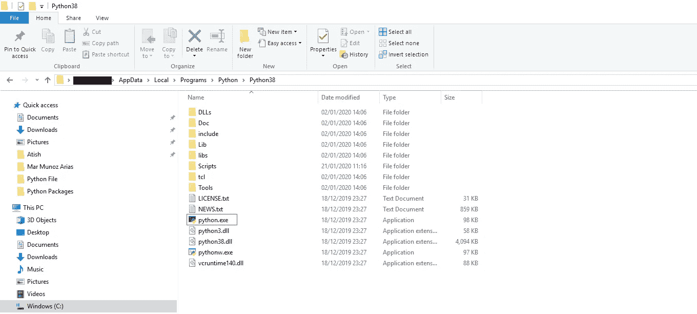
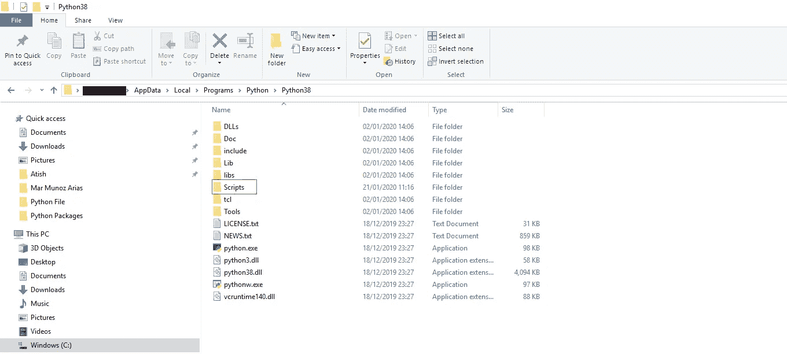
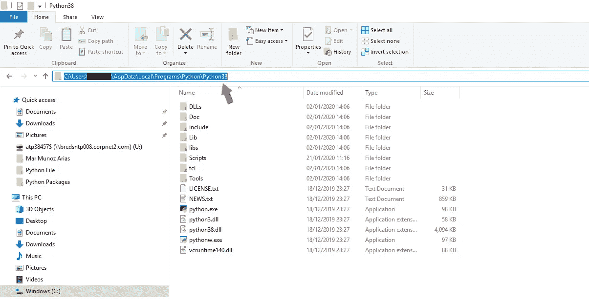
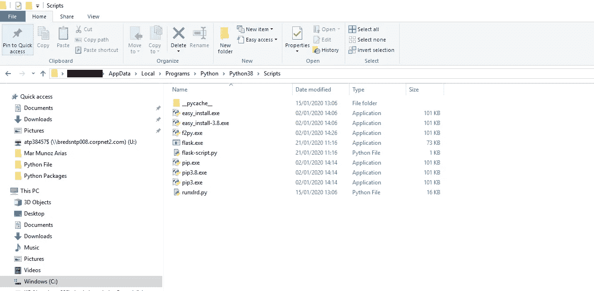
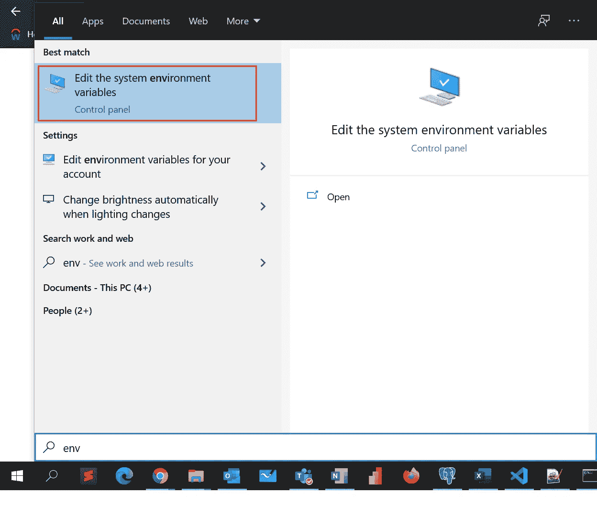
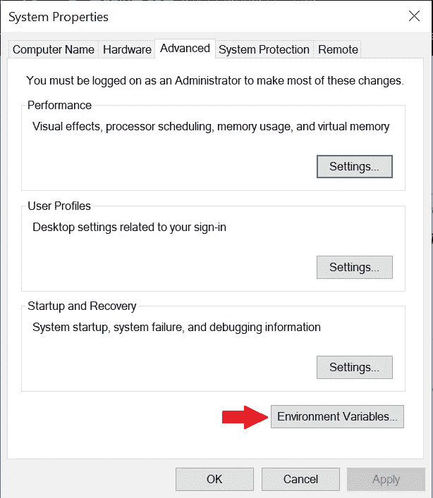
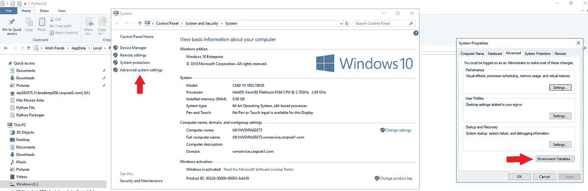
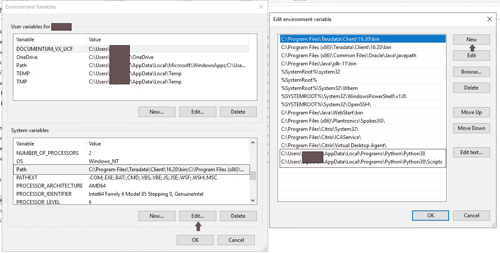
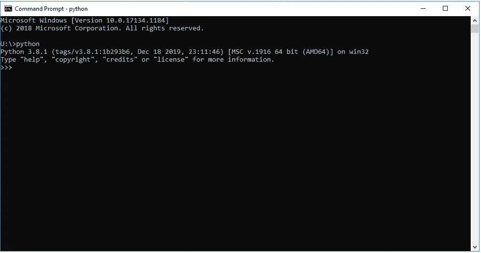

# Windows 10 中安装 Python 版(Plain 或 Anaconda 发行版)后如何设置路径变量(或环境变量)

> 原文：<https://medium.com/analytics-vidhya/how-to-set-path-variable-or-environment-variable-after-installing-python-plain-or-anaconda-e722ef8ea711?source=collection_archive---------7----------------------->

## Python 安装后最初困难的简单指南

***你是 Python(3 . x 版本)的彻底新手吗？
或
也许你很精通 python 编程，但不确定如何在 Windows 10 中为 Python 设置路径或环境变量。***

如果你在任何一种情况下跌倒，那么放松，深呼吸，我们会解决这个问题。在开始使用 Python 时，我也经历过同样的过程。

让我分享一下我的故事，当我在研究如何在命令提示符下进入 python 模式时，我在安装了普通的 [Python](https://www.python.org/downloads/) 或 [Anaconda](https://www.anaconda.com/distribution/) 发行版后，知道了一个叫做**路径变量**的术语。

好吧，让我们不要深究什么是路径变量；让我们坚持为 Python 添加一个。

我浏览了各种文章和视频，寻找直截了当的答案，在互联网上搜寻了同样的问题，但没有任何答案。信息是有的，但形式分散。 **所以当我找到了办法，想到了和大家分享。**

下面是需要做的事情:

> 1.找到**python.exe**和包管理器(如 pip，pip3)文件夹的安装目录，该文件夹是**脚本**

注意:如果你不确定 python.exe 的确切位置，你可以通过搜索栏找到它的目录

> 2.复制**python.exe**的路径目录和**脚本**目录。

> 3.进入**开始菜单**→搜索**环境** →你可以找到最佳匹配**下的选项编辑系统环境变量**选择它→点击“**环境变量**”(如图 3.2 所示)

图 3.1

图 3.2

# **或**

> 3.转到**这台电脑**→右击并选择“**属性**”→**高级系统设置**(第一个箭头标记)→点击“**环境变量**”。

> 4.在**系统变量**下转到**路径**→点击**编辑****→添加**新**→粘贴两个路径通过创建两个新的环境变量复制过来。**

****

> **5.为了确保一切正常，请进入“**命令提示符**并键入 **python** 。如果程序开始运行 python(如下)，那么恭喜你成功创建了路径变量。如果不是，则重新检查并再次彻底执行该步骤。**

****

**设置路径变量后，Python 解释器在命令提示符下被激活**

**您现在可以键入**pip install****<ABCD>**并安装您的 python 包。**