# 在 Ubuntu 18.04 LTS 上安装 TensorFlow GPU

> 原文：<https://medium.com/analytics-vidhya/how-to-set-up-tensorflow-gpu-on-ubuntu-18-04-lts-7a09ffd5f30f?source=collection_archive---------0----------------------->

## 使用 NVIDIA CUDA/cuDNN 的 GPU 加速深度学习


# **TL；博士**

我如何在 Ubuntu 18.04 LTS 上安装兼容的 NVIDIA CUDA Tookit 和 cuDNN 包，以便在笔记本电脑上使用 GPU 加速 TensorFlow/Keras 的深度学习。

# 目录

1.  [免责声明](#bd39)
2.  [简介](#757b)
3.  [安装流程](#cb8f)
    步骤 1。[识别兼容性](#dcce)步骤 2
    。[安装视频驱动](#7b17)步骤 3
    。[安装 CUDA 工具包](#8614)步骤 4
    。[安装 CUDNN 库](#d7f8)
    第五步。[更新环境变量](#1927)
    第六步。[安装 TensorFlow-GPU 和 Keras](#0ec4)
    步骤 7。[运行验证测试](#059f)
    步骤 8。[在 CNN 模型上试运行](#ea17)
4.  [杂项提示](#9fdb)
    a .[tensor flow-GPU 还是不加载怎么办？](#80bd)
    b. [如何管理 CUDA 内存不足警告？](#9c3c)
    c. [如何监控 GPU 使用情况？](#6a59)
    d. [如何杀死(释放)失控的进程？](#c7df)
    e. [我如何让 Keras CuDNNLSTM 使用最新的空间？](#2786)
5.  [总结](#32be)
6.  [方便的参考资料](#3532)

# 放弃

在我们开始之前，有些警告是适当的。

*   本文不是为 Anaconda 用户编写的，因为当您在 Anaconda 下安装 Tensorflow-gpu 时，它会为您处理上述 CUDA 驱动程序。可以在这里 [**这里**](/@shaolinkhoa/install-tensorflow-gpu-2-0-alpha-on-anaconda-for-windows-10-ubuntu-ced099010b21) 这里 [**这里**](https://docs.anaconda.com/anaconda/user-guide/tasks/tensorflow/) **查看。**
*   这主要是针对那些使用 Anaconda 之外的 IDE 和虚拟环境进行编码的 Python 用户。
*   此外，这是基于我的经验与 Ubuntu 18.04 LTS 只。然而，我认为整个安装过程也很容易适应 LTS 的 Ubuntu 16.04。
*   遗憾的是，即使你已经成功地安装并测试了兼容的 CUDA/cuDNN 包，也不能保证你的设置一定能工作。可能需要额外的调整和实验。

[^](#564e)

# 介绍

在我加入 [**Metis**](https://metis.kaplan.com.sg/) 数据科学训练营旅程之前，建议的先决条件之一是准备一台 Ubuntu 笔记本电脑。自然，我毫不犹豫地去争取。在我的笔记本电脑上安装 Ubuntu，并与 Windows 进行双引导，这是一次非常棒的学习经历，值得一提。

最重要的是，我希望我的 DL 项目能够充分利用我的笔记本电脑 GPU (GTX 1050)。事实证明，我花了很多时间搜索并重新安装库包。因此，我决定写这篇博客作为我自己的参考，如果你也感兴趣，希望它也能帮助你。

## 先决条件

*   您的计算机上必须安装有 NVIDIA 显卡。您可以从命令行中找到:

```
**$** lspci | grep -i nvidia
```

*   你已经安装了 Ubuntu 18.04 LTS(我的参考资料:[此处](https://itsfoss.com/install-ubuntu-1404-dual-boot-mode-windows-8-81-uefi/)、[此处](https://hackernoon.com/installing-ubuntu-18-04-along-with-windows-10-dual-boot-installation-for-deep-learning-f4cd91b58557) & [此处](/@mishawagon/ubuntu-and-windows-10-dual-boot-setup-2d5e6b5842fe))
*   你已经为机器学习建立了一个 [Python 开发环境](https://www.digitalocean.com/community/tutorials/how-to-install-python-3-and-set-up-a-programming-environment-on-ubuntu-18-04-quickstart)

[^](#564e)

# 安装过程

在我们开始之前，知道如何在出现问题时恢复到之前的状态总是好的。幸运的是，卸载非常简单，详见[此处](https://docs.nvidia.com/cuda/cuda-installation-guide-linux/index.html#removing-cuda-tk-and-driver):

移除 CUDA 工具包:`**$** sudo apt-get --purge remove "*cublas*" "cuda*"`

要删除 libcudnn 驱动程序:
`**$** sudo apt-get --purge remove "libcudnn7*"`

移除 NVIDIA 驱动程序(可选):
`**$** sudo apt-get --purge remove "*nvidia*"`

[^](#564e)

## 步骤 1 —确定兼容性

我们需要确保您的系统不存在以下兼容性问题:

*   视频驱动程序
*   CUDA 工具包
*   cuDNN
*   Tensorflow GPU

先弄清楚你的 NVIDIA 显卡是否兼容[T3 这里 T5。](https://developer.nvidia.com/cuda-gpus)

接下来，使用以下选项之一记下显卡驱动程序的版本:

```
$ modinfo nvidia | grep version
$ nvidia-settings
```

访问 [**此处**](https://docs.nvidia.com/deploy/cuda-compatibility/index.html#binary-compatibility__table-toolkit-driver) 识别哪个版本的 CUDA 与您的卡兼容。

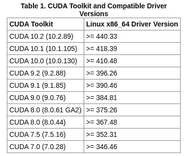

表 1: Cuda 工具包和兼容的视频驱动程序

最后，访问此处的[](https://www.tensorflow.org/install/source#gpu)**来记下基于你最兼容的 CUDA 版本，你可以安装哪个 cuDNN 和 TensorFlow。**

**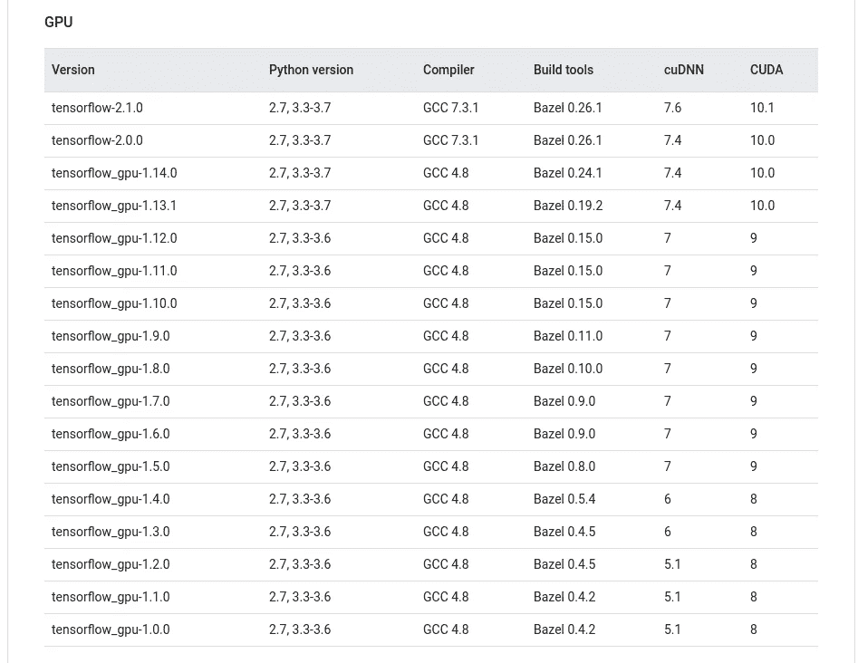**

**表 2: Tensorflow GPU 和各自的兼容库**

**从我个人的经验来看，虽然我们应该只安装兼容的 CUDA 和各自的 cuDNN 版本，但是我们有一点空间根据默认的安装结果来改变 cuDNN 版本。更多关于[这个](#a192)以后再说。**

**[^](#564e)**

## **步骤 2 —安装视频驱动程序**

**现在你知道你有一个兼容的 NVIDIA 显卡，让我们安装最新的驱动程序。**

**首先，让我们将您拥有的与可用的进行比较:**

```
$ modinfo nvidia | grep version
$ ubuntu-drivers devices
```

**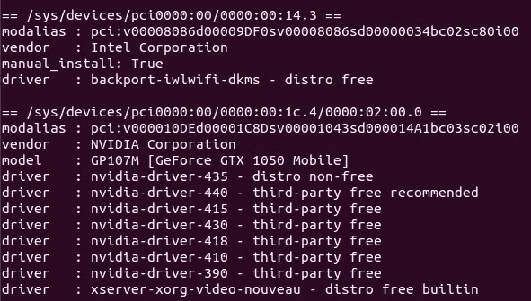**

**让我们从驱动程序列表中安装最新推荐的驱动程序，如果您还没有这样做。就我而言，我使用以下代码将我的 GTX 1050 更新到版本 440:**

```
$ sudo apt install **nvidia-driver-440**
```

> ****务必**确保在重启前选择了 NVIDIA 驱动程序。**

```
$ prime-select query
$ prime-select nvidia
```

**[^](#564e)**

## **步骤 3 —安装 CUDA 工具包**

**有了最新的视频驱动程序，让我们安装与你的视频驱动程序最兼容的 CUDA Tookit。**

**让我们看看你是否安装了它，或者更糟，错误的版本。要进行检查，请使用以下命令之一:**

```
$ nvcc --version
$ apt list --installed | grep -i nvcc
```

**如果您安装了不兼容的版本和/或它不适合您，建议执行干净的卸载:**

```
$ sudo apt-get — purge remove “*cublas*”
$ sudo apt-get — purge remove “cuda*”
```

**如果您安装了正确的版本，那么您可以跳到下一步。**

**要下载您的兼容 CUDA 工具包，请访问 [**此处**](https://developer.nvidia.com/cuda-toolkit-archive) 和选择您可以使用的兼容版本**。**我们不需要去[**这里**](https://developer.nvidia.com/cuda-downloads) 安装最新的 CUDA，因为 Tensorflow GPU 库通常还不兼容它(请参考上面的[表 2](#d8c3) 进行回顾)。**

**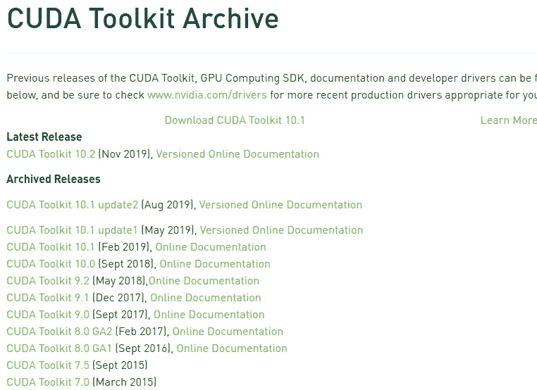**

**一旦你点击了相应的版本，你将被送到一个新的页面。从这里，选择 Ubuntu 18.04 的所有相关选项。下面是我选择下载 CUDA Tookit 10.0 的截图，这是我安装 TensorFlow GPU 1.13 和 1.14 的兼容版本。**

**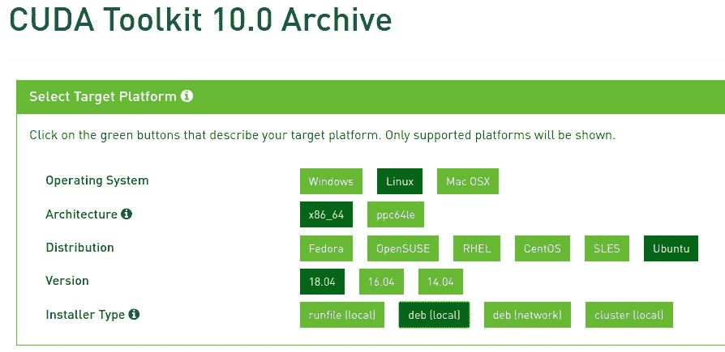**

**点击“下载”按钮下载“基本安装程序”deb 文件，并按照框中的说明进行操作，最后一条除外。**

> ****重要提示**:之后不要升级你安装的 CUDA 版本。**

**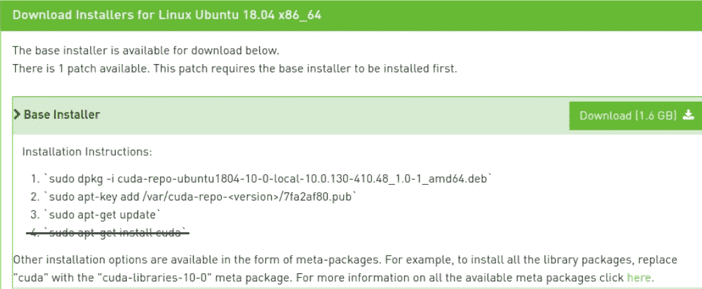**

**[^](#564e)**

## **步骤 4 —安装 cuDNN 库**

**现在我们已经安装了 CUDA，让我们安装兼容的 cuDNN。像往常一样，让我们检查一下您是否已经安装了一个，如果它不适合您，那么您将需要删除它。
`$ apt list --installed | grep -i libcudnn`**

**版本控制有两个部分。对于我的情况，我需要 cuDNN 版本 7.6 和 CUDA 工具包版本 10.0。因此，我下载并安装了它。**

**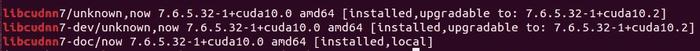**

**如果需要删除已有的 libcudnn:
**

**访问 [**此处**](https://developer.nvidia.com/cudnn) 点击“下载 cuDNN”继续。**

**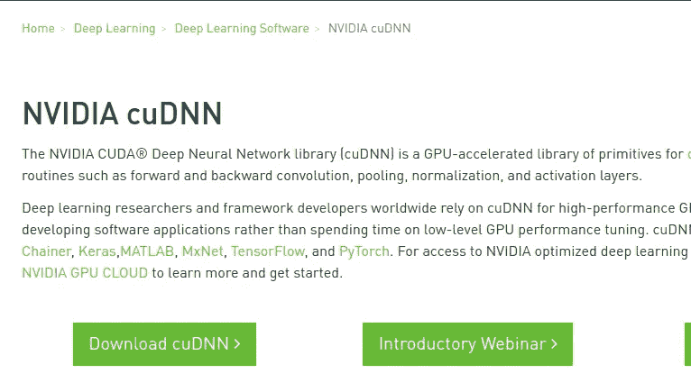**

**然后会提示您注册或登录。如果这是你第一次来这里，你必须注册。**

**一旦登录，勾选同意条款，你应该看到这个页面。**

**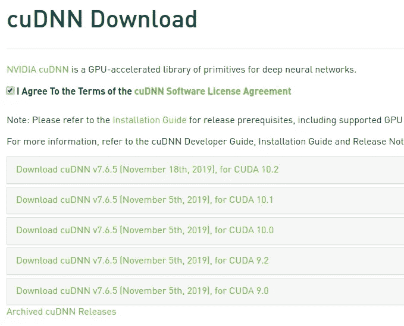**

**如果您的 cuDNN 版本不在列表中，则选择“*存档的 cuDNN 版本*”以获得更多选项。**

**请记住，要匹配与您可以/想要安装的 TensorFlow 兼容的 cuDNN 和 CUDA 版本。对于我的情况，我选择了 cuDNN 7.6.3 和 CUDA 10.0。**

**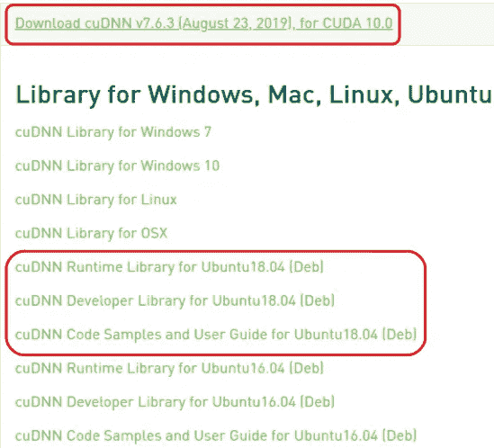**

**下载 Ubuntu 18.04 的所有三个 Deb 文件:**

*   **cuDNN 运行时库**
*   **cuDNN 开发者库**
*   **cuDNN 代码示例和用户指南**

**要安装，请运行以下命令(但将文件名更改为您下载的文件名):**

```
$ sudo dpkg -i *libcudnn7_7.6.5.32-1+cuda10.0_amd64.deb*
$ sudo dpkg -i *libcudnn7-dev_7.6.5.32-1+cuda10.0_amd64.deb*
$ sudo dpkg -i *libcudnn7-doc_7.6.5.32-1+cuda10.0_amd64.deb*
```

**我们还要防止版本被意外/自动更新:**

```
$ sudo apt-mark hold libcudnn7 libcudnn7-dev
$ apt-mark showhold
```

**[^](#564e)**

## **步骤 5 —更新环境变量**

**快到了！我们必须更新几个环境变量。首先，检查 CUDA 是否已经在您的系统路径中:**

```
$ echo $PATH
$ echo $LD_LIBRARY_PATH
```

**若要更新，请使用您喜欢的文本编辑器打开。bashrc 文件:
`$ nano ~/.bashrc`**

**跳到文件的末尾，添加以下三行，但是要确保修改 CUDA 版本以匹配您的版本。**

```
 # NVIDIA CUDA Toolkit
export PATH=/usr/local/cuda-**10.0**/bin:$PATH
export LD_LIBRARY_PATH=/usr/local/cuda-**10.0**/lib64:$LD_LIBRARY_PATH
```

**重启以使这些生效。**

> ****NB** :通过运行下面的命令之一，可以在不重启的情况下执行修改，但是当我随后运行验证测试时，不知何故它对我不起作用。如果你的测试第一次也失败了，在你尝试其他任何事情之前:试着重启一次，然后再次运行测试以确保万无一失。**

```
$ source ~/.bashrc
$ . ~/.bashrc
```

**[^](#564e)**

## **步骤 6-安装 Tensorflow GPU 和 Keras**

**如果您还没有安装 TensorFlow GPU 和 Keras，让我们来安装它们。您需要的 TF 版本必须与您的 CUDA 工具包和 cuDNN 库兼容(参见表 2)。**

**对于我来说，我的显卡兼容 CUDA 10.1 和更低版本。这基本上意味着我可以安装任何版本的 TensorFlow GPU。然而，由于我的 DL 项目仍然运行在旧的 TF (TensorFlow)版本上，我将只安装最新的 TF 1.14。**

**要安装特定的 TF 版本，请运行以下命令:**

```
$ pip install “tensorflow-gpu==1.14.*”
$ pip install keras
```

**要检查:**

```
$ pip list | grep -i tensor
$ pip list | grep -i keras
```

**[^](#564e)**

## **步骤 7 —运行验证测试**

**我们现在越来越接近了！让我们按此顺序运行以下测试:**

*   **步骤 7a。验证 cuDNN 正在工作**
*   **步骤 7b。验证 TensorFlow GPU 正在工作**

## **步骤 7a —验证 cuDNN**

**按此处 指示的 [**运行以下命令。**](https://docs.nvidia.com/deeplearning/sdk/cudnn-install/index.html#verify)**

```
$ cp -r /usr/src/cudnn_samples_v7/ $HOME
$ cd  $HOME/cudnn_samples_v7/mnistCUDNN
$ make clean && make
$ ./mnistCUDNN
```

**如果 cuDNN 工作正常，您应该会看到这条消息:
`Test passed!`**

## **步骤 7b —验证 Tensorflow GPU**

**从命令行启动“python”并执行这些代码:**

```
$ python
>>> import tensorflow as tf
>>> print(tf.test.gpu_device_name())
>>> quit()
```

**如果 TF-GPU 安装正确，应该会报告一个 GPU 设备:
`/device:GPU:0`**

**[^](#564e)**

## **第八步。在 CNN 模型上试运行**

**访问 [**这里**](https://www.tensorflow.org/tutorials/images/cnn) ，下载笔记本，给它一个旋转。**

**如果你遇到 CUDA OOM(内存不足)警告，点击 [**此处**](#9c3c) 了解如何解决。**

**[^](#564e)**

# **杂项提示**

**现在，您已经成功安装了一个可运行的 TensorFlow GPU，让我根据自己的学习经验与您分享几个技巧。**

**[^](#564e)**

## **Tensorflow-GPU 还是不加载怎么办？**

1.  **确保安装了与[最兼容的版本](#dcce):[NVIDIA 视频驱动](#7b17)， [CUDA 工具包](#8614)， [cuDNN](#d7f8) 和 [TensorFlow-GPU](#0ec4) 。**
2.  **确保[路径和 LD_LIBRARY_PATH](#1927) 已经正确更新。**
3.  **重启机器并再次运行[验证测试](#059f)。**
4.  **根据各种论坛讨论，如果您无法在当前设置下使用 Tensorflow-GPU，您可以尝试降级到不同版本的 Tensorflow-GPU、cuDNN 和 CUDA Toolkit(按此顺序)。在每次排列改变后运行验证测试。**
5.  **在谷歌上搜索错误信息，或者在 StackOverflow 这样的论坛上发帖寻求帮助。**

> ****重要提示**:在安装一个不同的版本之前，一定要记得卸载以前的 CUDA/cuDNN 版本。记住也要更新环境变量。**

**[^](#564e)**

## **如何管理 CUDA 内存不足警告**

**请注意，您可能遇到的一个常见问题是 **CUDA OOM(内存不足)**警告。基于[这个](https://stackoverflow.com/questions/34199233/how-to-prevent-tensorflow-from-allocating-the-totality-of-a-gpu-memory)和[这个](https://riptutorial.com/tensorflow/example/31879/control-the-gpu-memory-allocation)，您可以将以下代码插入到您的脚本/笔记本中，以帮助管理该问题。**

**[^](#564e)**

## **如何监控 GPU 的使用**

**在命令行中运行以下命令之一:**

```
$ nvidia-smi
$ watch -n 5 nvidia-smi
```

**您可能希望监控温度、当前内存使用量和每个进程的内存使用量(以及各自的 PID)。**

**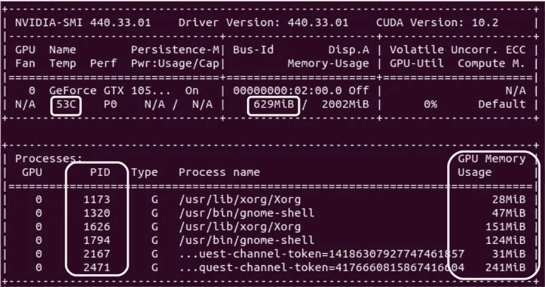**

> ****NB** :注意 CUDA 版本列为 10.2，和我安装的 10.0 不一样。根据[这个](https://stackoverflow.com/questions/53422407/different-cuda-versions-shown-by-nvcc-and-nvidia-smi)和[这个](https://docs.nvidia.com/cuda/cuda-runtime-api/driver-vs-runtime-api.html)，有两种不同的 API，运行时和驱动 API。我们安装的 CUDA 工具包指的是运行时 API，而不是视频驱动 API。**

**[^](#564e)**

## **如何终止(释放)失控的进程**

**如果 GPU 内存没有被释放，即使你已经退出了你的 IDE 或笔记本，那么你可以手动杀死它。您可以通过使用其各自的 PID 来实现。例如，如果我想终止上面显示的最后一个进程 2471:**

```
$ sudo kill -9 2471
```

**如果您不确定要终止哪个进程，您可以从底层开始，尤其是可疑地占用大量内存的进程。**

**[^](#564e)**

## **我如何让 Keras CuDNNLSTM 与最新的空间**

**在弄清楚 Google Colab 是如何做到的之后，只安装以下版本:**

*   **CUDA 工具包 10.0**
*   **cuDNN 7.6**
*   **TensorFlow 1.15.x**

****注 1:** 在保留 CUDA Toolkit 10.0 兼容版本的同时，我能够将 cuDNN 从 7.4 升级到 7.6，尽管这在[网站上没有被列为兼容](https://www.tensorflow.org/install/source#gpu)。**

****注 2:** 在安装了 TF 1.15 之后，我在使用 Keras 卷积层进行图像分类项目时遇到了问题。最终，通过在新环境中安装 TensorFlow 1.14.x 解决了这个问题。[虚拟环境](https://docs.python-guide.org/dev/virtualenvs/)为赢！**

**[^](#564e)**

# **包裹**

**最后，我希望你能够在你的 Ubuntu 18.04 LTS 上成功安装一个工作 Tensorflow-GPU 环境，它可以通过你的板载 GPU 全面加速你的所有深度学习项目。**

**对于那些因为任何原因而不能这样做的人，不要绝望。你可以一直使用云解决方案，例如， [Google Colab](https://colab.research.google.com/) ，它免费提供 GPU 和 TPU！或者，您也可以尝试使用 [Docker](https://www.tensorflow.org/install/docker) 来代替。**

**感谢你阅读我的文章，我希望这对你有用！**

**[^](#564e)**

# **方便的参考资料**

1.  **[CUDA 工具包文档](https://docs.nvidia.com/cuda/index.html)**
2.  **用于 Linux 的 NVIDIA CUDA 安装指南**
3.  **[Linux 上的 cuDNN 安装指南](https://docs.nvidia.com/deeplearning/sdk/cudnn-install/index.html#install-linux)**
4.  **[TensorFlow GPU 支持](https://www.tensorflow.org/install/gpu)**
5.  **[TensorFlow GPU 兼容性列表](https://www.tensorflow.org/install/source#gpu)**
6.  **[TensorFlow Pip 安装指南](https://www.tensorflow.org/install/pip)**

**[^](#564e)**