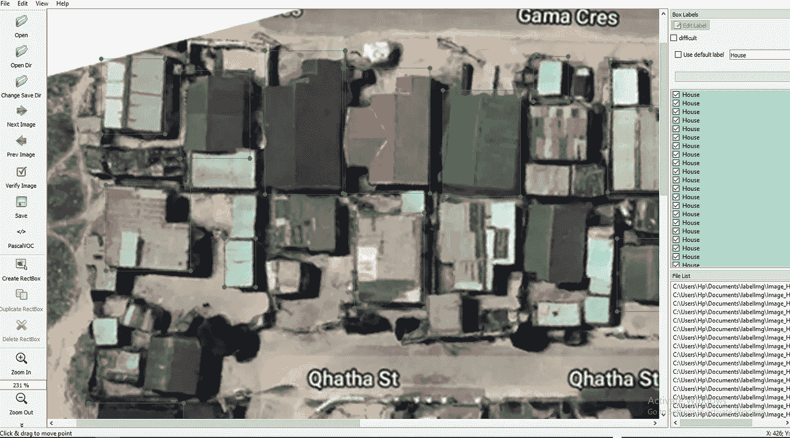

# 如何在 Anaconda 中建立虚拟环境用 LabelImg 进行图像标注

> 原文：<https://medium.com/analytics-vidhya/how-to-set-up-virtual-environment-in-anaconda-for-image-annotation-with-labelimg-9ee58d8a41fd?source=collection_archive---------18----------------------->


**概要**

*   目标
*   *理解图像标注*
*   *不同类型的图像标注*
*   *label img 简介以及如何下载软件包*
*   *为什么需要环境以及如何设置环境*
*   *激活环境并添加标签的目录*
*   *安装 Pyqt，添加资源，启动 LabelImg 软件*
*   *你现在该怎么办？*

# **目标**

本文的重点是教您如何在 Anaconda 中为 label img——一个图像注释工具——创建所需的环境。还将向您介绍作为图像注释工具的图像注释和标签，以及万一您不熟悉它们时对环境的需求。尽管您将获得向您展示如何进行注释的资源，但本文将不会详细讨论这一点。这篇短文中的知识将帮助您设置 conda 环境，从头开始构建您的自定义图像数据集，最重要的是在您的设备上启动 labelImg 软件。

# **理解图像标注**

机器学习或计算机视觉中的图像注释是用预定标签标记图像数据的过程，以便向计算机视觉或机器学习模型提供关于图像中表示的对象的信息。

然后，当出现新数据时，该算法将使用带注释的数据来学习和识别相似的模式。图像标注是计算机视觉的重要组成部分。


来源:KDnuggets

计算机视觉行业几乎每分钟都在进步，因此，对用于训练或改进其模型的高质量和可靠数据的需求不断增加。您可能会感兴趣地知道，世界上许多重视质量、速度、规模、安全性以及防止内部偏见的公司已经在外包他们的数据注释任务。

> “正确注释的数据对于自动驾驶汽车、空中无人机的计算机视觉以及许多其他 [AI](https://www.therobotreport.com/category/design-development/ai-cognition/) 和机器人应用的开发非常重要。”— SAS

此外，随着计算机视觉和机器学习的不断发展，对高质量数据的需求将会继续增长。因此，不能低估数据的质量和尽量减少当前和未来数据偏差的必要性。

# 不同类型的图像注释

*   边界框:这是最常见的。要求标签员在图像中的关键对象周围画一个方框的注释。
*   多边形注释:它通常用于形状不规则的项目的更精确的注释。
*   线条注释:它主要用于需要描绘的部分太小或太薄，并且边界框无法实现的情况
*   点标注:点标注包括在图像的指定位置精确绘制关键点。它主要用于面部识别和情感分析。
*   语义分割:这种类型需要将图像分成多个部分，并将每个部分中的每个像素分类到其对象的相应类别标签。

# 标签介绍

我基本上将 LabelImg 描述为一个图形化的图像注释工具。它是用 Python 编程语言编写的，并使用 **Qt** 作为其图形界面。注释以 **PASCAL VOC** 格式保存为 **XML** 文件，这是[ImageNet使用的格式。此外，它还支持 **YOLO** 格式。我们能深入实际吗？](http://www.image-net.org/)

## **如何下载 labelImg**

*   如果你还没有的话，下载并安装[**Anaconda**](https://www.anaconda.com/download/#download)(Python 3+)。
*   从这个 [**链接**](https://github.com/tzutalin/labelImg/archive/master.zip) 下载 **labelImg** 的 ZIP 文件，解压到一个喜欢的位置。如果你更喜欢从 GitHub 克隆它，你可以从这个 [**链接**](https://github.com/tzutalin/labelImg.git)**——我不会围绕克隆讨论太多。可以查看如何 [**克隆 GitHub Repo**](https://git-scm.com/book/en/v2/Git-Basics-Working-with-Remotes) **。****

## ****为什么虚拟环境很重要，如何创建虚拟环境****

**虚拟环境在 Python 中很有用，因为它们有助于创建一个隔离的空间，供您试验第三方模块的新版本、您自己编写的代码的新方向、Python 本身的不同版本等。，所有这些都不会污染系统预装的 Python 版本，或者任何你称之为 Python 的“普通”版本。**

**我经常倾向于通过每月更新来确保我所有的包都是最新的。对我来说更像是例行检查，哈哈。我将在下面解释在 Anaconda 提示符下创建 python 环境的过程。**

*   **启动你的水蟒提示**
*   ***检查您的 Conda 版本并更新，这可能需要时间来完成。***
*   ***检查可用 Python 版本的列表，以便您可以正确指定用于新环境的版本。***
*   ***用你选择的任何名字和 Python 版本创建你的新环境。我选择了* ***labeller*** *作为我的新环境名和 Python 版本 3.8.3。***

```
conda -V #It is good practice to check the version of your Conda
conda update conda #Only run this code if it is necessary to update
conda search “^python$” #Check the list of available Python Version
conda create -n labeller python=3.8.3 anaconda #Create the new Env
```

# ****激活环境并添加标签的目录****

*   ***激活新环境，让我们准备将****label img****包安装到新环境中。***

```
conda activate labeller #Activate the new environment with this code
```

**现在我们已经激活了我们的新环境。我们需要将这个包带到我们的新环境中，使它能够工作。**

**基本上，你现在应该做的是，回到解压后的 **labelImg** 文件夹，复制文件路径。**

****

****点击箭头所在的位置，复制高亮显示的文本。****

# ****安装 Pyqt，添加资源，启动 LabelImg 软件****

**从下面的剪辑中，您需要使用“ **cd** ..”来更改目录并粘贴复制的目录，如第一行所示。第二行将把 pyqt 安装到新的环境中。我已经安装了 **pyqt** ，这就是为什么它说**所有请求的包已经安装。**检查以下代码并按照步骤操作**

```
conda install pyqt=5 # Install pyqt for graphical interface
pyrcc5 -o libs/resources.py resources.qrc # add resources required
python labelImg.py # We will launch our software with this line
```

**添加目录非常简单，不需要时间，但是 pyqt 可能需要一些时间，这取决于你的网络带宽。**

****

**您已经在这里添加了目录并安装了 pyqt=5。**

**只需将 labelImg 所需的资源添加到目录中，然后启动软件。**

****

**我们期待已久的终于来了！现在你可以像专业人士一样注释了！**

****

**用标签标记的图像**

****

****一个样本****

**毫无疑问，用 LabelImg 注释图像非常容易。不要忘记只有两个选项可以保存，分别是**PASCAL VOC**格式的 XML 文件和 **TXT** 格式的 YOLO 文件。**

# **你现在应该做什么？**

*   **这里有一个**[**4 分钟的视频**](https://www.youtube.com/watch?v=VsZvT69Ssbs) 来指导你用 LabelImg 进行标注****
*   ****查看本贴关于[**物体探测**](/deepquestai/object-detection-training-preparing-your-custom-dataset-6248679f0d1d) **b** y [摩西·奥拉芬娃](https://medium.com/u/93711d5c7c5?source=post_page-----9ee58d8a41fd--------------------------------)****
*   ****阅读关于 [**计算机视觉**](https://www.sas.com/en_us/insights/analytics/computer-vision.html)****
*   ****阅读更多关于[**图片注释**](/supahands-techblog/what-is-image-annotation-caf4107601b7) 通过[甲寅低](https://medium.com/u/79ce6a0c33e7?source=post_page-----9ee58d8a41fd--------------------------------)****

****谢谢你来到我的角落。我期待在我的下一篇文章中见到你。抱抱你！****

****[](https://www.linkedin.com/in/oluwaseun-abel-ofinni-404214125/) [## oluwaseun Abel of nini-项目经理/项目数据分析师-尼日利亚数据科学| LinkedIn

### 查看 Oluwaseun Abel Ofinni 在全球最大的职业社区 LinkedIn 上的个人资料。Oluwaseun Abel 有 9 份工作…

www.linkedin.com](https://www.linkedin.com/in/oluwaseun-abel-ofinni-404214125/)****