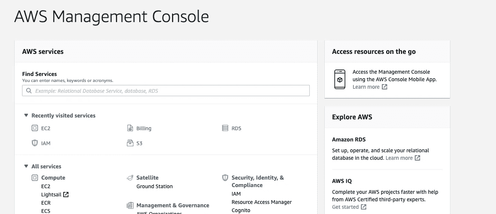
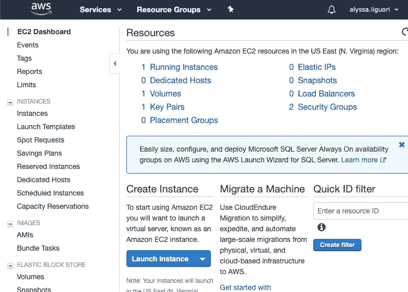
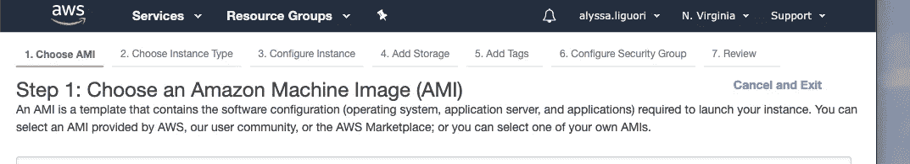
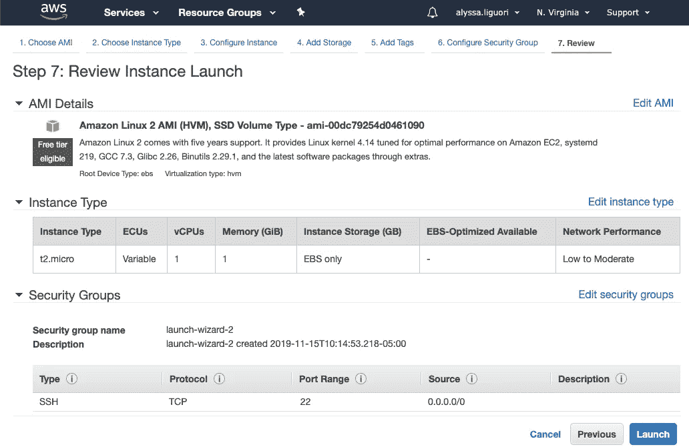
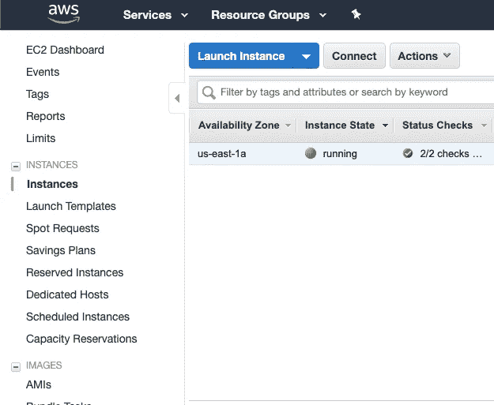
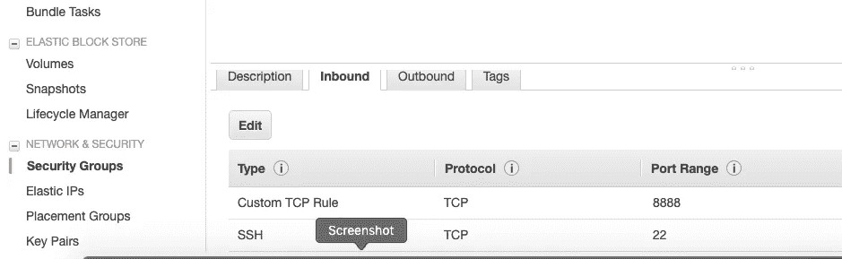
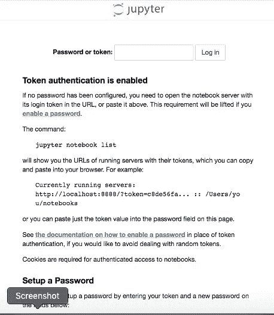

# 如何设置 AWS EC2 实例并启动和运行 Jupyter Notebook

> 原文：<https://medium.com/analytics-vidhya/how-to-set-up-your-aws-ec2-instance-and-get-jupyter-notebook-up-and-running-2aead043be76?source=collection_archive---------5----------------------->

创建一个 EC2 实例，安装 python3、pip 和 python 库，并运行 Jupyter Notebook。

1.  创建一个 [AWS 账户或登录现有账户](https://aws.amazon.com/)并导航至 **AWS 管理控制台**。



AWS 管理控制台

2.在**所有服务** > **计算** >下点击 **EC2**

3.点击**启动实例**



4.现在，创建实例有 7 个步骤。

注意，为了启动实例，您需要创建一个公钥/私钥对，或者提供一个现有的密钥对。从 AWS 的 [EC2 密钥对文档](https://docs.aws.amazon.com/AWSEC2/latest/UserGuide/ec2-key-pairs.html)——“在引导时，公钥内容被放置在`~/.ssh/authorized_keys`内的条目中的实例上。若要登录到您的实例，您必须在连接到实例时指定私钥。



>第一步:**选择 AMI** 。如果您想了解更多信息，请查看本 AMI 用户指南文档[。按照我的代码，使用亚马逊 Linux。](https://docs.aws.amazon.com/AWSEC2/latest/UserGuide/AMIs.html)

>第二步:**选择实例类型**。阅读本文档中关于 i [实例类型的更多信息。](https://aws.amazon.com/ec2/instance-types/)

>第三步:**配置实例详情**。保留默认值，除非您的用例需要调整。

>第四步:**添加存储**。空闲层最多可存储 30 GB。如果需要，将默认值 8 GB 更改为 30gb。

>第五步:**添加标签**。这一步是为了帮助你保持条理。根据您的喜好添加或删除标签。

>第六步:**配置安全组**。阅读更多关于 AWS 的[安全组的信息，以便更好地理解](https://docs.aws.amazon.com/AWSEC2/latest/UserGuide/ec2-security-groups.html)。

>第七步:**审核实例启动**。确保所有设置如您所愿，然后点击**启动**。



步骤 7:检查实例启动

5.您的实例已启动。通过导航到 **EC2 仪表板**(服务> EC2)检查状态，然后点击**实例**。当你看到**在**实例状态**下运行**时，进入下一步！(您可能需要水平滚动才能看到实例的所有细节)。



用于检查实例状态的 EC2 仪表板

6.在**启动实例**按钮旁边，点击**连接**。把这个屏幕放在手边，你很快就会用到它。

7.根据您的机器，下载 PuTTY 或使用终端启动到 SSH(安全 Shell)服务器的连接。你需要你的私人钥匙。[下面简单介绍一下 SSH](https://www.ssh.com/ssh/) 。请参考步骤 6 中提到的连接屏幕。假设您有一个包含您的私钥的 pem 文件。导航到该目录，然后使用以下代码更改 pem 文件的权限，然后连接到实例的公共 DNS。

```
# Here's an example with a pem file named "my-pem-file" with a private keychmod 400 'my-pem-file.pem'# Your login is ec2-user if you chose the Amazon Linux AMI during instance creation. After the @ symbol, enter your instance's Public DNS (IPv4) found on the same page where you found the Instance State ssh -i 'my-pem-file.pem' ec2-user@insert-public-dns-here
```

8.现在您已经连接好了，检查您的实例上的 python 版本

```
python --version
python3 --version
```

9.亚马逊 Linux 只附带 python 2.7，所以我们需要安装一个更新。命令如下:

```
sudo yum install python3 
```

10.安装 pip3

```
curl -O [https://bootstrap.pypa.io/get-pip.py](https://bootstrap.pypa.io/get-pip.py)
python3 get-pip.py
```

11.使用 pip3 安装所需的 python 库(numpy、pandas、jupyter、scikit-learn、matplotlib)

12.打开。带有 vim 的 bashrc 文件。添加**别名 python=python3** ，然后添加 **:wq** 以保存并退出 vim。仔细检查它的工作。

```
ls -la 
vim .bashrc
python --version # should now print out the python 3.7 instead of 2.7 
```

13.将默认的 jupyter 内核改为 python3，然后查看规范列表。

```
ipython3 kernelspec install-self
jupyter kernelspec list
```

14.要在浏览器中使用 Jupyter，请转到 **EC2** **仪表板** > **安全组**并编辑附加到您的实例的安全组。添加入站规则:对于**类型**，使用**自定义 TCP 规则**，并将**端口范围**设置为 **8888** 。



AWS 安全组

15.启动您的 jupyter 笔记本服务器

```
jupyter notebook — ip=* — allow_origin=* 
```

16.将您的公共 DNS (IPv4)粘贴到您最喜欢的浏览器中，然后按 **:8888**

17.您将看到这个屏幕。到您的终端检索运行后打印的令牌…

```
jupyter notebook — ip=* — allow_origin=*
```



浏览器中请求令牌的页面

并将令牌粘贴到浏览器的令牌文本框中。

18.恭喜你！您已经准备好开始在新的 EC2 实例上使用 Jupyter 笔记本了。

请留言告诉我你有什么问题，或者你是否需要帮助解决问题！