# 如何在 IBM cloud 上设置 GPU 计算实例(虚拟服务器)

> 原文：<https://medium.com/analytics-vidhya/how-to-setup-a-gpu-compute-instance-virtual-server-on-ibm-cloud-478948b94718?source=collection_archive---------8----------------------->

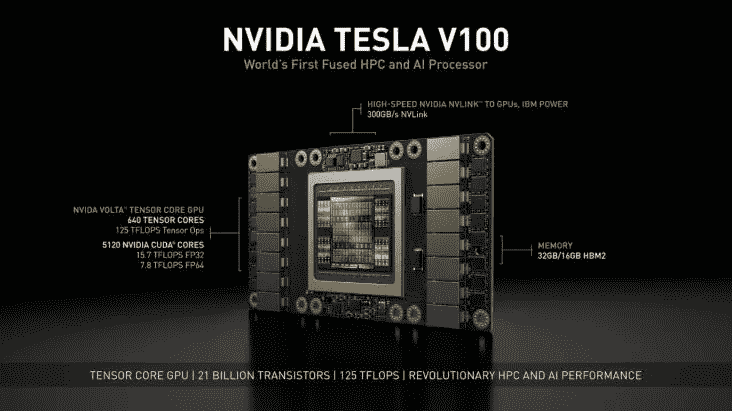

pic 信用@服务主页

图形处理单元或 GPU 现在是启动你的人工智能之旅的绝对必要条件。没有 GPU，许多最先进的深度学习网络都不可能实现。感谢像“亚马逊 Aws”、“谷歌云”和“IBM 云”这样的云公司的支持，现在访问 GPU 相对容易得多。

如果你是一家初创公司，正在开发基于下一代人工智能的产品，你可以申请不同云巨头的启动程序，如“亚马逊 AWS”、“IBM cloud”或“谷歌云”。您可以从亚马逊 AWS 获得高达 5000 美元的云积分，从“IBM cloud”获得每月 10，000 美元的云积分，或者从“Google cloud”获得 3000 美元的云积分。“IBM cloud”每月 10，000 美元的信用证明是我们深度学习实验的福音。

这篇文章是我向“IBM cloud”团队说声“非常感谢”的方式😊。

在这里，我列出了开始使用 IBM cloud GPU 的细节。IBM Cloud 以按小时和按月计费的方式提供以下两种 Nvidia GPU:

```
**GPU TYPE 1:****NVIDIA Tesla V100**GPU: 1 x Volta V100
Memory: 16 GB HBM2
NVIDIA Tensor Cores: 640
NVIDIA CUDA Cores: 5120
Memory bandwidth: 9000 GB/sec**GPU TYPE 2:****NVIDIA Tesla P100**GPU: 1 x Pascal GP100
Memory: 16 GB HBM2
NVIDIA CUDA Cores: 3584
Memory bandwidth: 720 GB/sec
```

在这些 GPU1 或“英伟达特斯拉 V100”中，深度学习是值得推荐的。

设置 GPU 的过程包括下面列出的 3 个主要步骤:

1.  **从 IBM Cloud 获得/订购“NVIDIA Tesla V100”**
2.  **登录到创建的 GPU 实例**
3.  **分区并挂载额外请求的磁盘空间**

# **1。从 IBM Cloud 获得/订购“NVIDIA Tesla V100”:**

下面列出了必要的步骤:

**步骤 1:使用您的登录凭证登录 IBM Cloud】**

前往链接[https://cloud.ibm.com/login](https://cloud.ibm.com/login)并登录您的 IBM cloud 帐户。

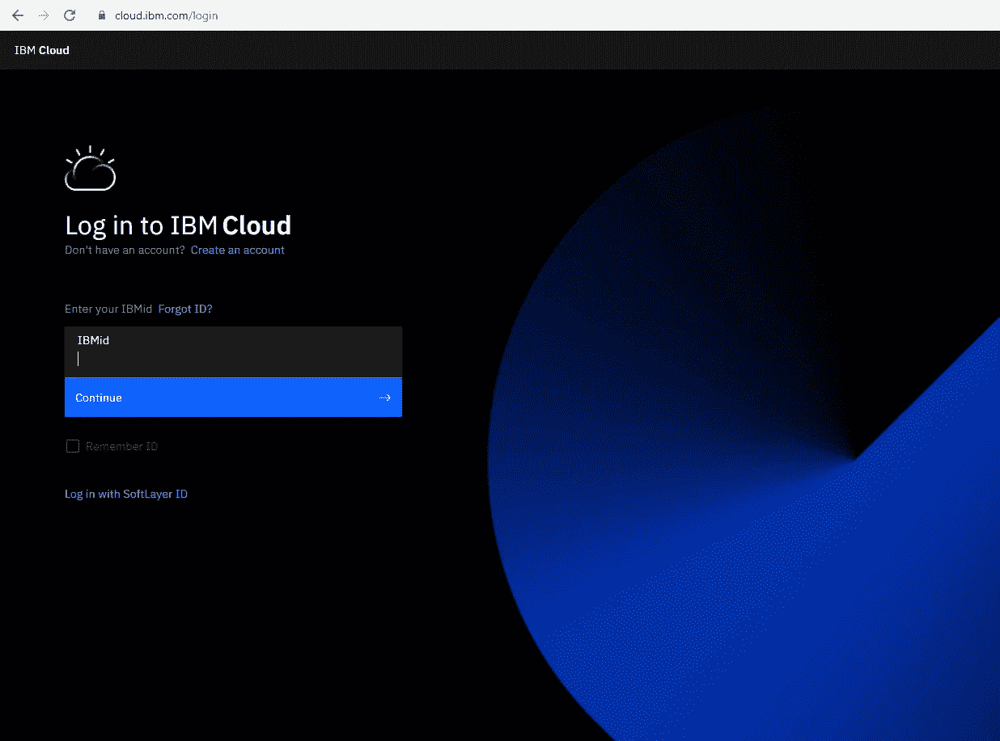

IBM cloud 登录页面

**步骤 2:在仪表板上点击右上角的“创建资源”:**

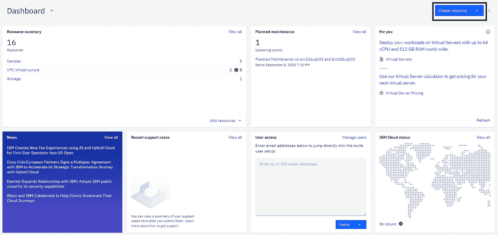

“创建资源”按钮占位符

**第三步:点击“经典虚拟服务器”:**

如果默认情况下不可见，您可能需要在“搜索目录”部分进行搜索。也可以从“裸机服务器”订购“GPU 实例”,但在本文中，我们将讨论“经典虚拟服务器”。

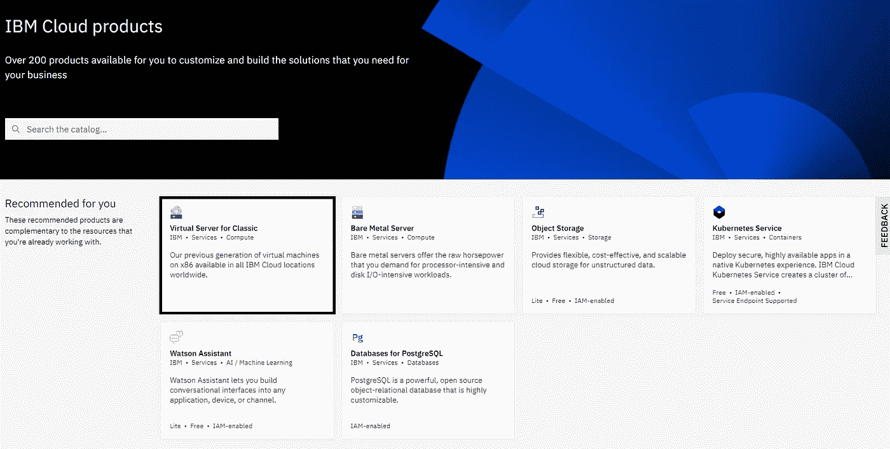

“经典版的虚拟服务器”占位符

**步骤 4:输入所需的配置以请求 GPU，如下所示:**

变量和属性的值:

*   虚拟服务器类型:**公共**【保留默认值】
*   数量: **1 个或更多**【根据您的喜好】
*   计费:**小时/月**【根据您的喜好】
*   主机名: **gpu-demo** 【根据您的喜好】
*   放置组:**无**【或者你可以分配一个组。分组将帮助您组织实例]
*   地点:**那东**【wdc 07 华盛顿】。仅在数据中心 dal10、dal12、dal13、lon04、lon06、wdc07、tok02、syd04 和 fra02 中允许 GPU 配置。
*   配置文件:**所有配置文件→ GPU - >选择您想要的 GPU 配置。**在本次演示中，我选择了 2 个 120GB 内存的 V100
*   SSH 密钥:**如果已经有 SSH 密钥，请选择一个，或者创建一个新的 SSH 密钥。**出于安全考虑，建议使用 SSH 密钥。您可以单独创建一个 SSH 私有-公共密钥对，并在此部分粘贴公共密钥。另外保存相应的私钥以备后用。稍后将使用该私钥登录 GPU 机器。
*   图像**:选择您想要的操作系统图像。为了这个演示，我使用了 Ubuntu 18.04**
*   附存储盘:**默认情况下，IBM 提供了一些 GB 的引导盘**。**总是建议为您的项目创建额外的磁盘空间**。对于本演示，我将创建一个 50 GB 的额外磁盘空间。应该注意的是，这个磁盘需要在以后进行分区和挂载。本文稍后将讨论执行相同操作的步骤。
*   网络接口:**网络接口和下面其他字段可以保留默认值。**

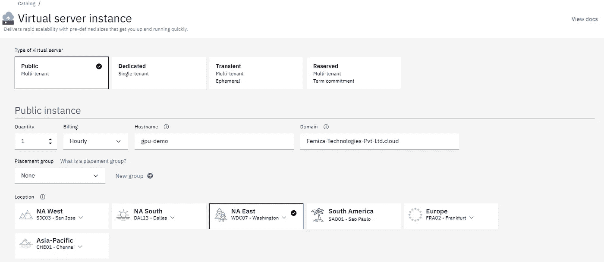

gpu 配置 1

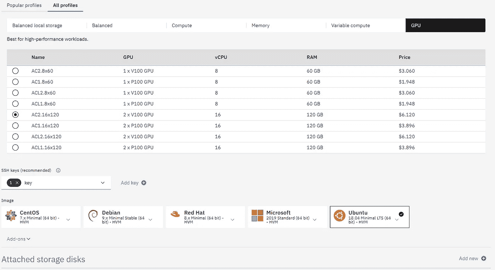

gpu 配置 2

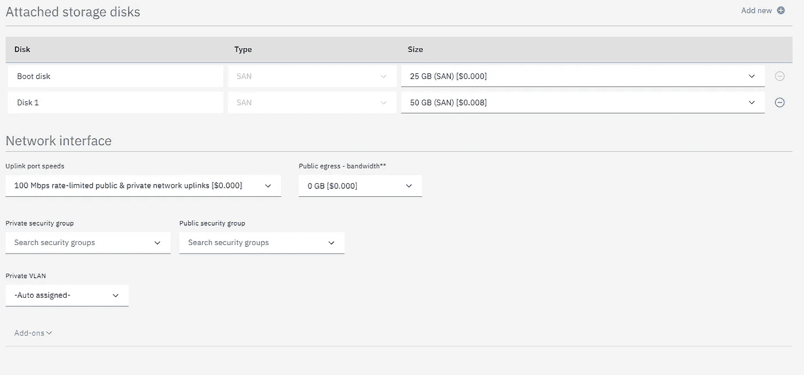

gpu 配置 2


gpu 配置 3

**步骤 5:同意条款和条件后，继续创建计算实例:**

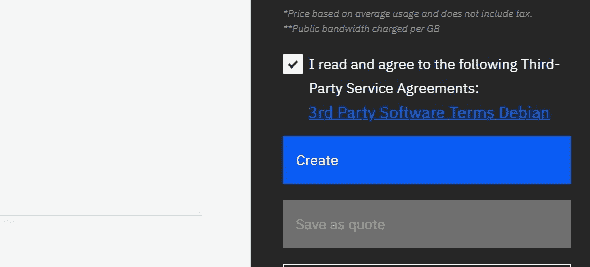

条件

几分钟后，GPU 服务器在仪表板上变得可用。

# 2.登录到创建的 GPU 实例:

您可以使用任何终端模拟器，如“Putty”、“Git Bash”或“标准 linux 终端”来使用 SSH 访问请求的服务器。有两种方法登录到所请求的机器，如下所述:

## **使用密码登录:**

在分配了“带有 GPU 的 linux 虚拟服务器”之后，它在仪表板上变得可见。该视图的快照如下所示:

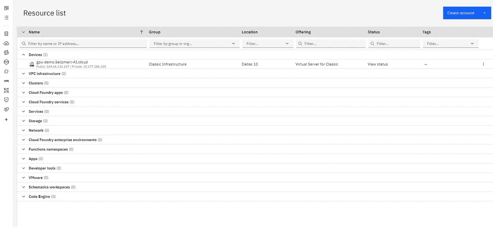

显示请求的服务器的 IBM cloud Dashboard

**如何获取机器/服务器的 ip 地址？**

点击机器名称进入详细信息页面。如果你向下滚动一点，你将能够找到它的 ip 地址(私有和公有)。请参考下面的快照:

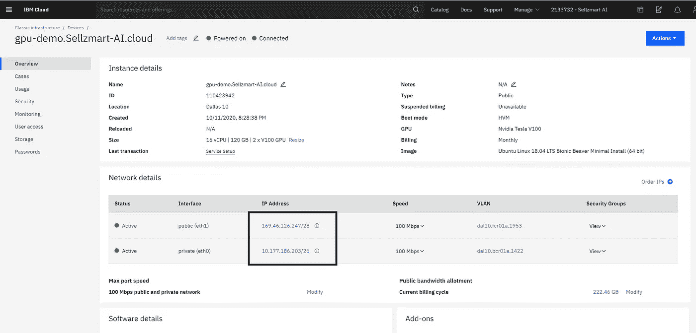

获取服务器的 ip 地址

**如何获取访问机器/服务器的密码？**

如前所述，单击机器的名称进入其详细信息页面。在详细信息页面上，单击左侧名为“密码”的菜单项以获取密码详细信息，如下所示:

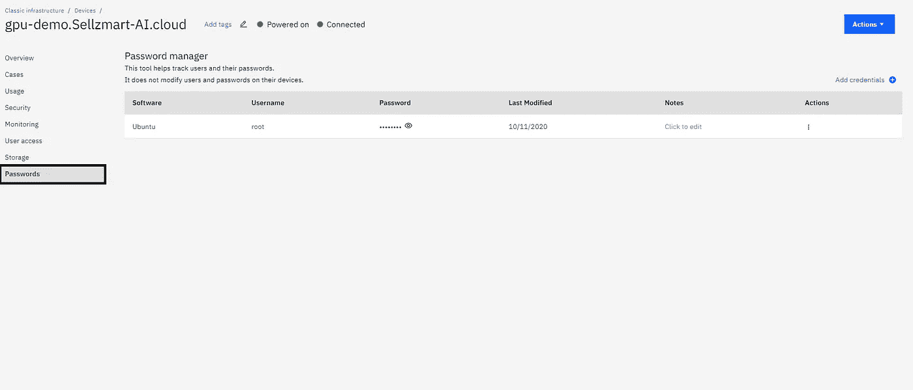

获取密码详细信息

**使用 ip 地址和密码访问服务器:**

打开你最喜欢的终端，在命令行输入命令“ssh root@ <your public="" ip="" address="">”。接下来，它会提示输入密码。输入我们在上一步中获得的密码。</your>

您应该能够成功登录到机器。

```
(base) [SELLZMART\shabnam@a-1bzp0de4onvjj ~]$ ssh root@<ip adddress>
root@<ip address>'s password: 
Welcome to Ubuntu 18.04.4 LTS (GNU/Linux 4.15.0-88-generic x86_64)
```

## 使用 ssh-key 登录:

除了上面讨论的使用密码的登录方法之外，IBM cloud 还允许使用 ssh-keys 登录。如果您还记得，在请求 GPU 服务器时，我们有一个提供 SSH-key 的选项。在这一阶段，必须提供“公共 SSH-key”才能使用“私有 SSH-key”登录到 GPU 机器。

使用“ssh-key”登录的命令行如下所示:

```
ssh -i key root@<public ip address> 
```

其中“key”是本地计算机上包含“私有 ssh-key”的文件的名称。

应该注意的是,“使用 ssh-key 登录”是登录任何远程服务器的一种安全且推荐的方式。

# 3.分区并安装额外请求的磁盘空间:

我们已经走了很长的路。我们已经成功地请求了一个安装了 GPU 的 Linux 服务器，并且能够访问它。

登录后，您会注意到您只能访问 25 GB 的可用引导磁盘，而不能访问我们请求的额外磁盘空间“50GB 的 disk1”。通过执行下面给出的命令，可以很容易地检查可用磁盘空间:

```
[@gpu](http://twitter.com/gpu)-demo:/# df -h . 
Filesystem      Size  Used Avail Use% Mounted on
/dev/xvda2       25G  1.4G   22G   6% /
```

在上面的命令中，“df”命令代表“磁盘空闲”，而“-h”代表“人类可读”。简而言之，上述命令为您提供了可用的空闲磁盘空间。

那么，我们请求的额外 50GB 磁盘空间在哪里呢？它以未分区的状态驻留在设备“/dev/xvdc”中。

**创建分区:**

让我们使用“fdisk”命令对磁盘进行分区。

在我们继续进行磁盘分区之前，让我们看一下当前可用的分区和设备:

```
root@gpu-demo:~# ls -la /dev/xvd*
brw-rw---- 1 root disk 202,   0 Oct 11 14:58 /dev/xvda
brw-rw---- 1 root disk 202,   1 Oct 11 14:58 /dev/xvda1
brw-rw---- 1 root disk 202,   2 Oct 11 14:58 /dev/xvda2
brw-rw---- 1 root disk 202,  16 Oct 11 14:58 /dev/xvdb
brw-rw---- 1 root disk 202,  17 Oct 11 14:58 /dev/xvdb1
brw-rw---- 1 root disk 202,  32 Oct 11 14:58 /dev/xvdc
brw-rw---- 1 root disk 202, 112 Oct 11 14:58 /dev/xvdh
```

以下命令显示了在“/dev/xvdc”中创建新分区的步骤。

```
o   fdisk /dev/xvdc  -> manipulating the disk partition table§  Hit m -> to see the help page§  Hit n -> to create a new partition as seen in the help message§  Hit < enter > -> to go with the default option§  Hit < enter > -> to go with the default option§  Hit < enter > -> to go with the default option§  Hit < enter > -> to go with the default option§  Hit w -> to write table to disk and exit
```

这些命令的执行快照如下所示:

```
root@gpu-demo:/# fdisk /dev/xvdcWelcome to fdisk (util-linux 2.31.1).
Changes will remain in memory only, until you decide to write them.
Be careful before using the write command.Device does not contain a recognized partition table.
Created a new DOS disklabel with disk identifier 0x7b6a0c6e.Command (m for help): mHelp:DOS (MBR)
   a   toggle a bootable flag
   b   edit nested BSD disklabel
   c   toggle the dos compatibility flagGeneric
   d   delete a partition
   F   list free unpartitioned space
   l   list known partition types
   n   add a new partition
   p   print the partition table
   t   change a partition type
   v   verify the partition table
   i   print information about a partitionMisc
   m   print this menu
   u   change display/entry units
   x   extra functionality (experts only)Script
   I   load disk layout from sfdisk script file
   O   dump disk layout to sfdisk script fileSave & Exit
   w   write table to disk and exit
   q   quit without saving changesCreate a new label
   g   create a new empty GPT partition table
   G   create a new empty SGI (IRIX) partition table
   o   create a new empty DOS partition table
   s   create a new empty Sun partition tableCommand (m for help): n
Partition type
   p   primary (0 primary, 0 extended, 4 free)
   e   extended (container for logical partitions)
Select (default p):Using default response p.
Partition number (1-4, default 1): 
First sector (2048-104857599, default 2048): 
Last sector, +sectors or +size{K,M,G,T,P} (2048-104857599, default 104857599):Created a new partition 1 of type 'Linux' and of size 50 GiB.Command (m for help): w
The partition table has been altered.
Calling ioctl() to re-read partition table.
Syncing disks.root@gpu-demo:/#
```

现在，让我们检查分区是否被创建。是的，创建它是因为我能够看到“/dev/xvdc1”。

```
root@gpu-demo:/# ls -la /dev/xvd*
brw-rw---- 1 root disk 202,   0 Oct 11 14:58 /dev/xvda
brw-rw---- 1 root disk 202,   1 Oct 11 14:58 /dev/xvda1
brw-rw---- 1 root disk 202,   2 Oct 11 14:58 /dev/xvda2
brw-rw---- 1 root disk 202,  16 Oct 11 14:58 /dev/xvdb
brw-rw---- 1 root disk 202,  17 Oct 11 14:58 /dev/xvdb1
brw-rw---- 1 root disk 202,  32 Oct 12 18:02 /dev/xvdc
brw-rw---- 1 root disk 202,  33 Oct 12 18:02 /dev/xvdc1
brw-rw---- 1 root disk 202, 112 Oct 11 14:58 /dev/xvdh
```

**在已创建的分区上创建文件系统:**

有两种主要类型 linux 文件系统可用。

*   ext4:目前最新的 Linux 文件系统类型。
*   ext3:这是几年前使用的最常见的 Linux 文件系统类型。

现在大部分机器都包含 ext4 文件系统，包括 IBM 云服务器。

使用下面显示的命令在我们在上一步中分区的磁盘上创建一个 ext4 文件系统。

```
root@gpu-demo:/# mkfs.ext4 /dev/xvdc
mke2fs 1.44.1 (24-Mar-2018)
Found a dos partition table in /dev/xvdc
Proceed anyway? (y,N) y
Creating filesystem with 13107200 4k blocks and 3276800 inodes
Filesystem UUID: ddd57e1b-1ea4-4cce-a024-99eb3a66d8c1
Superblock backups stored on blocks: 
 32768, 98304, 163840, 229376, 294912, 819200, 884736, 1605632, 2654208, 
 4096000, 7962624, 11239424Allocating group tables: done                            
Writing inode tables: done                            
Creating journal (65536 blocks): done
Writing superblocks and filesystem accounting information: done
```

## 挂载文件系统:

要装载设备，您需要创建要装载设备的目录。在本演示中，我将创建名为/temp 的目录。

```
mkdir /temp
```

现在我们已经创建了文件夹，让我们继续安装设备。

```
root@gpu-demo:/# mount /dev/xvdc /temproot@gpu-demo:/# df -h
Filesystem      Size  Used Avail Use% Mounted on
udev             59G     0   59G   0% /dev
tmpfs            12G  792K   12G   1% /run
/dev/xvda2       25G  1.4G   22G   6% /
tmpfs            60G     0   60G   0% /dev/shm
tmpfs           5.0M     0  5.0M   0% /run/lock
tmpfs            60G     0   60G   0% /sys/fs/cgroup
/dev/xvda1      240M   72M  156M  32% /boot
tmpfs            12G     0   12G   0% /run/user/0
/dev/xvdc        49G   53M   47G   1% /temp
```

**在/etc/fstab 中输入磁盘挂载映射:**

磁盘安装完成后，我们需要完成最后一步，告诉操作系统设备-文件夹映射。使用“nano”编辑器编辑文件“/etc/fstab ”,在文件末尾添加一行“/dev/xvdc /temp ext4 defaults，relatime 0 0”。步骤如下所示:

```
root@gpu-demo:/# nano /etc/fstab
GNU nano 2.9.3                                                                   /etc/fstabLABEL=cloudimg-rootfs   /        ext4   defaults,relatime       0 0
# CLOUD_IMG: This file was created/modified by the Cloud Image build process
LABEL=cloudimg-bootfs   /boot   ext3    defaults,relatime    0 0
LABEL=SWAP-xvdb1        none    swap    sw,comment=cloudconfig  0       2
/dev/xvdc /temp ext4 defaults, relatime 0  0
```

最后保存文件并使用^X.退出，我们就完成了:)！！！

这使我们结束了在 IBM cloud 上请求、访问和设置 GPU 计算实例所需的步骤。

作为预防措施，退出并重新登录到服务器，以确保一切顺利进行。

感谢您花时间阅读我的文章。我希望它对你有用。如果你喜欢我的文章，欣赏我的努力，请给我一个❤，让我通过你的评论知道你的建议。

在我的下一篇文章中，我将讨论安装所有必要的驱动程序和设置，使 GPU 对人工智能软件平台可见，如' tensorflow '，' keras '等。

请继续关注我即将发布的更新。

干杯，

莎安娜米黄