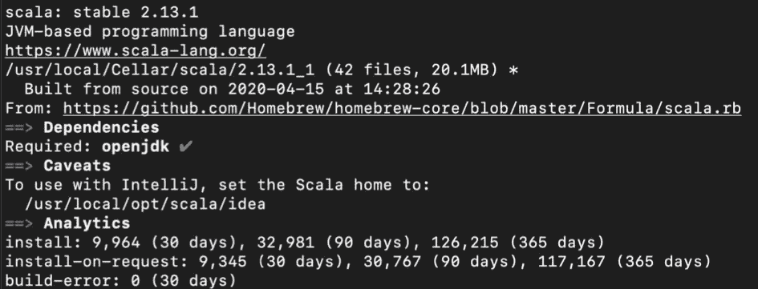
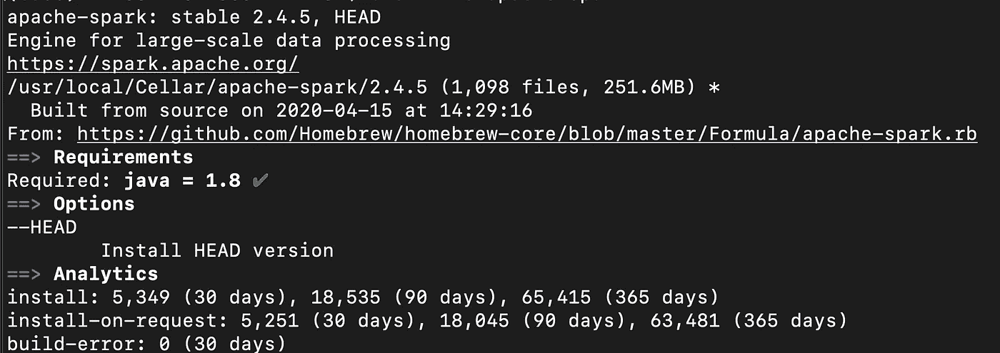
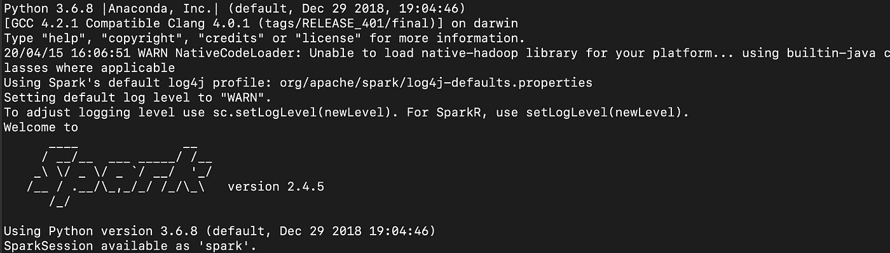
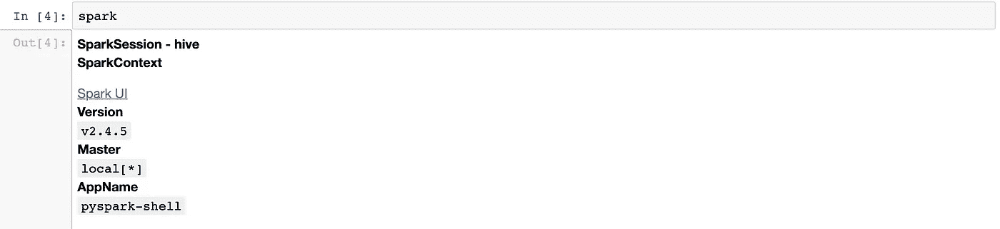

# 面向 Mac 用户的 PySpark 介绍和安装

> 原文：<https://medium.com/analytics-vidhya/how-to-setup-pyspark-in-your-mac-2e21f0c8f9b5?source=collection_archive---------5----------------------->


来源:https://www.lynda.com/

这篇博客简要地向你介绍了在大数据和人工智能中不算新但却是应用最广泛的技术之一。阿帕奇火花！

是的，Spark 现在已经快 10 岁了。这篇博客还介绍了 PySpark 以及在您的机器上安装它所需的步骤。让我们开始吧。

# 什么是火花？为什么要火花呢？

Spark 是一个开源的大数据平台，有助于以快速高效的方式处理大型数据集。它是一个大规模数据处理框架，通过将数据拆分到几个节点(可以把它想象成计算机)中，并在集群的每个节点中并行执行计算任务，从而执行集群计算并快速处理任务，*。*当我们不得不处理大到无法放入机器内存的数据时，我们通常会使用大数据技术。你们中的许多人可能想知道为什么我们不直接用 Hadoop 的 MapReduce 来完成这样的工作。嗯，那是因为 Spark 比 Hadoop 的 MapReduce 快 100 倍。以下是如何…

> MapReduce 在每次 map 和 Reduce 操作后将数据写入磁盘，而 Spark 在每次转换后将大部分数据保存在内存中。

无论是想要快速查询、分析、转换或从“大”数据中获得洞察力的数据分析师还是数据科学家，Spark 都是首选解决方案。因为 spark 有 SQL、机器学习、流处理和图形计算的库。它还支持各种编程语言，如 Java、Python、r。

# PySpark

**PySpark** 是 Apache Spark 发布的 Spark 框架 API，用 **Spark 支持 **Python** 。使用这个 API 可以轻松利用 Spark 的所有功能。让我们看看如何在我们的机器上设置 PySpark。**

# 先决条件:

**跳转到* ***安装*** *如果你已经安装了所有这些**

## 1.公司自产自用

如果未安装，请遵循以下步骤:

*   转到终端并运行:

```
$ /usr/bin/ruby -e “$(curl -fsSL https://raw.githubusercontent.com/Homebrew/install/master/install)"
```

*   安装成功后，运行以下命令确认安装:

```
brew doctor
```

如果你得到一个消息说“你的系统已经准备好了”，你可以进入下一步。

## 2. **Python**

我假设您已经安装了 python，否则您可以再次使用 Homebrew 安装它:

```
brew install python3
```

## 3.**jupyter-笔记本(可选)**

你可以通过 Anaconda navigator 或者跟随这个[链接](https://jupyter.org/install)或者通过 Homebrew 来安装它。

```
brew install jupyter
```

如果你的所有先决条件都完好无损，那么你就“准备好了！”。

# 装置

## 1.**安装 Java** :

我们需要先安装 Java，因为 spark 是用 Scala 写的，Scala 是一种 Java 虚拟机语言。

```
brew cask install java
```

这将安装最新版本的 java(安装需要相当长的时间)。

## **2。安装 Scala :**

对于安装 Apache-spark，Scala 是一个依赖项。因此，使用 brew 安装 Scala:

```
brew install scala
```

您可以通过以下方式确认安装:

```
brew info scala
```

你会看到这样的东西:



图片 1

## 3.安装 Spark

Apache Spark 是一个处理大数据的分布式框架。我们现在可以马上安装 spark。

```
brew install apache-spark
```

并确认(像我们一直做的那样🤷🏻‍♀️)由:

```
brew info apache-spark
```



图片 2

## **4。安装 PySpark**

使用 pip3 安装 pyspark:

```
pip3 install pyspark
```

## 5.设置环境变量。

我们需要定义某些环境变量和路径，以便通过 pyspark 访问 Spark

*   打开您的终端，然后:

```
cd ~vim .bashrc
```

然后定义以下变量:

```
export JAVA_HOME=/Library/java/JavaVirtualMachines/adoptopenjdk-8.jdk/contents/Home/export JRE_HOME=/Library/java/JavaVirtualMachines/openjdk-13.jdk/contents/Home/jre/export SPARK_HOME=/usr/local/Cellar/apache-spark/2.4.5/libexecexport PATH=/usr/local/Cellar/apache-spark/2.4.5/bin:$PATHexport PYSPARK_PYTHON=/usr/local/bin/python3export PYSPARK_DRIVER_PYTHON=jupyterexport PYSPARK_DRIVER_PYTHON_OPTS=’notebook’
```

确保在第三和第四个变量中提供正确的 spark 版本。

快好了！现在我们剩下的就是检查 pyspark 是否工作。

现在键入:

```
pyspark
```

在您的终端中，如果 spark 成功安装了所有依赖项，并且环境设置正确，您应该能够获得:



图 3

恭喜你！！！👏🏻您已经在机器上成功安装了 PySpark。现在，您可以启动 jupyter 笔记本来进一步体验 PySpark 功能，也可以开始在您的。py 脚本好了，我们已经在学习 PySpark 的第一步了！

现在启动您的 jupyter 笔记本并执行以下命令。

```
import os
import pyspark
```

默认情况下，PySpark 不在 sys.path(您设置它的路径)上，不会被用作常规库。因此，需要在运行时将 PySpark 添加到 sys.path 中。我们该怎么做？不在话下..“ ***findspark*** ”包可以帮你做到。使用以下命令安装 *findspark* :

```
pip3 install findspark
```

*findspark* 主要是搜索你的 spark 设置的环境路径，并在你的 jupyter 笔记本中初始化它。

以下代码具有相同的功能:

```
import findspark
findspark.init()
```

现在，为了确保 jupyter 一切正常，请尝试以下命令:

```
#executing the shell.py inside the 'SPARK_HOME' environment
exec(open(os.path.join(os.environ["SPARK_HOME"],'python/pyspark/shell.py')).read())
```

编译完 *exec* 命令后，您将再次看到:


图 4

正如您在*图 3 和图 4 中看到的，*我们已经为自己创建了 SparkSession。你在“火花”中看到的是:



图 5

瞧啊。！一切就绪！！👍🏼现在，您可以将 spark 功能与 python 结合使用，非常高效、快速地处理大型数据集。

在接下来的故事中，我将介绍与 rdd、数据帧和其他相关主题相关的概念。在那之前，再见。