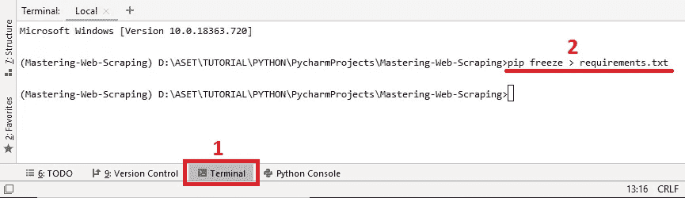
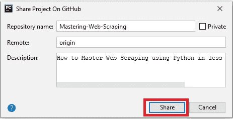

# 如何在 Github 上分享 PyCharm 项目

> 原文：<https://medium.com/analytics-vidhya/how-to-share-the-pycharm-project-on-github-de837063c12?source=collection_archive---------4----------------------->

## **使用 PyCharm 在 GitHub 上分享项目的简单方法**

如何在 Github 上分享 PyCharm 项目

在这篇文章中，我将告诉你**如何在 GitHub** 上分享 PyCharm 项目。

如果你不知道 GitHub 是什么，请看下面我对 GitHub 的一点解释。但是，如果你已经理解了，只是想知道如何在 GitHub 上分享你的 Pycharm 项目，那么请跳过这一节，继续向下滚动，直到找到你要找的东西。然后，如果你没有找到你要找的东西，很可能你已经失败了。 *lol*

好了，**什么是 GitHub** ？

> " **GitHub，Inc.** 是一家总部位于美国的全球性公司，使用 Git 为软件开发版本控制提供托管服务。它是微软的子公司，微软在 2018 年以 75 亿美元收购了该公司。它提供了 Git 的分布式版本控制和源代码管理功能，以及它自己的特性。” [**维基百科**](https://en.wikipedia.org/wiki/GitHub)

在上面 GitHub 的定义中提到 GitHub 使用 Git。
嗯……那么，**什么是 Git** ？

> Git 是一个分布式版本控制系统，用于在软件开发过程中跟踪源代码的变化。它是为协调程序员之间的工作而设计的，但也可以用来跟踪任何一组文件中的变化。其目标包括速度、数据完整性和对分布式非线性工作流的支持。” [**维基百科**](https://en.wikipedia.org/wiki/Git)

当你知道 GitHub 和 Git 的含义后，也许你会想**为什么要费心分享到 GitHub 呢？**

好的，**你必须将项目上传到 GitHub 的一些原因**:

1.  减少个人笔记本电脑的硬盘内存。当我们在一个项目上工作时，项目放在笔记本电脑上的情况并不少见，这可能需要我们花很长时间来打开项目。与其完成硬盘项目，不如存到 GitHub 吧？毕竟 GitHub 提供的容量是相当大的。对于 GitHub 容量管理你可以在这里 看到 [***。***](https://help.github.com/en/github/managing-large-files/what-is-my-disk-quota)
2.  你创建的项目本身可以很大。许多人在 GitHub 上寻找免费项目，如果那个人认为你的项目有趣，并不是说他或她会成为开发你项目的贡献者。
3.  **你将与团队**一起开发你的项目。有了 GitHub，你将更容易管理任务的划分。请通过浏览互联网了解更多信息。
4.  **你在 GitHub 上分享的项目可以成为你的作品集**。如果你是一名学生，毕业后想在公司工作或成为一名自由职业者，那么你可以展示你保存在 GitHub 上的项目作为你的作品集。你肯定会更有价值，对吗？

嗯……也许还有很多理由要和 GitHub 分享项目，但是文章可能太长了，没有触及**如何在 GitHub** 上分享 PyCharm 项目的核心。

这太长了。lol

好了，我们开始练习吧！
和往常一样，在继续学习**如何在 GitHub 上共享 PyCharm 项目之前，您必须做一些准备工作**:

1.  当然**你应该先有一个 PyCharm 项目**。如果没有项目，可以使用文章 [***如何在 30 分钟内掌握使用 Python 进行 Web 抓取***](/@ekomisprajiko/how-to-master-web-scraping-using-python-in-less-than-30-minutes-2bdb0bd1048c) 中的项目。我在本文中也使用了该项目。*但是我不建议你直接从我的 GitHub 下载它，因为已经有很多文件将在本文中实际创建。*
2.  您必须已经拥有一个 GitHub 帐户。如果你没有 GitHub 账号，请先注册 [***这里***](https://github.com/) 。

是的，所有的准备工作都完成了。如果你已经有了我上面提到的所有东西，那么**你可以开始在 GitHub 上分享 PyCharm 项目了**。

*快来编码吧！*
**第一阶段——创建。gitignore 文件**T38。gitignore file 服务于*忽略一些我们不需要保存或者推送到 GitHub* 的东西。**为什么？**因为不是每个人都用 PyCharm 作为 IDE 来构建 Python 中的应用，所以我们不需要像保存文件和文件夹。idea，venv 等。在 GitHub 上。这也可以减少我们在 GitHub 上的存储容量。以下是使用 PyCharm 创建. gitignore 文件的步骤:

1.**创建名为的新文件。gitignore** 按照下图的步骤进行:

创建新文件

将文件命名为。gitignore

2.有许多人创造了。gitignore 文件，你可以在 Google 上用关键字“**git ignore python py charm”**搜索然后会出现很多类似下图的选择:

Python PyCharm。gitignore

[MOOWOO/py-gitignore](https://gist.github.com/MOOOWOOO/3cf91616c9f3bbc3d1339adfc707b08a)

3.在这篇文章中，我使用。来自 MOOOWOOO 的 gitignore。通过此链接 [***此处***](https://gist.GitHub.com/MOOOWOOO/3cf91616c9f3bbc3d1339adfc707b08a) ***可以立即看到原始内容。***

4.**复制**所有原始内容:

复制所有原始内容

5.**将**粘贴到。gitignore 我们之前创建的文件:

粘贴到。gitignore 文件

6.恭喜你。gitignore 文件创建完成。

**第二阶段——创建 requirements.txt 文件**
因为我们使用。gitignore 要忽略一些东西，当有人把项目下载到我们的 GitHub 时，他要安装与我们在项目上使用的库或包相关的需求。嗯，这就是 requirements.txt 文件的功能所在，我们将在此阶段制作。以下是步骤:

1.按下 PyCharm 工具栏左下角的**端子**，如下图所示:

Pycharm 终端

2.仍然参照上图，键入 **pip 代码冻结> requirements.txt** ，然后**按 Enter** 。

3.等待，直到出现一个空行，如数字 1 所示。

4.检查项目上的 **requirements.txt** 文件是否已经存在:

requirement.txt 文件中的内容。

5.如果它已经存在，当您打开文件时，它将包含使应用程序正确运行所需的包或库。

6.如果您没有它，请按下项目文件夹中的向下箭头两次，以刷新该文件夹的内容。

7.如果仍然没有出现，您可以通过文件菜单执行**无效缓存/重启** PyCharm，如下所示:

文件>无效缓存/重启

选择无效缓存并重新启动

8.PyCharm 将重新启动您的项目。

9.如果还是没有再出现，*可能你运气不好，lol* 。请从第一步开始重复。

10.好了，完成 requirements.txt！

**第三阶段——在 GITHUB 上分享项目**
好了，这就是你一直期待的。顺利通过以上阶段后，接下来就是如何在 GitHub 上分享 PyCharm 项目了。看看这个。

1.确保你已经通过浏览器登录了你的 GitHub 账户(我用的是谷歌 chrome)。这将有助于确保这一阶段的成功。

2.**在 PyCharm 菜单上点击 VCS** > **导入到版本控制** > **共享项目上**这样:

在 GitHub 上共享项目

3.此外，为了让 PyCharm 在您的 GitHub 帐户中创建存储库，您必须**在 PyCharm 中注册**(您只需要使用您的 GitHub 帐户登录)，如下所示:

使用 PyCharm 登录 GitHub

4.接下来，您将被要求**创建一个库名**(这只是文件夹的另一个名称)和项目描述。通常它会自动使用 PyCharm 项目的名称:

创建存储库(项目文件夹)

5.点击分享(见上图)后，会要求**选择**想要分享到 GitHub 的内容(全选即可)。选择完毕后，请点击添加:

初始提交

6.**等待**上传过程完成，在 PyCharm 的右下角标记一个通知，如下所示:

在 GitHub 上成功共享项目

7.如上图所示的通知出现后，请**通过浏览器查看**你的 GitHub 账户中的库列表，是的，你得到了:

你的项目现在在 GitHub 上

8.好了，完成了伙计们！干得好！

多简单啊，对吧？

什么，你说努力？
好吧，好吧，我确定你只是在开玩笑对吧？

关于**如何在 GitHub 上分享 Pycharm 项目的文章**看来这就是我能给的全部了。

当然，还有许多其他方法来适应不同的情况和条件。让你更发达，请你自己去探索其他途径。

感谢您的阅读。
下次见，快乐编码！