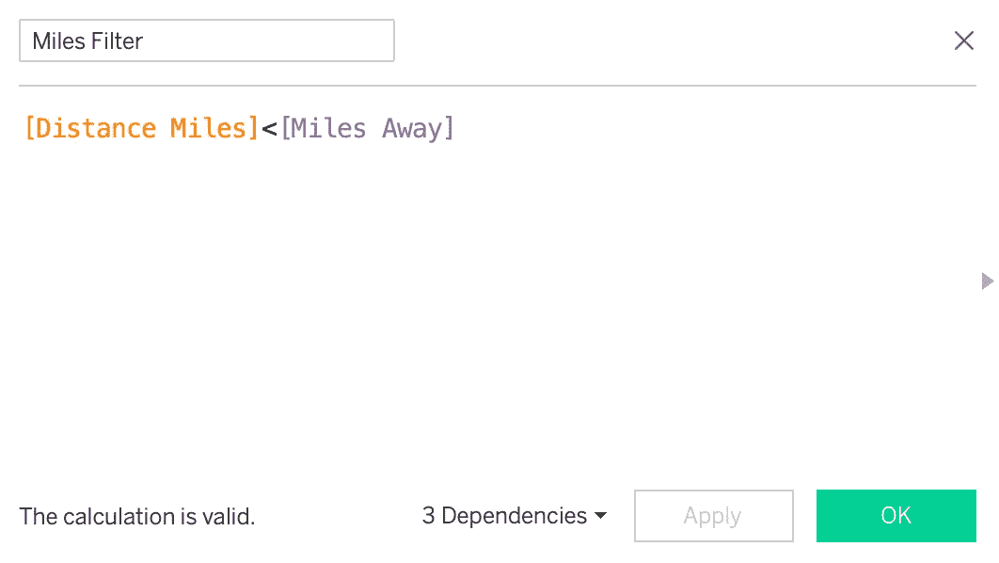

# 如何在 Tableau 中 X 位置的 X 米范围内显示地图

> 原文：<https://medium.com/analytics-vidhya/how-to-show-a-map-within-x-meters-of-x-location-in-tableau-525a1243978e?source=collection_archive---------13----------------------->

我从 2017 年开始使用 Tableau，Tableau 已经更新了很多功能。

# 周三锻炼

周三锻炼是我希望在 Tableau 中建立技能的网站之一。

> 重新创建数据驱动的可视化的每周挑战。

 [## 周三锻炼

### 如果你想在 Tableau 中建立自己的技能，那么周三锻炼可能是你需要的。锻炼周三是…

www.workout-wednesday.com](http://www.workout-wednesday.com/) 

我正在寻找一个功能来显示 X 位置 X 米范围内的地图，以应用于我目前正在进行的项目。

下面是我一直在寻找的东西，让我分享一下我从这次锻炼中学到的一些特点。

**# 2019 年周三工作安排**

# 第 43 周:显示 X 赌场 X 英里范围内的所有赌场

一个移动友好的仪表板，显示所选赌场周围的所有赌场

 [## 第 43 周:显示 X 赌场 X 英里范围内的所有赌场

### 我们正在打#Data19 的本垒打，那么还有什么更好的方法来绘制曼德勒湾周围所有赌场的地图呢？本周我们…

www.workout-wednesday.com](http://www.workout-wednesday.com/week-43-show-me-all-the-casinos-within-x-miles-of-x-casino-by-metres/) 

# **特色**

> **MakePoint** 将纬度和经度列的数据转换成空间对象。
> 
> **距离**返回以米、公里、英里和英尺为单位的两点之间的距离测量值。
> 
> **参数动作** *让你的观众通过* *直接与一个 viz 交互来改变一个参数值，比如点击或者选择一个标记。*

# 数据

来自的拉斯维加斯赌场数据。只有 4 列。

> 第 1 列:**名称**
> 
> 第二栏:**地址**
> 
> 第三列:**纬度**
> 
> 第四列:**经度**

你可以从下面的链接下载这些数据。

 [## 拉斯维加斯赌场-由 missdataviz 提供的数据集

### 工作计划 2019 年第 43 周周三

数据世界](https://data.world/missdataviz/las-vegas-casinos) 

# 因素

我们需要创建两个参数，可以由用户选择。

> 参数 1:选择一个赌场

**选择赌场**是在地图上选择一个标记，并更新所选赌场。

> 参数 2:英里以外

**里程数**是输入自定义的里程数，以显示选定的赌场和里程内的所有其他赌场。

# 计算字段

我们需要创建 7 个计算字段。

> 计算字段 1:选定的纬度

**选择纬度**是用户选择的娱乐场的纬度。

> 计算字段 2:选定的经度

**选择的经度**是用户选择的赌场的经度。

> 计算字段 3 : MakePoint 开始

**MakePoint Start** 是一个从**选中纬度**和**选中经度**的空间对象。

> 计算字段 4:赌场点数

**MakePoint 赌场**是所有其他赌场的空间对象。

> 计算字段 5:距离英里

**距离英里**返回以英里为单位的**赌场起点**和**赌场**之间的距离测量值。

> 计算字段 6:选定的赌场

**选择的赌场**是从**选择一个赌场**中突出显示并塑造一个值。

> 计算字段 7:英里过滤器

**里程过滤器**仅显示选定的赌场和里程内的所有其他赌场。

# 参数动作

创建仪表板后，您必须做的最后一件事是创建参数操作。

指定目标参数和源字段，该字段可以是从参数中选择一个赌场的**和从源字段中选择一个赌场**名称**。**

 [## 参数操作

### 使用参数动作让您的观众通过与 viz 的直接交互来更改参数值，例如…

help.tableau.com](https://help.tableau.com/current/pro/desktop/en-us/actions_parameters.htm) 

> 这是我的镜头！

你可以在这里查看我的数据可视化更多！

 [## Tableau 公共

### 编辑描述

public.tableau.com](https://public.tableau.com/profile/daheelee#!/)